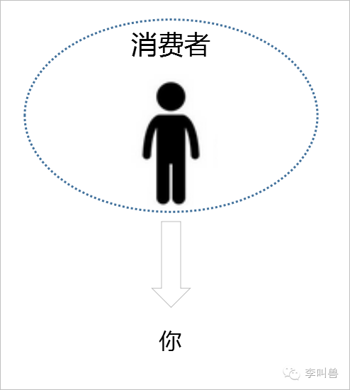
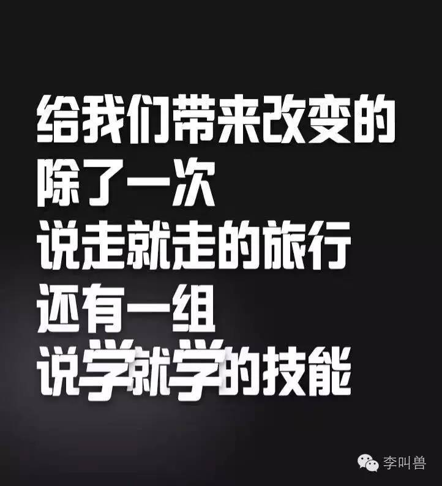
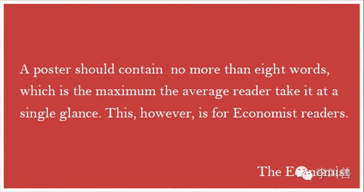

#【李叫兽】说服力不够，群体来凑

**【Re-think】**

**群体力量**

这篇文章，带你重新思考，营销中很多人忘记使用的一种力量——群体。

（内容部分来自之前去唯品会培训的演讲，现在分享给各位。）

我看过很多这种文案：

- “我的产品，开机快如闪电！”
- “像鸿毛一样轻的体验！”
- “探索人类黑科技。”

这些本质上都是在夸奖自己的产品好，都是在“直接说服”，但这并不是唯一的路径。

**那么，除了夸我的产品好，我们还能说什么？**

实际上，很多人经常忽视了，除了“直接说服”，还有可以借助一种重要的力量**——群体力量。**

**当你想要改变一个人的时候，除了把精力放到他本身之外，还应该把精力放在影响他决策的群体上。**

就像有时候追一个女生，搞定闺蜜（群体力量）比直接搞定她本人还要容易。

**过去，我们只想通过自己的力量去改变消费者，但这并不是唯一的路径。**

去年我曾在一个TED视频上看过这样一个案例（这个案例发生在现代营销诞生前）：

很久之前的德国地区，随着人口密度的增加，灾荒越来越多，于是国王想要推行一项新政策：鼓励更多农民种植马铃薯。（也就是土豆，亩产更高，能够养活更多人。）

但是最初在局部地区推广却非常困难，因为很多初次接受马铃薯的人，觉得它是一种很low的作物，甚至怀疑到底能不能吃。

而且更为让人恼火的是，这帮农民无论怎么说服都不管用——“马铃薯亩产高”、“马铃薯有营养”、“马铃薯吃惯了就好吃了”等等。（类似于你会遇到很多很难说服的消费者。）

后来国王就换了一种方式——颁布法律规定，国家引进了一种农作物，只有贵族才能享受。然后安排一些贵族在私家庄园里种植，并且派士兵把守马铃薯的种植园。

很多农民非常诧异究竟是什么农作物这么奇特，纷纷想要打听，于是国王就让士兵故意放出一些口让部分农民偷偷进去一探究竟，结果让马铃薯在全国都传开了——原来是这么高贵的作物。

接着，国王再取消了“贵族才能种植马铃薯”的法律，结果本来难以推广的马铃薯瞬间被大量农民抢着种植。（看完这个故事，我深深感叹——国内推广“转基因食品”失利，既起错了名字，也使用了错误的策略，让民众对这种技术进步产生了极大的负面印象。）

**总之，说服力不够，群体来凑：当你发现直接通过所谓的利益卖点很难说服消费者时，一定别忘了还有一项你尚未使用的力量——群体力量。**

大部分时候，我们眼中的消费者以及要采取的说服思路是这样的：
 

你认为你的目标消费者正在看向你，然后想要说一些话直接去影响他们。

但实际上，你面临的消费者是这样的——他们不光看向你，更是受到其他人的影响：

 
而大部分人经常用前一种狭隘的视角去看待消费者和你能够采取的营销、广告手段，忘记了后面这种视角——需要想办法利用群体的力量。

**那么，到底如何利用群体的力量，去影响用户的选择、刺激用户的情绪？**

这篇文章就讲讲“参考群体理论”——**如何利用4种参考群体的力量，去影响你的消费者。**

**参考群体就是指——能够影响某个人决策、判断和感受的群体。（比如在上面的“德国推广马铃薯”案例中，贵族就是当时农民的一种重要参考群体。）**

实际上，不论是利用文案，做活动，请代言人还是任何一种利用参考群体的方式，本质上都在利用以下4种参考群体：

1. **渴望群体**：消费者不属于但渴望加入的群体（比如农民眼中的贵族）
2. **回避群体**：消费者不属于同时也想保持距离的群体（比如常人眼中的小偷）
3. **喜爱群体**：消费者属于同时也为之自豪的群体（比如皇马球迷眼中的皇马球星）
4. **拒绝群体**：消费者属于但却内心排斥的群体（比如部分没钱的人眼中的没钱群体）

说起来好像很复杂，但我一张图就可以概括：

**1.渴望群体：消费者不属于但渴望加入的群体**

前面的德国推广种植马铃薯，就是对渴望群体的典型应用。对农民来说，贵族属于渴望群体——他们并不属于该群体，但却非常渴望该群体，所以会参考贵族的行为。

**之所以有这样的作用，是因为渴望群体除了让消费者建立信任（贵族的就是好的）之外，还给消费者塑造了一种“通过模仿渴望群体的行为，短暂让自己变得更像这个群体”的感觉。**

有个重要的心理学实验——亚裔学生饮食偏好实验，曾经证明了这个现象。

实验者召集了一些在美国的亚裔大学生，然后问他们一些提示亚裔身份的问题，比如“你英语到底怎么样”，然后让他们在一堆食物列表中写下自己最爱吃的事物。

结果发现，比起没有被问问题的亚裔学生，这些亚裔学生写下美式食物（比如汉堡、披萨）而不是亚洲食物（比如包子、寿司）的比率多了三倍。

这是因为问他们“你英语到底怎么样”，激活了他们的刻板印象威胁（StereotypeThreat），让他们意识到自己其实并不是真正的美国人，从而让“美国人”这个渴望群体更加鲜明，也就更加倾向于在潜意识模仿美国人的习惯（比如吃汉堡）。

甚至，在另一个实验中，被问了这类问题的亚裔学生，随后在餐厅中都更多地点烤起司、三明治这种美式食品了。

**也就是说：渴望群体能够非常有效影响消费者的行为，很多人会模仿渴望群体的行为，来让自己变得更像渴望群体。**

比如对中产阶级来说，富豪阶层是渴望群体，既然无法模仿他们的跑车、豪宅（都太贵），单纯模仿一下他们的包包，也是不错的。

**那么，渴望群体如何应用呢？**

其实非常简单，你只需要问自己这两个问题就行：

- 我的消费者渴望什么群体？
- 如何让他们感觉到，我想让他们做的事情，是这个群体的特有行为？

比如对出去旅行的消费者来说，渴望什么群体？

他们可能有拍出游客照、只吃游客餐的经历，所以可能渴望体验当地人的生活。

他们可能有被忽悠、行程规划不合理的经历，所以可能渴望目的地的本地人。

**然后，如何让他们感觉到我想让他们做的事情（比如使用我们的产品），是渴望群体的特有行为？**

比如民宿平台Airbnb说的就是：像当地人一样去生活。（对部分旅行者来说，当地人是一种渴望群体）

再比如当年在美国市场的啤酒大战中，卢云堡曾经在进口啤酒中销量领先，而这时德国的本国销量好的贝克啤酒要进入美国市场，于是也借用了渴望群体：

> “现在你已经喝过美国最流行的德国啤酒，现在来喝德国最流行的德国啤酒吧！”
 

（对当时的美国人来说，在啤酒的品味方面，德国人是一种渴望群体，他们很容易参考德国人的做法以做出行动）

**所以，你一定有想让消费者做的一件事（不论是种植马铃薯、转发微信还是购买产品），除了直接说服，你还可以借助渴望群体的力量，问自己这些问题：**

（1）我的消费者渴望什么群体？

（2）如何让他们感觉到，我想让他们做的事情，是这个群体的特有行为？ 

**2.回避群体：消费者不属于但渴望加入的群体** 

除了渴望群体，消费者还经常面对一些自己不属于并想要保持距离的群体——回避群体。（比如常人眼中的小偷）

**如果你的产品、文案等能够帮助消费者跟回避群体保持距离，他们就更有可能去做你想让他们做的事。**

所以每次面临一群消费者，还需要问自己：**消费者是否在回避什么群体？**

比如美国有个知名的手工工具（比如家用螺丝刀）制造商百得，占据了大量的消费者市场，但同样的品牌却很难进入专业手工业者（相当于普通消费者雇佣专业人士来帮自己修理）市场。

反而是另外一个本来不知名的日本品牌Makita（品牌不知名、工具也不那么易用还高价）在这个市场推广取得了成功。

为什么呢？

如果抛开产品本身，看群体的力量，你就明白了：**这些专业手工业者，在回避什么群体？**

很明显，他们一定要想办法回避“非专业人士”这个群体，他们最害怕的事情就是被人认为其实他们跟普通人自己修差不多。

这时候，如果有消费者看到这些专业手工匠人也用百得工具，自然就会觉得“我自己买了百得不一样吗”，从而降低了他们的服务价值。

（ps.这也是为什么理发店用的洗发水，一定要用非知名品牌的，为了跟普通消费者群体起到回避作用，提高自己的服务感知价值。）

**总之，消费者总会面临一些自己不属于也想保持距离的群体，如果你的产品能帮助消费者保持这种距离，回避这个群体，就更有可能受到青睐。**

那么**“**回避群体**”**这种方法如何应用呢？

很简单，也是问自己两个问题：

**（1）我的消费者在回避什么群体？**

**（2）如何让我不想让消费者做的事（比如不买我的商品），成为这个回避群体的特点？**

比如专门定位与高端商务人士的《经济学人》杂志，就利用过回避群体的力量。

（1）《经济学人》的主要读者存在什么想要回避的群体？

我想至少可能有——在职场混迹了很多年但却了无成就的人。

（2）那如何让“不读《经济学人》”的行为，成为这个回避群体的特点？

有张海报是这样写的：

“我从来不读《经济学人》——42岁的管理培训生”

再比如我之前在设计“李叫兽·14天改变计划”（一个线上营销训练营）文案的时候，也想过这个问题：对于那些想要通过知识改变自己的人来说，有什么他们想要回避的群体？

我想到之前有很多热文讽刺了那些没有知识、不想学习，但想通过单纯的环球旅行来改变自己的人。

于是就写了这个文案：

 

（对这些想要通过知识改变自己的人来说，那些被别人讽刺只想通过旅行改变自己的人，大概是一种回避群体）。

还有，我之前还看过一个大连房地产（优势是在海边）广告，也激活了大家对回避群体的厌恶心理，说的是“这是大连，不是内陆”，就利用了沿海城市人对内陆城市的回避心理——为了进一步回避这种群体，那自然就是要买大连沿海的楼了。

**总之，你一定有不想让消费者做的事情（比如不读经济学人、不参加训练营），除了直接说服，你还可以借助回避群体的力量，问自己这些问题：**

**（1）我的消费者在回避什么群体？**

**（2）如何让我不想让消费者做的事（比如不买我的商品），成为这个回避群体的特点？**

**3.喜爱群体：消费者属于同时也为之自豪的群体**

前面两种渴望群体、回避群体，都是消费者本身不属于的群体，除此之外，还有一种：**消费者本身属于并为之自豪的群体，那就是“喜爱群体”。**

比如你是中国人，也为中国人自豪，对你来说，“中国人”这个群体就是你的喜爱群体之一。
 

再比如一到了XX名校校庆时，朋友圈就多了很多和校庆相关的文章——大部分文章写得很烂，但却让转发者的朋友们知道了转发者是来自这个名校的人。

也就是说，自己母校的毕业生，也是这些人的“喜爱群体”。

对他们来说，**“**母校校庆**”**相关的文章，就成为了他们的**“**排外标志**”**，是一种只有自己群体有别人群体没有的标识，可以让他们完成对喜爱群体的自豪感获取。

**那么“喜爱群体”如何使用呢？**

**按照李叫兽的习惯，当然也是两步走，问自己两个问题：**

**（1）你的用户为所在的什么群体自豪？**

**（2）如何让你的产品，成为该群体的“排外标志”？**

比如上海地区有个地方广播台，在文案中也利用过喜爱群体的力量。

那么，上海一个广播台的主要听众，为所在的什么群体而感到自豪呢？

自然是为作为中国经济金融中心上海的本地人而自豪。

那么，如何让你的产品，成为该群体的“排外标志”？

它在文案里，是这么写的：

“阿拉上海人，两只话筒嘎三胡”

其实，这两句文案是用上海方言写的，只有在生长在当地的人才具有看得懂、念得出该文案的能力，这也就成为了他们的排外标志。

再比如之前提到的《经济学人》杂志，同样利用过“喜爱群体”的力量——他目标读者是高端高知识的商务人士，也为自己是高端商务人士而自豪。

那么经济学人的什么特点，能够成为他们的“排外标志”呢？

它过去的一个文案是这么写的：一张海报的长度不应该超过八个单词，这是普通水平的读者一眼看去时，能接受的最大信息量。但这张海报不同，它是写给《经济学人》的读者看的。

也就是说——阅读能力，变成了排外标志。

**总之，当你面对一群消费者的时候，一定记得，要发现他们为之自豪的喜爱群体。**

再比如我之前见过一个白T恤的文案“一般人穿不好白T恤”（只有本身颜值高的帅哥才能驾驭），这就把白T恤变成了“帅哥”的排外标志。

**那么，这种“喜爱群体”的威力，什么时候最大呢？有研究发现：当一个用户处于他所在的群体底层的时候，更加容易受到喜爱群体的影响，也变得更加排外。**

一项关于游戏的心理学实验，证明了这一点：

研究者召集一些男性玩射击游戏“光环”，玩到一半也拉进了很多女性玩家加入，结果发现有些男性玩家表现了对男性的自大和对女性的歧视：

> “唉，这么有技术含量的游戏，女人肯定玩不了”

> “我就说吧，女人拖后腿！”
 

那你猜这些抱怨都是什么人提出来的？

游戏结束后的数据统计发现，在游戏有表现越差的男性，越辱骂并歧视女性，并且为自己的性别自豪。也就是说——一个群体中的低位者，反而更加容易产生“喜爱群体”的心理。

比如，有些公司中存在一些名校毕业的人鄙视那些本科学校一般，但表现却很好的人，不断为名校身份自豪。如果看绩效，一般这些人也是名校中表现相对差的一些人。

为某个城市自豪并歧视外地人的人，也更容易是该城市的底层人士。

**所以，当面对一些消费者的时候，你还可以问自己：这些消费者到底为什么自豪？如何让我的产品成为排外标志？**

**4.拒绝群体：消费者属于但却内心排斥的群体** 

还有最后一种很让人矛盾的群体：**消费者本身属于，但内心却排斥的群体。**

比如看到了国内的一些不好现象然后吐槽中国，称中国为“你国”的人心中，中国人就变成了“拒绝群体”。

应用方法也很简单：**我的消费者想摆脱什么群体？如何让我想让他们做的事（比如用我产品），帮他们证明，自己跟群体内其他人不一样？**

比如我在之前的一个《网红如何刺激打赏》的文章中，就说了一种刺激用户打赏的方式——把中国人普遍不愿意为知识付费的现象说出来，利用拒绝群体的力量。

“美国人都有知识付费习惯，而大部分中国人虽然更有钱，却缺乏这种基本意识。”（ps.这个也结合了渴望群体）

这时候就会有一部分人，为了证明自己跟其他缺乏这种习惯的中国人不一样（拒绝群体），从而增加打赏。

再比如我在“14天改变计划”的海报中，还写了一个“人人都爱碎片化知识，但那浪费了不少时间”，从而让人产生“我要跟那些依赖碎片化知识的人不一样”的心理。

**总之，面对消费者的时候，你需要问自己：我的用户想摆脱什么群体？如何让我的产品，帮他们证明自己跟该群体内其他人不一样？**

除了上面的用法，还有一个典型的营销问题可以被解决：**当你的消费者在使用你产品的时候，内心有负面形象（相当于拒绝群体），就可以把该群体转化成喜爱群体来解决。**

比如肯德基推出了高性价比的咖啡（相对于星巴克），但消费这种咖啡的人却容易陷入一个“图便宜”的人这种拒绝群体：他们明明属于这个群体，但却不想在这个群体。

**一种营销手段就是把这种拒绝群体变成“喜爱群体”，想办法讲这个群体的好处，反而让人自豪。**

肯德基说的就是：咖啡为了觉醒，不为凹造型。

暗示星巴克咖啡的购买者是追求面子、摆造型的肤浅的人，而肯德基咖啡的使用者却是“聪明的消费者”，不追求虚无的面子。

**所以，你有时候还需要问自己：我的消费者，是否在消费我产品时自动进入了某个拒绝群体，从而减少了购买？如何把这个拒绝群体变成喜爱群体？**

再比如我之前遇到一个专门给胖女孩提供衣服的服装APP“大码美衣”，就有类似问题——很多胖女孩认为“肥胖者”是一个拒绝群体，虽然自己属于，但非常排斥。这就阻碍了大码美衣。

而大码美衣的策略就是——在各种文案中不断塑造胖女孩的积极形象。比如发文章说《有一个胖女孩做女朋友是一番怎么样的体验》、《那些超模界的胖女孩》等等，让胖女孩增加对自己群体的喜爱程度。

**结 语**

人往往很难依靠自己力量成功，要善于借助外力，就连古人都说了：

> 假舆马者，非利足也，而致千里；假舟楫者，非能水也，而绝江河。君子性非异也，善假于物也。——《劝学》
 

同样，营销也要借助外力，而群体就是一种重要的外力。**当你面对一群消费者的时候，除了之前讲过很多次的各种产品优点文案，一定不要忘了还有“参考群体的力量”。**

**毕竟，说服力不够，群体来凑。**