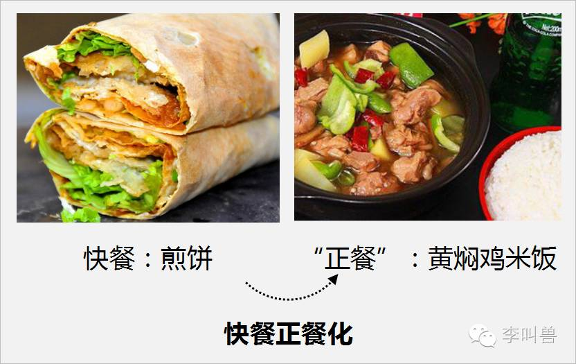
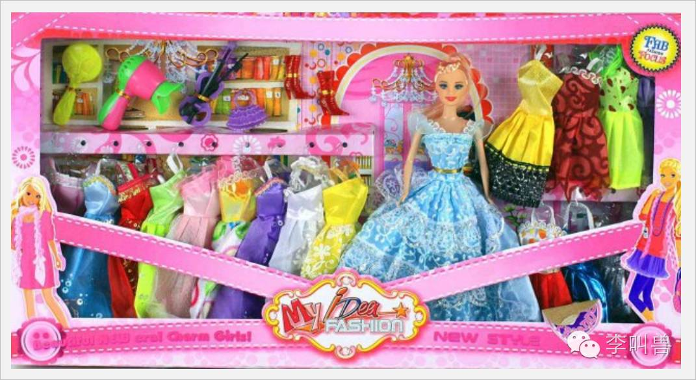
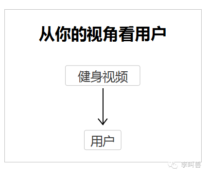
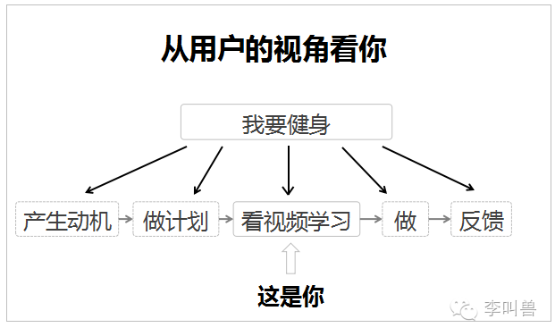

#【李叫兽】买不起流量，但你做得起创新
原创 *2016-09-27* *李靖* [李叫兽](https://mp.weixin.qq.com/s?__biz=MzA5NTMxOTczOA==&mid=2650441621&idx=1&sn=ce1597524334c23b305af7baec995b16&chksm=884f0440bf388d5636945beadc325c11c088b3e8b12d480e7b214e7f67fc254e1a51e5af9b57&scene=21&key=a269c8ed3afb88d81c068db75a0fbb46469a4f2755ac85d4232d871eeaa6cd384dd0bf1718ec11d07338f6f484829fd8921b876d8459a1debd44728753809dc3c49eed8913e27c3f0bb59276dd765c7b&ascene=7&uin=MTc4OTM3ODkzOA%3D%3D&devicetype=Windows+7&version=6203005d&pass_ticket=V5w3mkkLQcmNI8VtqJK0C1erJipHSMkFDXxkSrQt9dQbXsQ8haTP3Q1NJmbFLNhV&winzoom=1##)

> 原文链接：http://mp.weixin.qq.com/s/s1raM3BZyAsp9b72b8pbUg

**【价值创造】系列文章 II:**
**“如何进行价值创造”** 

我一直以来都很好奇这个问题，为什么有些人总能有与众不同的想法，并作出创新，而另外一些人却总是循规蹈矩，不得不陷入“买流量”、“刷订单”、“增加广告”等重复性工作？

这篇文章就讲讲，**如何进行“价值创造”型创新，并分享4种方法**。

李叫兽上篇文章分析了一个大多数公司正在抱怨的问题：**为什么营销变难了？**

为什么我们会觉得“越来越难以吸引用户注意力”、“流量越来越贵”、“代言人也没过去那么管用了”？

一个非常重要的原因是：**大部分人都在做“价值攫取”型工作，而不是“价值创造型”工作。**

**“价值攫取”型工作是指想办法不断争取存量资源，而“价值创造型”工作则是更改资源的利用方式，创造新价值。**

就拿举办一个营销论坛来说，所谓的“价值攫取”型工作，就是不断想办法邀请大咖、租到更高势能的场地、找来更大牌的媒体、布置更恢弘的灯光等，这些大部分都不需要什么真正的“想法”，只是在跟其他的同类论坛争取本身就已经稀缺的存量资源（比如大咖的时间）而已。

而“价值创造”型工作，则是需要重组资源的利用方式，比如为找到一个与众不同的需求，设计一个感召人参加的使命，重新思考别人来参加论坛的原因等。

之所以营销变难，就是因为随着资源流动加快（大家越来越能平等获得各种资源），导致价值攫取型工作变得没那么重要，反而让价值创造型工作变得更加关键。而后者则做起来更加困难——不得不绞尽脑汁想点与众不同的新想法。

**那到底如何进行价值创造呢？**

在营销活动中，我们经常听到这样的建议——看看市场上有多少消费者，看看竞争对手的行动，所搜集一些相关案例，但是我们忽略了一点，那就是**“看看自己的思考行动”**。

是的，要解决“价值创造”的问题，你更应该的不是看向外部（比如搜集信息和知识），而应该看向内部，**好好去研究下你自己到底是如何思考的**。

当你内部去“**思考自己的思考过程**”时，就会发现，之所以大部分时候你陷入了循规蹈矩的“价值攫取型”工作，而不是抬头去“价值创造”，并不是因为你不够聪明，也不是因为你知识缺乏，而是因为**你的思维被大脑的天生陷阱给限制住了。**

下面就是一些限制我们价值创造的常见思维陷阱，以及对应的解决方案：

1. **固定类别思维——融合类别**
2. **低解释水平思维——提高解释水平**
3. **环节局限思维——全环节思考**
4. **假定默认行为——重新质疑金科玉律**

**1. 固定类别思维——融合类别**

**餐厅分为两种：快餐和正餐。**过去快餐都想办法做得更加便捷，而正餐餐厅都想办法做得更加正式。

但这种“固定分类”其实可以打破，所以过去十几年的餐饮界出现了两个重要趋势：**快餐正餐化和正餐快餐化。**

- **快餐正餐化**——过去的快餐（比如肯德基或者肉夹馍），因为太不像中国人理解的“正常的一顿饭”，吃了之后好像这顿饭吃得不正常，所以出现了让快餐变得更像“正常的一顿饭”的方式，例如黄焖鸡米饭。

 
- **正餐快餐化**——过去的正餐，上菜太慢、菜量太大等，不够便捷，所以出现了让正餐变得像快餐的方式，例如外婆家、绿茶等，小分量、快速上菜。

**这就是我所说的第一种价值创造的方式——打破固定分类。**

它并不是通过获取更多资源（价值攫取），而是重构原有资源的利用方式**——本来被我们一直理解成固定的归类，通过互相融合可以产生新价值。**

再比如我去年提出的“**媒体产品化、产品媒体化**”的概念，也是利用了“融合类别”的思想。

大部分企业把自己的对外行为分成了“产品”和“营销”，产品负责为顾客创造价值，而营销则负责传递价值（也就是媒体价值）。

但其实这两个分类也应该融合。

- **媒体产品化**——比如企业的微信自媒体，很多人当成了单纯的营销方式，所以整天发广告，导致粉丝不喜欢看。而其实应该**用产品思维来做自媒体，它并不是一个营销方式，而是产品本身（不过是内容产品），你需要设计这些内容应该持续性满足什么需求**（例如，保健品自媒体也可以跟保健品产品一样，满足让人更健康的需求）

- **媒体产品化**——既然企业的媒体（例如自媒体）应该用产品思维，那么产品也应该用媒体思维，**让产品本身变成企业的媒体**。例如味全果汁让瓶身变成媒体，传递信息。

大部分人会认为固定的分类是不能被改变的，好像我们从小接受过的分类，就是理应是这样——例如餐厅就是快餐和正餐，人就是男人和女人，场所分为家和办公室……

**但其实任何的分类都是人大脑中想出来的，而不是固定的。**

比如你现在看几百年前古人的分类逻辑，一定觉得很滑稽：

同样，从未来的角度看现在，我们现在已经有的所有分类，都可能是滑稽的，亟待被打破的。

**而你要做的，就是重新思考这些分类，并且找到融合的办法。**

**方法很简单，你就去找一下：我所在的行业，有哪些“XX有两种”之类的说法，现在出现了哪些互相融合的趋势？**

下面是我刚刚想到的一些：

**（1）有两种典型的商业模式——2B 业务2C业务**

于是就有了两个趋势：

- **2B2C化**——原有的B端业务开始向C端进行营销，类似于阿里云、高通、蚂蚁金服等都开始打C端广告，想像当年的英特尔一样，挟消费者以令采购方。

- **2C2B化**——本来是针对C端的产品和服务，开始不断先通过B端进行推广，比如很多人已经发现，有些O2O服务与其不断打广告，还不如搞定一个数万人大公司的HR，变成员工福利，瞬间得到推广。

**（2）有两个场所——家里和办公室**

于是也有了两个趋势：

- **家里办公化**——随着越来越多自由职业者的出现，越来越多人在家里办公，所以提升家庭办公体验的产品就有了市场。
- **办公室家庭化**——随着越来越多加班狂公司出现，很多人把工作本身当成了生活方式，这就让越来越多公司在办公司提供类似家庭的环境（甚至提供床位）。

**（3）有两个场景——虚拟和现实**

过去要不就是虚拟的（比如互联网），要不就是现实（比如你亲眼看到的商场）。

于是现在也有了两个趋势：

- **虚拟现实化**——也就是我们所说的VR技术，让影片、游戏等变得更加像现实。
- **现实虚拟化**——也就是我们所说的AR技术，让现实中可以呈现虚拟的信息。

（PS，之前还有人问我AR和VR的区别，我就说一个是让虚拟更现实，另一个是让现实更虚拟，将来你根本分不清啥是虚拟啥是现实）

**（4）娱乐界也有两个分类——戏剧和真实**

戏剧就是在荧幕上表演出来给你看的，真实就是你自己实际的生活。

既然这样，一般也有两个趋势——

- **戏剧的真实化**——大量的真人秀的出现，让戏剧变得更加像真实生活，类似于《奔跑吧兄弟》，还有鲁豫做的新节目《大咖一日行》（就是王健林提出1个亿小目标的那个）
- **真实的戏剧化**——大量直播平台的出现，让普通人的真实生活能够更加像戏剧，比如你在花椒映客上直播自己的生活给别人看。

**（5）白领们空出一个下午，也有两个分类——去运动健身，还是去玩游戏**

自然，也有两个趋势了：

- **游戏的运动化**——让本来的游戏能够真实起到运动效果，例如xbox中的kinect，让人对着屏幕又跑又跳。
- **运动的游戏化**——让本来的跑步等运动拥有游戏的乐趣，例如足包APP，让人通过跑步来“圈地”，并且在手机上可以看到圈了多少地，有游戏效果。

**（6）工作中的人，是来一段旅程，还是一段培训？**

- **旅程的培训化**——比如近些年流行的企业家硅谷访学之类的，让旅程拥有培训的属性。
- 所以我觉得反过来也成立——**培训的旅程化。**
我2周前发布的“李叫兽·14天改变计划”，就是想设计一个完整的旅程感，通过Day1\Day2等的不同组合安排，让线上的学员形成完整的学习、训练、任务等体验。

这样写下去没完了，所以剩下的你自己想——**你所在的行业，原来有什么分类，这些分类是否有融合的趋势？**如果有的话，你可以**反向融合**（例如别人都是把游戏做成运动，而你把运动做成游戏），从而发现新的价值创造机会。

**2. 低解释水平思维——提高解释水平**

同样参加一个营销讨论会，你会发现有些人的话语是：

> “在哪里打广告？地推的时候在哪个小区比较好？现在找什么代言人能够提高转化率？”
 

这说明当你看待眼前的问题时，你想到的是**具体、表面而且局部的特征**（类似于地推在哪个小区，是整个营销环节的局部部分），而这就是对事物的**“低解释水平”（Low Construal Level）**。

而另一部分人的讨论话语则是这样的：

> “我们现在面临的营销问题是什么？是知名度不够，还是消费者不够信任？”

> “我们到底在满足消费者的什么需求，如何让他们为这样的需求买单？”

> “为了进一步协同我们的战略定位，我们还需要做哪些事？广告在其中扮演什么角色？”
> 
> “为此，广告需要怎么设计，投在哪，才会扮演好这个角色？”
 

这说明当你看待眼前的问题时，你想到的是**抽象、本质和总体的特征**（比如满足消费者什么需求，这个很抽象，眼睛是看不见的），而这就是对事物的**“高解释水平”（High Construal Level）**。

之所以很多人陷入了日复一日、循规蹈矩的行为，一个很重要的原因就是——**总是用低解释水平看待眼前的事物**。

当一个海报广告摆在TA眼前，TA只会考虑这个海报是不是很有创意，是不是文字优美，而不是站在更加抽象的消费者角度、战略角度，去思考这个海报到底是如何影响用户决策的。

当一个披萨摆在TA面前，TA只会看到披萨的局部和具体特征，所以说了一句“披萨不就是一块大饼加肉嘛”，而不是从整体、抽象和宏观角度去思考披萨（比如意大利人为什么喜欢吃披萨）。

**而要做出真正的“价值创造”，则需要提高自己看待眼前事物的“解释水平”，重新看待眼前事物的“why”，而不是紧紧盯着事物本身。**

例如过去大家改良布娃娃都是盯着布娃娃本身，想办法把布娃娃做的更加漂亮、做工更好，但不去重新思考“**用户为什么需要布娃娃**”（这是高解释水平）。

但后来有一家做布娃娃的，发现小女孩喜欢布娃娃，真正满足的需求并不是找个同样的玩伴，而是想看到成年后的自己，所以就有公司做出创新，发明了以成人女性为样式的布娃娃。

这就是芭比娃娃。

再比如很多品牌有钱了之后都会找代言人，于是大家竞相找更大牌、更知名的代言人，但大部分人的工作只聚焦于“代言人”这个局部本身，去思考如何更大牌，如何低价格，如何符合调性等（低解释水平），而不是重新思考一些高解释水平的问题——“**到底为什么需要代言人？代言人到底还可以扮演什么角色？”**

当你重新思考这种高解释水平的问题，就会发现拥有了更多思路，比如高德地图发现了把代言人（林志玲）声音录制成了音频导航，让代言人具备了“品牌背书”以外的价值。

**所以，当你在看待眼前的某个事物的时候，如果能不仅仅局限于事物本身，不仅仅局限于你自己眼睛能看到的部分，而是去看它的why，去看一个产品和行动，到底是为了什么，就容易找到更多与众不同的思路。**

**3. 环节局限思维——全环节思考**

**很多时候，我们价值创造的思路被限制，经常是因为我们把产品当成了全部，而非用户完成某个人物的一个环节。**

假设你是做专门做健身教学视频的，一定会发现可能没有那么容易爆火，真正对用户的改变也有限。你可能很难理解为什么，因为从你的视角看用户，是这样的：

这种思维的逻辑在于——我们生产健身教学视频，然后把视频推广给用户。

但李叫兽多次讲过用户视角，所以如果从用户视角来分析，你会发现真实的逻辑是这样——你所生产的视频，只不过是用户完成某个任务的一个环节。

用户要完成“健身”的任务，需要多个环节同时存在，才得以成立，比如必须有个让他们产生动机的来源，必须要制定健身计划，要有视频等方式教他们学习，他们要自己去做，接着还要有反馈。

而其他环节不够好的情况下，你单纯提供“健身视频”，真实的市场价值也就不高了。（用户因为没有持续动机和反馈，而且懒得自己做计划，根本坚持不下来）

所以后来KEEP这类APP软件解决了这个问题，KEEP等APP可以让人产生动机（比如有美好身材照片的诱惑）、帮助你健身计划，提供视频，还提供反馈等，让健身形成了完整的链条。

**我们知道，任何事物的成功都是有整条的环节构成的，在其他环节存在局限的时候，单个环节的投入几乎毫无意义。**比如庄稼要长粮食需要水、空气、土壤、肥料等，而在一个没有水的环境里给庄稼提供肥料，再多也是没有意义的。

同样，你应该把自己的产品看成用户某项任务的一个环节，而不是站在自己的视角，把自己当初了唯一的环节。

**打破环节局限的思维，在消费者解决任务的完整环节去考虑，你会获得更多价值创造的空间。**

比如我之前在设计14天改变计划的时候，也在思考这个问题：有时候培训课程没有效果，不是因为课程内容这个环节有问题，而是其他环节有问题（例如训练、反馈等）。所以我反而把更多的精力用来设计训练题，而不是课程本身的内容。

**4.默认假定行为——重新思考“金科玉律”**

**很多时候，我们价值创造的思维被限制，是因为我们早就把已经存在的事物，当成了默认的金科玉律，即使他们存在的合理性可能早就消失了。**

比如在网游行业，商业模式几乎都非常明显——**免费让大家玩游戏，然后在游戏内设置门槛，刺激一部分人内购。**

然后游戏内部慢慢形成了“陪太子读书”（普通玩家陪人民币玩家玩耍）的氛围。

但是去年推出的守望先锋（Overwatch）则打破了这个金科玉律——它让所有人必须支付198元才能使用，而且进入游戏之后的内购也相对较少（内购不会影响公平性），受到了很多人的欢迎。

**为什么守望先锋能打破这个金科玉律呢？**

其实很重要的原因是——这个金科玉律早就随着时代的变化变得不再合理，但是大部分人仍然默认了“存在的就是合理的”这个假定。

如果你翻一翻网游历史，就会发现本来游戏都是收钱的（买点卡），而这提高了游戏的门槛，把很多玩家限制在了游戏之外。

后来盛大的陈天桥就发明了一个“狠招”，游戏免费，内购收费。通过减少一部分普通玩家的游戏体验（被装备厉害的人民币玩家虐），让更多人可以进来玩游戏，从而让游戏的“免费模式”得以盛行。

于是国内游戏竞相模仿，形成了当下的局面。

**但是消费升级趋势的出现，当时这种模式之所以合理的“假定”已经渐渐不再成立——在现在很多消费者眼中，金钱已经不再是最大的成本。**

游戏玩家越来越有钱，对他们来说，金钱不再是最大的成本（所以初期购买游戏的费用很多人付得起），相反，比起金钱，他们更加在意游戏的公平性。

这就导致，过去牺牲公平性从而让普通玩家进场的模式可能会减少，而守望先锋则让大家付费买了公平。

**所以，如果你深入任何一个行业，都会发现一些默认了很多年的规则（比如软件必须免费、电商要重视速度等），这些规则当时都是因为某些原因才存在的，而当这些原因减少，本来的规则也就变得可被打破了。**

这就跟价值创造留出了机会。

而很多人之所以一直循规蹈矩，就是因为假设所有已经存在的就是合理的，而忘记了这些金科玉律成立的前提条件。

所以，请各位静下心来去思考一下自己所在的行业：**有哪些人人都在喊的规则，其实早就失去了成立的前提？**

**结 语**

**很多时候你没有办法进行“价值创造”，并不是因为你缺乏相关的信息和资料，而是因为你的思维被一些常见的陷阱给限制住了。**

比如：固定归类、低解释水平、环节局限、默认假定……

而要想创造与众不同的价值，就要重新开始，去思考一下你自己是如何思考的。

【价值创造】系列文章第一部：[【李叫兽】为什么你感觉营销变难了?](http://mp.weixin.qq.com/s?__biz=MzA5NTMxOTczOA==&mid=2650441600&idx=1&sn=a01f5120d912b1583314b17f754b983b&chksm=884f0455bf388d4332c1cae01c2bfb3eb15a06d7b5f2def4c52de10eb5b2e74e36507889d4dc&scene=21#wechat_redirect)
 