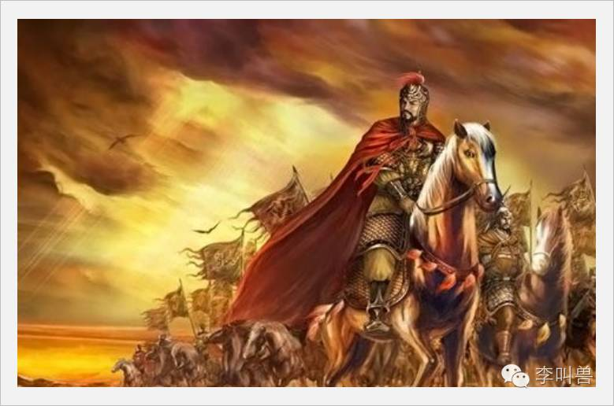

#【李叫兽】永恒的冲突：为什么消费者会重复传播类似的观点？

**Re-think:**
**“月经式热点”**
我们经常发现人们会重复传播观点，也有无数成功的营销重复利用类似的心理。

这篇文章，就讲讲这一切在消费者心理中，是如何发生的。

## **一** 

朋友圈总有一些相似的文章，每个月都来那么几次。

比如——

- 《雷军：不要拿战术上的勤奋来掩盖战略上的懒惰》
- 《深度思考比勤奋更重要》
- 《致那些勤奋的懒人们》
- 《为什么说绝大多数人都是“低品质”勤奋者？》
- 《你是不是用勤奋在掩盖另一种懒惰？》

（这些文章都是不同作者，分布在几个月发出来，核心内容全部都一样，但每次发出来都能重新火一阵。）

我之前有篇文章曾经讲过一个概念**“月经式热点”——深存于我们的内心，我们不断讨论、在意并且定期就会爆发的心理需求，而不是偶然出现的热点。**也建议营销人更多去借助“月经式热点”，而不是临时事件热点。

而“不要让战术上的勤奋掩盖战略上的懒惰”就是一种典型的都市工作者的月经式热点，更加神奇的是，**几乎所有和知识、成长相关的公众号，最终都会写到这个话题，而且每次写到都能再火一把——它就像武术界的叶问，每个想开宗立派的武行，都要去挑战一下。**

那到底是什么原因，让吃瓜群众们一次又一次被同一个内容（只不过换了标题和作者）刺激到G点从而转发？为什么隔一段时间总会爆发一下？

**“月经式热点”，到底是怎么来的？**

一句话概括：我认为月经式热点的形成，本质上来源于我们**“虚构信念中的永恒冲突”**。

## **二** 

我们知道，人类之所以能够数万甚至数百万人通力协作，而其他动物一般最多只能形成几十或者上百个单位的社群，是因为人类是所有生物中，唯一能够相信“虚构信念”的物种。——《人类简史》

比如远古智人们仅仅因为公共相信一个“河之神”，就能大量团结起来去攻击其他部落。

也就是说，**只有人类能够相信并讨论一些“看不见的事物”**（比如正义、国家、平等、民族），而其他动物最多能理解并沟通看得见的事物（比如苹果、树木、河流、老虎）。

人类世界的基金经理可以从你口袋中拿走10万，是因为他许诺到了年底这些钱会变成11万并再回到你的口袋里（因为我们会相信一些看不见的事物）。

但你无法让任何一个猴子自愿给你10支香蕉，仅仅因为你许诺明天会还给它11支香蕉。

这些大量的“虚构信念”（无论是“国家”、“宗教”、“伦理”还是“自由精神”，本质上是我们大脑想象出来的）保证了我们社会的有效运转和协作，但这导致了另一个问题：

**很多保证我们互相合作的“虚构信念”之间，并不是完全互相兼容的，很多时候不同信念之间存在“永恒的冲突”。**

比如西方社会倡导最多的**“自由”和“法制”**就是一组“虚构信念中的永恒冲突”。

共同相信“人人生而自由”，可以避免我们出现奴隶社会，让人们更加友好的合作共赢，同时可以激发人的潜力，这个信念对我们显然是有利的。

共同相信“法制”，可以规范我们的行为，减少各种伤害事件，这个信念对我们人类显然也是有利的。

但是这两个信念之间却是冲突的——**自由的提升往往会导致规范的降低，而规范的提升又会导致自由的降低。**

这就形成了一种持续存在于人的心理中的“永恒冲突”——自由和法制都是好的，既然他们有些冲突，就一定有人更支持自由一定有人更支持法律。

**而这就会引发大量的“月经式热点”——我们在转发这些热文时，往往是站在某对“永恒冲突”的一方，通过转发内容来支持这一方，打击另一方。**

比如你看到很多人转发《雷军：不拿战术上的勤奋来掩盖战略上的懒惰》的同时，也有另一些人在转发相反的观点：

- 《任正非：员工要做好本职工作，不要把精力放在构思“宏伟蓝图”上》
- 《空谈误国，实干兴邦》
- 《一般的军事家谈战略，伟大的军事家谈执行。》
- 《想得再多，不如去做》

这是因为“思考”和“执行”本身就是一组“永恒的冲突”——这两者对我们都是好的，但经常却有冲突（精力有限，放在思考上增加，往往放在执行上就会下降）。

而为了在“永恒的冲突”中占据有利地位，我们就不得不通过演讲、转发、传播、说服等方式，去支持或者反对某一方。

如果说“思考”和“执行”这两个信念是“总统大选当中的两个对手”，**那我们转发朋友圈就相当于一次投票。**

所以，这就形成了月经式热点——虽然几个月前雷军刚发布了“不要用战术上的勤奋掩盖战略上的懒惰”这个观点，但最近很多人又开始喊“空谈误国、实干兴邦”，让思考派的人颇受打压。

此时作为另一个公众号，换下案例和描述，发表一样的观点（比如“你是不是在用勤奋掩盖懒惰”），就正中这波“思考派选民”的下怀——“呀！戳中我内心了！”，说着转发朋友圈，为本来稍显弱势的阵营“思考派”投了一票。

不论你是做营销的还是写公众号的，表面上你发出去的是“文章”、“文案”或者所谓的“品牌价值主张”，实际上你是在给你的选民送“选票”**——让他们在某种永恒的冲突中，能够支持自己的一方观点（比如通过转发）。**

（等下我会具体讲讲怎么寻找“永恒的冲突”。）

## **三**  

**这不光是当代很多经久不息热文的本质，还是很多其他传播、讨论行为的本质。**

永恒冲突导致“月经式热点”，从而引发经久不息的针对某些话题的传播、讨论，本来我以为这是什么移动互联网时代或者社交媒体时代的新现象，但后来我又发现：

**这种月经式热点自古就有，而且不光是营销，甚至政治、影视、艺术等众多领域，也暗藏着各自的永恒冲突。**

比如，看过很多古代战争片的人，一定对这句话非常熟悉——**“将在外，君命有所不受”**，自从出现在《孙子兵法》之后，总是在历朝历代反复被提及。

之所以这样，是因为**“将在外，君命有所不受”反映了一组在古代君臣将领中的永恒冲突——“自主”还是“服从”。**

这两件事都是好的——提高“自主”，将军可以最大化自己的潜能，灵活根据战场情况作出调整；提高“服从”，又可以最大化减少将军肆意指挥、胡作非为的可能性。

**但“自主”和“服从”本质上却是冲突的——提高自主，必然会降低服从；提高服从，又会降低自主。**

于是就引发了数千年的争论——我想如果古代也有朋友圈，“将在外君命有所不受”必然也会每个月换着标题、案例和作者刷屏一次。

更惊奇的是，我还发现“自主”还是“服从”这组永恒的冲突，在广告营销圈也存在，甚至连李叫兽自己都中枪了。

比如隔断时间就会有文章变火，强调“策略性”、强调“创意必须服从品牌大策略”（比如李叫兽写过《文案的策略性》），本质上这相当于“服从”这方，类似于古代将军接受大局指挥而不是自主作战。

此时又会有另外一些文章会变火，比如强调“广告是创意为王”、“营销要积极尝试，不能被高层限制太多”、“精益创业思维”等，本质上这相当于“自主”这方，类似于“将在外君命有所不受”，反正这部分营销工作教给TA了，就给他自主去积极尝试呗。

**再继续一看，发现这对冲突也被很多影视IP表达出来。**

比如去年上映的《美国队长3：内战》，编剧让复仇者联盟分裂成了两派，就是为了反映这种“永恒的冲突”：各种超级英雄组成的保护地球无敌联盟，被政府要求增加监管（任何行动需要跟联合国XX小组汇报，以约束超级英雄），导致整个复仇者联盟分成了两派。

 

**一派是以美国队长为首的“自主派”，**他们相信超级英雄应该作为独立第三方去铲奸除恶，而不能成为政府的工具，不能成为不同国家政治博弈的筹码，因为政府也不能保证绝对的正义，而且只有独立自主，才能灵活制定策略杀外星大坏蛋。（PS. 美国队长是翻版的“将在外君命有所不受”）

**另一派是以钢铁侠为首的“服从派”，**他们相信美国司法倡导的“制衡原则”，如果超级英雄不能被其他力量制衡，万一为所欲为怎么办？毕竟很多民众也有这样的担心，所以必须得接受政府的监管。

**于是，这个对立就可以火很多年，因为每一代人内心都有“自主”还是“服从”这个永恒的冲突，而每个人都可以在这种对立中找到自己的位置——你是支持美国队长，还是支持钢铁侠？**

##**四**  

**如何寻找目标群体中的永恒冲突，以利用“月经式热点”？**

其实方法很简单：

**第一步：找到人的某种基本冲突**（比如“自主”VS“服从”，基本上所有人都会面临这种冲突）——问自己：**有哪些人们想实现，但却又彼此有矛盾的“虚构信念”？**

**第二步：套用到你的目标群体中。**

举个例子，**有一个基本冲突是“为自己”VS“为别人”**

这是符合“永恒冲突”的原则“都想实现但彼此冲突”——“为自己”和“为别人”都是有利的信念，但他们经常有冲突。

之所以会出现这组冲突，是由人本身进化决定的。

所有的进化都是为了保证基因的延续，而人类作为一种社会性动物，**保证基因延续不得不在“自私”和“利他”之间取得平衡（**如果人人都自私，部落存活不下来，你基因也没了），所以永远有“为自己”还是“为别人”的永恒冲突。

为了验证这一点，我随便一搜我的“月经式热点”收藏夹，就发现了这么多符合条件的热门观点：

- “人不为己，天诛地灭” vs  “先天下之忧而忧，后天下之乐而乐”
- 《是的，我就是喜欢钱》 vs 《在这个不要脸的世界，要脸真特么难！》
- 《该撕逼就撕逼，别委屈自己》 vs 《既然好人没好报，我们为什么还要做好人？》
- 《创业一定要为了钱》 vs《为什么创业者越来越不要脸》
- 《不要活在别人的世界里》VS《不要只顾自己不顾别人》

（PS. 嗯，你也发现了，有些互相对立的观点实际上是同一个人写的，这当然不是作者精神分裂，而是本身需要迎合对立冲突双方不同群体的需要，所以有时候倡导为自己，有时候倡导为别人）

然后回到你的目标群体，**假设你是做商场要卖圣诞礼品的，就需要问自己：“为自己”VS“为别人”这个冲突，在用户买圣诞礼品时的表现是什么？**

比如最简单的一个：“为自己”的表现就是多给自己买，少给别人买；“为别人”的表现就是多给别人买，少给自己买。

如果你站在后者阵营，就要激发用户“别人为你付出太多，你也应该为别人付出”的心理，比如广告片中出现你童年时，妈妈攒了半个月工资冒着大雪给你买礼物的镜头，然后一晃多少年过去，你已经长大成人并赚钱，现在应该回赠自己的妈妈。

而如果你站在前者阵营，就要激发用户“你为别人付出太多，现在应该多考虑自己”的心理。

比如英国有个百货商场Harvey Nichols，在圣诞做了“Sorry I spent on myself”的活动，号召人们买点贵的给自己，送点便宜的给朋友，收到了特别多的响应。

除此之外，我们社会中还有大量的这种“永恒的冲突”，可以被重复利用。

比如“平等”VS“自由”、“民主”VS“集权”、“努力”VS“享受”、“冒险”VS“稳定”、“能力”VS“资历”…… 

**结 语**

正是因为我们的大脑能够想象出本来不存在的事物，并且虚构出信念（比如“宗教”、“正义感”、“国家”），而不是像猴子一样只能理解具体的香蕉和西瓜，我们才能够通力合作，形成复杂的社会体系。

**但这些维持我们彼此协作的“信念”有很多相互冲突的部分（比如“自由”VS“法制”），这就导致我们不得不永恒地争论、讨论这些永恒地冲突并且支持其中某一方。**

所以当我们去转发这些“月经式帖子”的时候，本质上是做出了“投票”行为，为自己所支持的一方投了一票。

你转发并怒斥百度的“刘超事件”，是为了并不是因为真的对这个素未平生的人有多大仇恨，也不是他犯了多大的罪过，只不过是在“资历VS能力”的冲突对决中，投了后者一票——鄙视那些有资历没能力的人。

而当你转发《我为什么不聘用90后》的时候，又是在冲突对决中，投了“资历”一票。

**所以做营销的，一定要弄明白你面临的群体，到底存在什么永恒的冲突，你到底支持谁反对谁。**

毕竟伟大领袖毛主席也说过：

> **“谁是我们的敌人，谁是我们的朋友，这个问题是革命的首要问题。”——《中国社会各阶级的分析》**
 

**说明**

篇幅所限，不具体归纳和分析到底有哪些“永恒的冲突”了。（以后会写专题文章专门分析某类人群的）但我相信只要理解了上面说的基础概念，你自己肯定有能力找出来。

希望对你有所帮助。

最后，请你自己分析一下：你发现了什么“永恒的冲突”？

直接留言回复吧！

 