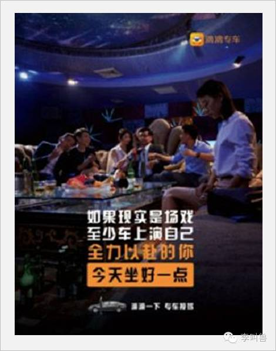

#【李叫兽】北上广有哪些“月经式”热点？

**Re-think:**
**“热点”**

**当说到借助“热点”，很多人首先想到的就是借时事**——冥王星有了新发现，赶紧发张海报说：“王二狗牌充电器，远离地球来看你”；苹果发布了新的超薄iPhone，赶紧发条微博说：“谁能比我更薄？”

但我认为这并不是最应该借助的“热点”。

 

**实际上，很多成功的传播活动，真正借助的热点并不是时事，而是当下的文化环境下，人们不断讨论、在意并且定期就会爆发的心理需求。这里，我称之为——“月经式需求”。**

 

这篇文章，李叫兽带你分析：经过经济条件和身份的变化，在精彩和压力共存的生存环境中，高知识高地位却没太多资本的北上广白领们，有哪些可以被营销人当做持续热点来借助的“月经式需求”。

**1、外部压力带来的夺回控制感需求**

很多北上广的新白领们从小到大都是同龄人中的佼佼者，通过多年的努力、残酷的竞争得到一个相对光鲜的位置。但是他们却没有享受到预期中的幸福和自由——每天不得不遵守上班规定、承担角色责任、承受房价压力，感觉不能随心所欲做自己想做的事情，失去了对自己的控制感。

 

**而很多营销活动，就是抓住了这种长期存在、定期爆发的“月经式需求”。**

 

近期的“逃离北上广”事件，新世相和航班管家号召北上广努力工作的白领，暂时放下压力和任务，来一次说走就走的旅行。

 

 

很多人果然表示“要放下工作，说走就走。”

 

**如果稍微回想一下，就会发现这种“月经式需求”——几乎每隔几个月，就会集中爆发一次。**

 

比如之前火爆的辞职事件：

 

> “世界那么大，我想去看看。”
 

网上流传甚广的段子：

 

> “你写PPT时，阿拉斯加的鳕鱼正跃出水面，你看报表时，梅里雪山的金丝猴刚好爬上树尖。你挤进地铁时，西藏的山鹰一直盘旋云端，你在会议中吵架时，尼泊尔的背包客一起端起酒杯坐在火堆旁。有一些穿高跟鞋走不到的路，有一些喷着香水闻不到的空气，有一些在写字楼里永远遇不见的人。”
 

2月份很火的话题：到底是逃离北上广还是逃回北上广？

之前在知乎上看到一个问题：

 

> “我的理想是拥有一个约五十平方公里的农场。现在年薪4万，办公室HR。怎样才能一步步靠近我的理想？”
 

还有数不胜数的“辞职去丽江开旅馆”、“环游世界”等众多的火爆话题。

 

**究其原因，是因为这些白领在日复一日的“被控制”中（比如按时上下班或者再讨厌也要挤地铁），恰好看到了挣脱这种控制的活动，短暂幻想夺回对自己自由的权。**

 

（李叫兽之前说过：人幻想某件事的体验，和实际做的体验是类似的）

 

对自己的控制感，就像喝水、吃饭和性一样，是一种基本需求。当人感觉自己不能控制自己的生活，就会产生消极的体验。

 

比如一项针对养老院的研究发现，同样一批病人，那些被允许自自己移动床的位置和摆放花草的老人，比那些事事都被照顾的老人，活的更久更健康。

 

因为那些事事被照顾，连花草的位置都被固定好的人，对自己的控制感就降低了。

 

很多北上广的白领就是这样——外部环境不断剥夺他们的控制感，让他们不自由、承担很多责任、屈服于很多目标时，自然就会产生这种“夺回控制感”的需求。

 

这种需求持续存在，就等着隔段时间被激活一次。

 

**那营销人如何借用这个需求呢？**

关键的方法就是：**寻找控制这些人的外部力量，然后帮助他们暂时解脱（比如号召放弃、号召做自己、塑造挣脱成功的偶像等）**

 

比如职场人的应酬是一种“控制他们的外部力量”，让他们感觉在外部责任和压力面前失去自由，于是你可以帮助他们暂时解脱，自己控制自己：

比如升职目标是一种“控制他们的外部力量”，让他们无法自由自在地生活，不得不加班并迎合领导，于是有人号召辞职创业，“做自己的主”，“当自己的老板”。

 

甚至，即使创业了，项目的盈利压力、融资压力也是一种“控制他们的外部力量”，让他们不能做自己想做的事情，于是又有新的号召……

**总之，对北上广的白领来说，“责任”和“自由”是一种永恒的冲突，在社会压力如此之大的时代，他们解决这个冲突的办法就是：行动上履行责任，思想上向往自由。**

 

而很多网红偶像、企业品牌等，发起的活动，如果提供了一种“短暂的自由幻想”，让他们夺回控制感，就容易获得支持。

**2、角色变化带来的怀旧需求**

北上广的新白领们，不断面临着各种变化：很多人本来是外来群体，后来变成“新北京人”、“新上海人”；本来是大学生，毕业转身一变成为白领；本来是白领，转身一变加入创业公司变成创业者；本来自己辛苦努力照顾自己，突然发现有了孩子，多一个人需要照顾……

 

**这种角色、身份、环境的不断变化，让人对自己的生活产生了“不连续感”，难以像自己确认“我是谁”——**

> “现在的我还是昨天的我吗？”
> 
> “我变了吗？”
> 
> “我现在到底是谁？是生长在三线城市的孩子，还是新时代北京人？”
> 
> “我是一个年轻美女，还是一个漂亮妈妈？”
 

**而一旦人更多产生这种“不连续感”，角色身份模糊，就容易触发怀旧心理。**

 

比如毕业季时，大学生面临身份转变，产生了不连续感，自然会不断怀旧。

 

相比之下，一辈子面朝黄土背朝天的古代农民，因为角色身份固定，不那么容易产生怀旧。

 

**这也导致：在各种身份、环境剧烈变化的北上广新白领群体中，怀旧，也成为了一种月经式需求——长期存在、等待被利用，并定期爆发。**

 

比如各种电影，每隔一段时间，就帮我们再回想一遍曾经做过的事：

 

- 《我的少女时代》
- 《同桌的你》
- 《港囧》
- 《魔兽》
- 《那些年，我们一起追的女孩》

各种金句段子，不断爆火，让我们一遍遍回到过去，确认“自己曾经是谁”。

 

> 小时候刮奖刮出“谢”字还不扔，非要把谢谢惠顾刮得干干净净才舍得放手，和后来太多的事情一模一样。
 

> 从前的车、马、邮件都慢，一生只够爱一个人。
 

还有各种爆火的事件，比如呼唤六小龄童上春晚。

 

> “哪怕春晚六小龄童直播吃桃子，我也能嗑着瓜子，看一晚上。”
 

那么在营销上，如果你想刺激人参加某个活动，如何利用这种怀旧心理呢？

 

**很简单，既然怀旧心理的重要作用是帮助人击破这种“不连续性”，让人觉得“我还是过去的我”，你就问自己两个问题就行了：**

**step 1. 我想让用户（也可以是粉丝、消费者）做什么？**

**step 2. 我想让他们做的这件事，和过去他在什么身份下做的什么事，是类似的？**

 

- 比如你是卖培训的：

 

**step 1. 我想让用户做什么？**

想让都市繁忙不学习的白领周末花时间去学习和培训

 

**step 2. 我想让他们做的这件事，和过去他在什么身份下做的什么事，是类似的？**

 

高中时的学习（当然也可以是其他的）。

 

所以，某公众号可以策划这个活动：《我准备好了40张书桌，等你回到高中》

 

> “你有多久没有连续10小时读书学习了？有人说，他这辈子智力的巅峰就是高考结束的那一刻。现在，我们策划一个活动，让你这周末回到高中……”

- 比如企业家俱乐部的活动：

 

**step 1. 我想让用户做什么？**

 

想让这些企业家参加我的“行走戈壁”活动，来吃苦。

 

**step 2. 我想让他们做的这件事，和过去他在什么身份下做的什么事，是类似的？**

 

这些企业家年轻时的自己（吃苦奋斗）。

 

所以，可以这么说：

 

> “企业家们，我们当年浴血奋战、吃进苦头才有了今天。到现在，我们在私人会馆里喝茶，在豪华轿车里躺着，那么，让我们想起当年吃苦的企业家精神，跟我一起徒步走戈壁！”
 

**总之，对于身份不断变化的人来说，“怀旧”是一种很容易被定期激发的“月经式”需求，一定记得好好利用**：“魔兽”让已经年过30的玩家最后再战一次，爱情电影让每天物质化相亲的男女再纯粹地爱一次，六小龄童让繁忙工作的人再回到童年耍一次，那你想让你的用户做什么？

  **3、权力距离变化带来的平权运动**

 我国一直是一个有很高“**权力距离**”的国家。（权力距离 -PowerDistance：GeertHofstede提出的文化概念，指的是**对社会阶层不平等的容忍度**。）

 

过去我们强调“君为臣纲，父为子纲，夫为妻纲”，长时间接受“不同人不同地位”的观点，体现在日常生活中，就是老板欺压员工、父母干预子女意志、女性被歧视等。

 

**但近些年，特别是在北上广地区，由于高等教育普及和公民意识觉醒，这种状态起到了非常大的变化，权力距离不断缩短**——比如你走进任何一个互联网公司，越来越难发现上级对员工的侮辱压榨行为，不同层级之前越来越平等。

 

**与此相关的，就是大量的“平权运动”的出现**，比如员工追求自主权，子女追求追求独立人格，女权运动等。

**而这些“平权运动”，也成为了长期存在、定期爆发的“月经式需求”。**

 

**比如最典型的“女性平权”（女权运动）**：以前女性被当做生育工具，被限制追求自己的事业和生活，而现在女性则逐渐觉醒，不想被当做男人的附庸，想要独立追求自己的平等价值。

 

几个月前，柳岩在包贝尔婚礼上被伴郎调戏，引发了大量的反感。（如果是10年前，大家的容忍程度会比现在高很多。）

2014年，某地区民政局搞妇女德育班，强调女德的关键是“打不还手、骂不还口、逆来顺受、绝不离婚”等，遭到大规模抵制。

 

2013年，北外女生发起“我的阴道说”的行动，强调女权，引发大规模讨论……

 

**除了女权运动之外，还有大量的子女追求权力、员工追求权力等运动。**

 

比如“万人抵制百合网”的行动，起因是百合网发布广告，强调子女要听妈妈的话，早点结婚。

本质是，颠覆过去“子女必须听父母的话”的理念，相当于一种平权。

 

父母比子女地位高、老板比员工地位高、顾客比服务员地位高、男性比女性地位高、大公司比小公司地位高等等，过去这些象征着**“**高权力距离**”**的行为，逐步在瓦解或减少，从而导致这些北上广白领们大量的参与、转发类似的平权运动。

**那么营销人如何借用这个每隔一段时间就出现的“热点”呢？**

**关键的方法就是：为平权行为提供合理化的理由，或者帮助用户讽刺那些倡导权力高下的行为。**

 

比如SK2几个月前制作的传播广告“她最后去了相亲角”，让一堆逼子女结婚的父母，去相亲角看子女给他们留言的心里话：

从而，倡导女性独立，倡导人们追求自己的生活。

 

还有滴滴专车之前的反对白领被恶意加班，也是在帮助他们征求权利：

**总之，北上广白领们正在面临一个权力距离迅速变化的社会，这时候平权相关的需求会长期存在并等待被激活，策划社会运动，别忘了这一点。**

**4、感受阈值提高带来的精神重生需求**

**被全球VC疯狂补贴的北上广白领们，正在面临一个各种感官需求被大量满足的生活。**

 

首单29元享受上门按摩，顶尖的全球美食，大量的电影和娱乐活动，互联网上充沛的信息，各种社交场所……

 

这些共同导致了北上广的人们**“感受阈值”的提高——当吃到越来越好吃的东西，再多一点好吃的，我们也不会感觉到有多么好吃了。**

 

北上广人们生活压力虽大，但是每天的感官需求却经常被过量满足，因此导致了“**在物欲横流的时代进行精神重生**”的需求。

 

（相比之下的农村人，有好吃的当然会去吃）

 

- 比如大家都过量饮食，于是有“辟谷”的活动（连续两周不吃饭）；
- 大家过量休闲不吃苦，有“徒步走戈壁”、“跑马拉松”的活动，还有6点早起打卡的社群；
- 大家接触很多性信息，于是有“戒色网站”；
- 大家过量满足信息需求（大量的新闻、朋友圈内容等），于是有“冥想”活动，什么都不看；
- 大家过量社交，于是有独处思考的活动……

**总之，北上广的人们对更好吃、更舒服、更丰富的资讯越来越无感（也就是感受阈值提高了），反向的活动反而变得更受欢迎——让我们更加追求克制、追求“少就是多”、追求清心寡欲、追求自我训练，从而减少负罪感……**

 

而这也是一个会定期被利用的**“**月经式**”**需求。

 

那么你如何利用这个需求呢？

**很简单——在你的活动中，剥夺别人被过量满足的某个感官需求。**

 

比如你是卖茶的，组织一个“1小时只有茶”的运动，不能看手机不能跟别人聊天（限制信息和社交），让茶友们在这个物欲横流的世界中，享受独思的清净。

 

**5、社会评价标准改变带来的规则捍卫需求**

**北上广近些年迎来了经济结构的迅速转变和各种阶层的快速流动（默默无闻的屌丝一夜成名，强大的企业家一夜破产），逐步带来的各种新旧社会规则的矛盾，从而让北上广白领们不断主动捍卫自己所坚持的某种规则。**

比如前段时间的百度UE总监刘超，在设计大会上做了一个很“挫”的PPT演讲，从而被万人指摘。后来被网友扒出来，说这个总监高薪低能，空有资历，更是得到北上广众多白领的口诛笔伐。

 

（ps.就连李叫兽本人，也不耻这种参加会议但不好好准备的行为）

 

那为什么发生不久，在北京海淀静淑苑公交站杀人的嫌疑犯，罪过大了去了，没有得到这么多口诛笔伐？

 

一个很重要的原因是：我们并不是在口诛笔伐刘超本身，而是在**捍卫被新一代白领所认同的一个规则——我们应该靠能力而不是靠资历来身居高位、获得机会**（比如大会演讲的机会）。

 

任何一个社会或者群体，都有一些默认的行事规则，如果有人打破被大家认为合理的规则，就会得到支持者的口诛笔伐——**因为如果这个合理的规则被长期打破，大家的利益会受损。**

 

就像我之前看的电影《师父》中，初入天津武林的高手，打破天津武行多年维护的规则，自然被规则的维护者容不下。

 

**而在当下迅速变化的北上广，正在上演着各种规则的交替，北上广的年轻白领们，正在想办法用新的规则去替代旧的规则，并且去捍卫自己所支持的规则。**

 

比如我自己正在观察到的一些北上广规则交替：

 

- 以资历来评价人VS以能力来评价人
- 以结果论英雄VS考虑过程正义
- 以关系取胜VS以绩效取胜……

 

比如北上广白领们通过刘超事件，感觉暗含着“以资历来评价人”的社会规则，当感觉到刘超能力一般但靠资历等来上位的时候，就觉得他打破了自己在捍卫的新社会规则（靠能力说话）。

 

从而导致，甚至百度公司内部的人，都在喊着让刘超辞职。

 

**而这种新旧规则的交替和捍卫，是一个重要的“月经式”需求，长期存在，等待被激发。**

 

再比如几年前网上热议“郭敬明涉嫌抄袭”的时候，很多人在反感这种抄袭行为，这是因为他们在维护“过程正义”、“智力有价”这样的规则。

 

但我记得当时一些老家的人，反而说“郭敬明再抄袭，人家也每年赚几千万，你有本事也去赚几千万”。

 

他们的评价标准就跟北上广白领不一样，他们在以结果论英雄，认为社会规则就是弱肉强食，还有钱有权谁有理。

 

还有各种火爆的：《少年不可欺》、《携程在手，说走走不了》、《XX，你为什么抄袭我的文章》、《田朴珺重新定义了一种女人：独立婊》等，都能看到明显的规则维护行为。

图：《少年不可欺》事件

**那么营销上应该如何利用这个“月经式”需求呢？**

 

**你需要准确识别这个群体正在热议的各种规则冲突，并且让自己站在他们所支持的一方。**

** **

比如加多宝当年商标案败诉王老吉之后，利用了大家对这种规则的维护：我们应该靠能力而不是靠关系等外部因素取胜，从而唤起了共鸣感。

**结 语 **

有很多文章，会给出今日热点，建议你去借势。而我写这篇文章，是想**尝试分析影响这个群体至少几年的热点**。

 

**这些被我称之为“月经式需求”的热点，一般是社会结构的变化、文化的转型等必然出现的热点，并且都能被重复利用。**

 

时事影响不过三天，但文化变化导致的热点却会持续数年，作为营销人，你应该更考虑后者。

**说明：**

 

1、既然这篇文章写了，北上广有哪些“月经式需求”，那么很多人就会好奇，为什么不写写：

- 中国农村有些月经式需求？
- 城乡结合部有哪些月经式需求？

 

嗯，以后如果有了相关的经历和研究，我会写的。

2、关于文化相关的营销，非常复杂，北上广新白领的焦虑和需求，也不是一篇文章能概括完的，正好在这里给读者留个作业：**你还发现北上广白领，有什么可以借用的“月经”式热点？**

 

直接留言即可。
 