#【李叫兽】 跟大品牌学营销，为何越学越糟糕？
原创 *2016-06-29* *李靖* [李叫兽](https://mp.weixin.qq.com/s?__biz=MzA5NTMxOTczOA==&mid=2650441343&idx=1&sn=9e0ad9a6d1dd80808ed45de44267d730&scene=21&key=1a602d525bf2cc7aa473ca05383c86e779debb19f3d0cde4607c5181ec7466dd083c8d40c5e6fdd2bc57c7b0e7f9b1478869e527098a4fbfd6543b157dba69feeb67e8fbb06d5dbf0e0a470aa6527c85&ascene=7&uin=MTc4OTM3ODkzOA%3D%3D&devicetype=Windows+7&version=6203005d&pass_ticket=V5w3mkkLQcmNI8VtqJK0C1erJipHSMkFDXxkSrQt9dQbXsQ8haTP3Q1NJmbFLNhV&winzoom=1##)

> 原文链接：http://mp.weixin.qq.com/s/OgKEYwsF7K4m2A2rMUcvUw

> **“一个很奇怪的现象是，我们很喜欢学习别人成功后做的事情，而不喜欢学习别人当年是怎么成功的。”**
 

品牌营销也是这样，很多初创品牌喜欢整日研究已经成功的大品牌到底又做了什么互动营销、社会化传播和感人创意，却不怎么研究它们当年是怎么成功的。

 

看下面这个案例，想想你的第一感觉：

 

 

 

我想大部分读者可能跟我一样，感觉这个广告“怪怪的”，即使它看起来很有创意（利用了反差感）。

 

为什么会这样呢？

 

“坚持中国文化”，按理说是一个很好的精神诉求，至少能够感动一部分拥有民族自尊心的人，可为什么放在这个广告里就感觉怪怪的呢？

 

一个很重要的原因就是：**你不认识“六贤记”，但它却用了跟大品牌一样的营销策略。**

 

如果我们把相同的广告创意，换成一个认知明确的大品牌，这种创意的异样感就会减少一些：

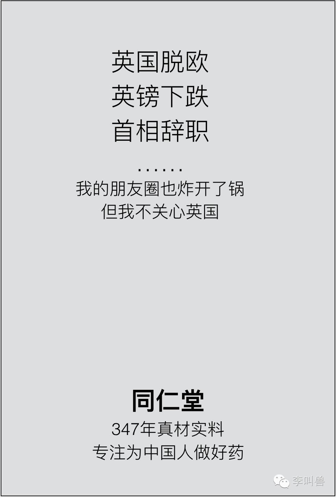

为什么会这样呢？

 

一句话：**六贤记在没有建立“基础联想”之前，就尝试建立“附加联想”。**

 

**“基础联想”是帮助用户大脑归类并建立认知的必要信息。**

 

比如一个消费者看到“同仁堂”三个字，就能瞬间联想到它是做什么的（卖药），也知道它的特点（真材实料的中药），也知道我们为什么、什么时候买它。

 

这就说明用户已经对“同仁堂”建立了基础联想。

 

但大部分用户看到“六贤记”这三个字，大脑就空无一物，对他们来说，“六贤记”这三个字跟“X#KF*NA”这样的乱码一样，不代表什么。

 

这就说明没有建立基础联想。

 

**“附加联想”是在用户基础联想以外，用来丰富内涵、提高好感的联想。**

 

比如已经建立基础联想的同仁堂，通过“民族精神”、“专注精神”、“乐于公益”、“社会责任”等各种形象塑造的营销创意，引来关注，就是不断增加品牌的“附加联想”。

 

自然能够让人回想起“同仁堂”所代表的购买理由（比如真材实料的中药）。

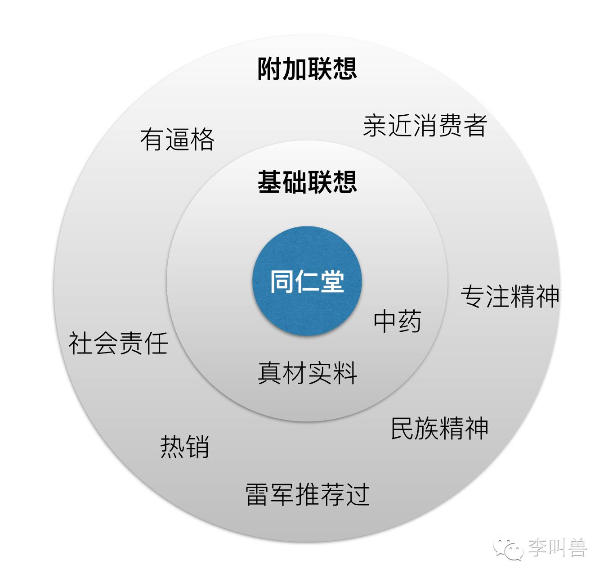

六贤记则不行，在读者面前没有基础联想，单纯的附加联想就觉得怪怪的。

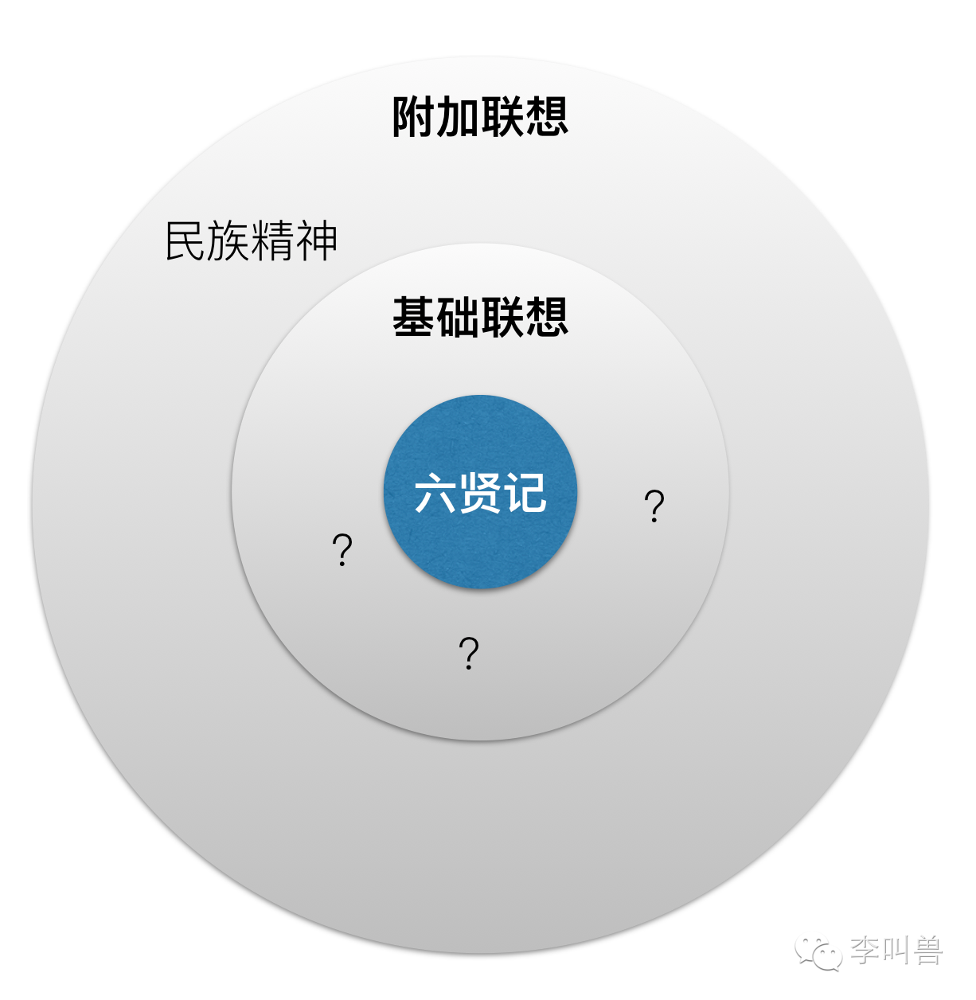

再比如想到可口可乐，除了知道**“可乐第一品牌，最正宗的可乐”**这个**基础联想**之外，还能想到它是美国文化的代表，能想到蕴含的追求**“欢乐开怀”**的精神，能想到体现的**民主精神**（总统喝的可乐和平民喝的一样的），后面这些都是**“附加联想”**，它们和产品本身无关，但是可以丰富品牌内涵，拉近消费者距离。

 

如果你观察很多大品牌的营销，就会发现它们常以“附加联想”方面的营销为主，比如护舒宝的某个TVC倡导女性独立的精神，可口可乐为迪拜工人做“瓶盖打电话”的活动来塑造社会责任感等等。

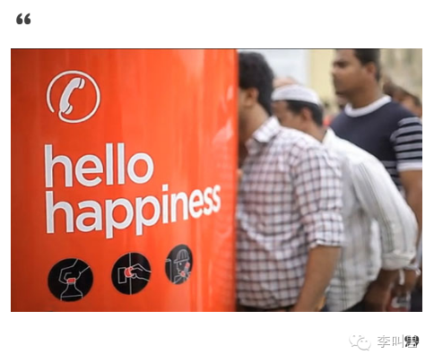
 

这是因为这些大品牌往往已经建立了稳固的“基础联想”（没有人会问可乐是什么东西，以及可口可乐正宗吗这样的问题），这时候再通过“附加联想”进行品牌形象提升，自然有效果。

 

**而很多初创品牌常犯的营销错误就在于：在没有建立“基础联想”的时候，就模仿学习成功后的大品牌，把很大的营销精力放在建立“附加联想”之上。**

 

比如十几年前，健力宝推出了新的饮料“第五季”，整个营销、广告风格参考可口可乐、苹果这样的成熟品牌，结果让人看了不知所云。

整个广告就是一群年轻人热爱第五季饮料并且快乐的热舞，给人塑造一种潮流、时尚的感觉。（让我想起了知名的iPod广告）

 

广告很精彩很吸引人，但是并没有清楚的给消费者一个理由：“**我为什么要喝第五季饮料而不喝别的？**”(这个是“基础联想”)

 

如果你是这个广告的设计者，此刻你肯定会辩解：既然可口可乐这样做很成功，作为行业新人，为什么不能学习这样伟大的前辈？

 

不是说你不能学习可口可乐这样的伟大前辈，成功者，我们当然要学习。

 

而是说：**你应该学习可口可乐成功前做的事情，而不是学习可口可乐成功后做的事情。**

 

**那么可口可乐成功前是怎么做的呢？**

 

如果我们回到20世纪初，当时美国正在做禁酒运动，可口可乐抓住机会，打的广告是：

 

“**伟大国家的无酒精饮料**”——响应新的社会风气，主打无酒精饮料这一空白，同时强调“美味提神”这一的利益（酒精并不提神，反而更昏沉）。

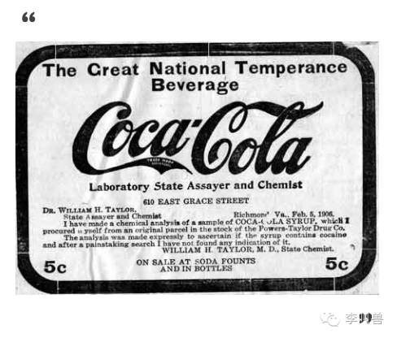

 

当时为了切入市场，可口可乐主打的是“基础联想”，让大家对**“什么是可乐”**以及**“为什么要喝可乐”**这样最基本的问题建立认知。

 

为什么不学习这一点呢？

 

**这就是一个典型的学习失误：我们特别喜欢模仿成功者成功以后做的事情，而丝毫不关心他们当年是如何取得成功的。**

 

我们喜欢说“乔布斯对客户一向很强势”从而不尊重客户，但是却忽略了：这是乔布斯成功后的特权，而不是导致他当年成功的原因（当年乔布斯为了推销产品，可也是挨门挨户）。

 

我们喜欢说“比尔盖茨当年辍学创业，我现在也应该这样”，但是却忽略了：辍学是比尔盖茨取得初步创业成功后的特权，而不是导致他初步成功的原因。

 

我还看到很多创业公司的营销人员，每天拼命的刷着各种“创意库”“最新案例”，并且听杜蕾斯、宝马的营销经理分享最新的创意案例。

 

有这个时间，却不去研究：80年前的杜蕾斯、30年前的戴尔、半个世纪前的宝马……

 

**这就是很多创业品牌学大品牌做营销却总也学不会的重要原因：你学习的是成功后的他们，而不是学习他们当年怎么成功的。**

 

就像学习成功后的马云去云游四方、到处演讲，永远也不可能成为马云一样。

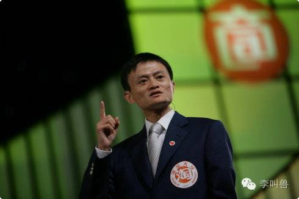

**对于品牌营销，为什么有这么大的不同？为什么我们学习成功品牌的营销，看戛纳广告奖创意，经常不成功？**

**这是因为：建立一个记忆所需要的技巧，和强化并丰富一个记忆所需要的技巧，很多是不一样的。**

 

就像一个陌生人，自我介绍时应该做的事情，和一个熟人为了提升朋友面前形象要做的事情，是两回事。

 

在初期“自我介绍”并建立认知的时候，主要是需要让别人能够对你产生“基础联想”，如果你的名字叫“王二狗”，那么一开始的目的就是让对方看到这三个字后能够大体建立对你这个人的概念。

比如知道你的年龄、性别、职业、大致社会阶层、家乡籍贯、我为什么要认识你的理由（比如你来求合作）等。

 

这个时候，我们说“王二狗”在对方的大脑中，已经占据了一个位置。

 

然后，等你们变成了“熟人朋友”，你所提供的“附加联想”才有意义——某一天你换了一个新包，对方会觉得你很时尚；某天你升职了，对方会祝贺你升职。

 

**而如果没有事先建立上面的“基础联想”，所有的“附加联想”就变的毫无意义——你走在街上，听到有人自言自语说自己升职了或者看到有人背了新潮的包包，你会记得这个人吗？**

 

当然不会，因为这部分记忆在你的大脑中根本没有存储位置。

 

**对品牌营销来说，也是这样——在建立必要的“基础联想”之前，学习大品牌增加“附加联想”，并且期望通过这些精神来打动用户，几乎没有效果。**

 

认识一个人，需要有必要的身份、年龄、性别、职业等“基础联想”。

 

**那对品牌来说，有哪些必要的基础联想呢？**

 

一般来说，新品牌新产品，必须在这些方面建立基本的认知，其他的营销才有意义：

1. **归类：它会占据我购买什么产品的预算？**
2. **购买理由：我为什么选择这个产品？**
3. **产品使用方式：我如何使用这个产品？**
4. **基础信任：我为什么相信你说的？**

**1、归类：它会占据我购买什么产品的预算？**

 先看这个众筹上的文案，你会有什么感觉？

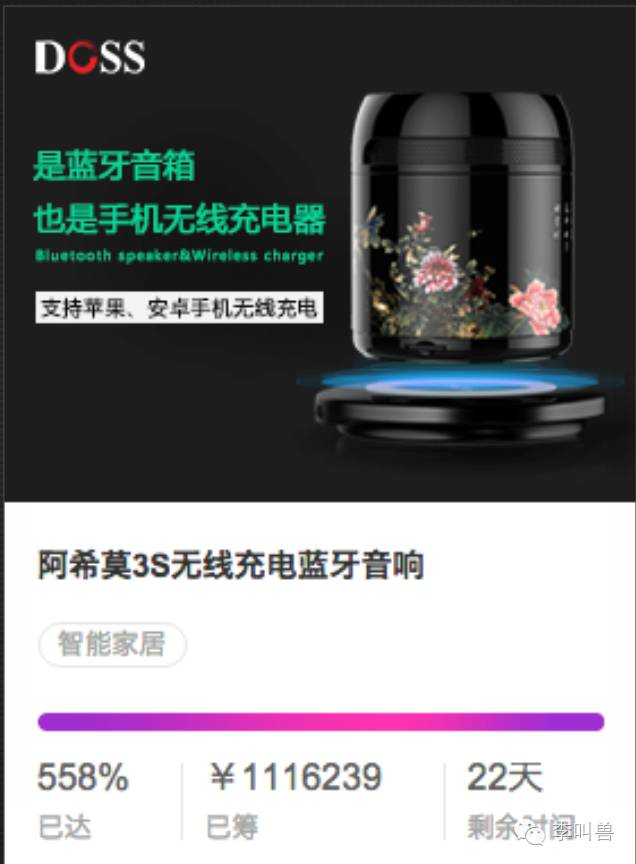
 

如果你跟我一样，一定会觉得这个文案“怪怪的”。

 

为什么呢？

 

**因为你看过之后，根本不知道把这个产品放到什么归类中。**

 

如果它是一个“蓝牙音箱”，意味着这是一个100-300左右预算的东西（音响的常规预算），意味着我在想要提高音质的时候想到要买它，可是为什么我要拿一个音响给手机充电？

 

如果它是一个“充电器”，意味着这是一个百元以下的东西（充电器的常规预算），意味着我要在手机丢了充电器的时候想要买它，可是为什么一个充电器要能放音乐？

 

这样的话，我根本不知道应该拿什么东西和这个进行比较，也就无法判断到底贵还是便宜。

 

**实际上，我们看到任何一个事物，都会先对它进行归类。**

 

比如在房间里，看到四条腿并带一个木头平面的东西，一瞬间就会认为它是一把椅子，是用来坐的。

**所以，任何新产品新品牌建立“基础联想”的第一任务，就是先在用户的大脑中拥有一个“类别”。**

**这样的“类别”，暗示了一个消费者希望通过产品达到的目的，也就知道它需要占据自己哪块时间和哪块购物预算。**

 

比如几年前的蘑菇街APP，对外介绍就是一个不清不明的“我的买手街”，而“买手街”在大众认知中，是一个根本不存在的类别，这就让陌生用户很难知道自己为什么要用蘑菇街，以及自己什么时间应该用蘑菇街。

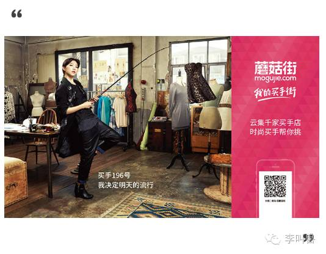
 

如果蘑菇街是一个“购物分享社区”，这意味着我来看看哪些达人都在买些什么，打发下时间，顺便可能会发现一些好玩的商品或者交到朋友。这样它帮我完成的任务和微信、网易新闻差不多（打发时间）。

如果蘑菇街是一个“导购平台”，这意味着我想买东西的时候来看看什么值得购买，我会要求它更加客观中立并且懂行。这样它帮我完成的任务跟百度、问朋友以及评测网站差不多。

 

如果蘑菇街是一个“品牌电商”，这意味着我来这里是为了买东西，我会要求它商品丰富、质优价廉、物流速度快。这样它帮我完成的任务跟唯品会、天猫和京东差不多。

 

**当用户对产品的归类不同，自然所有的消费行为也不一样。**

 

比如当年消费者把阿胶归类成“女性补血用品”，消费量有限而且认为这类东西本身不应该很贵，因此价格80元一斤；后来通过营销，消费者把它归类成“人参、鹿茸这样的滋补品”，销售量提升，而且价格也上涨了。

 
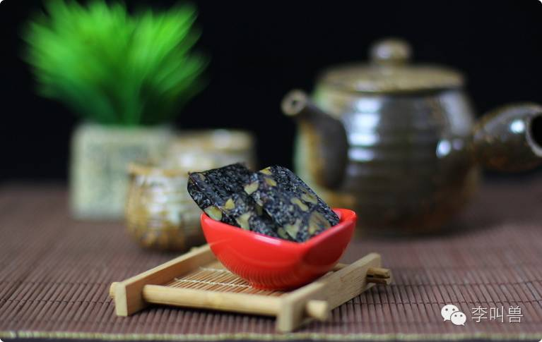

**总之，任何一个新品牌，在建立“基础联想”的时候，要先回答的问题就是：我想让用户把我归类成什么？到底占据了用户的什么时间和什么预算？**

** **

**做营销我们经常强调“差异化”，但是实际上，在诉求差异化的特点之前，应该先寻找“共性”，在用户的大脑中被分类到了某一个已经存在的归类中。**

**
**

**2、购买理由：我为什么选择这个产品？**

**如果说“归类”是创建了共性，那么“选择理由”就是建立差异化。**

 

“好了，我知道你是用来听歌的音响（归类），那么为什么放着这么多音响不选，要选你这个智能的？”

 

回答这个问题的答案，就是我们说的“选择理由”。

 

**如果只有归类，而没有选择理由，也相当于没有建立完善的“基础联想”。**

 

就像前面讲过的“第五季”饮料的广告一样，我们所有人都知道这是用来喝的饮料，广告也很好看，可是我为什么要选择你呢？

 

当没有解决这个问题的时候，单纯增加大量的“附加联想”，几乎毫无意义。

 

再比如，在我入行营销之前，就看过一个让我感动不已、惊叹叫绝的广告：大众银行的广告。

 

广告中讲了几个台湾80岁的老爷爷，为了年轻时的梦想，重新开始训练，最终骑摩托车环岛来祭奠青春的故事。

 

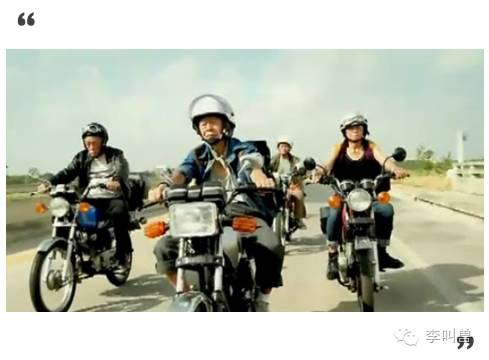

**但现在来看，这是一个100分的内容，却可能不是一个优秀的广告。**

 

（注：内容与广告是有区别的，好的内容标准是引起共鸣、吸引读者、充满创意等，好的广告是标准是解决了什么营销问题）

 

马来西亚的大众银行，比起花旗、汇丰等巨头本身处于劣势，这个时候最关键的应该是提供一个“选择大众银行的理由”（比如“服务更好”“速度更快”等），建立完善的“品牌基础联想”，然后再考虑是不是通过“附加联想”来提升形象。

 

而当这个“选择大众银行而不是花旗”的理由没有植入心智，增加大量的感动也很难引起购买。

 

**所以，如果你的品牌并没有完整的“基础联想”，就不要花费巨大精力去做那些单纯增加“附加联想”的事情。**

 

这并不是说感动这样的附加联想没有意义。如果品牌已经有了坚实的“基础联想”，用户知道为什么选择你，那么只要增加曝光、感动等，用户就容易重新想到这个理由，从而触发购买。

 

比如我已经知道“怕上火喝加多宝”并且相信了这一点，这个时候，加多宝已经在我的内心有了完整的“基础联想”，然后它做公益营销视频，鼓励中国人拥有“独立之精神，自由之思想”，我深受感动，同时看到了“加多宝”三个字，也根据这几个联想起了“怕上火”等选择理由。

然后下次再吃火锅的时候，就更容易想起喝两罐加多宝。

 

再比如下面2个完全一样，主打“附加联想”（写一段让人感动的话）的广告，如果做测试，肯定是携程的转化率高。 

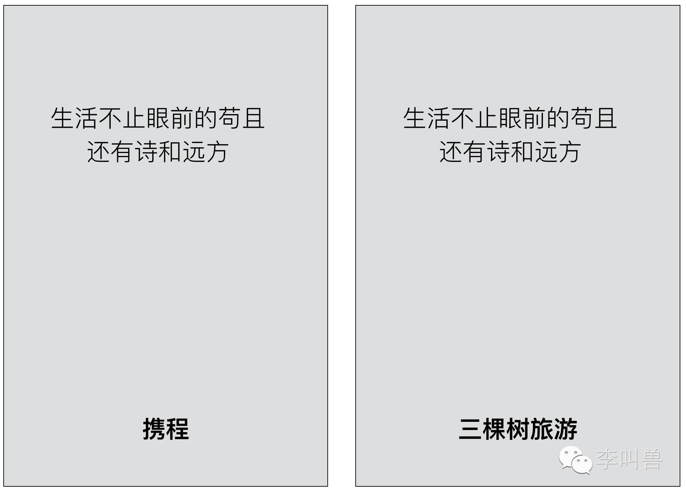

两个品牌都完成了“建立归类”的工作（后者是我杜撰的品牌，你也知道它是旅游平台），然后都做了一样的文案，但为什么我判断前者转化率高？

 

因为“携程”这两个字自带选择理由——看到“携程”，你就会回想起来“这是最大的在线旅游平台”，当你想到这个选择理由，将来自然会提高购买。

 

而看到三棵树旅游公司，你虽然知道它是旅游公司，但脑海中想不起任何的选择理由，所以不论对上面的话感动多少次，都很难真正购买。

 

所以，如果三棵树公司（虽然它不存在），学习携程的套路做营销，估计就是等死吧。

**3、产品使用方式：我如何使用这个产品？**

在智能时代到来之前，有个很创新的电视辅助产品叫做TIVO，强调“在你最方便的时候，看你最想看的”。

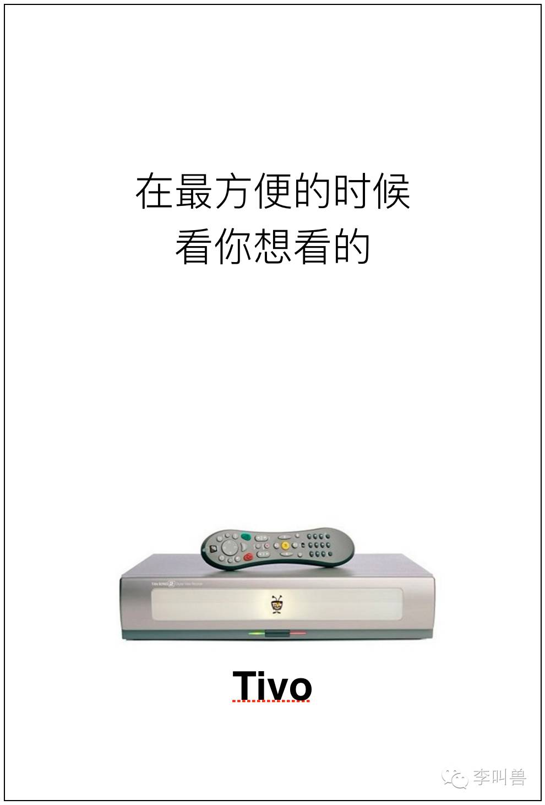

如果仅仅这样说的话，虽然给了一个选择理由（“方便自由”），但用户根本无法想象自己接下来使用产品的情形，也就很难销售。

 

这是因为：**所有人都对未知感非常恐惧，如果别人无法想象自己做出某个行动之后的情景，可能就不会做出这个行动。**

 

**所以品牌必须要建立的一个基础联想就是：能够让人看到你的名字，想象到自己使用产品的过程。**

 

当时Tivo的CEO拉姆齐多次自豪的说：“98%的使用者表示，自己一旦用上就无法离开Tivo了”，但这丝毫遮盖不了Tivo获取新用户困难并且最终失败的现实结果。

 

如果这样，让用户能够想到自己使用后的情形，情况可能就会好一些： 

 

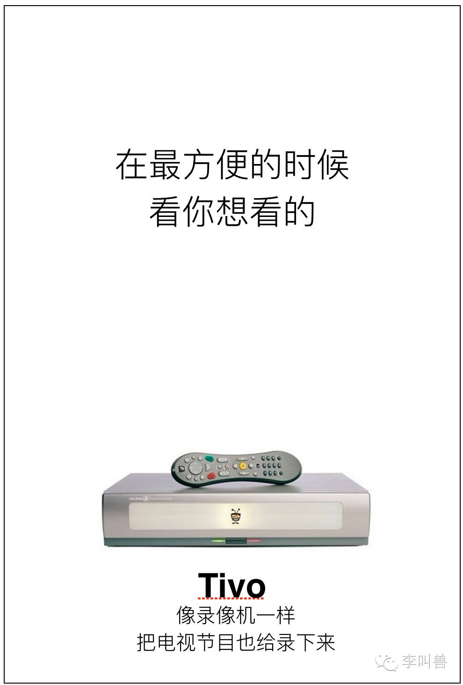

**人是一个对“预期”很敏感的动物，所以你的产品必须能让人顺利建立预期。**

之前我还看过一个研究，讲人脑和计算机最大的区别是什么，科学家发现最大的区别并不是“创造力”“思维”等能力，而是对未来的感知能力。

 

同样是做一道算术题，如果人知道明天自己被处死和知道明天活的好好的，做题的效率是不一样的。

而对计算机来说，不论多么先进的人工智能，知道明天自己会被砸的稀巴烂之后，今天的计算不会受到影响。

 

**所以，只要你的产品是对人销售的，就必须建立他对未来的感知。让他感觉到自己会如何使用产品。**

**4、基础信任：我为什么相信你说的？**

**一个让很多营销人难以接受的现实是：“你承诺我放心”的黄金营销时代，早就一去不复返了。**

 

在激烈竞争的市场中，你说的话如果不能在第一直觉上被信任，就相当于没有。

 

**所以，对新品牌来说，“最基础的信任”是一个必要的“基本联想”。**

 

之前李叫兽讲过一个海鲜外卖公司海鲜到炕，一个重要的卖点是“新鲜”，为了阐述这个卖点，有人提出的方案是告诉消费者：

 

> “我们是活海鲜做的，而很多海鲜店虽然看起来是活的，但经常拿冷冻海鲜来做。”
 

为什么我判断这样完全不靠谱呢？

 

因为没有人会对这个卖点建立信任——没有一家海鲜店愿意承认自己是死海鲜，而且消费者也没有直接观测到的证据（相反，他们看到了鱼缸中的鱼），你凭什么说就你新鲜？

 

是啊，所有人都在说自己新鲜，你什么说自己比别人新鲜？是因为“更新鲜”这个词吗？

 

**如果一个新品牌，有了归类，有了选择理由，用户也能想到自己如何使用，但就是无法对你的承诺建立信任，那也没有建立完整的“基础联想”。**

 

**那么如何建立信任呢？**

 

篇幅所限，讲几个简单技巧：

 

**（1）如果你占据的是“空位”，用户更容易信任**

 

比如上面的海鲜到炕，为了突出新鲜，如果强调“没有进过鱼缸的海鲜”（ps.它是直接在海边加工的），就更容易建立信任。

 

因为用户在海鲜店总能看到鱼缸，“没进过鱼缸的海鲜”是一个别人不强调的“空位”。

 

**（2）如果说话的人会有损自己的利益，用户更容易信任**

 

比如你做照顾儿童的机器人，结果在广告中保姆站出来说“它确实照顾的有耐心”，就更容易建立信任。

因为这种机器人本质上抢了保姆的工作，伤害了他们的利益，而我们潜意识觉得“说了伤害自己利益话的人，一般不是骗子”。

 

**（3）如果叙述某个具体过程，而不是抽象结果，用户更容易信任**

** **

比如地产广告，“出门后，我在第20棵树上做了标记”，远远比“高绿化率小区”更容易获得信任。

 

因为人们更容易相信自己容易验证的事实。

（其他N个建立信任的方法，以后文章会专门分析，这里不详述了。）

 

**总之，如果你的信息没有被直接信任，就不算建立了“基础联想”。**

**结 语 **

大品牌有很多可学之处，比如积极跟消费者沟通、维护优势的舆论等，但我们更应该学习大品牌当年是如何成功的，而不是学习大品牌成功后做了什么。

 

一个别人根本不认识的初创品牌，在没有建立基础联想的情况下，就开始模仿已经拥有完整基础联想的大品牌去做“附加联想”，去感动消费者、形象包装等，往往缺乏效果。

 

因为一个陌生人建立认识所用的方法，和熟人提升形象所用的方法，往往有很大不同。

**说明：**

跟大品牌学习营销不一定会失败，本文只是更加建议：不要盲目模仿成功后的品牌，而要多学习他们当年的成功。 