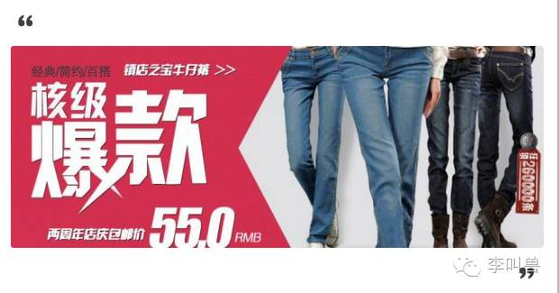
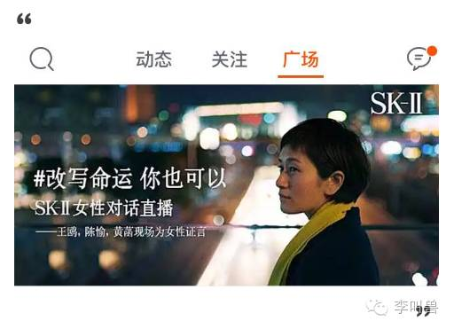
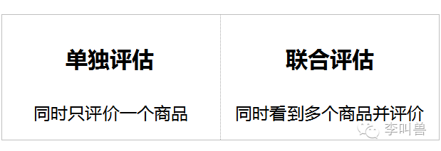
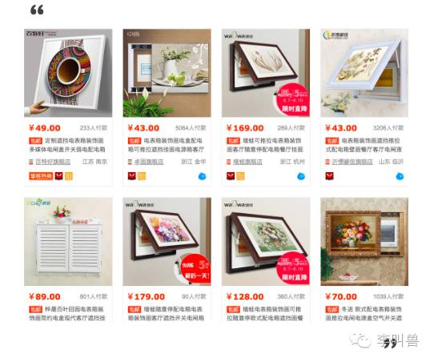
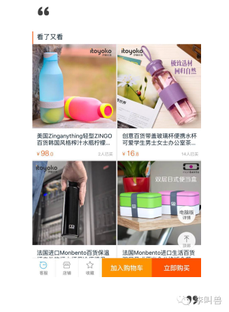
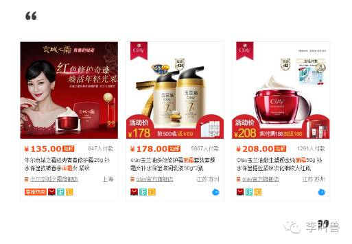
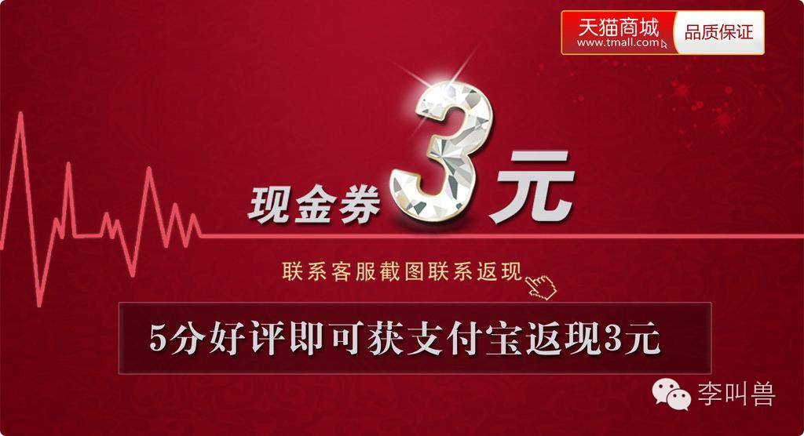
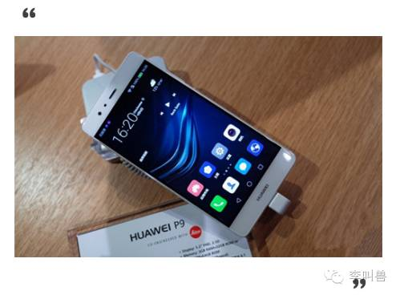
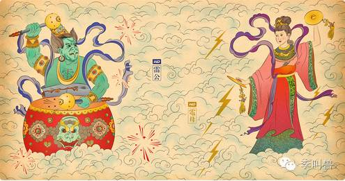
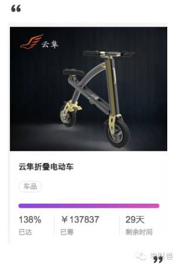

#【李叫兽】内容电商时代，不得不了解“消费者偏好”的4种变化

如果说淘宝、京东是**交易型电商**，那么现在另一种电商——**内容电商**，正在逐步崛起。越来越多的消费者在看直播、看自媒体文章、看帖子的过程中购买商品。

 

**当年从线下转到线上，市场的游戏规则变了，现在从交易型电商转到内容电商，游戏规则也会发生变化。**

 

本期李叫兽文章，就讲讲内容电商下，与你息息相关的各种营销决策，可能会有哪些改变。

**内容电商平台下，玩法要怎么变？**

> **能够生存下来的物种，并不是那些最强壮的，也不是那些头脑最聪明的，而是那些能够对环境变化做出最快反应的物种。                **            
> 
>  ——《物种起源》 达尔文
 

如果你是战争专家，你一定会去研究“决定战争胜负”的相关因素如何变化——枪阵的出现，改变了骑兵决定战争胜负的能力；机枪的出现，又让枪阵变得毫无意义；坦克的出现，又让机枪的战略作用降低……

同样，**如果你是营销人，你一定会去研究“决定顾客选择”的相关因素如何变化，因为顾客的选择永远是你占领市场的关键。**

 

到底什么因素决定了顾客的选择？

 

就像不同年代决定战争胜负的关键武器不同一样，**不同情况下，决定顾客选择的关键因素也不一样。**

**线下时代**

营销最常见的关键词是：**渠道为王、天价广告、货架竞争**……

 

因为“**购买的便利性**”几乎是决定顾客选择的最重要因素——**你的产品再好，但货架上没有你，做什么都是白费。**

**淘宝京东等交易型电商时代**

 营销最常见的关键词是：**流量、性价比、爆品战略、销量领先、好评过万**……

这种情况下渠道变得没那么重要，因为理论上**所有商品都有机会被买到**。

 

而**性价比和销量信息**变得空前重要，因为“**所有能够被直接对比的因素，都会被消费者拿来对比**”——当我们刚为一款心仪的数码产品心动不已，就立马看到了下面的同类推荐，再三对比，还是选那个销量领先而且性价比高的吧。

 

这也导致另一个问题：

 

很多**精致类产品**，比如设计师设计的精美杯子，**并不好卖**。一方面这类产品的优势并不容易被参数体现出来，另一方面大量的低价仿制者也使产品迅速同质化。

**内容电商时代**

接着，又一波潮流来了：**内容电商时代**。

 

很多消费者**在阅读内容的时候完成购买**——不论是微信自媒体电商、网红直播卖货还是“男生有哪些基本款春装”这类帖子。

 

 

在这样的趋势下，最大的变化是什么？

 

内容电商下，最重要的一个变化就是：**消费者的购物行为（shopping）和购买行为（buying），出现了大规模的分离。**

 

在过去大部分情况下，购物（shopping）和购买（buying）基本上是同时发生的，消费者为了买东西或者享受逛街，去京东、天猫或者线下的新世界百货购物（go shopping），同时在这个过程中，买到了商品（buying goods）。

 

而在内容电商环境下，消费者在购买商品的时候，**并没有处在“我要购物”、“我要逛街”的心态和场景下**，而是在悠闲地看着美妆达人直播，或者自媒体的文章。

这是非常不一样的。**当你在想要购物的时候看到商品信息，和你在没想要购物的时候看到商品信息，整个的偏好、选择标准和决策方式，都会发生巨大的变化。**

刚刚我们提出的营销决胜最关键的问题——“**什么决定了顾客的选择**”，也将发生巨大的变化。

###**内容电商VS交易型电商，消费者行为的4大区别** 

**1、单独评估 vs 联合评估**

消费者看到一个产品的时候，有两种典型场景：

**在内容电商（比如看到新媒体文章推荐）时，用户一般处于单独评估状态。**

 

比如顾爷发过一个软文卖“电表箱挂画”——家里电表箱很丑、不美观，用一副画把它遮住，显得家里美观又有逼格。

 

 

 

**当看到这个商品推荐广告的时候，你就进入了“单独评估”状态**，只比较眼前的画以及你的现状（没有电表画）。这个时候你在意的是产品本身好不好，带给你的感觉怎么样，以及价格能不能接受。

 

很可能的结果是，你看到这幅画200多块钱，也不太贵，所以就买了。

 

而如果你不是在阅读顾爷公众号的时候看到商品，而是进入淘宝、京东这种交易型电商，心理就不一样了。

 

**在交易型电商中，用户一般处于“联合评估”状态。**

比如淘宝搜“电表箱挂画”，你看到的页面是这样的：

 

这个时候，你进入了“联合评估”状态，你主要的比较点不再是“电表箱挂画”和你的现状（没有电表画），而是众多的电表箱挂画中哪个最好。

 

**如果你仔细盯着上面的淘宝图看，我想你此时的消费者心理已经发生了这些变化：**

 

- 想要看看不同价位的画之间到底有什么区别。材质？大小？印染工艺？谁画的？
-  急于寻找一些让自己感觉到熟悉的信息。比如扫一眼看看哪个品牌是你听过的（即使是华为牌的画，此时都更能抓你的眼球）。
- 赶紧比较哪个店销量大、好评多（咦？刚刚看到顾爷的，怎么不这么关心销量信息？）
- 开始在意价格，并且重新思考买这个画到底值不值。

 

然后，你可能不会买电表箱挂画了，甚至会觉得买一幅这样的画很多余，还不如买一箱牛奶补补身体。

 

**表面上看，一样的产品，你仅仅切换了评估方式（单独评估VS联合评估），你选择产品的标准却产生了巨大的变化。**

 

而就像我们前面说的，为了“在竞争中存活”，你不得不了解，“决定用户选择”的因素，到底产生了什么改变：

**（1）感性线索vs理性线索   **

 

**联合评估环境下，消费者更加注重容易对比的理性线索，**比如材质、大小、印染工艺等，这是因为联合评估的时候，我们看的是选择项之间的不同，而不是选择项和现状之间的不同。

 

**而在单独评估的时候，消费者会更加容易受到感性线索的影响，**大脑进入的不是“计算模式”而是“感觉模式”，会更容易感觉到增加一个画带来的生活改变、这幅画整体的设计感、流露出的艺术气息等。

 

所以，如果你是在参数上占优的产品，比如小米或乐视的手机，进入联合评估会非常有利，因为用户非常在意跑分。

 

如果你是在参数以外的体验上占优的产品，比如设计精美和有情怀的手机，进入单独评估会比较有利，因为你的优势无法被直接计算，难以在联合评估中占优。

 

> 有研究发现，假设有两款同等价格的冰激凌，一款是满满地装在小杯子里，总共50毫升；另一款是在200毫升的杯子里装了半满，相当于100毫升。
> 
>  
> 
> **在单独评估的时候（分别只看到其中一款冰激凌），消费者会对满杯但量少的冰激凌更满意。**因为这个时候我们看“主观感觉”，那么眼前的这个满满的，给人感觉就是多。
> 
>  
> 
> **而在联合评估的时候（同时看到两款冰激凌），消费者却又会选择半满但是量多的冰激凌**——废话，大家又不傻，看数据明显这个给的多。

再比如，找工作的时候，如果只看到一个职业选择，大部分人会对那种工作内容激动人心、公司名让人仰慕、发展前景好的工作更满意（而不是单纯的薪水）。

 

而在联合评估的时候（同时拿到很多offer），大家比较来比较去，最终更容易选择薪酬更高但自己实际上并不喜欢的工作。

 

**因为联合评估的时候，我们更容易忽略主观感受，选择那些“数据”和“参数”上更牛的选项。**

 

所以在淘宝上，你可以直接根据材质、大小等性价比选择一个画，即使这个画买回去后你并没有像买顾爷的画那样惊喜。

 

这也意味着，在**交易型电商环境下，拼参数、拼数据的产品容易获胜**，而在设计感、原创性上占优的产品，难以赢得顾客选择。

 

**而在内容型电商中，我们是单独评估，这时候设计师原创设计带来的冲击感，可能直接让我们选择去购买。**

 

这同样意味着，**在交易型电商中，我们更容易受到销量领先、知名品牌等信息的影响，因为这也容易比较。而在内容型电商中，我们则直接感觉对这个产品喜欢不喜欢。**

**（2）高端vs低端   **

**联合评估状态下，我们会进入“计算模式”，更加注重价格信息（因为容易比较），所以低价品的销售会非常好。**

**单独评估状态下，我们会更加注重主观感受，更有可能忽略成本，放纵一下买个自己喜欢的，所以高价品、享乐品的销售会非常好。**

之前我遇到一个自媒体卖产品的客户，同样的产品（高端有设计感的杯子）推送给同样的粉丝，一个用淘宝平台，一个直接用微信嵌入的电商平台，结果后者转化率高了十几倍。

 

其实一个很重要的原因就是：淘宝本质上属于交易型电商，会强迫所有消费者自动进入联合评估的状态。

 

（图：任何一个详情页下，都会推荐类似商品，让消费者进入联合评估）

 

**在这种状态下，用户会更加在意成本信息，价格敏感性增强，从而导致更少人选择高端产品、享乐产品。**

 

所以高端品牌（比如LV）在线下一定是用专卖店，而不会进入卖场，因为后者是联合评估。

**总 结**在内容电商环境下，更多人会在单独评估状态下购物，出现这些变化：

 

- 性价比的作用性降低，而感性因素的影响会升高（比如设计感、悠久历史、情怀、故事等）。
- 低端产品的销售会降低，原来很难卖出去的高端产品、享乐型产品会更容易卖。

 

**2、主动搜索 vs 被动搜索**

如果在淘宝、京东购物，此时你的心理状态经常是：**我要买东西**。

 

你处于“购物”（shopping）心态中，大脑中经常装着某个潜在的任务——比如要看看有没有好看的衣服或者想买一箱牛奶存放到冰箱。

 

这个时候，**我们就说你处于“主动搜寻”的心理，你会对将来可能会购买的产品信息更加敏感，而对无关信息不那么敏感。**

 

而在内容电商环境中，你本身正在专心看网红的直播或者某个自媒体的内容，这个时候突然看到有个产品信息（比如讲健康的播主，推荐了新型智能牙刷），此时，我们说你处于“**被动接受**”的心理。

 

**这有什么区别呢？**

 

> **研究发现，在主动搜寻的心理中，我们会更加关心直接与任务相关的信息，而对与任务无关的信息减少关心。**
 

比如你想挑一款面霜，会在大量的面霜相关的商品中进行比较，对面霜相关的信息非常敏感。

 

而如果此时偶尔看到有个叫做“面部喷剂”的新型产品，你可能压根不会关心（因为你正在找面霜），即使它也可以帮助你改善和保养皮肤。

（ps.这个产品是李叫兽编的，用来制造未知感，实际上不存在这个产品）

 

**所以在交易型电商中，各种新奇、未知的产品，其实并不好卖。**

 

> 有个知名的“看不见的大猩猩”心理实验证明了这一点。
> 
>  
> 
> 心理学家召集一些志愿者，给他们布置任务：数一下在接下来的视频中，球员一共传了多少次球。
> 
>  
> 
> 然后在视频一半的时候，有个人穿着大猩猩的衣服进场并且做了欢呼的动作。

> 等实验结束，心理学家问志愿者：**球员一共传了多少次球？大部分人答案都对了。**
> 
>  
> 
> 但是接着问：**你们有看到一个大猩猩吗**？
> 
>  
> 
> **结果超过半数的人声称没有看到大猩猩。**
> 
>  
> 
> **这是因为看视频的时候，大部分人聚焦于“数传球”这个任务中，从而自动忽略了与任务无关的信息（大猩猩）。**
 

这也导致了用户在京东选购面霜的时候，可能更容易关注面霜本身，而不是主动好奇地去寻找除了面霜还有什么新型产品可以替代。

 

而如果是在内容型电商，用户事先没有觉得要买面霜，而是在看一档教你如何保养面部的节目，就更容易接受一种新型的护理面部的方式（比如XX面部喷剂）。

###**总 结**
内容型电商，比交易型电商更适合销售新奇产品。

 

**3、对渠道商业属性的感知**

 

在京东、天猫等交易型电商购物时，消费者对商家往往有着明确的感知——**它是打广告要赚钱的，所以自然提高了对信息的警惕性和怀疑度。**

 

这时候，消费者会对商品的缺点更加关注，更容易选择没有缺点、没有风险的产品。

 

总之，就是“**挑刺心理**”。

 

**而在看内容的时候（比如自媒体内容或者半糖、调调这种独立导购贴），消费者的心态并不是“我要筛选谁会不会骗我”，而是专注看内容**——“哇，这个段子太搞笑了，哈哈哈！”“哦，原来男生春装需要一个blazer！”

 

这时候，消费者会对商品的优点更加关注，更容易选择有亮点、有独特属性的产品。

 

总之，就是“**找亮点心理**”。

 

**这对不同类型的产品，有巨大的影响。**

 

比如，锤子手机属于有亮点也有缺陷的产品。

 

如果是在京东等交易型电商，用户本来看了优点后很心动，但是一看到王自如的评价“锤子续航不行”，可能会立刻放弃购买。

 

这也是淘宝、京东等平台上一句差评抵得上一千句好评的重要原因。

**而在内容型电商平台，用户认为自己并不是在购物而是在看直播看文章，防范心理、挑刺心理并没有被激活，更容易受到各种独特而打动人的优点的影响**——“哇！锤子手机竟然是对称的，真不错！”

 

再比如，华为P9使用了“徕卡双摄像头”，有独特价值，但在一些崇尚原产地的用户眼中，华为是“国货”，不是“进口货”，存在缺点。

 

在京东、天猫上，很多用户直接一眼扫过去：国产的不靠谱，还是算了。其他所有的亮点都因为这个缺陷而变得没用。（这在营销上叫做“非补偿性评估”，缺点无法被优点弥补）

 

而在内容平台上，用户并没有认为自己现在的任务是在购物，没有激活“挑刺心理”，更容易综合看待这个产品：P9是华为的，国产。咦？徕卡双摄，这个特点不错，即使是国产也无所谓了，我觉得值得入手！（这在营销上叫做“补偿性评估”，产品的缺点可以被有点弥补）

 

**不光营销领域，只要和用户决策相关的领域，都是类似的道理，比如找对象。**

 

**在相亲的时候，类似于“交易型电商”的状态**，相亲者（比如某美女）头脑中装着求偶相关的决策任务，更容易激活挑刺心理，进入“非补偿性评估”，一个缺点杀掉一切——

哦，你没有房啊，那不用谈了，谢谢。走的时候把咖啡钱付一下，我有事先撤了。

 

 

这时候其他方面不论有多大的优点（比如比郑中基要帅、比乔布斯有才华、比亲爹还疼我）都很难弥补没房这个必要性缺点。

**所以，方方面面都60分的男人，远远比某方面40分，其他方面都99分的男人要容易通过筛选，因为这时候看最低分不看总分。**

 

而如果不在相亲的时候，比如某美女在跟对方公司的男性聊商业合作，就进入了类似“内容型电商”的状态，她头脑中没有装着“我要判断他是否适合结婚”的这个决策任务（因为此时正在谈公务），就没有防范心理，进入了“**补偿性评估**”——

> 这个人真有才华，年纪轻轻就升任部门经理，虽然还没买房，但前途不可限量！
 

**这时候，优点缺点可以互补，房产不够，才华来凑；身高不够，颜值来凑……总分更高的男人，更容易赢得下一步发展的机会。**

###**总 结**
内容电商环境下，商品更加不会因为单一的缺陷（比如不是大品牌、不是进口货），就丧失被用户青睐的机会。消费者更加容易找亮点，看总分。

**4、认知闭合需求**

先科普下什么是“认知闭合需求”。

 

“认知闭合需求”作为近些年心理学的热点话题，是指：**当人面对模糊性的问题时，给问题找一个明确答案的欲望。**

 

比如古人明明没有能力弄明白到底为什么下雨，相当于“为啥下雨”这个重要问题没有“闭合”，让人难受。

 

为此，古人YY出一套“雷公电母+龙王”的理论来解释下雨的原因。虽然这毫无根据，但是满足了人的“认知闭合需求”，解决了疑问，心里一块石头落了地。

 

**在高认知闭合需求状态下，我们会想要赶紧得到一个合理的能说服自己的答案，往往不愿意接受复杂信息、新观点或者任何的模糊性。**

 

这和我们的内容型电商VS交易型电商有什么关系呢？

 

**在交易型电商（甚至包括线下商场），我们认为自己来了就是要为了购物的，内心暗含着一个做消费决策的任务，存在较高的认知闭合需求——不断地寻找有助于帮助我们迅速做决策购买的线索。**

 

比如，你想要选购一台电动车代步，登上了淘宝，看到除了常规电动车，还有这种：

 

很大概率你看了会心动，但最终不会购买，还是去买了传统电动车。

 

因为判断传统电动车是否适合你非常容易——大街上这么多人骑着呢，别人能用我就能用。

 

可以让你的认知迅速“闭合”。

 

**而判断这个新型电动车就麻烦多了——**

 

> “这么单薄会不会危险？如何判断安全性？我刷刷用户评论看看……百度一下评测视频……”
 

> “优势是能折叠，对我来说应用场景多不多？偶尔坐地铁可能用得上，这是比传统电动车的优势。那我坐地铁频率高吗……上个月坐了几次来着……”
 

> “续航20公里，那我算算这20公里对我来说够不够，家里到公司……我记得是4公里，再看看地图……万一有哪天我要出远门呢……”
 

> “车胎不是充气的，这会降低越野能力吗？打听打听……比充气的有什么优势……”
 

**如果你具有高度的认知闭合需求，需要尽快做个决定，那你很大概率不会选择这个产品**——判断它是否适合你，太复杂了，就像古人理解天气一样复杂。

 

而如果是在内容型平台，反正你悠闲地看一个叫做“城市新型交通方式”的直播视频（而不是内心暗含了一个做决策的任务），跟着视频优哉游哉地了解这个车，就能接受相对复杂的信息，从而最终购买产品。

 

**所以，内容型平台因为降低了“认知闭合需求”，从而让用户更容易接受复杂的决策信息，也让复杂的、让人不习惯的、难以比较的产品，能相对容易地卖出去。**

**而在交易型电商平台，如果用户无法直接迅速对比，就不太可能购买你的产品。**

 

**结 语 **

内容电商，“决定用户选择”的因素，产生了哪些变化？

 

因为用户更容易进行单独评估、跟多地被动接受信息、更少地顾虑和找茬、更少的认知闭合需求，导致用户更加容易接受感性信息、高端产品、享乐产品、新奇产品、复杂产品和有缺陷但总体有亮点的产品。

 

总之，锤子手机比起小米，在内容电商平台会比在交易型电商，更有利。

 

**本期方法应用场景：**

 

- 判断未来趋势，选择战略方向。
- 选择产品策略。
- 根据产品特点选择销售渠道。
- 选择你的广告诉求。