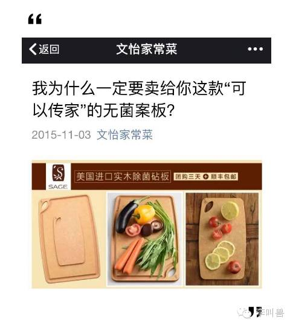
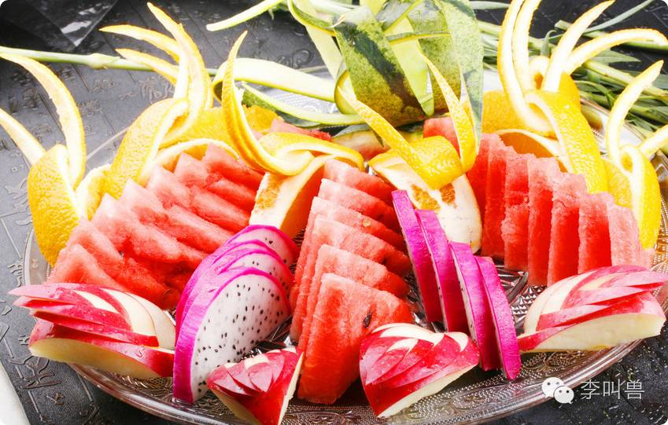
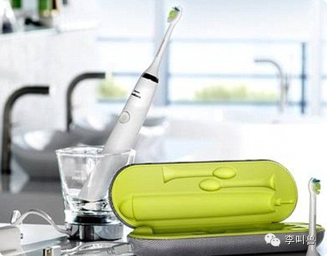
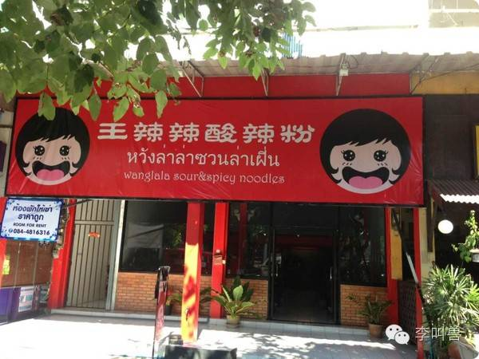
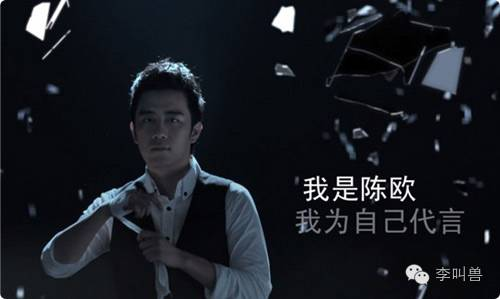
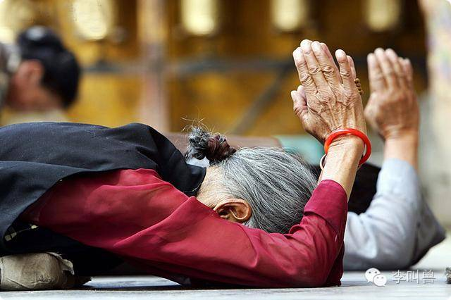

#【李叫兽】认知价值，决定网红商业模式
原创  *2016-05-18* *李靖* [李叫兽](https://mp.weixin.qq.com/s?__biz=MzA5NTMxOTczOA==&mid=2650441169&idx=1&sn=284aaf45995830a8631646910933a639&scene=21&key=d8b6cb606368af433455e02757f38992a8dc6341587e5439c008a23d2eff5a96b71ca3fbe2dd2299da75e4a293801db66b1b91775ec2d1b97ed3578205a04f92c17ce743103865c58a124af05eb54801&ascene=7&uin=MTc4OTM3ODkzOA%3D%3D&devicetype=Windows+7&version=6203005d&pass_ticket=V5w3mkkLQcmNI8VtqJK0C1erJipHSMkFDXxkSrQt9dQbXsQ8haTP3Q1NJmbFLNhV&winzoom=1##)

> 原文链接：http://mp.weixin.qq.com/s/Txdz8sD0hzH3jJ36JJzRTw

“真正决定网红商业模式的，并不是广告和卖货本身，而是TA提供的认知价值。”

**网红有哪些商业模式？**

关于这个问题，主要有两大派，一派是以罗辑思维为代表的**“卖货派”，主张网红的终极模式是卖货、创品牌，成为真正的交易入口**；另一派是**“广告派”**（比如江南春等人），**认为最顶尖的网红就是直接合作卖广告，简单有效。**

 

但是我认为，**网红商业模式区分的关键**，并不是“做广告”或是“卖货”，而是**看网红本身提供在用户大脑中，存在什么认知价值。**

 

一般来说，网红提供了这些不同的“认知价值”：

- **流量价值**：网红带来大量的流量和曝光（也是被最多人看到的价值）；
- **心理唤起价值**：网红唤起人不同的心理状态（之前李叫兽文章讲过的价值）；
- **品牌价值**：用户对网红的信任带来的背书作用；
- **支持心理**：网红唤起人的感激感；
- **模仿价值**：网红引发人的模仿；
- **号召价值**：网红能够号召人的行动。

 

既然创造这么多不同的认知价值，现在的网红也可能具备多重身份：

- 流量价值——网红是一个**免费产品**
- 心理唤起价值——网红是一个**场景**
- 品牌价值——网红是一个**品牌**
- 支持心理——网红是一个**朋友**
- 模仿价值——网红是一个**偶像**
- 号召价值——网红是一个**社群（或宗教）组织者**

 

下面，李叫兽就来分析一下网红每种身份下的关键认知价值，以及每种价值可以对应什么商业模式。

###**1、流量价值——网红作为一个免费产品**

这是被最多人看到的价值——**网红提供了免费产品（比如文章、视频），靠这些免费产品吸引了大量的关注和曝光，然后利用关注和曝光产生的价值来赚钱。**

 

如果流量价值是网红的关键价值，那么商业模式自然可以参考**免费商品**的商业模式，只需要去了解360、hao123导航等免费工具如何赚钱。

 

一般来说，无非是通过大量的流量展示，为其他商品引流。

 

对很多产品来说（比如一个陌生的保险项目），大量的流量本身并不刺激销量，**而当一个产品更多具备下面这些属性时，单纯的流量曝光就能带来很大销量：**

**1.享乐品属性**

游戏、巧克力、蛋糕等属于享乐品（主要是为了解决一时的享受体验），而药品、马桶、圆珠笔、电池等属于实用产品（主要是为了满足某种实用需求）。

 

大量研究发现：**对于享乐品来说，只要有大量的曝光，被你多次看到，就能提高销量。**

这是因为你每看到一次巧克力的诱惑照片，自制力就会下降一点，看过3次之后，就可能直接让你忍不住诱惑而下单。

而对于实用品来说，单纯的曝光带来的销量非常有限（比如当你不缺圆珠笔时，不断看多少遍圆珠笔都不会买），**所以实用品的营销主要在于情景植入和精准性**（比如搜索引擎关键词）。

 

**2.低决策难度的产品**

一个装饰性手链是低决策难度的商品，你看着好看可能立刻就买了，这时候单纯大量的曝光就能刺激销量。

 而一个结婚钻戒是高决策难度的商品，你会综合考虑对比各种品牌、价格、信誉等因素，这时候单纯的曝光并不能直接带来销量。

 

因此，**如果你是一个拥有超级流量的网红，最重要的价值是流量本身，那么销售低决策难度的享乐品，会非常容易。**

 

同样，一些以单纯流量为主的网站（比如导航网站、门户等），这类产品的转化率也是最高的（这就是为什么这些网站经常出现恶俗的页游广告）。

**刚刚假设的情况是网红自己直接促进产品的销售（可能是自己有电商、为淘宝导流等），这时候利用曝光直接产生的冲动性购买，可以销售低决策难度的享乐品。**

 

但是如果你想打间接的品牌广告，而不是当做交易入口呢？

 

这个时候，你的曝光创造的主要价值是“**提示性价值**”。

比如加多宝在凉茶大战中不断强调自己是行业领导者，需要在你能看到的各种地方不断提示这一定位，从而让你将来去烧烤摊撸串的时候优先点加多宝，那么你只要打上它的广告，多展示几次，就相当于不断向用户提示，强化了品牌。

 

不过要注意的是：如果是直接流量变现，间接广告产生的经济价值并不高，你还得跟分众、CCTV等流量更大的平台做竞争，实际上不划算。

**总 结**

（1）**比标对象**：百度、360等免费工具；

（2）**网红特点**：没有人格化、没有粉丝崇拜、没有深度内容聚焦、没有垂直人群聚焦，单纯具有大量的关注和流量；

 

（3）**关键价值**：大量的流量；

 

（4）**解决的产品营销问题**：曝光展示不足的问题；

 

（5）**建议的商业模式**：优先以**直接销售**为目的（可能是为自己的电商或者淘宝导流），主要应该销售低决策难度的享乐品，同时为了不浪费流量，应该销售多种相关产品，给用户多种选择（万一点进来的粉丝不喜欢巧克力，没关系，旁边还有美味麦片）。

 

同时，因为流量模式下产品精品并不重要，反而**品类多样**和**灵活性**重要，所以不建议自主研发产品，应该以**多方合作**为主（比如销售别人的产品或者给淘宝店引流。）

 

而如果要做间接的品牌广告，以**知名品牌提示性营销**为主。

 

### **2、心理唤起价值——网红作为一个场景**

当你打开一个爱情类网红的公众号，你内心可能被唤起了爱情的感觉；当你打开了一个专门讲恐怖故事的网红公众号，你内心可能又被唤起了恐惧的感觉。

 

这就是很多网红作为场景，创造的一个重要价值：**唤起你的某种心理，让你短暂地变成另外一个人。**

 

而这种价值，是绝大部分网红真正创造的远超流量本身的价值。

 

（详细参考李叫兽之前文章：[《【李叫兽】网红自媒体，最大的价值不是流量，而是……》](http://mp.weixin.qq.com/s?__biz=MzA5NTMxOTczOA==&mid=2650440976&idx=1&sn=828c09def6bae6f4a0376d22ad087f6e&scene=21#wechat_redirect)）

比如李叫兽在之前的文章中举过例子，本来一个上千元的砧板全亚洲一年销量不到一万（即使无数商场有无数流量），但文怡的公众号发文，10分钟就销售1.5W个，超过整个亚洲此类高端砧板的总销量。

 

这是因为一个人在正常状态下，根本不会违背自己的认知习惯去购买一个远超常规价格的砧板。

 

而文怡公众号的文章，通过对美好、极致做菜体验的持续描述，让人一旦进入这个公众号，也会短暂地变成一个“崇尚美好、极致做菜体验”的人，从而变得能够接受这么贵的砧板（就像你平时不会买80元一个的西瓜，但是一旦进入夜店的场景，被唤起了另一种心理，会很容易花80元买只有四分之一个西瓜组成的果盘）。

**之所以这样，是因为人的性格和偏好是不稳定的，经常在不同的场景下被唤起不同的心理自我，从而表现出完全不同的消费者行为。**

 

比如，研究发现，当人的恐惧心理被唤起时，会提高对从众的需求——所以讲恐惧小说的网红，应该销售热销类商品。

 

有很多网红都能够深度唤起粉丝的某种心理，比如咪蒙、罗辑思维、深夜发媸等。

 

**那么，具有强烈心理唤起的网红，最适合什么商业模式呢？**

**既然他们最大的价值是“通过内容唤起某种心理，让人短暂变成另一个人”，那么就应该通过“让人做一些平时不会去做的事情”来获得商业价值。**

 

而对商品的营销来说，这个价值就是：**新产品推广初期如何唤起用户的需求。**

 

比如你卖一个让人感到很陌生的智能牙刷，直接打大量的流量广告可能是没有用的。因为普通人即使看到了智能牙刷的广告，也会直接回避这个信息——我已经用惯了普通牙刷，凭什么要改变习惯换成这种的？

 

这类产品营销的关键问题是：让人意识到自己有需求。让人觉得传统刷牙方式不健康、不安全、不方便，最终选择购买一个智能牙刷。

传统广告很难解决这个问题，而一些可以让人产生高度投入感的网红内容却能够有效解决这个问题。

 

比如你在看一篇网红讲解健康的文章，全情投入、深度阅读、放下对广告的反感和防备之心，反思自己过去的消费习惯，最终决定买一个智能牙刷试试——这是广告无论如何也达不到的效果（即使你找李叫兽写文案也很难）。

 

所以对于这类网红来说，应该销售这种“需要改变习惯或认知，进而唤起一个不同的需求，最终才会接受”的商品。

**总 结**

（1）**比标对象**：评测贴、电视节目（比如养生类栏目间接推销保健品）、线下演讲展会、直接推销；

（2）**网红特点**：**强烈的人格化**（比如咪蒙敢怒敢恨的性格表现）、持续发类似的内容（每篇内容风格类似，都能唤起不同心理）、**内容的涉入度较强**（比如看一系列段子就呵呵一笑就过去了，但深度阅读一篇咪蒙的吐槽文章，整个人的情绪都可能被带动）；

 

（3）**解决的产品营销问题**：唤起需求难、需要改变用户习惯的问题；

 

（4）**建议的商业模式**：**直接销售第三方产品**，或者给可以直接产生销售行为的商品**导流**（比如下载APP）；

**不建议打间接广告**（比如塑造品牌形象做提示性营销），因为心理唤起就是一刹那的感觉，如果不能直接产生交易或下载，这种感觉就被浪费了。

**不建议自己研发产品**（因为这样可以持续利用唤起新的心理需求的能力）

### **3、品牌价值——网红作为一个品牌**

**一些网红因为持续地塑造某个形象，实际上已经具备了品牌价值，成为某个品类的代表。**如果说“加多宝＝凉茶”是一个成功的品牌，那么“同道大叔=星座”也可以是一个成功的品牌。

 

如果说传统是我们是先有了产品，然后想办法慢慢建立品牌——比如研发出凉茶，然后慢慢寻找定位（怕上火），慢慢传播，让一个产品具备了品牌价值。

 

**那么很多品牌型的网红就是反过来的，他们是先有了品牌和定位（比如同道大叔=星座；杜绍斐=直男基本款服装），然后再反向为这个定位寻找产品。**

 

你可以想象成：一个叫做“加多宝”的网红，因为不断发防上火类养生内容，成为全国怕上火的心智代表（先有了品牌），这个时候为了变现，开始选产品，最终发现凉茶比较适合，于是做了凉茶。

 

**因此，如果是一些定位清晰、人群聚焦、并且形成品类代表的网红，可以走品牌的模式，研发产品进行销售。**

**那么这种商业模式适合什么产品或行业呢？**

既然你的优势在于品牌，那么就适合进入那些因为品牌有问题而阻碍发展的行业：

 

**1.存在高度不对称的行业——品牌的背书价值**

比如医疗美容行业，用户在尝试之前，根本不知道效果怎么样，因此对很多服务提供者缺乏信任感。

这种因为信息不对称导致的风险问题，严重阻碍了很多行业的发展，而如果在这种行业拥有一个被大众信任的品牌，就容易击败竞争对手。

 

**网红因为具有了公众人物属性，已经得到了粉丝信任，因此建立品牌去解决一些缺乏信任的行业存在的问题，会非常容易。**

比如我见过的一个理财团队“花卷财团”，就是先通过内容服务建立信任，然后延伸理财服务。

 

类似行业：医疗美容、理财产品、咨询服务、心理辅导、保健品、强效护肤品等。

**2.需要吸引关注的行业——品牌吸引关注的价值**

有很多行业的产品，本身不像手机产品这样如此有关注价值，无法占据讨论话题，也就难以推广。

 

比如你是卖床单的，床单不像衣服那样容易引发讨论和关注，也很难占据话题。

 

但是如果这是网红做的床单，就容易多了，无数人会愿意关注。

 

再比如提出“裂变式创业”的宗毅成为了网红，也让他公司的产品“空气热能泵”获得了更高的关注；王辣辣让酸辣粉这个品类获得了关注等。

**3.缺乏有价值定位的行业——品牌建立定位的价值**

比如服装、化妆品、快消品等行业，最难的并不是做产品，也不是打广告做推广，而是如何在数以万计的同行中找到一个差异化定位。

 

但是网红的存在就可以解决这个问题。比如服装行业定位很难找，找到了也很难把定位推出去，导致品牌建立不起来。

 

而一个网红“杜绍斐”已经通过内容建立了“直男基本款”的成功定位（这可能是花费上千万找战略定位专家都不一定能做成功的），再反向提供符合定位的服装产品，就容易多了。

**总 结**

（1）**比标对象**：各种成功的品牌；

（2）**网红特点**：持续性鲜明的特征，聚焦某个行业，成为某个品类的代表；

 

（3）**关键价值**：品牌价值；

（4）**解决的产品营销问题**：缺乏背书、缺乏定位、缺乏关注的产品；

 

（5）**建议的商业模式**：**建立品牌，销售付费产品**——可以是实物产品，比如服装网红建立服装品牌，也可以是虚拟产品，比如知识网红变成付费培训产品的品牌；

 

与前面模式的不同在于，如果建立品牌，就不能销售其他品牌的产品（比如假如走服装品牌的战略，就不能给Gucci导流量了）。

###**4、支持价值——打赏心理的非货币化**

**用户免费看了你的内容，产生感激心理（就是李叫兽前几周文章讲的打赏心理），然后买你的东西、点你的广告或者直接给你打赏付费。**

比如有的斗鱼游戏主播，因为讲的非常精彩，结果粉丝叫好，纷纷去支持他的淘宝店，年销售上千万（按利润算都快顶一个小上市公司了）。

 

**为什么同样是销售产品，前面的叫做流量变现，而这个叫做“打赏心理的非货币化”呢？**

**这是因为用户本质上购买的原因，并不是因为本身想要这个商品，而是把购买商品当成表达支持和感激的方式。**

这种商业模式，非常类似于我之前回老家看到的“老年人保健品直销员”的价值。

 

有的年轻小伙子，销售保健品的时候，对老年人很用心关怀，陪聊天、帮忙倒垃圾等，满足了这些孤独老年人的陪伴需求（子女不在身边）。

 

一旦这些老年人觉得孤独了，就会给这些直销员打电话说保健品吃完了（实际上是为了获得陪伴）。

所以，这些人直销员实际上不是卖保健品的，而是提供“老年人陪伴服务”的，只不过其支付方式是购买保健品而不是直接给钱而已。

而保健品购买，就是“打赏心理的非货币化”。

 

有一些网红也是这样，斗鱼主播卖零食，但他不是开零食店的，而是提供“直播服务”，而粉丝买零食是表达支持感的重要方式。

 

**那同样是购买销售产品，这个“打赏心理非货币化”和前面讲的“建立品牌”有什么关键区别呢？**

 

一个非常重要的关键判断点就是：**如果网红不再提供服务，是否还会有这么多人购买产品。**

**品牌一旦建立成功，销量可以自持性增长。**比如陈欧是建立品牌的网红，但是如果陈欧没了，还是会有人买聚美优品的东西，因为聚美优品是个“品牌”。

 

而罗辑思维网红顺便卖书，但如果罗振宇不再发语音做视频，很少有人会再去他那里买书（可能会直接去京东买更低价的），因为罗辑思维不是“书店品牌”。

 

所以，这个时候就有人说：这种“支持感”所支撑的商业模式，根本就不如建立品牌啊，网红一旦不在，销量就为0啊，因为用户根本不是单纯因为自身需求而买的。

 

这倒不对，上面的劣势实际上也是优势。

 

**正是因为用户是因为支持和感激之心而购买，而不是因为需求购买，所以反而更加适合销售那些“初期尝试很难，但是一旦尝试就可以持续带来商业价值”的产品。**

 

比如保险产品，产品同质化严重、获取新顾客很难，但是一旦让一个顾客用了某公司产品，就有可能吃这个顾客一辈子（他们会懒得换产品）。

 

所以这类产品本身的推销经常是通过“非需求”的手段：比如推销员的亲戚觉得要支持一下，就买了；或者上门推销说话很甜，别人实在不好意思就买了。

 

（这也造就了“一人做银行，全家跟着忙”的段子）

 

如果说普通人能够让亲朋好友100人因为支持感而购买（反正买各家的保险、银行存款都差不多），那么网红就可以让成千上万人因为支持而购买，这爆发的力量是非常惊人的。

**总 结**

（1）**比标对象**：朋友亲戚；

（2）**网红特点**：引发粉丝强烈的共鸣感或感激感；

 

（3）**关键价值**：让别人无条件支持；

（4）**解决的产品营销问题**：初次尝试困难，但一旦尝试后切换成本高的产品；比如银行存款、保险产品、社交APP（积累了朋友后切换成本高）、工作软件；

 

（5）**建议的商业模式**：跟第三方合作，按照新顾客数量分成。
###**5、模仿价值——网红作为偶像**

**人天然有模仿别人行为的习惯（这来源于我们大脑的镜像神经元），而网红的一个很重要的价值就是：引发别人的模仿。**

比如网红张大奕把自己塑造成女神的形象，成为了很多粉丝想要成为的人。于是大量的粉丝开始模仿张大奕的行为。

 

张大奕用什么化妆品，这些人就用什么化妆品。

 

张大奕穿什么牌子衣服，这些人就买什么牌子衣服。

 

甚至她的淘宝店也叫做“吾欢喜的衣橱”（暗示：这是我喜欢的认可的，你们来模仿的话就在这里买。）

 

**所以，这类网红具有引流潮流的能力，能够帮助一个品牌在前期成为潮流。**

**总 结**

（1）**比标对象**：巴黎时装周、时尚参考杂志、明星

（2）**网红特点**：引发别人的模仿

 

（3）**关键价值**：让别人无条件支持；

（4）**解决的产品营销问题**：需要制造潮流和热销感的商品。比如服装、首饰、旅行圣地等。

 

（5）**建议的商业模式**：为其他品牌导购，或者自己建立品牌。

**6、号召价值——网红作为社群组织者**

  

**宗教和社群最经常的商业模式是：创造仪式，然后销售仪式必备品。**

 

比如我创造一个“周日晚上做礼拜”的宗教仪式，规定做礼拜必须有蒲团，然后靠销售蒲团来赚钱。

而网红也可以这样，比如十点读书联合warfalcon开展“100天阅读训练营”活动，相当于建立了某种仪式，然后只需要销售这种仪式的必备品就可以了。

 

**一些崇尚“更好的自我”“个人成长”的网红，都比较适合开发这个价值。**

 

**总结**

（1）**比标对象**：商会、社团、宗教等

（2）**关键价值**：号召人参与某个仪式

（3）**商业模式**：创造仪式，然后销售独有的仪式必备品。

**结 语 **

不要把网红都简单归结于“有很大流量”，然后单纯按照流量变现的方式来设计商业模式。

 

**应该仔细分析你到底具有哪些不同的价值 （可能上面6种都有），然后再根据你的真正提供的价值，设计相关的商业模式。**

**说明：**因为商业模式问题属于很多公司隐私话题，所以这期内容不开实验讨论群。

**相关阅读**：

[【李叫兽】网红自媒体，最大的价值不是流量，而是……](http://mp.weixin.qq.com/s?__biz=MzA5NTMxOTczOA==&mid=2650440976&idx=1&sn=828c09def6bae6f4a0376d22ad087f6e&scene=21#wechat_redirect)

[【李叫兽】流量迷恋症：为什么有些流量无法带来销量](http://mp.weixin.qq.com/s?__biz=MzA5NTMxOTczOA==&mid=402719032&idx=1&sn=5c0ed776863fc53017f592eab0f8ac05&scene=21#wechat_redirect)

[【李叫兽】我有3种方法，延长网红生命周期](http://mp.weixin.qq.com/s?__biz=MzA5NTMxOTczOA==&mid=402595120&idx=1&sn=feece9ad8bfa5b16f2cab21217a72495&scene=21#wechat_redirect)
