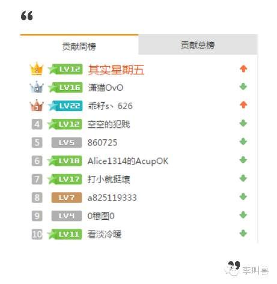
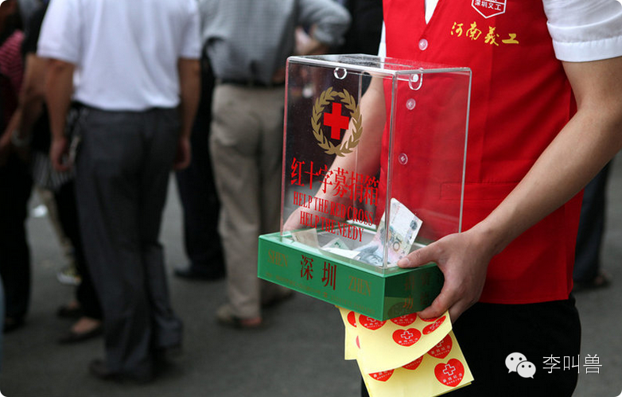

#【李叫兽】打赏最多的网红，必用这九种方法

游戏主播，明明可以被用户免费看，却经常能收获总额达几十万的打赏。反观大量分享纯干货的公众号，影响力巨大，却经常打赏者寥寥无几。
本期李叫兽方法，将告诉你：如何刺激用户主动打赏。

**如何刺激用户主动打赏？**

回答“如何刺激用户打赏”这个问题，实际上就是在回答：**如何让用户在明明可以不付费的时候，选择主动付费？**(即使这在经济学上是完全不理性的，因为没有让用户的利益最大化)

而如果观察我们的生活，就会发现这种现象早在网红经济出现之前就有了。

比如街边唱歌卖艺的，你明明可以免费听，可还是会经常走上前去给两块钱。

再比如流行于美国的小费文化——给出租车司机和餐厅服务员的服务主动打赏。

那么，问题来了：

- 为什么你会给街头卖艺的人打赏，但是不给公众号作者打赏？
- 为什么同样是打赏，美国人给餐厅服务员小费，但是不给空姐小费？
- 为什么在美国给餐厅服务员小费打赏，但是在中国不给？

**打赏心理如此复杂，懂得了用户的打赏心理，自然能更加了解消费者行为的本质。**

因此，李叫兽综合心理学家对小费现象数十年的研究，结合多次给网红提供咨询服务的经验，研发出这套最全工具**——****刺激打赏心理的9种方法。**

研究发现，打赏为用户提供了多种独特的心理效用，而**刺激打赏的关键，就是激活这些心理效用**。

###**1、激活隐形的社会契约**

为什么你在街头听到有人高歌一曲，不论唱得多么难听，通常上都会打赏。而你看到公众号文章、知乎回答，却经常没有打赏的习惯？（甚至有作者在知乎文章后面贴上支付宝二维码求打赏，结果招人骂：“老子看你的答案是给你面子，还好意思收钱？”）

难道是因为知识不如歌曲性感？当然不是。

**这是因为你觉得打赏是街边卖唱人的重要谋生方式，他们之所以唱歌，就是为了谋生赚钱，而这种行为就形成了一种隐形的社会契约：**

“我卖艺，你给钱，如果你停下脚步，相当于你遵守了这个隐形约定。”

所以，**刺激打赏重要的方法，就是激活这种隐形的社会契约**：让别人觉得你是以写作为生，或者以直播大胸为生的人。

美国人普遍有打赏服务员的习惯，是因为他们普遍有这样的共识：服务员固定收入非常少，单纯靠这点固定收入，是没有服务员乐意提供服务的。而之**所以还有这么多服务员，是因为小费本身就是他们重要的收入来源**（有大量的研究发现，那些觉得服务员固定收入很少的顾客，更加倾向于给小费）。

而之所以不打赏空姐，是因为他们知道，空姐提供服务，不是为了获取打赏，而是为了履行自己的职责。为了帮助她们履行职责，航空公司已经给她们提供了薪水，而这部分薪水已经包含在机票价格里了。

**所以，当别人感觉你是以此为生，以此为重要的收入来源，就会主动提供打赏。否则，这种心理就没有被激活。**

比如有朋友找李叫兽打电话问半小时问题，主动给几千块咨询费。是因为他们觉得这是李叫兽谋生的重要方式。

而同样的朋友，如果让李叫兽花费半小时时间去帮忙取个快递，就不会因为这个帮助而想到付费，因为他们知道李叫兽不是以取快递为生（虽然帮忙取快递更容易，但我个人宁愿做咨询）。

相反，你从专门取快递的朋友那咨询建议，不会想到付费，但找他帮忙取快递，一定会给钱。

**因此，为了刺激打赏，你可以让人觉得你以写公众号为生，这是你的职业。**

###**2、激活“帮助心理”**

**人打赏另一种重要的是心理是提供帮助和支持**——我们选择给街边卖艺的人打赏，另一个很重要的原因是我们觉得他们需要这个帮助。

而这种帮助别人的行为，本身就会让我们更加快乐，产生**积极的心理体验**——想想你帮助和支持了一个陌生人之后自己开心的感觉吧。

所以，如果能够激活用户帮助别人的心理，也能刺激他们主动打赏。

那么如何激活用户的帮助心理？

**用一句话概括，就是让对方觉得自己在屌丝改变世界的过程中，扮演了重要角色。**（PS. 这不就是天使投资人的心理嘛……）

这句话包含了3个因素：

**（1）低地位   **

> “别看我是个网红，但是没什么钱。”

**当别人感知你的社会地位、金钱显著低于他的时候，更容易激活他的帮助心理，从而主动提供打赏。**

所以很多美女主播即使很有钱，仍然在看起来廉价的房间里直播，并且喊月收入只有她十分之一的打赏粉丝为“土豪”。

所以papi酱即使将来上市了，也应该会保持现在视频中相对简陋的家庭装修。

**（2）为自己所寻求的帮助提供意义   **

**当别人感知你所寻求的帮助具有社会意义时，更容易激活帮助心理，主动打赏。**

典型的就是产品众筹网站上，各种产品的1元支持——付费1元，但是什么都得不到，相当于打赏了。

**（3）让别人看到帮助后的效果   **

**你需要让帮助者觉得自己的帮助扮演了重要角色，从而激活更多人的帮助心理。**

研究发现，我们更愿意捐款100元帮助一个儿童的买药品，而非捐同样的钱却只在某个大型慈善项目中占据万分之一 ——后者的帮助没有扮演重要角色。

比如维基百科在寻求别人捐款的时候，说：捐50元，相当于为我们努力工作的程序员买杯咖啡。

再比如咪蒙多次在文章中写到，多亏了粉丝的帮助，让自己的公众号做广告转化率特别高（很多人为了咪蒙而专门下载广告主的APP）。这让粉丝们感觉到自己的支持行为真正帮助到了咪蒙，从而不断增加对她的支持。

###**3、激活感知社会习俗**

为什么你在美国给餐厅服务员小费，但是在中国不给？

很简单，**因为在美国服务员小费是一种默认的社会习俗，而在中国并不是。**

我们见面选择握手，给女士让路，并且不在公共场合大小便，并不是因为我们真的有多么道德高尚，而是因为无意识地遵守社会习俗。

犯罪分子同伙见面也握手，并不是因为他们是讲礼貌素质高的好人，而是因为这是社会习俗，潜意识就去遵守了，没想那么多。

所以，**刺激打赏的一个重要方法，就是让人更多感觉这是一种应该遵守的社会习俗。**

但是当下很多领域的打赏（比如知识分享）并不是社会习俗，怎么办呢？

**一个很重要的方法就是利用群体的力量。**（李叫兽说过，如果本身动机不够，就用群体力量来凑。）群体力量要考虑“渴望群体”和“拒绝群体”。

**渴望群体是指：你现在不属于，但渴望属于的群体。**

比如李叫兽说过，为了普及土豆，德国先禁止平民吃土豆，只让贵族吃，贵族是渴望群体，从而刺激大众开始渴望土豆，后来再推广给大众就容易多了。

**拒绝群体是指：你现在属于，但实际上想要远离的群体。**

比如面对中国的各种落后现状，一些人把中国说成“你国”，这个时候中国人在他们心中就是“拒绝群体”。

好了，回到打赏问题。

如果高端、先进、被知识分子尊重的美国人是“渴望群体”，而普遍缺乏知识付费习惯的中国网民是“拒绝群体”，那你就可以让人感觉：

**“美国人都肯为知识主动付费，中国人你呢？”**

然后就会有一拨儿人为了证明自己不是“落后的中国网民”这个群体而主动付费。

（当然这里仅仅是举例，除了国家之外，还可以有很多群体划分，比如社会阶层、知识阶层等等）

所以，为了普及某种社会习俗，可以问自己：

**我想普及的社会习俗属于哪个群体？**（比如打赏习俗哪个群体有？）

**如何让这个群体变成渴望群体，把用户本来的群体变成拒绝群体？**

###**4、激活内在一致性**

**人都喜欢在不同的场景下维持一致性的自我感觉，所以可以让人感觉“不打赏”的行为同其他的某个行为不一致，从而刺激打赏。**

比如，很多在秀场露胸露大腿的美女，被打赏成百上千，但公众号、知乎辛苦写干货的大V们，被打赏几块钱而且没多少人打赏。

这是一种“行为的不一致”，所以可以让人感觉到：

“你给卖胸的美女打赏100元，但只给李叫兽打赏2元。”

（不过这里提醒，行为的不一致是一种负面情绪刺激。短期有效果，但不能长期用来刺激粉丝，否则会因为这种负面情感刺激而导致粉丝远离）

###**5、激活外在自我形象**

一项关于美国小费文化的研究发现：当跟朋友，特别是异性朋友一起吃饭的时候，给小费的比例显著上升。这是因为，除了上面提过的“帮助心理”、“社会习俗”等，**获得的“自我形象”也是用户打赏获取的关键心理效用**。

如果给小费的行为可以给用户带来自我形象的提升，自然就会有更多的人给小费。

所以，刺激打赏的另一个方法是：**让用户的打赏行为可以给其带来形象的提升和展示。**

比如斗鱼等平台公开展示打赏贡献值最高的用户，让打赏行为能够互相排名和比较。

直播播主公开感谢这些打赏的用户并且称呼其为“土豪”（虽然这些播主经常比打赏的粉丝有钱多了）。

**而对知识性产品来说，打赏行为可能会让人产生“这个人是尊重知识的人”这种形象，从而刺激更多人打赏。**

但很多公众号、微博途径的打赏经常不像直播主播那样能够被其他人看到，也就缺乏形象上的身份标识，怎么办呢？

一种经常的做法是**组建收费的社群或者提供会员**，作为变相的打赏途径，让会员身份来提高粉丝的个人形象——“看，我是XX人的会员！”

这就是为什么有些网红，即使不提供任何额外服务，也往往有人愿意付费成为其会员。

###**6、激活互惠心理**

**人在接受别人给予的恩惠后，往往会有“负债感”，从而会选择投桃报李进行回报，这就是“互惠”心理。**

比如在大街上直接让行人为某个公益项目捐款，可能选择捐款的人很少。但是如果先送别人一包纸巾，然后让人捐款10元，大部分就会直接捐款——一包5毛钱的纸巾激活了人的互惠心理，从而让人自然想要捐款。

网红如果能够激活人的互惠心理，同样能够获取更多的打赏。**记住，打赏的本质是主动付费，而互惠是一种非常重要的主动付费动机。**

那么如何激活人的互惠心理呢？一般有这几个方法：

**（1）让人直接产生较大的收获感**

比如李叫兽文章提供科学的营销方法，帮助读者发现过去营销活动不科学的地方，从而产生收获感，会刺激人的互惠心理进行打赏。

这就是为什么李叫兽文章阅读量不高，但是打赏经常超过很多百万阅读的文章的原因。

（当然这个方法说了等于没说，毕竟谁都想提高文章给读者的收获感，所以你着重看下面两个刺激互惠的方法）

**（2）收获的实体化**

**人们会天然地高估实体化的价值，而低估虚拟商品的价值。**

比如很多战略咨询公司提供真正有价值的解决方案，经常不被客户感知，为此他们把方案制作成数百页精美的报告或PPT并且打印出来，提高了感知价值，客户被精美报告背后的用心打动，即使里面绝大部分都是废话，核心思想一条微信就能说完（李叫兽记得当年修“服务营销”这门课的时候，这招叫做“无形服务的有形化”）。

**同样的服务，如果能够实体化方式呈现，就能获得更多的感知价值**——比如研究发现，把游戏刻录成光盘寄给用户，远远比发下载链接得到的付费意愿强。即使用户的价值完全是一样的，甚至下载链接还省事点、发货快点。

**所以，作为网红，如果能在虚拟服务之外（比如单纯写文章或者卖胸露大腿），附加一定的实体服务，就能激活互惠心理，从而提高打赏。**

比如小马宋公众号平时发很多非常有价值的文章内容，打赏不多，但是有一次在文章后附送一本电子书的下载链接，并且让大家自愿给钱，结果打赏就特别多——电子书更加实体化。

再比如很多网红做电商，也是通过实体化来激活互惠心理——你内容是好，但让我单纯给你打赏2元我觉得亏了。不过，在你的公众号上买一罐100元的茶叶，就不感觉亏了（即使这个茶叶京东上只卖50元）。

**（3）提高感知成本**

**如果让用户感觉你是花费了巨大成本，那么他们就更加会有“获得收益后产生的负债感”——也就是互惠心理。**

某干货作者：“为了写这篇文章，我周末都没有去陪家人。” 某美女主播：“因为整天在网上陪你们，男朋友都离我而去。”

###**7、创造未来预期**

有研究发现，在打赏餐厅服务员的时候，如果是你预期将来还会来的餐厅，你会很主动给小费；如果你预期将来不会再来这家餐厅（比如旅行的时候偶尔路过的），你就会减少主动给小费。

这是因为，如果你觉得会经常来这个餐厅，你会在潜意识担心：**如果这次不给小费，下次服务员可能就不会这么积极主动给你服务了。**

正是这种“预期服务质量”，让很多熟客付出了更多的小费。

**所以，如果让人觉得他们的打赏会在长期不断提升网红的内容质量，或者没有打赏的话长期内容质量会降低，人们也会增加打赏。**

“既然这么多人支持我，我一定会坚持下去，不断贡献更好的优质内容。”

###**8、改变默认选项**

人在决定是否要打赏时，往往是一刹那的决定，这个时候大部分会根据默认选项来选择自己的行为——“除非有必要的理由让我打赏，否则我默认不会打赏”。

**而在这种决策环境下，改变用户的默认选项，即使其他不经过任何改变，都能取得显著效果。**

在一项关于慈善捐款的调查中，有学者发现，欧洲有个区比其他区的民众，捐款多了70%，

这是因为这个区的民众更加热心慈善吗？当然不是。

（PS. 这里要插一句，把某个现象简单归因到某种人格特质，是绝大部分研究者常犯的懒病，比如有人分析小米成功就简单说雷军有商业直觉。而实际上的原因并不是这些）

那是因为什么呢？**最终学者发现，这个区域让用户捐款的调查表上的选项和别人不同：**

大部分区域是让用户在“我决定捐款”这个选项上画勾；而这个区域则是先帮用户印上了“我决定捐款”，然后让不想捐款的人画叉。

这样，就把用户的默认选项变成了“**我决定捐款**”，而不是“**不捐款**”，从而改变了很多人的行为。

同样，在打赏问题上，也可以使用这个技巧——**改变用户的默认选项**。

比如，如果跟用户说“给我打赏吧”，用户默认的选择题是：到底打赏还是不打赏？

但是如果跟用户说“你想打赏多少”，用户默认的选择题就变成了：我是打赏2元还是打赏10元？

**后者的表达，把“打赏”变成了一种默认的行为，剩下的就是让用户选到底打赏多少了。**

（默认选项的改变有很多灵活应用的方式，读者可以自己摸索，在这里不赘述了）

###**9、打赏行为的去货币化**

**任何用户，对金钱的成本感知是非常高的，如果能够想办法让用户感觉直接付出的不是钱，那就能降低用户的感知打赏成本，从而提高打赏。**

比如斗鱼直播平台设置了鱼丸这个虚拟货币来打赏主播，用户可以通过每日登陆等领取一定的限额，也可以直接充值。

这就让降低了用户打赏对金钱的感知：

一方面用鱼丸替代了货币，让人感觉成本低了（这就跟用信用卡，用户消费会更多一个道理，因为没有直接看到钱，感觉钱花得没有那么多了）。

另一方面，让用户可以通过努力来赚取一部分鱼丸，进一步降低了鱼丸和金钱在心理上的关联性（虽然很多用户的鱼丸还是主要靠充值）。

**很多游戏也利用了这个原理来刺激付费**，比如我前段时间玩的一款手游“星球大战”，用户可以通过每日任务来换取水晶，从而买更好的角色等，也可以通过直接充值来买水晶。

于是，我就经常消费水晶，因为反而觉得系统每天会送一些给我。这样我反而经常性充值水晶，因为已经形成了使用水晶的习惯，每次等不及慢慢靠系统积累，就会产生冲动直接买。

（PS：这个游戏让我耗费近千元，后来果断卸载了）

所以，如果想要提高打赏，可以想办法降低用户直接对货币的感觉，让打赏行为更多地去货币化。

**结 语**

“打赏”是一种非常复杂的行现象，用户之所以打赏（而不是选择免费），是因为能够得到多种不同的心理效用。

上面总结了9种科学的刺激打赏方法，灵活运用，你的打赏率一定提升。

部分引用来源·《社会心理学》戴维迈尔斯 

·《Who Do We Tip and Why\_ An Empirical Investigation》

·《Tipping Motivations and Behavior in the U.S. and Israel》

·《Incentives and service quality in the restaurant industry\_ the tipping service puzzle》

·《让顾客自己来定价》