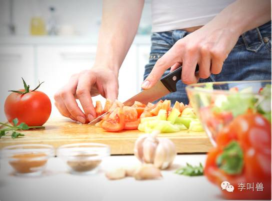

#【李叫兽】网红自媒体，最大的价值不是流量，而是……
原创 *2016-04-12* *李靖* [李叫兽](https://mp.weixin.qq.com/s?__biz=MzA5NTMxOTczOA==&mid=2650440976&idx=1&sn=828c09def6bae6f4a0376d22ad087f6e&scene=21&key=a269c8ed3afb88d88c08c5218d87d9ab0f20ca08b8c42e93185467a53a76c0889930fdde6fd40ce8fb0bf7881a8e3fc3b05626a87e7bd3d50527309c84ab807df536842174cc23bd6619cd3017d70df2&ascene=7&uin=MTc4OTM3ODkzOA%3D%3D&devicetype=Windows+7&version=6203005d&pass_ticket=V5w3mkkLQcmNI8VtqJK0C1erJipHSMkFDXxkSrQt9dQbXsQ8haTP3Q1NJmbFLNhV&winzoom=1##)

> 原文链接：http://mp.weixin.qq.com/s/sM54jfrmxilt7pqVMXI-JQ

如果你要投放广告，那么**「流量」**一定是一个很重要的词汇。

 

所以我们习惯了**拿流量来计算投放渠道的价值**——“Papi酱天价广告拍卖值不值？”，很多人发文章将其和优酷、电商的千次曝光成本做对比。

 

但是我今天要说的是：**不论是Papi酱这样的网红，还是其他的自媒体营销渠道，最大的价值并不是流量。**

- - - - - - - - - - -

 

此话怎讲？先举个例子。

 

既然都在说流量，那么假设有个价格1500元的砧板（远超普通砧板的价格），目标销量是1万，你觉得需要多大的流量或曝光量才能卖出去1万个？

按照普遍的转化率计算，有的人会猜500W流量，有的人会猜1000W流量，那么实际上需要多少呢？

 

实际上，整个亚洲所有商场的流量都不够——这个品牌的砧板在很多商场都有专柜（包括电商），而**去年整个亚洲所有渠道的销售量加起来都不到1W**。

 

想想也非常合理，毕竟大部分砧板是几十上百块，正常人是不会突然改变认知习惯（砧板就是几十块的东西）来买一个这么贵的砧板的。

 

但是李叫兽前几天见的一个网红朋友“文怡”就打破了这个惯例，**她在自己的公众号发文章推荐这个砧板，结果10分钟就销售了1.5万个，超过这类砧板在全亚洲一年的销量。**

 

为什么会这样呢？

 

因为正常人在正常的心理状态下，是不会买这个砧板的——你走过商场看到一堆砧板，只可能按照过去的习惯买一个100元的；或者想买砧板的时候在京东淘宝上一搜，看得差不多了在中间价位上选一个。

 

**而要让人改变过去的习惯，去买一个这种不常见的砧板，就必须唤起这个人的某种心理，让这个人短暂地变成“非正常状态”，变得对“极致的做菜体验”产生渴望。**

文怡的公众号就扮演了这个角色，它让打开这个公众号和这篇文章的人，短暂地变成了另外一个人——不论你平时是一个严谨的会计师还是一个自由的艺术家，当你阅读文怡这篇文章的时候，你就短暂地变成了“追求极致做菜体验的美食家”，而只有当你的这种心理被唤起的时候，你才能打破过去的习惯，去买一个1500元的砧板。

 

所以，这就解释了前面的观点：**网红最大的价值并不是流量，而是心理唤起**——**唤起你的不同自我，让你短暂地变成另外一个人，从而表现出完全不同的行为。**

- - - - - - - - - - -

举个例子：如果你在卖一个让用户感觉很未知、有风险的产品（比如一个高收益率但品牌未知的P2P理财产品），你应该怎么做？

 

一般情况下这种产品非常难销售，因为正常人大多是风险厌恶者，对未知的产品非常谨慎，所以很少有人会放手一搏去尝试这种产品。

 

但其实这里有个非常简单的技巧：**在用户旁边站个美女（假设用户是男性）。**

 

为什么呢？**因为当人的求偶自我被唤起的时候，人会短暂地变成“风险偏好者”（不管他平时是什么人），变得更愿意追求冒险。**

 

有个心理学家做过这样的实验：

 

让一群男性玩滑板，并且可以自由选择动作难度，发现绝大部分都选择中等难度的挑战。

 

然后心理学家让一群美女故意从旁边走过，结果发现几乎所有的滑板玩家，都选择了挑战更高难度，结果自然是有些人摔得很惨——**美女的出现唤起了玩家的求偶自我，让他们变得更愿意追求风险。**

 

这在进化心理学上非常容易解释：

 

在远古时代，正常状态下，行事谨慎的人更容易存活，所以猎人们在躲避狮子的威胁和到手的猎物之间，一般会选择躲避狮子的威胁。

 

但是当求偶机会出现时，雌性的卵子有限，如果不放手一搏去跟其他雄性竞争，就永久丧失了遗传基因的机会，所以猎人们会变得追求风险，把安全置之脑后。

 

所以，如果想让人短时间内变成一个勇于追求风险的人，记得唤起他们的求偶自我。

而这就是我要讲的——**网红最大的价值，并不是众多专家所说的带流量（否则和淘宝直通车有什么区别），而是“心理唤起”。**

###**一、 流量价值VS心理唤起价值** 

 

一直以来，我们总是喜欢拿流量来衡量一个广告渠道的价值，所以都在讲什么CPC（单位点击成本）之类的指标。但是实际上，**流量并不是一个广告渠道的唯一价值。**

 

比如在上面卖砧板的案例中，如果**仅仅看流量价值**，1000W的电商流量和10W的文怡公众号流量，你会选择哪个？

当然是选择1000W的电商流量啊。

**可是为什么从最终销售效果来看，流量价值更低的10W点击流量的投放，效果更好呢？**

这是因为这个网红公众号提供了另外一种价值——**心理唤起价值**，让这些粉丝看完文章的那一秒，产生了对“极致做菜体验”的追求。而这个价值，远远超过单纯吸引流量的价值。 

 

**之所以会这样，是因为人本质上都是有“多重自我”的，在不同情景之下表现的行为完全不同。而营销的重要手段，就是创造这样的情景来改变用户的心理。**

比如路人遇险没有人施救的时候，网上骂声一片，说现在风气怎么这么坏。

这并不是因为路人不上网，网民不走路，**实际上，网上义愤填膺的人和路上见死不救的人都是同一群人。只是因为他们在不同的场景下表现出了不同的自我。**

 

当你在上网浏览信息的时候，是根据周围的信息（比如现场无人施救的场景）来做判断行为并发表意见。

而你在着急走路回家的时候，心里想着自己的事情，往往是根据其他人的行为来判断自己的行为（也就是从众），所以你看到前面的路人没有行动，自然也就跟着不行动，最终导致无人施救。

 

**而如果你是一个遇到危险的人（比如前几天798和颐酒店的女子），如何说服路人施救呢？**

 

其实大喊大叫根本没有用，因为大家的心理进入了**“路人模式”**，根本不会根据信息来判断，只会根据习惯和他人的行为来判断。

 

这时你要做的其实就是“心理唤起”，想办法唤起他们的另一个自我，让他们短暂地进入**“网民模式”**。

 

所以你要喊的并不是：“好疼！好疼！救命！救命！啊啊啊啊啊！”

 

而是指着其中一个路人喊：“这位红衣服的小哥，你如何评价一个见死不救的人？” （模拟网上的提问，唤起他们的另一种心理自我）

 

而如果没有这样唤起另一个自我，再大的人流量也救不了你，因为所有人都是“路人”。

 

**对品牌营销来说也是一样，过去我们过分注重“流量价值”，好像只要有足够的人路过，就会有足够的人购买。**

**但是其实还应该重视的是“心理唤起价值”——在不同的情景之中，人的行为和心理完全不一样，需要根据唤起的情景和心理来销售产品。**

 

同一个人，刚看完李叫兽公众号想要买的东西，和刚看完咪蒙公众号想要买的东西，肯定是不一样的。

 

**那么在投放的时候，如何根据不同的情景来选择你要推广的产品呢？**

 

###**二、 心理唤起如何提高转化**

**每个网红自媒体的场景都不一样，不论是咪蒙、Papi酱唤起的宣泄感，还是李叫兽唤起的理智分析感。那么如何根据不同的网红唤起的不同的用户心理，恰当地选择投放呢？**

 

这个问题分类本身非常复杂，因为篇幅所限，我就简单说两个分类（之后会不断更新新的分类）。

**1.恐惧唤起VS浪漫唤起**

先考你一个问题：

 

现在你有两款凉茶产品需要推广，其中一个是主打**“中国每卖10罐凉茶，7罐加多宝”的加多宝凉茶**，另一个是**“独家限量老字号广东凉茶”**。

 

然后有两个投放渠道可以选择，一个是“《美人鱼》电影软文的植入”，另一个是“《午夜凶铃》电影软文的植入”。

 

你会怎么选择投放渠道呢？

  

实际上，**你应该在《午夜凶铃》电影软文中植入加多宝的广告，在《美人鱼》电影软文中植入“独家限量老字号广东凉茶”的广告。**

 

为什么呢？

 

因为《午夜凶铃》可以刺激人的恐惧感，而当人的恐惧心理被唤起的时候，会天然地提高对从众信息的接受程度——**当我们害怕担忧的时候，我们总是渴望自己是某个群体中的一员。**

 

所以应该在《午夜凶铃》电影软文中植入加多宝的广告。

 

而这个时候如果植入强调“独特性信息”的限量版广东凉茶，反而会进一步加剧恐惧感，人就会产生回避心理——**毕竟当我们害怕的时候，谁也不想自己是独自一人。**

 

有个研究曾经发现，在播放完恐怖分子袭击的新闻节目后，所有人都对“畅销”、“热销”这类词汇更加敏感，更加倾向于接受最畅销的产品。

（所以之前加多宝不是说，“怕上火，喝加多宝”嘛，当你“怕”，自然会容易接受从众信息）

 

同样，**应该在《美人鱼》电影软文中植入“独家限量版广东凉茶”。**

 

为什么呢？

 

因为《美人鱼》唤起的是人对浪漫、恋爱的感觉，而当人的浪漫心理被唤起的时候，会天然地提高对独特性信息的接受程度——**毕竟，当你在追求某个异性的时候，你希望自己是唯一的，而不是有很多人在跟你竞争某个异性。**

 

而这个时候，强调“20万人光顾”、“销量领先”这类信息，反而会让你恶心。

 

所以，如果网红自媒体唤起的用户心理是恐惧感（比如写恐怖小说的），那么最适合植入的产品是打“从众”诉求的产品——比如“销量领先，当然更多人喝”、“产品连起来绕地球一圈”等。

 

如果网红唤起的用户心理是浪漫感（比如写爱情故事的），那么最适合植入的产品是打“独特性”诉求的产品，比如“限量版”、“独家供应”、“唯一”、“个性化定制”等。

**恐惧心理被唤起时，更倾向于购买“从众型产品”；浪漫心理被唤起时，更倾向于购买“差异型产品”。**

所以，不要在《美人鱼》电影里植入加多宝。

**2.独立自我VS集体自我**

现在假设你要推广两种定位的麦片，一种是**“XX麦片，健康的选择”**；另一种是**“XX麦片，美味的选择”**，现在你分别要在罗辑思维公众号和咪蒙公众号推广，你会怎么投放？

实际上，**你应该在罗辑思维公众号上推广“XX麦片，健康的选择”，在咪蒙公众号上推广“XX麦片，美味的选择”。**

为什么呢？

 

因为人有两种不同的自我感觉，一种是“独立自我”——“我是独立的个体，我的想法完全由我自己决定，我就要做我自己想做的事情”；另一种是“集体自我”——“我是社会的一部分，我是某个圈子和集体的一部分”。

 

**而当人的“独立自我”被唤起的时候，人会变得更加感性和冲动，倾向于消费感性产品（比如美味可口的麦片），而当人的“集体自我”被唤起的时候，人会变得更加理智，倾向于消费理性产品（比如健康的麦片）。**

 

有个实验证明了这一点：

 

有两组被试者，一组被试者阅读主语都是**“我们”**的文章（激活集体自我），另一组阅读主语都是**“我”**的文章（激活独立自我），结果前者选择购买理智信息较多的产品，而后者购买了感性信息较多的产品。

 

而到了网红界，罗辑思维公众号强调“一起读书”、“社群连接”等，激活的是一个人的集体自我，这个时候销售理性诉求的产品效果会非常好。

比如书籍、健康食品、闹钟、培训课等。

 

而咪蒙的公众号不断说“致贱人，我为什么要帮你！”、“致low逼”等，满足人的宣泄心理，倡导人撕下面具追求自我释放，实际上激活了一个人的“独立自我”，这个时候销售感性产品的效果会非常好。

 

比如奢侈消费品、服装、旅游、美食等。

（图：咪蒙卖游轮旅行）

 

平时你可能是一个严谨自律的人，做一件事时总是考虑自己的责任（哎，为了帮老公攒钱，还是不买这个包包了）。但是你突然看到咪蒙写了一篇文章《我不讨好世界，我只讨好自己》，就短暂地变成一个追求释放的人，“独立自我”被激活。这个时候你会感觉对自己降低责任要求，买一个平时不舍得买的包包是理所应当的。

 

所以，**如果你唤起别人的集体自我，就多销售理智诉求的产品，即使是同样的麦片，也请说“为了健康”。**

**而如果你唤起别人的独立自我，就多销售感性诉求的产品，同样是麦片，也请说“别管那么多，好吃就行了”。**

所以，就像前面说的，**网红最大的价值并不是流量本身，而是唤起用户不同的心理。**而这样的价值几乎是京东电商、百度搜索等各种投放渠道都不具备的。

 

当你在逛京东淘宝不同页面的时候，你就抱着“随便逛逛，看看东西”的平常心，自然很多东西不会买，也自然只会买恰好想到要买的东西。

但是当你在网红场景下消费的时候就不一样了。

 

你在恐怖故事公众号中产生了恐惧感，这个时候公众号电商上的一列列“销量领先”诉求的产品就对你就形成了强大吸引。你在爱情小说公众号中被唤起了浪漫感，自然就会买一个平时根本没有想到去买的定制饰品。

 

当你每天早上点开罗胖的60秒语音，你被唤起了集体自我，那一瞬间就感觉所有的书籍和培训课对你充满了吸引力。而当你晚上打开咪蒙的文章，被唤起了独立自我，又觉得追求当下的美好多重要，相同的钱，还是去买包包吧！

 

**这就是众多网红最大的价值，唤起你的不同自我，即时性地匹配心理感受和交易行为。**

传统营销时代，你在电视上看了3分钟香奈儿广告，被唤起了追求浪漫的冲动，而当你真正跑到线下专柜的时候，却又发现当时被唤起的感觉早就消失，导致很多广告最终效果很差。

而在网红自媒体大行其道的时代，交易行为（用户购买）和心理唤起可以同时发生，**你的产品需要唤起用户的什么心理，就可以选择对应的自媒体渠道去唤起这样的心理。**

###**三、 心理唤起：未来的市场细分**

 

**心理唤起（人在不同情境下表现的不同自我），不光影响网红的变现价值，更影响着未来所有的市场细分。**

 

过去，我们经常按照人群来划分市场，所以我们不会给理智的金融分析师推销坚果手机，也不会给文艺女青年推销ThinkPad笔记本。

 

之所以这样，是因为我们直觉上认为人与人之间性格的差异非常大，有的人爱好社交，有的人爱好独立思考，所以我们按照性格、年龄、地域等把人进行分类。

 

**但实际上，同一个人在不同情境下的性格差异，经常远远超过不同人之间的性格差异**——假设我是一个悲观的人而你是一个乐观的人，那么我在看喜剧电影时，肯定比你这个乐观的人看悲剧时要快乐得多。

**所以，未来，市场不是按照人群进行细分，也不是按照行业和产品品类进行细分，而是按照被唤起的心理状态进行细分。**

 

**当我们在考虑消费者的时候，并不是看“他是谁”，而是看“他现在是谁”。**世界上不存在悲观的人和乐观的人，只存在正在悲伤的人和正在快乐的人。

- - - - - - - - - - -

**结语：**

当我们选择投放渠道的时候，**不应该只关注渠道的流量价值**——有多少曝光、哪些人会看等，**更要注重渠道的心理唤起价值**——在这个场景下，用户普遍被唤起了什么心理？

而“心理唤起价值”，才是网红自媒体与传统渠道相比最大的价值。

部分研究引用来源        

- JIEWEN HONG，HANNAH H. CHANG(2015), “I” Follow My Heart and “We” Rely on Reasons: The Impact of Self-Construal on Reliance on Feelings versus Reasons in Decision Making, Journal of Consumer Research (April) 1392-1411

- Chen, Cathy Yi (2009), “Who I Am and How I Think: The Impact of Self-Construal on the Roles of Internal and External Reference Prices in Price Evaluations,” Journal of Consumer Psychology, 19 (3), 416–26.

- Zhang, Yinlong, and L. J. Shrum (2009), “The Influence of Self-Construal on Impulsive Consumption,” Journal of Consumer Research, 35 (February), 838–50.

- Mandel, Naomi (2003), “Shifting Selves and Decision Making: The Effects of Self-Construal Priming on Consumer Risk Taking,” Journal of Consumer Research, 30 (1), 30–40.