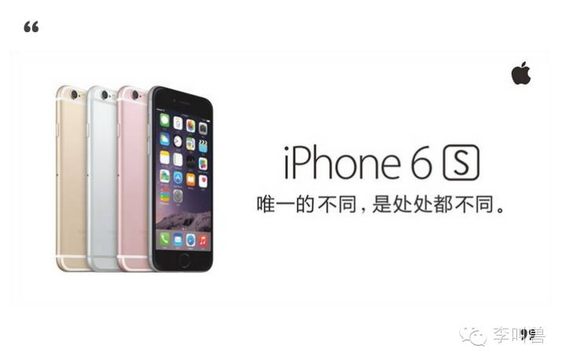
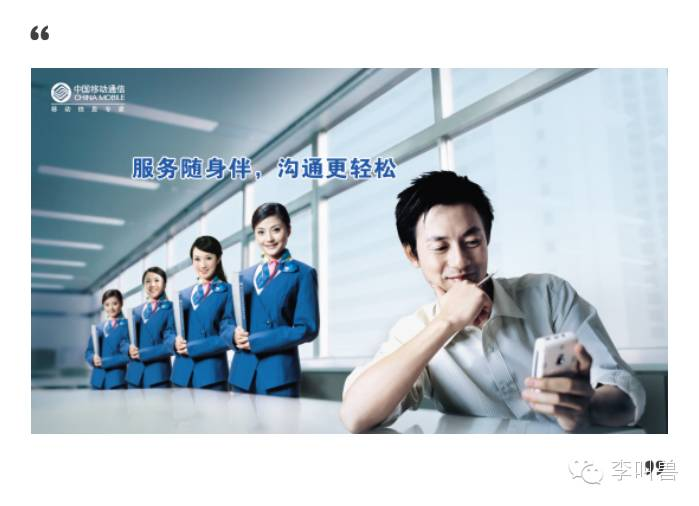
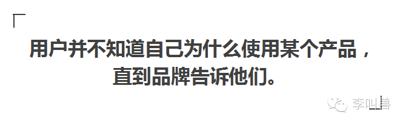
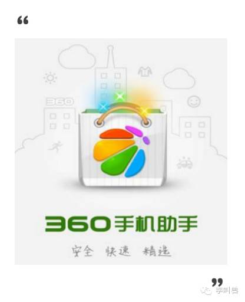
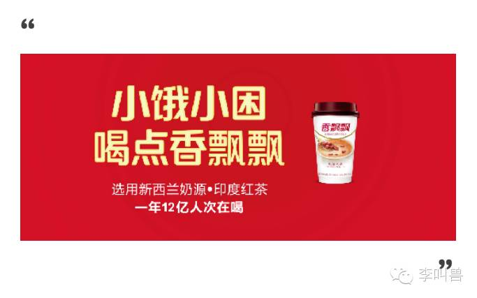
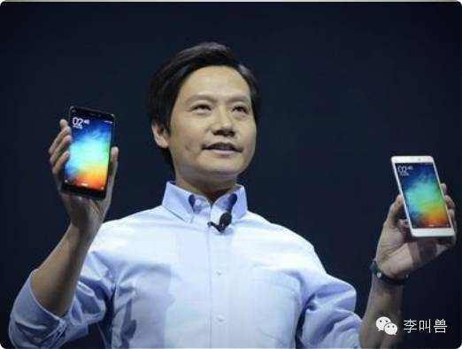
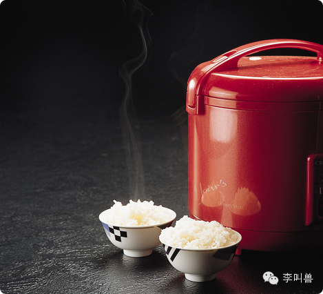
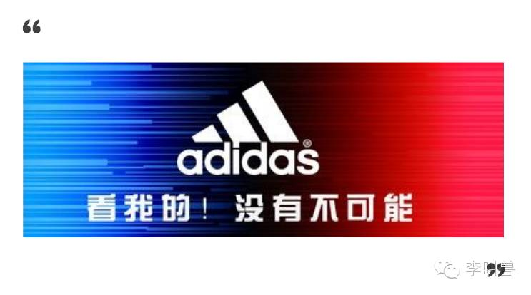
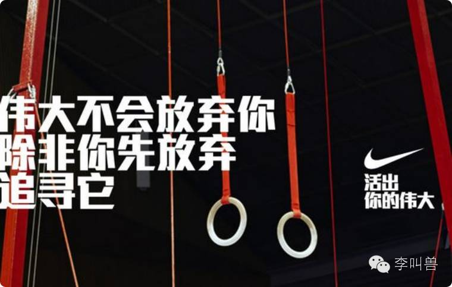

#【李叫兽】世界上最遥远的距离，是我天天用你的产品，却不曾在意你的品牌

下面这些问题，我想很多人已经开始意识到了：

 

**用户每天都在使用我的产品，粘性也很高，但似乎对我毫不关心。**

 

- 几亿人每天都在用中国移动的产品，但好像不论中国移动怎么包装，大家都不关心它；
- 月流水几千万的一家淘宝店，它的大部分用户也从来不关心店主是男是女，甚至都不记得这家店的名字；
- 绝大部分人每天都在用百度等搜索引擎，但好像也仅仅是“使用”而已，对它并没有什么“感觉”。
 

**这是因为在这些用户的眼里，你的产品仅仅是一个工具**——就像水、电和煤气一样，大家都在用，也确实离不开，但就是丝毫不关心。

 

这个时候，我们会说：**这个产品，仅仅有“产品忠诚”，而没有“品牌忠诚”。**

 

**用户的持续使用，仅仅是因为切换产品不习惯或替代选择少，而不是因为对你品牌的认同。**

 

然而，有的品牌却不是这样。比如即使从来不用苹果产品的一些人，也会经常关注苹果的新闻、发布会甚至它的广告。

那么怎么解决呢？**如何让你的产品在用户眼中不仅仅是个工具，而是拉近品牌心理距离，进而获得品牌忠诚？**

这方面众说纷纭，每个专家都有一套理论，但所有的理论都要回归一个基本的“做事”原则：**如果你想让别人做某件事，就必须先给他们提供价值。**

 

比如公众号作者想要用户转发自己的内容，首先就要提供有趣的文章作为价值。

 

同样的道理放在品牌建设方面，也是一样。

 

如果把产品和品牌分开，那么：**用户持续使用你的产品本身，是因为你的产品本身为他提供了价值**（比如百度提供了便利搜索的价值，所以即使品牌有问题，大家还是继续用）。

 

用户没有关心你的品牌，是因为你的品牌并没有给他们提供价值。

 

对于我这样一个中国移动的普通用户来说，它的产品本身的确给我提供了非常大的价值（比如让我随时随地可以上网），但是其品牌却没有给我提供价值（比如我并没有在看到中国移动几个字的时候产生自信的感觉）。**也就是说，中国移动给我提供的，仅仅是产品的有形价值，而不是品牌带来的无形价值。**

而如果没有提供更多的“无形价值”，打再多的广告、请再多的代言人，也往往无济于事。

 

所以，让用户不再单纯拿你的产品当工具，拉近品牌心理距离，做法非常简单：**让你的品牌本身和产品一样，能够给用户提供某种额外价值。**

 

那么“**额外价值**”有哪些呢？品牌可以通过帮消费者哪些忙，而让消费者关心品牌？

1. **提供购买动机**
2. **帮用户简化决策**
3. **帮用户塑造社会形象**
4. **帮用户强化自我认知**
5. **帮用户增加正面情感**
6. **帮用户减少负面情感**

###**1、提供购买动机**

**「 你的品牌是否为用户提供了合适的购买动机？」**

 

实际上，在戴比尔斯告诉我们“A diamond is forever”之前，没人会想到“结婚时需要一个信物”的需求，被一枚钻石来满足会合适。

 

所以，“提供购买动机”是品牌为用户提供的重要价值之一。

**而当品牌没有提供购买动机，或者提供的购买动机和用户使用产品的真实动机不一致的时候，用户就不再关心该品牌。**

 

比如，我使用“360手机助手”，是因为它可以很方便地帮我下载应用、管理手机，从而节约我的时间。而360品牌宣传的是“安全第一”，意味着用360手机助手是因为它能保护安全——**这跟我实际使用产品的动机根本不一致，就会导致我逐渐疏远这个品牌，逐渐不再关心这个品牌，即使我仍然在持续使用这个产品。 **

**所以，如果要拉近品牌与用户的距离，非常关键的一个做法就是：****让品牌为用户提供合适的购买动机。**

 

实际上，很多品牌随着时代的发展面临严重的品牌老化问题，并不是因为产品过时（可口可乐卖了100年都不过时），往往是因为品牌提供了过时的购买动机。

比如十几年前一些国产家电品牌主打“民族的骄傲”，提供的购买动机是“爱国”。而随着时代的发展，家电产品已经不再是民众表达爱国心的重要方式，整个中国的民族主义思想也不再火热，这就导致整个购买动机已经过时，从而让整个品牌在用户面前显得非常疏远。

 

**而优秀的品牌往往能够精准匹配用户的购买动机，帮助用户想起“我为什么要买这个产品”，从而拉近用户与品牌的心理距离。**

 

比如香飘飘奶茶以前暗含的动机是“冬季暖饮”，后来暖冬越来越多，冬天保暖也越来越好，这个购买动机有所下降。然后随着生活节奏加快，工作变忙，出现了另一个动机——“轻度劳累解乏”。

 

所以后来香飘飘主打“小困小饿，喝点香飘飘”，成功激活市场。

 

再比如美术刀本来是一个严重同质化的产品，也几乎难以引起消费者的关注，但是重新定位成“拆快递神器”（随着电商发展而出现的新动机），重新激活市场，获得“第二春”。

  

###**2、帮助用户简化决策**

**「你的品牌如何帮助用户简化决策？」**

 

前段时间，李叫兽遇到一个游戏制作公司，之前的做法是一直单独策划各种火爆的游戏，但后来越来越认识到应该打出自己公司的品牌，获得用户的认可，所以打算请代言人、增加品牌露出、规划视觉体系等。

 

然而单纯这样做几乎没什么效果，因为“增加露出”等实际上并没有增加一个品牌对用户的价值，所以我问：

 

> “这个品牌的建立对用户的价值是什么？是不是帮助他们简化了选择游戏的决策？
> 
> 比如我个人喜欢精细制作并且等级体系好的游戏，以往我需要下载下来慢慢判断一个游戏是否具有这个特点，但是现在我只要看这个游戏是EA制作的，就行了。**这相当于简化了我选择游戏的决策。**那我们的品牌代表了游戏有什么特性呢？如何帮用户简化决策？”
 

**而这就是品牌的另一个价值——帮助用户简化决策。**买电子产品，只要看到小米的品牌，就意味着一定是高性价比，就不用再仔细思考它到底是不是暴利商品了。

**如果品牌具备了帮助用户简化决策的作用，就相当于提供了“产品使用”以外的价值，用户就会在购买、使用产品以外，开始关心这个品牌。**

 

再比如李叫兽的文章，每篇文章都用类似的风格提供营销方法，并且形成相对稳定的质量，这样粉丝一看到“李叫兽”，即使还没有看文章，脑中就已经有了对文章风格和质量的大体判断。这个时候，“李叫兽”就帮助读者简化了决策。

 

**所以，如果想要让品牌提供产品以外的价值，从而引起用户对品牌本身的关注，一个很重要的方式就是：让品牌可以帮助用户简化决策。**

**所以，你需要不断问自己：**

> - 在用户的眼里，同样是做一款商品（比如设计手机），我的品牌代表着什么（比如XX手机代表拍照好）？
> - 我的品牌旗下所有的产品，是否都代表着这个特点，能够帮助用户简化决策？

###**3、帮助用户塑造社会形象**

** 「 我的品牌，如何帮助用户在别人面前展示自己的身份？」**

**产品品牌可以帮助用户进行“无声的自我介绍”，帮助他们向周围的人证明自己是谁。**

 

有国外的一个消费者研究发现，当让男性用户观看“**成功人士**”相关的视频后，他们更加倾向于购买**奔驰环保电动车**，因为突然产生了“向周围人证明自己是一个注重环保的成功人士”的需求。

 

而让男性用户观看**性感的美女**视频后，他们则更加倾向于购买**保时捷跑车**，因为他们突然产生了“向异性证明我有吸引异性的资产并且喜欢花费”的需求。

 

**每个人都有自己想维持的社会形象，如果你的品牌能够帮助用户完成这个任务，就相当于提供了产品使用以外的“品牌价值”，就会拉近品牌与用户的距离。**

一般来说，帮用户塑造社会形象有两种手段：“帮他们表达自我”和“帮他们隐藏自我”。

**（1）帮他们表达自我**

 

**用户想向社会和他人证明真实的自我，你的品牌要帮助他们表达这一点。**

 

比如我送孩子去本地最贵的幼儿园，证明我是一个爱孩子的妈妈。

**（2）帮助用户隐藏自我**

 

**品牌有时候可以帮助用户隐藏真实的自我，从而提高他们的形象。**

 

比如电饭煲刚进入日本的时候，主打便利，推广效果很不好。原来是家庭主妇认为，为了便利性而选择电饭煲，这是偷懒的表现，自己形象不好。
 
后来电饭煲改变了说服方向，主打“烹饪最好的米饭”，帮助用户隐藏了这个动机，结果大获成功（即使她们真实的动机是便利性）。

 

再比如奔驰宝马等高级轿车，经常主打性能（即使同等价位下的性能肯定低于丰田等），也是帮用户隐藏自我——即使人们为了彰显地位而购买BMW，但是也不想表现出这一点，他们更喜欢说“我买BMW不是为了彰显地位，而是因为它的最新自动驾驶技术很牛逼。”

**总之，如果你的品牌能够帮助用户表达自我或者隐藏自我，就相当于提供了产品使用价值以外的价值，就会拉近用户与品牌的心理距离。**

**所以，你需要不断地问自己：**

 

> - 用户在使用我的产品的时候，一般会想要塑造什么形象？
> - 我的品牌如何帮助他们这一点？
 

###**4、帮助用户强化自我认知**

**「 我的品牌，如何帮助用户在内心认识自己是谁？」**

 

**用户不仅仅是想向周围人证明自己是谁，同时也想向自己证明自己是谁。**

 

记得本科时候，有的同学明明一整天都在玩手机，却还要背着书包去图书馆。因为单纯的“去图书馆”这个行为，帮助他们安慰了自己内心——“这证明我今天是想学习的，而不是在寝室颓废。”

**之所以需要这样，是因为就像一个人无法直接知道别人的性格一样，我们同样无法直接知道自己的性格。**

 

所以，我们需要通过行为来判断别人的性格（比如看到某人去图书馆，我们会觉得他是用功的人），同样，我们也需要通过行为来判断自己的性格（比如看到我自己去图书馆，自己的潜意识也会觉得我原来是一个用功的人）。

**而如果品牌能够帮助用户“认识到自己是谁”，就会拉近用户和品牌的心理距离，而不仅仅是把产品当工具。**

比如李叫兽最近一直懒得去健身，但我的手机上一直装着一个叫做KEEP的健身APP，因为单纯装这个APP的行为，向我自己暗示“我是一个经常健身”的人。

 

而如果我直接卸载了这个APP，无疑是向自己宣告：我已经放弃健身了。

 

当然，我不会这么做。所以我一直保留着这个启动率几乎为0的APP。

**总之，人需要不断向自己确认自己到底是谁，而你的品牌恰好可以帮助这一点。**

**所以，你需要不断问自己：**

 

> - 用户在使用我的产品的时候，想象中的理想自我是什么？
> - 通过使用我的产品，用户如何向自己证明自己就是那个“理想自我”的形象？
 

###**5、帮助用户增加正面情感**

**「我的品牌，如何帮助用户增加正面的情感？」**

 

之前遇到一个品牌，希望拉近与用户的距离，而不仅仅是被用户当做工具，所以想主打“为爱而生”或者“温馨伴你同行”。

 

但是当我问：你的新情感战术，如何增加用户的正面情感？

 

接着就发现答不上来了——**大部分人所谓的“提高品牌情感”，只不过是在增加自己的情感，而不是帮助用户增加情感。**

 

**而成功的“品牌情感塑造”，应该是帮助用户增加情感。**

 

比如我记得高中的时候，一度面临各种艰难的挑战，当时Adidas不断宣称的“没有不可能”，曾经给我一些内心的力量，增加了正面情感。

 

也就是说：即使我没有消费这个品牌的产品，但是我通过观看它的广告，也相当于在消费这个品牌，获得了它带给我的价值（自我效能感），即使这是免费的。

 

**所以，品牌拉近与用户心理距离的一个重要方式是：在提供使用价值以外，为用户增加正面情感。**

 

常见的正面情感有：自我效能感（自信）、快乐感、崇拜感、控制感、怀旧感、共鸣感等。（以后李叫兽会针对每种具体情感，专门写文章说明刺激方法，这里仅进行简单举例）

 

**首先要提的一个正面情感是“自我效能感”**（self-efficiency，类似于通俗讲的自信）**，“自我效能”指的是：我在多大程度上，感觉到我能成功做到我想做的事。**

大量的研究发发现，如果用户在看到或听到品牌信息时提高了自我效能感，用户就会显著拉近与品牌的心理距离，而不仅仅是把产品当工具。

 

比如护舒宝卫生巾做的知名营销活动，让更多女性拒绝对自己的低估，相信自己的力量，相当于提高了这群人的“自我效能”。

比如NIKE做的“发现你的伟大”，讲了普通人也是一个伟大的运动员，提高了运动者继续坚持下去的自我效能。

 

**甚至很多人之所以能够获得民众支持，也是因为他给民众提供了“自我效能感”。**

比如前段时间的民科事件中，因为引力波而被热炒的民科郭英森，虽然很多人都分析证明，他不具备基本的科学素养，所有的发现也基本没有价值，而且对科学缺乏敬畏，但是他仍然得到了大量人的支持。

 

**这是因为他为缺乏高等教育的普通大众提供了“自我效能感”这种正面的情感价值，成为了很多人的心理寄托——“一个没有学历的人也可以研究科学”，从而忽略了他其他方面的不足之处，对他产生了支持感。**

 

对于这些品牌来说，除了基本的使用价值，给用户提供的“自我效能感”也是一个重要价值，而这个价值拉近了与用户的心理距离。

 

除此之外，众多品牌还提供了共鸣感、快乐感、怀旧感等正面情感，都在拉近距离。

 

**所以，你可以不断问自己：**

 

> - 我的主要用户缺乏什么正面情感？（比如如果你专门定位给肥胖女性穿的衣服，她们会缺乏自我效能感，对身材不自信。）
> 
>  
> 
> - 我如何提高他们的这种情感？（比如像这群用户证明，胖人也有美好人生，提高自信。）

###**6、帮助用户减少负面情感**

**「我的品牌，如何减少用户的负面情感？」**

 

**既然品牌可以帮助用户提高正面情感，自然也可以帮助他们减少负面情感。**

常见的负面情感有：恐惧、愤怒、厌恶、悲伤、失控、尴尬等。

 

比如咪蒙写过一个文章《我借钱给你，我特么有错吗？》，狠狠骂了那些借别人钱还矫情的人，实际上帮助用户减少、化解了一些愤怒、厌恶的情感。

 

你被借钱的朋友坑了很不爽，但迫于人际压力不能直说，而咪蒙帮你把内心的话都说出来，狠狠骂了他一顿，实际的体验和你亲自骂他一顿是差不多的。

**因为大量的研究证明：我们的大脑基本上无法区分是幻想而产生的愉悦感，还是实际的愉悦感（这就是为什么很多人自慰）。**

 

也就是说，你把自己假想成咪蒙然后看这篇文章，和你实际骂了朋友一顿，真实的宣泄感实际上差不多，还省去了得罪人的麻烦。

 

**所以，你可以寻找用户在使用你产品时的负面情感，然后想想你的品牌如何帮用户消除这种负面情感。**

 

比如“学钢琴的孩子不会太坏”，帮助很多父母减少了对孩子将来变坏的潜在恐惧感（虽然理智一想就知道，学钢琴对这个帮助可能并不大），从而拉近用户与品牌的心理距离——如果说他们的产品提供了“学钢琴”服务，那么他们的品牌实际上就提供了“减少对孩子变坏的恐惧感”服务。

 

**所以，你需要不断问自己：**

 

> - 我的用户可能会面临什么负面情感？
> 
>  
> 
> - 我如何帮助他们消除、减少这种负面情感？
> 
>  
> 
> （如果无助，我就支持；如果恐惧，我就保证；如果愤怒，我就帮助发泄；如果悲伤，我就安慰……）
 

**结 语 **

**“产品忠诚”和“品牌忠诚”是两回事，仅仅通过“重复购买率”，并不能测量品牌忠诚。**

 

产品忠诚，是指用户纯粹因为被动原因而持续使用你的产品（替代品太少、迁移成本太高、使用新品牌风险太大等原因），比如因为我的整个账号体系都在这个公司里，所以它的下一款产品我不得不买。

 

而品牌忠诚则，是指用户因为主动的心理原因而不断使用你的产品，比如我认可、相信这个品牌，它的下一款产品我一定优先购买。

 

如果说单纯产品忠诚像是通过“婚姻协议”来维持婚姻，那么“品牌忠诚”则像是通过“感情”来维持婚姻。

 

**而如果你想让产品不被用户当做持续使用的工具，并进一步拉近跟用户的心理距离，就必须要有“品牌忠诚”，而它的关键就是：让品牌本身也能像产品一样，给用户提供价值。**

 

我把上述方法总结在下图：

本文说明：

上周文章中提出过，品牌最重要的是针对竞争对手确定有利位置，而不是单纯的品牌包装。任何的品牌包装必须强化和符合战略定位。**这周文章讲品牌包装本身，实际应用时请符合具体的战略定位。因为品牌包装是战术行为，不是战略行为。**

部分引用来源
· Odin Y, Odin N, Valette-florence P. Conceptual and operational aspects of brand loyalty: an empirical investigation. Journal of Business Research, 2001, 53(2):75~84 
· Carroll B A, Ahuvia A C. Some antecedents and outcomes of brand love. Marketing Letters, 2006, 17(2): 79~89 
L Dunn，JA Hoegg,The impact of fear on emotional brand attachment,《Journal of Consumer Research》, 2014, 41(1):152-168
JN Sheth，BI Newman，BL Gross ， Why we buy what we buy: A theory of consumption values，《Journal of Business Research》, 1991, 22(2):159-170