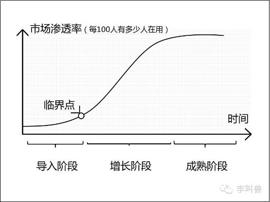

#【李叫兽】做市场的人，不一定知道什么才是“市场”
原创 *2016-02-24* *李靖* [李叫兽](https://mp.weixin.qq.com/s?__biz=MzA5NTMxOTczOA==&mid=402177985&idx=1&sn=77dbfc22fa8b1d04f3c0dc99513b06d2&scene=21&key=cf558d6bdcc9fe6c988f1041c96082aea124e013ae78ea2fd16adf8edea6ecf736d9d835c146a78ea2d8fbddf8dc3cc4d277b10cd3c1c1a300130de92ab6783af6dff4976aca04fabd441e33dea78d4a&ascene=7&uin=MTc4OTM3ODkzOA%3D%3D&devicetype=Windows+7&version=6203005d&pass_ticket=V5w3mkkLQcmNI8VtqJK0C1erJipHSMkFDXxkSrQt9dQbXsQ8haTP3Q1NJmbFLNhV&winzoom=1##)

> 原文链接：http://mp.weixin.qq.com/s/_OQ4WlhuhFBY9B-n6zg7dw

很多公司市场部的人，每天忙着推广各种活动，忙着抓热点，甚至忙着做挂历，却忘记去真正了解市场营销的最基础定义：**什么才叫一个市场**。有时候，重大的疏忽，是源于对基础原则的理解仍然不够。
 

###**一** 

首先，这是一个所有人都知道的原则：

 

任何一种新产品，要想成功推向市场，必要的条件是：**至少先在一个市场进行有效渗透。**

 

比如某个市场有100人，一旦该市场有10-20个人开始用，就会形成引爆，其他人跟风开始用。而如果20个100人的市场，每个市场有1个人用，虽然仍有20人在用，但不会形成引爆。

（图：同一市场中，渗透率一旦超过某个临界点，就会得到爆发式增长。）

 

> “这不就是任何一本基础营销教材都有说的“市场聚焦”嘛，我当然知道！”

——**绝大多数市场人都以为自己在市场聚焦，但实际上可能并没有准确理解一个“市场”的真正含义。**

 

之前在做咨询的时候，李叫兽遇到这样一个情况：

 

某IT品牌旗下的O2O公司（主营上门修电脑修手机等），**在初期推广的时候，几乎具备了成功营销的全部条件**：整体服务满意度高，价格低廉（比如上门清灰只有49元），文案也OK，团队执行力强，甚至，也进行了市场聚焦——定点聚焦到几个高端小区进行推广，先把渗透率做起来。

**最终却收效甚微，哪里出了问题呢？**

 

###**二** 

**这个产品可能进入了几百个市场，但没有进入任何一个有效的市场。**

 

> “为什么这么说？不是'集中到几个高端小区进行推广的吗？' "
 

**一般来说，一个有效的市场（Market）至少要满足这4个条件：**

1.  拥有一群实际存在的顾客；
2. 这些顾客普遍都有某些需求；
3.  有一系列产品和服务来满足其需求；
4. 在决定购买时，市场中的消费者相互参考。

 

大多数人对前三条都有直观的理解。**但遗憾的是，最后一条才是大部分新产品企业成功推向市场的关键——市场中的消费者相互参考。**

 

比如你把同样的企业软件推销给同一地区的10个中小公司，表面上看是进入了“北京市创业公司办公软件”这个细分市场，但只要不同公司的人在使用办公软件时不相互参考意见，这就相当于10个市场。

 

同样，在上面的例子中，该O2O公司上门修电脑的服务看似聚焦在了几个北京市高端白领小区，但是我相信，几乎没有什么小区的白领，会在“怎么修电脑”的问题上，跟隔壁邻居交换意见。

**这就意味着，一个小区有2000个家庭，你可能进入了2000个市场，而不是1个市场。**

 

（而如果是对写字楼、公司进行推广，就算是市场聚焦——你电脑坏了不知道怎么办，可能会跟邻桌的人交换意见。）

 

###**三**

> “为什么这样不行呢？为什么我们要聚焦一个市场，而不能直接这么铺开面砸钱呢？”
 

**因为没有任何一家公司能够一次性支付所有营销活动的开支，任何的营销必定依赖一系列的连锁反应和杠杆力量。**也就是说，经过初始的营销刺激之后，消费者能够开始变得主动讨论、主动推荐。

 

我们一直以为，一个公司营销的主体是市场部、销售部人员，但其实不是。

 

**实际上，任何一个企业主要的营销活动永远是消费者完成的，而市场部只不过起到触发作用**——可以想象一下你消费的任何一种商品，不论是服装、饮料、APP还是李叫兽公众号，更多是因为看到了周围人使用、推荐、讨论、分享，而不是广告。

**想象一下，如果所有的营销都是靠市场部的预算来完成，会是什么样**：你买了一部华为手机，在整个决策过程中，有周围朋友使用而产生的展示效果，有饭桌上朋友对手机的讨论，有某朋友把新买的手机分享到朋友圈的照片，有某用户在论坛发的体验帖——**如果这一切对你决策起到最大影响的因素，都找华为市场部要钱，那不论有多少预算都是不够的。**

所以，市场部的作用更多是刺激市场内消费者、讨论者、意见领袖等人群的连锁反应，让他们帮你营销，而不是一手包揽全部营销活动。

 这就意味着，任何推广活动，必须在同一个市场内，刺激连锁反应，而这一切的关键就是——**你至少进入了一个消费者相互参考意见的市场。**

 

###**四** 

再回到开头提出的这张图：

在一个市场内，当消费者的密度增加到一定程度，当一个消费者看到周围越来越多的人开始关注一个事物、购买某种商品，就会迎来爆发式增长。

 

而当密度没有增加到一定程度，增长就会很缓慢。所以，所有的新产品在初期，几乎都是先集中资源进攻少数市场，以期待达到引爆市场的临界点，而不是分散到2000个市场，每个市场渗透率都是千分之一。

 

**既然要聚焦一个市场，以发挥市场内的杠杆力量，那么怎么定义一个市场呢？**

###**五** 

**“你应该用消费者如何满足需求来定义市场，而不是单纯用产品品类和人群来定义。”**

 

前面我们提到过，一个市场之所以被称为“一个市场”的4个必要基本组成原则：

1. 拥有一群实际存在的顾客；
2. 这些顾客普遍都有某些需求；
3. 有一系列产品和服务来满足其需求；
4. 在决定购买时，市场中的消费者相互参考。

 

**如果用一句话来概括就是：**

**“一个市场，就是一群消费者使用类似产品满足类似需求，并且相互讨论。”**

这样来看，绝大多数创业者、新产品营销人员，对自身市场的定义，都非常模糊和狭隘。

 

**有人，简单地用产品属性来定义市场：**

 

> “我们的定位是绿色健康沙拉。”
 

> “我们的定位是做精致高端首饰。”

**还有人，简单地用幻想中的群体来定义市场：**

 

> “我们的沙拉，定位的城市新中产消费者人群。”
 

> “我们的首饰，定位的是20-40岁爱美女性。”
 

这样的回答，**仅仅是简单描述了一个产品的类别，或是描述了脑海中的目标人群，但并没有准确描述和定位任何一个市场**——20-40岁的爱美女性至少有上亿人，每个人都可能有数千种不同需求，消费者偏好、购买原因、意见参考程度等都不一样，怎么能称之为一个市场？

这样的描述，如何能指导基层员工的具体工作？

 

###**六** 

正确的市场描述，应该清晰地说明你的产品如何在一个能够参考意见的群体里满足需求。**它能够指导一个员工的具体工作，而这是任何市场策略的基本要求**——毕竟，任何不能指导具体工作的方针，都是废话。

 

**它往往是以“产品如何满足目标用户的需求”为定义，而不是以产品品类和用户群进行定义。**

 

比如你是卖扫把的企业，定义的市场是：“**大学生为了迎接父母的突然造访，而临时打扫房间**”。简短一句话，但形成了对所有人工作的指引。

**产品部门的人知道了：**

> “既然是寝室大学生迎接突然造访，那么比起家庭用扫把，这个扫把对经久耐用、质量等要求不高（相比之下，家庭主妇对耐久性要求高），但是却要求价格低廉、体积小（好放在寝室不占地方）、简单易用（大学生可不太会复杂操作），那么搞个塑料的套装是最好的！”
 

**渠道部门的人知道了：**

> “既然是迎接突然造访，那么就要求购买便捷性强，所以大型商超、电商等渠道就不铺了，着重铺到校园小卖店。”
 

**文案部门的人知道了：**

> “这部分大学生可能平时没有打扫房间的习惯，嫌麻烦，所以着重诉求点应该是省力省事，所以应该突出‘一套就够了’的概念，告诉大学生，房间迅速整洁，不用到处采购，我们一个套装就够了。”
 

同样，公关部门、服务部门甚至人力部门，都有了工作的指导方针。

**所以，前面的沙拉、首饰的市场，可能需要这样定义：**

 

> “公司的白领，需要一款低热量绿色食品代替午餐，以减轻昨晚吃太多大餐的负罪感，同时在同事间展示自己健康生活态度的形象，为此，我们向他们提供一款新的代餐沙拉。”
 

> “有一些美女，有消费能力但不买大牌首饰，因为她们不想被认为是从众和喜欢炫耀的人，相反，她们想在闺蜜中体现自己独特的艺术追求。为此，我们提供设计独特、无品牌标志的高质量首饰。”
 

上面的这两个描述，更加清晰的说明了你进入的市场，也能够给下一步的市场营销计划带来指导方针，让每个人知道怎么工作。

 

###**七** 

> “为什么要用‘消费者用产品满足什么需求’来定义市场，而不是简单描述产品属性和目标人群？”
 

**不能只用产品来定义你的市场** 

即使完全相同的产品，可能满足完全不一样的需求，也就根本不是一个市场，不符合最初讲的“市场聚焦”这一基本原则。

戴比尔斯当年用一个口号： “A diamond is forever”，让钻石由一块石头，变成了结婚的象征，让无数男人拿出一年的收入，来买一个没有任何使用价值的产品，仅仅是为了证明“我爱你，所以我愿意为了你进行无意义的花费”。

这是一个“市场”，但后来戴比尔斯用完全一样的产品，仅仅换了一个口号，就不再是同一个市场了。

 

**后来的戴比尔斯，发现女性的左手已经市场饱和（所有人都买结婚钻戒），所以准备开发右手，打出了“左手代表我们，右手代表自己”这样的口号。**

如果说之前的钻戒满足的心理需求是“证明配偶很爱我”，那么现在的右手钻戒满足的需求就是“证明我是独立经济的女性，能给自己买钻戒”，**前者唤起了“求偶”动机，后者唤起了“社会地位”动机。**

而这，根本就不是同一个市场，相对应的所有渠道策略、市场策略、销售策略等都不一样。

 

**不能只用用户群来定义你的市场**

很简单，一样的用户，可能完全满足不一样的需求。

 

100多年前，平均一个美国人有2双鞋——一双平时穿，一双周末礼拜的时候穿。

现在，一个美国人平均拥有8双鞋，还有19%的女性拥有超过50双鞋。有的用来彰显地位（比如皮鞋），有的用来吸引异性（比如细高跟），有的用来舒适运动（比如慢跑鞋），还有的用来在彰显地位的同时保持舒适（比如带软垫的皮鞋）。

同样的人，在不同的场景，用同样的产品，完全在满足不一样的需求，也根本不是一个市场。

**不能只用“消费者如何满足需求”来定义市场**

 

之前美国有个奶昔企业（忘记叫什么名字了），刚进入市场的时候，发现所有的奶昔公司，都把自己定义成“奶昔公司”，从而细分出了各种竞争者：

“高档奶昔”、“中档奶昔”、“法国风味奶昔”、“水果奶昔”……

既然都是奶昔公司，所有的竞争者都有相同的努力方向：**让奶昔更好喝。**

 

而这家企业并没有急着把自己定义成奶昔公司，而是先问这样一个问题：“美国人为什么喝奶昔，他们想通过奶昔来完成什么任务？”

 

然后发现：美国人喝奶昔，是因为早上开车去公司路上，来不及解决早餐，想边开车边解决早餐，而奶昔可以单手拿而且容易饮用，又有能量值，所以被当做了第一选择。

 

最终，他们定义的市场是：“**帮助早晨开车上班的人，单手解决早餐**。”

 

而在这个任务中，其实“好喝”并不重要，所以在竞争对手都忙着提高好喝程度的时候，他们着重提高了杯子的握感、奶昔的粘稠度（防止倾洒）、多重营养成分（比如加入坚果补充其他早餐营养）等，帮助消费者更好完成任务。

所以，当你定义市场，一定记得完整分析：

**“哪些消费者，要用什么产品，来满足其什么需求或者任务？”**

### **八**

**寻找能提供参考意见的群体，利用杠杆力量。**

 

你现在知道有一群消费者，用你的产品，满足什么需求，也理解你即将进入并大举推广产品的市场。但如果忘记最后的关键一步，可能会前功尽废——寻找一个能密切提供参考意见的群体，当做第一个市场。

 

在前面O2O公司“上门修电脑”案例中，就是因为一线城市高端小区内用户从不互相沟通交流，导致你面对的是2000个个体，而不是一个群体，从而无法使用撬动群体的杠杆力量（让消费者帮你推广、讨论等），无法让一波营销行为带来持续的连锁反应。

这导致推广成本很高，但收效甚微。

 

那么，从哪个群体开始推广呢？

 

大部分人都提到过从“刚需人群”、“高频需求人群”等开始，但这里最经常被遗忘的就是：你第一波推广的对象，必须是相互之间能够影响、交流和交换意见的群体。这种意见交换越频繁（比如某个车友会、同一公司、一群闺蜜等），就越意味着你可以利用消费者之间的连锁反应，让他们帮助你承担90%的营销成本。

**结 语** 

**在很多时候，同一市场的消费者密度，是商业成功的关键因素。**

 

因为一旦一个市场内，用类似产品满足类似需求的消费者超过某个临界值（比如100个人中有15人使用），消费者相互的影响、意见参考就会形成连锁反应，整个市场就会迎来爆发增长。

 

当年的Zipcar租车服务，曾经以均匀的方式推向全美国市场，结果推广缓慢，无论如何降价、促销、做广告都没用。**后来先聚焦几个重点区域提高密度，结果迅速增长，并逐步占领了一个有一个市场。**

 

再比如朋友圈的分享的文章，你偶然看到1-2个朋友分享一个标题平淡无奇的文章，几乎不可能打开看。而如果一刷朋友圈，发现十几个好友都分享了此文，即使标题是无聊的“一二三四五”，你也会打开看，最终会导致刷屏。（传播的密度超过临界点）

 

**在这个临界点到来之前，用户主要受市场部工作的影响（比如标题起得好不好），而临界点到来后，用户则主要受其他用户的影响（比如很多人都疯转了），而这就是连锁反应。**

 

激活任何一个连锁反应的关键，在于你先至少先定义并进入一个市场。这个市场并不是简单按照地理位置、人群年龄、产品品类等定义的，**必须是“一群人使用类似产品满足类似需求，并且相互参考意见”。**

 

只有这样，你才算做到了开头提到的那个基本常识：**市场聚焦。**（毕竟，同时进入2000个市场可算不上聚焦）

 

此时，你才可以利用消费者的连锁反应，发挥营销的杠杆力量，而不是单纯依赖自身的营销预算。 