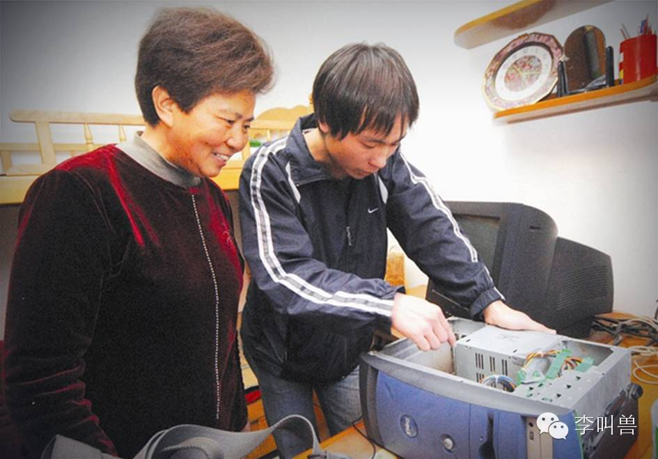
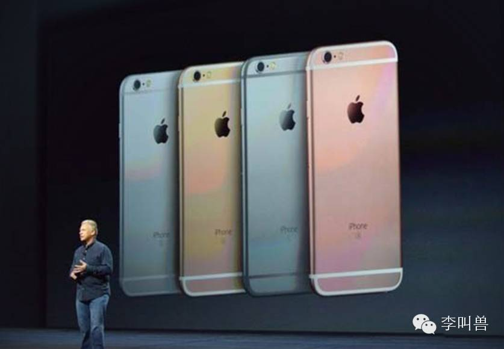
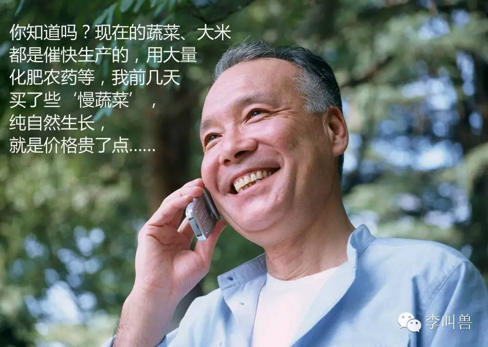
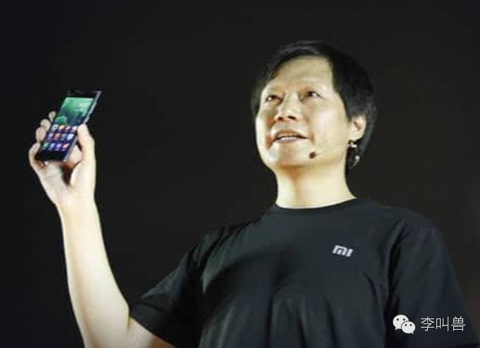
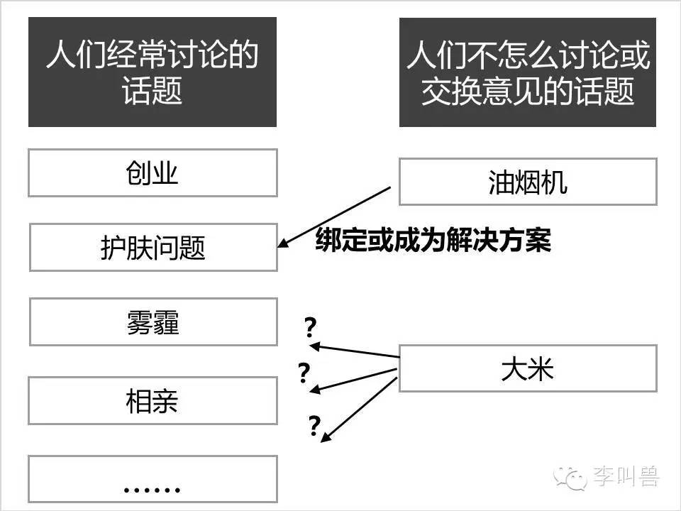
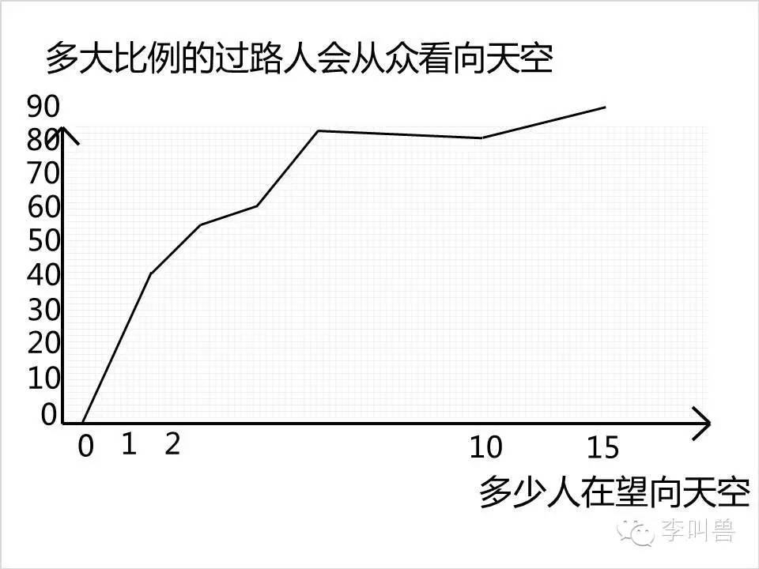
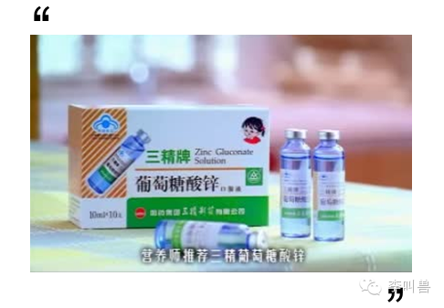
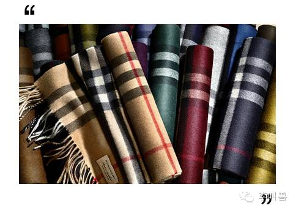

#【李叫兽】一个市场是如何被激活的？
原创 *2016-03-01* *李靖* [李叫兽](https://mp.weixin.qq.com/s?__biz=MzA5NTMxOTczOA==&mid=402268611&idx=1&sn=aac0e4d11c1471b9475936949b9d93d8&scene=21&key=ae0c59bce615bdd8257f55acfee7691b30d7329baba1556f0c0dea1daf9c2cf0b7a1325e994b56b534402f4a5f20fc07571f1d67ae4d73883d93384952332c5eb18be388fc6a04936f22f92c5d161b98&ascene=7&uin=MTc4OTM3ODkzOA%3D%3D&devicetype=Windows+7&version=6203005d&pass_ticket=V5w3mkkLQcmNI8VtqJK0C1erJipHSMkFDXxkSrQt9dQbXsQ8haTP3Q1NJmbFLNhV&winzoom=1##)

> 原文链接：http://mp.weixin.qq.com/s/dYF4RC5g4EHO-418iysSXg

【李叫兽】重新定义市场”系列 

第二篇

**如何利用市场上的杠杆力量，激活市场**

发新产品了，很多公司都在砸钱做营销做市场，忙着把广告贴在电梯，忙着在微博购买转发，忙着在电视大规模给用户洗脑，但是往往并不清楚：砸钱做市场，到底是在做什么？

 

**是的，我们到底为什么要砸钱？**

 

一种流行的观点认为：砸钱做营销做市场，是为了直接带来巨大的销量——人们看到广告后，会被广告中的美女、婴儿以及产品卖点所吸引，从而疯狂上街购买。

 

这种流行观点如此符合一个人的直觉，但又如此不切实际（只要你想想自己作为消费者有多少次这样做就知道了），给大量的企业带来误导。

 

再次举上一篇文章用的真实例子：

 

> 一个O2O上门修电脑的公司，服务体验好、价格低廉，也花钱聚焦目标用户进行地面推广——定点北京的几个高端小区，投电梯广告等，但收效甚微，区区几个下单的用户完全无法弥补高额的营销费用。
 

为什么呢？

**因为在这个营销计划中，全部的营销都是公司市场部做的。**

**而真正有效的营销，是消费者帮你做的，市场部只不过起到初始刺激的作用。**

 

设想一个正常的小区居民，接受营销唯一的渠道就是电梯上的广告（花的市场部预算），而其他多种免费的强力营销方式，他没有任何渠道接触——他不会在修电脑的时候跟邻居询问用哪家服务好，也不会因为看到邻居用了某个修电脑服务，进而因为从众而使用该服务（因为一线城市高端小区的居民几乎是没有什么相互沟通的）。

这就意味着：这家O2O公司所有的营销成本，都被自己的市场部承担了。

 

而真正的营销专家应该有这样一个基本常识：**没有一家公司能够一次性承担所有营销活动的成本。因为每一项营销活动的成功，都必须依赖后续的连锁反应：**

**看了广告而下单的人很少，甚至远远无法弥补广告投放的巨大成本，但广告投放之所以有效，是因为少数人看到、下单后，能够在一个群体内引发连锁反应**——比如推荐给周围的朋友，比如使用产品被周围的人看到后跟风购买等。

 而如果一项营销活动没有刺激这一系列连锁反应，也就相当于没有使用市场上巨大的杠杆力量，完全在凭借自身的力量来进攻市场——这当然是不行的，没有任何一家企业拥有如此强大的力量，可以直接改变成千上万人的行动。

 

**所以，你认为营销活动是由市场部做的，但其实不是，营销活动的主体是广大的消费者，而市场部的作用只不过是刺激他们帮你营销。**

 

想想你自己购买尝试新产品（比如某个新型化妆品）的经历就知道了，有多大比例是因为你看到周围朋友使用、被周围人推荐（杠杆力量），有多大比例是因为看了广告后觉得激动人心而购买（市场部本身力量）。

 正因为如此，**几乎没有营销人员，能够在相互无法交换意见的群体中，实行任何有意义的营销计划**（比如在北京某高端小区推广上门修电脑服务），这也是上面案例企业推广失败的重要原因。

你真正要做的，是进入一个相互参考意见的群体（上一篇文章的内容[《【李叫兽】做市场的人，不一定知道什么才是“市场”》](http://mp.weixin.qq.com/s?__biz=MzA5NTMxOTczOA==&mid=402177985&idx=1&sn=77dbfc22fa8b1d04f3c0dc99513b06d2&scene=21#wechat_redirect)），然后用有限的营销预算，为市场提供初始刺激，再利用其引发的连锁反应（比如消费者讨论、示范、推荐）来进攻市场。只有这样，才能利用杠杆力量，放大有限市场预算的效果。

 

那么，一个消费者群体里，到底有哪些可以利用的杠杆力量呢？

 

**实际上，市场上能够被有效利用的杠杆力量，主要有两种：**

1. **意见参考效应——我们被别人推荐、跟别人讨论等**
2. **展示效应——我们看到别人使用了产品**

##**第一种杠杆力量：意见参考效应**

关于意见参考效应，有个更通俗的说法，叫做“口碑”——**消费者在购买某种商品时，向其他人询问意见，或者你用了某种商品，主动推荐给其他朋友。**

 

大部分新产品，即使进入了正确的细分市场，仍然推广缓慢的原因，就是没有有效激活群体内的意见参考效应。

 

比如前段时间做咨询遇到这样一个客户：

 

一个做有机食品的企业（有机汇），生产高性价比的有机食品，在分众打广告讲自己的各种产品有机、健康等，结果推广转化率不高。

这样的推广信息，必然无法激起一个群体内的有效口碑效应。试想一下，假设你看到广告后真正购买了这种有机大米，吃完了之后，你有多大可能性分享给自己的朋友呢？

 

很少，因为这个产品推广：

1.  **缺乏新奇性**——即使最好吃的大米，带来的感官冲击并不大，至于健康，更是感知不到的了，所以用户几乎不会分享这种不奇特的信息。

 

  2.  **缺乏分享必要的知识**——即使用户想分享，那么分享什么呢？普通用户能知道有机大米和绿色大米、生态大米等一系列概念的区别吗？如果你自己就不懂，怎么会推荐给其他人？

 

 3. **缺乏分享的话题**——宣传中只讲了大米本身，那么只有当用户讨论到大米话题时，可能才会想起有机大米。可用户谈论大米话题的频次太少了，也就很难想起来。

 

总之，用户没有感觉到奇特，没有理解产品，更没有讨论相关话题的习惯，自然就不会经常推荐。

那怎么办呢？选定了一个市场后，如何激活口碑？

###1 提供有意义的新奇性

人是典型的群居动物，在进化之初，就拥有了“向所在群体分享新奇事物”的本能——**远古部落的猎人看到一个从没见过的野果，或者看到一个潜伏在附近老虎，**肯定会迅速把消息传遍整个部落，这种信息分享机制，保证了部落的延续。

现在也是一样，我们发现了超预期体验的餐厅，奇特的新闻，或者特别的口红，都会分享给自己的朋友，甚至适度夸张。

 

而如果你想激活这种分享推荐机制，一个很重要的原则就是：**提高信息的新奇性。**

 

反观上面有机食品的信息：关于最好吃的XX，有机的生态的XX，健康的XX这类广告，早就已经充斥满大街，几乎不具备任何分享价值，更何况用户根本不知道“有机”是什么意思，代表着什么。

 

所以首先要提高信息的新奇性：**这个产品的优势特点，与什么存在反差？为什么这种反差是有意义的？**

 

然后我们发现有机产品的几个特点：种植周期长（不能催熟）、土地每次用完要休耕3年、复杂的国家认证体系、耗费大量人工来除虫（而不是靠农药）等。

 

**这个与什么存在反差？**

当然是与当下流行的追求效率速度、工业化、低成本化有反差。（而不是与“无机”有反差）

**所以，其实可以包装“慢”的概念，而不是“有机”的概念，**因为前者既更加概括了这类产品的最大特点（生产慢、成本高），又与目标市场一线城市快节奏的生活方式产生反差，还以此暗示高成本以支撑高价格。

总之，要想引发群体内的讨论、推荐，必须提供可以被理解的新奇性信息（“有机”既不新奇也难以被理解），并且**想办法打破预期。**

 

什么叫做打破预期？

当我们听到办公室有人喊“蟑螂”的时候，第一秒就会让眼睛扫向桌子底下；当我们听到有人喊“蜘蛛”的时候，第一秒就会让眼睛扫向墙角——因为我们过去已经建立了“蟑螂”、“蜘蛛”一般在哪里的知识，**听到信息的那一秒，就会唤起过去的记忆（比如蟑螂在桌子下），瞬间建立预期。**

而这种预期一旦被打破，就会产生反差感。

 

比如你叫了一个师傅上门修电脑，这个时候对上门的师傅已经产生了预期（想想中可能是一个穿着蓝色工装的工人），**结果上门的是一个穿着钢铁侠衣服的人，就打破了预期，更容易主动与别人分享。**

 

如果你的产品、服务、营销等任何一个环节有打破预期的体验，用户自然就会提高分享率，主动跟朋友谈起这件事。（当然，如果你的产品让人大失所望，也算打破预期，这个时候人们也会主动分享，只不过这对你是不利的。）

 

###2  创造知识落差 

什么时候，人们会主动分享知识、信息和商品？

 

当人们发现就某个问题存在“知识落差”的时候——比如你朋友买了普通大米吃得很开心，而你知道这种大米不够健康，就会产生冲动告诉他可以买有机大米。

 

这个时候，你的知识（懂大米之间的区别）和朋友的知识（他不懂）就产生了落差，这种知识落差会刺激你主动分享信息给朋友，也会刺激你的朋友主动向你询问信息。

 

而**如果要刺激用户的分享，激发他们的连锁反应，就要想办法创造这种知识落差**——主动提供给用户必要的知识，让他们拥有超过别人知识的优越感。

 

比如小米手机在初期营销的时候，大力宣扬手机行业暴利，说明为什么小米高配低价，秒杀各种高档手机等。

这种宣传，**让第一波看到广告的人，产生了超过其他人的知识（比如更懂手机行业），他们会为了优越感等原因，逐步在各种场合宣扬这种知识**——“原来大家都用三星啊，你知道吗？三星4000多的手机，成本和1999的小米差不多！手机行业就是……”

 

而上面的有机食品广告，就没有创造这种“知识落差”，**消费者看完了所有海报广告，仍然不会比没看过广告的人更理解有机是什么、对生活有什么意义，自然也就不会分享，该企业也就无法利用市场上的杠杆力量。**

  

###3  绑定分享话题 

要充分利用市场上的杠杆力量，就要回答这样一个问题：**消费者什么时候能够讨论到你？**

 

在上面的有机大米的广告中，这个问题的答案很简单：只有当消费者讨论到“什么才是更好吃的大米”的时候，才能讨论到。

 

可是，你稍微回想一下就会发现：**“大米”是一个消费者热门讨论的话题吗？消费者经常讨论“什么才是最好吃的大米”吗？**

 

当然不是。实际上，大米是如此不起眼、所有人都习以为常的食物，消费者几乎很少讨论到这个话题。

那怎么办呢？**一般的做法是把产品同更加容易被讨论、参考的话题进行绑定。**

 

比如方太油烟机：

 

油烟机也是一个我们不经常讨论的话题，它在家里一直不起眼，而且属于耐用品，好几年才买一次，真正被讨论的频率，估计还不如矿泉水。

 所以方太去年新的广告，把油烟机这样一个难以被提起和讨论的产品，同护肤话题、母亲生病、眼睛健康等建立联系。

 

比如“买高端护肤品保养皮肤，但敌不过低质量油烟机的摧残”——油烟机是一个低频话题，但女性护肤是一个高频话题，几乎所有的年轻女性，都经常就护肤问题交换意见。

 

把油烟机绑定到护肤问题上，就容易引起讨论，毕竟，**只要人们没有就某个问题交换意见，就意味着你无法利用群体中的杠杆力量，无法通过一次性营销，刺激连锁反应。**

 

同样，上面的有机大米也可以采取这样的思路，跟某个大家经常讨论、想要解决的问题绑定。

 

再比如当年西少爷肉夹馍刚出来的时候，写了一篇创业文章，讲了五道口北漂的心路历程，还包括被女朋友甩了的经历。

 

然后发现：当人们就肉夹馍选购交换意见的时候，会提到西少爷。当人们就年轻人创业交换意见的时候，会提到西少爷。当人们就北漂的困苦交换意见的时候，也会提到西少爷——它跟很多人们喜欢交换意见的问题进行了绑定。

总之，**高效的营销者会通过初始刺激，激活目标群体消费者就某个问题的意见参考，**他们会主动提供有意义的新奇信息，创造知识落差，绑定热门问题等，以激活消费者的连锁反应，利用杠杆力量。

 

##**第二种杠杆：展示效应**

除了“意见参考”，另一种利用群体内杠杆力量的方法是展示效应，换个更通俗的词汇就是“从众”。

 

比如，当你看到周围的很多人使用罗技牌鼠标，也会从众买一个相同牌子的鼠标，这就是受到了展示效应的影响。

 

如果说罗技完全通过广告等市场部的营销手段，获取一个新用户（之前没听说过罗技）的成本是100元，**那么刚刚你受到“展示效应”的影响，买了罗技鼠标，就相当于帮罗技市场部省了100元**——这就是巨大的**杠杆力量**。

 

再比如你刷朋友圈，连续看到十几个朋友都在转一篇文章《将混沌序列变换成均匀伪随机序列的普适算法》，即使它的标题已经烂到了没有运用任何标题技巧的程度，看起来毫无趣味可言，你仍然很有可能点开看看。

 

**因为“跟从别人的行为”会对我们产生巨大的刺激力量，这种力量几乎超过一切Y型文案所能起到的最大效果。**

 

比如之前心理学家做实验，想看看多少人会因为看到街上有人抬头看天，也停下脚步抬头看天。

 

然后发现，当路上有一个人抬头看天的时候（即使这是一个毫无意义的举动），有20%的路人会跟着看天；**而一旦有5个人抬头看天，就会有超过80%的人也停下脚步，跟着看向天空**（即使天上啥也没有）。

 

> **“展示效应”如此巨大，竟然能让80%的人停下匆忙的脚步做无意义的事情，如果有哪个街边广告能达到这种转化率，绝对能让历史上所有知名广告黯然失色。**
 

那么，如何提高展示效应呢？

 

最简单的方法就是：提高形象的独特性、统一性和外显性，以让消费者能够一眼看到群体中其他人在用你的产品。

 

- **独特性**：让产品形象跟同类产品区隔

比如三精口服液是蓝瓶的，跟同类产品显著不同（三精在广告中也提示消费者“认准蓝瓶的”）；

 

比如之前所有耳机线是黑色的（便于遮盖），苹果率先使用白色耳机线，增强了独特性和辨识度——所以你不能一眼看出人群中谁在使用AKG耳塞（因为它是黑色的），但是能一眼看出人群中谁在用苹果耳机。（当然现在情况已经变了）

 

- **统一性**：所有的产品能够用统一形象元素。

比如巴宝莉的围巾全部都采取格子设计，有统一的形象识别，让人很容易看到周围某个人是不是戴了巴宝莉围巾。而如果采取10种设计风格，你就无法识别。

- **外显性**：产品的使用能够被群体内其他人看到。

比如上门修电脑如果不是在小区推广，而是在公司推广，就会提高修电脑服务的外显性，让周围的同事都能看到——在家里的话，就只有你一个人能看到。

 

这样，你的行为就相当于对群体起到了参考、展示的作用。下次别人修电脑时，就会来问："小王，你上次修电脑用的什么APP?"

 通过初始的刺激，让一部分人先用起来、展示起来，然后再利用群体的展示作用，就相当于有效利用了市场上的杠杆力量。

 

**结 语**

几乎任何人都无法单纯依赖自己的力量取得成功，市场部也是。

 

市场部的作用并不是做营销本身，而是利用有限的资金预算，通过给市场施加一些初始刺激，来激发一系列连锁反应，利用市场上的杠杆力量。

 

**最常用的杠杆力量有两种：**

1. **意见参考效应**
2. **展示效应**

 

毕竟，营销不是市场部做的，而是被市场部刺激后的消费者做的。市场部的最高目标，就是公司不再需要市场部。

 

所以成功营销的一个结果是：**当你停止任何的营销行为，公司仍然存在新订单。**（比如2013年的微信即使不打广告，也会自动增加用户，主要靠用户的相互推荐等连锁反应）

 

因为只有这样，才说明你真正高效利用了市场上的杠杆力量。 