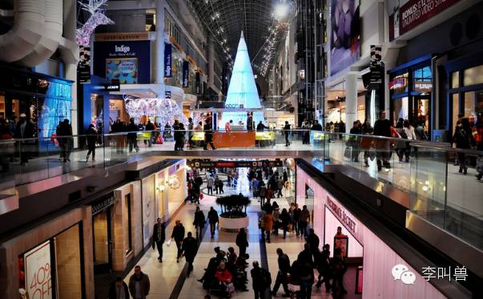
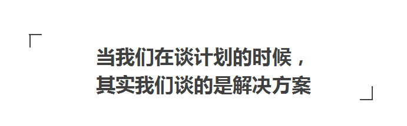
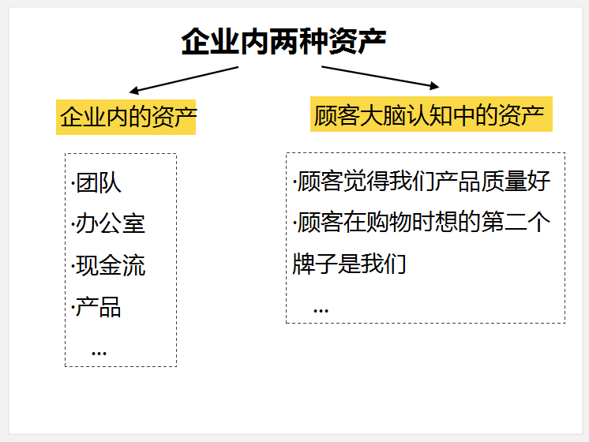

#【李叫兽】你可能只会列营销大纲，不会做营销计划

销计划有两种，一种是“大纲式计划”，另一种是“方案式计划”。

李叫兽见过的绝大部分市场计划是这样的“大纲式计划”。

 

比如北京某商场的周年庆营销计划：

> 1. 以“周年大促”为核心构思创意，吸引目标顾客到来；
> 2. 线下传播：地铁、公交、楼宇框架等，目标覆盖人群500W，吸引数万客流量；
> 3. 线上传播：制作病毒视频、H5互动页面、公众号文章等，通过微信、微博扩散，并且联系100个KOL（关键意见领袖），形成千万级传播；
> 4. 媒体公关：XXXX等多家媒体，全方位覆盖报道；
> 5. 微信粉丝提升5W以上。
 

这样的计划，乍看似乎很有想象空间（“数万客流量”、“千万级传播”），但转念一想，总感觉少了点什么。

 

到底哪里出了问题？

 

这种“大纲式计划”最大的问题就是：没有解决任何问题。

 

**这个计划，仅仅是把“市场计划一般都需要做哪些事”列了一遍，但丝毫不提及我们的关键问题是什么以及问题如何解决。**与其说这是一个“营销计划”，不如说是一篇“拘泥于目标细节和任务模板的轮廓大纲”，几乎无法有效指导任何一个人的具体工作。

比如，计划的重要部分有一个“病毒视频”，那么请问：所有的病毒视频都行吗？病毒视频在整个计划里扮演什么角色？要契合什么主题？为什么需要视频？

 

实际上，把整个计划修改一下日期和公司名，几乎可以完整地套用在任何一个产品的任何一次营销行为中。

 

**智能硬件上众筹计划、新手机发布计划、脑白金换包装计划、电影发行计划甚至炒作凤姐计划，都可以完整地套用这样的大纲模板：**吸引目标顾客、线上线下联动、公交地铁广告覆盖、H5+视频病毒传播、KOL转发、微博千万级讨论……

 

可是，这有什么用呢？当你把“千万级传播”加入PPT，就能帮助整个活动千万级传播了吗？

另一种计划是非常少见的“方案式计划”。

方案式计划是把制定计划，当做“为某个问题找解决方案”的过程，它的目标是通过一系列的营销行为来解决某个问题，而不是简单地列出“要做而未做”的任务清单。

 

**比如同样是前面的商场周年庆计划，有的会这样写：**

 

> 作为本地最有影响力且历史悠久的商城，我们承载了当地人很多关于过去逛街的记忆，但现在大家更多地关注电商促销信息，导致我们的促销活动一年不如一年。
> 
>  
> 
> 所以我认为，这次活动我们面临的关键挑战是：如何刺激消费者跑来关注我们的促销活动，而不是全被京东天猫的广告吸引走了。
> 
>  
> 
> 为了解决这个问题，我认为这次再只强调“XX大促”这样信息是没用的，因为同样是“大促销”，我们本身的促销额度和广告投放量不可能超过天猫，这就无法扭转我们的不利局势。
> 
>  
> 
> 而我们真正的优势其实是“逛街体验”，所以应该促使消费者更多关注逛街体验本身，以对抗狂轰滥炸的电商广告。

 

> 所以我建议，这次我们以“逛街就逛真正街”为主题，通过线上线下各种渠道的协同，号召消费者周末休息出来逛真正的街，以吸引他们来参加周年庆活动。
> 
>  
> 
> 为此，各部门需要紧密配合，目标是让本市更多消费者想要逛线下店，而不是网购：
 

> 1， 文案小张：继续优化“要逛就逛真正街”这个主题文案，并且寻找用户网购的痛点（比如无法试穿、比如不能出门过个好周末等），以制作主文案；
> 
> 
> 
> 
> 2， 视频创意小刘：根据文案部门提供的主文案和用户痛点，策划以传播性为优先目的的短视频；
> 
> 
> 
> 
> 3， 媒介部门老王：为了形成反差和撕逼效果，确保我们的广告跟电商广告在一起出现（比如公交站牌左边是“上天猫，逛街享巨惠”，我们在右边就是“要逛就逛真正街，同享巨惠”等）；
> 
> 
> 
> 
> 4， 新媒体部门小莉：联合其他线下品牌发起公关活动，跟电商撕逼。
> 
> 
> 
> 
> ……

实际上，我非常不喜欢“计划”这个词汇，单纯说“赶紧定一个计划”，听起来好像只是把待做事项清单、截止日期和任务目标列出来这么简单。

剩下的事情就容易了，随便去百度文库一搜，就能看到几种典型的营销计划模板，**然后再把一些时髦的营销词汇搭配上经典的管理学原理，很容易就凑出了一个几十页的PPT。**

比如这些时髦营销词汇：“整合营销传播”、“引爆全网”、“KOL转发”、“H5互动”……

 

套上这些经典管理学理论：甘特图、责任制、时间节点、考核标准……

 

但这并不是绝大部分企业真正需要的“计划”，只不过是一些美好愿望的罗列。**而计划其实应该是达成美好愿望的方式，而不是美好愿望本身。**

 

当一个人说“帮我制定一个计划”的时候，他真正想说的是：“我现在遇到一系列问题，能不能帮我想办法综合利用公司的资源，解决这些问题？”

 

而不是想说：“亲爱的，我不知道做营销的美好愿望（比如“引爆全网”）有哪些，能不能告诉我一些？”

所以，什么是“计划”？

 

**我认为“计划”就是“设计一连串关键行动，来解决某些问题。”**

 

与其说是“计划”，不如说是“解决方案”。（为什么大纲式计划不靠谱，因为他不是针对某些问题的解决方案，甚至，它连问题是什么都不知道。） 

既然“计划”的本质是“针对某些问题的解决方案”，那么“市场营销计划”是什么？

 

市场营销计划其实是“针对顾客认知问题的解决方案”。

 

说的有点绕，解释一下。

 

我们假设企业有两种资产，一种资产是企业内的资产，比如：团队、办公室、公司现金流、产品等。

 

另一种是看不见的，存在于众多顾客大脑认知中的资产，比如：“顾客觉得我们产品质量好”、“顾客在购物时想的第二个牌子是我们”等。

 

过去我们认为企业最重要的资产在企业内部，实际上，企业最重要的资产在企业外部，在大量顾客的认知中。

 

**如果说财务计划、运营管理计划是用来解决企业内部资产的问题，那么市场营销计划就是为了解决企业外部“顾客认知”这项资产的问题：**

- “本市消费者越来越倾向于去电商，我要扭转他们的态度。”
-  “消费者现在倾向于去实体店购买我们的化妆品，我要让他们习惯微信购买。”
-  “消费者并不认为自己需要一个智能水杯，我需要让他们意识到普通水杯不行，要换智能水杯。”

 

总之，你要“改变一些消费者的想法、态度和行为，从而让情况对你更加有力”，为了做到这一点，你需要制定一个营销计划。

既然“营销计划”就是“为了解决顾客认知问题而设计的一连串行动”，那么比起流行于市面的“大纲式计划”，一个“方案式计划”应该至少符合这些条件：

 

1.  明确你要解决的问题
2. 更加注重过程，而不是目标
3. 需要针对用户设计行动，而不是自己
4.  需要根据问题重新配置资源

 

###**1.明确你要解决的问题**

 

任何的计划，必须说明“到底要解决什么问题”以及“如何解决问题”，如果问题并不明确，那么任何的任务清单都毫无意义。

 

比如，之前我见过一个做装修的企业，看到大家都在运营微信社群，自己也要运营，但苦于不得其法。

“我的微信群，经常活跃了一段时间后就不再活跃了，怎么做可以延长生命周期？”

 

既然需要一个“社群运营”的计划，我们要先看看“为什么你需要运营社群”。 

 

“当然想让更多人买我的装修服务。”

 

既然“我们想获取更多顾客”，那么存在的关键问题是什么？为什么很多顾客没有买你的服务？是因为他们缺一个有持续生命力的社群吗？

 

当然不是。装修本身是十几年才遇到一次的任务，大部分人会在装修时密集关注此类话题，一旦装好了，就不再关心。

 

**既然这样，关键的问题应该是：如何让目标消费者在想要装修的时候想到我？**

**而“持续生命力的社群”这个计划显然对这个问题没有帮助**——等大家装好了房子，根本不会再关注装修话题了，这个时候你拼老命让别人在一个“装修”群里聊天，有什么意义？（当然，如果是可口可乐这种持续重复购买的商品，还是有意义的。）

很多时候，我们用键盘随手一敲，就在短期营销计划里写上了“H5互动”、“引爆全网”、“病毒视频”，就在长期计划里写上了“微信增粉”、“持续运营微博”等，但是都忘记搞清楚到底想通过这些计划解决什么问题。

 
    
**再比如文章最初提出的商场周年庆计划，并没有说明到底现在面临什么问题，以及到底怎么解决，仅仅列举了一些过去就做过的常规活动。**

 

所以，任何的市场计划，必须在开头说明：我们现在面临的关键问题是什么，为什么我接下来要说的计划能够有效帮助解决这个问题。

 

而如果说不出这一点，那么很可能就是在做“大纲式计划”，照搬模仿一些业内的普遍做法——**如果你做一件事唯一的原因就是其他人也在做，你当然说不出“到底要解决什么关键问题”了。**

 

###**2.更加注重过程，而不是目标**

很多时候，翻开一个市场计划，发现绝大部分是目标的罗列——H5传播、引爆全网、病毒视频。

 

不可否认，目标和愿望的存在非常重要。**但最重要的是实现目标的方式，而不是目标本身。**

 

比如“病毒视频”，其实根本不是一种视频制作方式，而是视频要实现的目标——传播量大的视频自然就是病毒视频，传播量不大的视频，即使以“病毒视频”作为项目命名，也不是真正的病毒视频。

 

**把“病毒视频”当做传播的计划方案，就跟把“做一道好吃的菜”写进厨师菜谱一样废话和无用**——“做一道好吃的菜”无法为厨师提供任何实质性指导，还不如简单说一句“多加盐”。

**所以，计划应该更加注重过程，应该是对“我们该如何解决问题”的描述，而不是简单描绘美好的愿望。**

毕竟，当一个人说“他缺一个推广计划”时，他并不是“不知道营销的目标可以有多好”，而是“不知道到底应该怎么做”。

 

同样，我们需要一个计划，也不是因为担心“大家目标和愿望不够大”，而是担心“大家接下来的行动，缺乏一个明确的指导方针”。

 

###**3.针对用户设计行动，而不是自己**

 

大部分大纲式营销计划，往往是从**企业自身行动**出发（比如我要做海报、我要做H5），而不是从**用户的行动**出发（我想让用户产生什么想法）。

 

而实际上，就像**战争上的作战计划更多地需要包含“敌人的行动”而不是自己军队的行动**一样，市场营销计划应该更多包含的是用户的想法和行动。

为了做到这一点，营销计划需要回答这些问题：

 

**（1） 如果用户怎么想，情况会对我更有利？**（比如开头的商场：如果用户更多考虑线下逛街的体验，情况会对我更有利）

**（2） 给用户施加什么信息刺激，会让他们产生这种想法？**（比如：告诉用户“要逛就逛真正的街”并体现网购痛点，会让他们产生上述想法）

**（3） 这种信息应该如何最有效传达到目标用户？**（比如：本市的公交站牌）

 

###**4.符合经济性原则**

 

**什么叫做“经济性原则”？就是你做这件事比其他人做这件事“更合适”。**

 

比如你是一个卖“智能水杯”的人，那么日常微博活动的作用可能就很低（智能水杯是耐用品，不是像杜蕾斯那样的日常消耗品，不能依靠每天互动来刺激重复性购买），你就不如杜蕾斯合适。因而集中精力一次性大范围传播的作用可能就很高。

 

实际上，如果我们把计划当做“解决方案”，**任何解决方案都需要重新考虑“经济性”——为了解决我的问题，有哪些价值被高估，有哪些价值被低估？**

 

比如李叫兽团队在去年7月份刚成立的时候，想要招聘设计师，本来的一个方案是：去4A公司找优秀的设计师。

 

这个方案被否决了，因为不符合经济性：4A公司优秀的设计师固然不错，但其实有浪费——**他们有一些能力，我们并不需要**（比如把图片做的非常复杂、华丽和精致的能力），因为我们以内容为主，要求图片清晰突出文字，不需要这么好的修图水平。同时有一些我们需要的能力，他们可能并不具备，比如偶尔帮忙剪辑视频、做PPT等。

 

这就意味着，我们并不比这些4A公司更适合雇佣这些人才。假设这个人的薪水是3W，那么至少有1.5W的是用来支付我们并不需要的一些能力（比如高超的修图能力）。

 

最终我们在其他渠道找到更合适的人。

 

**总之，任何事情都有无数解决方案，而做方案的人必须说明为什么这个方案比其他方案更加合适，为什么自己公司比其他公司更适合这个方案。**

 

再比如之前参加一个讨论会，帮一个食品想推广方案，有人提出“咱们可以跟支付宝合作做线下推广啊！”

 

这个创意当然不错，但其实无法解决什么问题。**因为你可以和支付宝合作推广，那么别人也可以（包括你的竞争对手），你并没有说明为什么你比其他人跟支付宝合作，更加有效。**

 

同样，H5传播、微信运营、微博互动、病毒视频、线下广告等，传播方式非常多，你一股脑写到营销计划里，难道是想让资源平均投入到所有方式里？

 
当然不是，实际上，你只能集中资源，投入到最有助于解决你关键问题的渠道中。（比如“持续购买和关注”并不是上文装修公司的关键问题，所以运营持续性用户社群，意义可能就不大。）

大部分市场计划，往往是描述一些美好的目标（我们要千万级传播），或者罗列很多待做事项（比如21号前布置活动会场），这些当然非常重要，但最重要的是回归到我们之所以要做计划的原因：

 

**我们遇到了问题，现在需要设计一系列的行动，作为解决方案！**

 

为什么我认为花费大力气估算传播量，远远不如设计过程本身重要？

 

可能这是由于营销的本质决定的。

 

**我认为：市场营销，既是确定性的科学，又是可能性的艺术。**

 

说它是“**确定性的科学**”，是因为大众心理其实非常稳定，而心理学方法又如此之多，只要有足够的研究和用户洞察，你就一定能找到更合适解决问题的方案。

 

说它是“**可能性的艺术**”，是因为虽然你能够选择最优的方法，但最终的结果却往往难以估量——你确信自己设计了优秀的文案，但最终传播量是100万，还是1000万，转化率上升多少，这很难估算。

 

也就是说，你往往可以选择过程，但难以控制结果。

 

这就像教育孩子，你明确知道“让孩子上学比不上学要好”（确定性的科学），但上学后到底能成为CEO还是什么，你就不知道了（可能性的艺术）。

 

既然“营销是确定性的科学，又是可能性的艺术”，那么自然，我们应该花费更多精力去做确定性科学的部分（想想具体应该怎么做），而不是都用来做可能性的艺术（忙着幻想最终达成千万传播效果还是百万传播效果）。

 

欢迎关注公众号：李叫兽（Professor-Li）

李叫兽【重新定义市场系列】前三篇导读：

[【李叫兽】做市场的人，不一定知道什么才是“市场”](http://mp.weixin.qq.com/s?__biz=MzA5NTMxOTczOA==&mid=402177985&idx=1&sn=77dbfc22fa8b1d04f3c0dc99513b06d2&scene=21#wechat_redirect)

[【李叫兽】一个市场是如何被激活的？](http://mp.weixin.qq.com/s?__biz=MzA5NTMxOTczOA==&mid=402268611&idx=1&sn=aac0e4d11c1471b9475936949b9d93d8&scene=21#wechat_redirect)

[【李叫兽】市场部到底该做什么？](http://mp.weixin.qq.com/s?__biz=MzA5NTMxOTczOA==&mid=402382827&idx=1&sn=30628119305fe86ff5a72f745757c7e6&scene=21#wechat_redirect)