#【李叫兽】2016，新媒体不是媒体
原创 *2016-01-19* *李靖* [李叫兽](https://mp.weixin.qq.com/s?__biz=MzA5NTMxOTczOA==&mid=401650053&idx=1&sn=25af8e671b315660717df4ffecd1bde0&scene=21&key=cf558d6bdcc9fe6cc7c3e485548b6444f1031ccc8cf03ba74edc7f4d1a9ea3fce30db0bad40e13ba218f03d0328dff2a72590e88540786fd314fb20a7a2c6f6322766d8d2839971bd61aca738b507b19&ascene=7&uin=MTc4OTM3ODkzOA%3D%3D&devicetype=Windows+7&version=6203005d&pass_ticket=V5w3mkkLQcmNI8VtqJK0C1erJipHSMkFDXxkSrQt9dQbXsQ8haTP3Q1NJmbFLNhV&winzoom=1##)

> 原文链接：http://mp.weixin.qq.com/s/9OCgyP8IvGALVakHObmmPw

李叫兽受插坐邀请，在北大百年讲堂做分享演讲，主题是“2016，新媒体不是媒体”，以下是演讲内容。

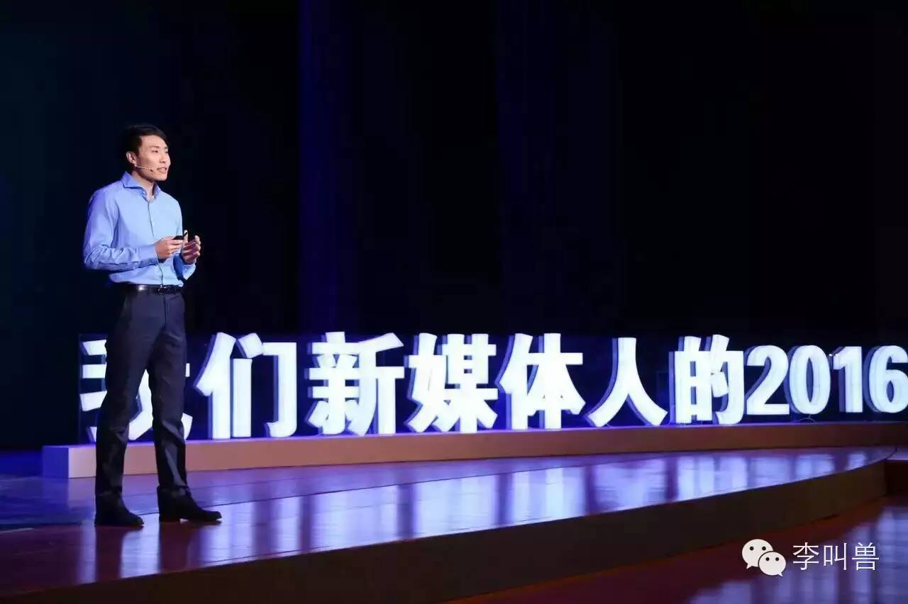

在自媒体时代，很多企业经常面临这样的问题：

“为什么微信上投入这么多钱，就是看不到效果呢？公众号就是不活跃呢？”

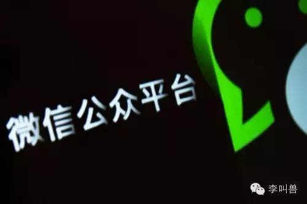

很多人对此的第一反应是增加资金投入、增加人力投入，但其实通常情况下，这既不是资金的问题，也不是人力的问题。

 

**问题到底出在哪呢？**

 

这往往不是因为投入不够。

 

实际上，很多企业的新媒体部门，投入很大，甚至都快变成了“公益部门”了。

 

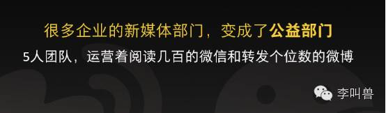

甚至，我还见过某公司搞的微信抽奖，奖品是Apple Watch，结果只有几十个人参加——相当于花了2998元，只获取了几十个粉丝，其中大部分还会立马取消关注。

 

**也不是因为能力不行。**

 

实际上，很多企业不惜代价、高薪聘请新媒体运营的专家，雇佣最好的创意团队，甚至由某个总监直接带头……

**很多时候，我们无法解决一个问题，既不是因为缺乏投入，也不是因为缺乏能力，而是因为看待问题的视角出现问题。**

比如在战争中，过去分为载具和武器。但是转化视角，让武器具有载具功能，就有了坦克；让载具具有武器功能，就有了战车。

同样，我们需要转化视角，重新审视一个企业的构成。

 

**我们知道，任何一个企业，对它的用户、消费者，实际上只做两件事：**

1， 满足需求（造货）——产品部门负责

2， 传递信息（卖货）——市场、销售等部门负责

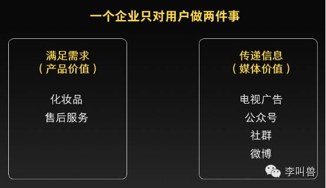

前者是“产品价值”，后者是“媒体价值”。

 

这是绝大部分公司的分类，也是传承已久的方式。

 

**这有什么问题呢？**

 

既然说要“转化视角”，我们就要打破这种分类，重新看待事物本身——如果我们把边框去掉，把“满足需求”和“传递信息”看成所有企业行为的基本功能，会怎么样呢？

 

现在大家都说“互联网打破边界”，我们也打破边界，就会发现这样一个矩阵：

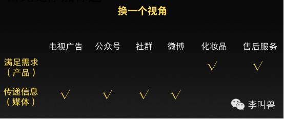

“化妆品”、“售后服务”这些产品，具有满足需求的功能；同样，“公众号”、“微博”这些媒体，也具有传递信息的功能。

 

针对这两部分的培训，一个叫做“产品经理课”，一个叫做“广告文案课”。

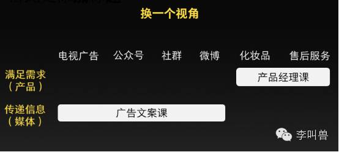

讲如何让产品满足需求的，是产品经理课。

 

讲如何利用媒体传递信息的，是广告文案课。

 但是剩下的部分呢？

 

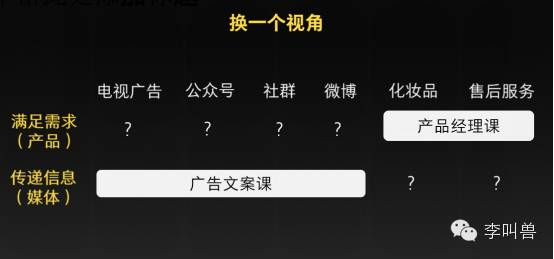

如果让媒体部分，像产品一样被设计，可以满足需求；

让产品部分，像媒体一样被设计，可以传递信息，会怎么样？

转化视角，你就会发现，**一切皆产品，一切皆媒体。**

 

应该**让媒体产品化，也应该让产品媒体化。**

 

今天我既不讲“产品经理课”，也不讲“广告文案课”，只讲讲：

1， 媒体产品化——如何让媒体满足需求；

2， 产品媒体化——如何让产品传递信息

 

###一、媒体产品化

很多企业运营公众号、社群等的失败，往往是因为企业把它们当做是营销方式或者简单的发声渠道，甚至办成了“企业内刊”（比如发《张董国庆节讲话：狠抓食品安全》），缺乏内容价值，自然不会有人看。

而优秀的公众号，则可以满足别人具体的需求，具有产品价值——比如“咪蒙”满足别人建立优越感的需求。

 

**所以我们要做的，是把媒体给产品化——让媒体具备产品属性，可以满足需求。**

 

那么如何像产品经理一样，设计媒体呢？

 

首先你得知道什么才叫做“产品”。

 

我对“产品”的定义是：

 

**“任何能够持续性满足需求并且获取注意的东西，都叫产品。”**

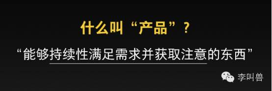

听起来很绕，没关系，先看个例子：

 

看一下经常被李叫兽黑的康师傅公众号的近期文章，你会感觉这不像一个产品：

 

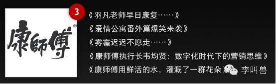

为什么呢？

 

因为它没有“持续性满足需求并且获取注意力的能力”，这句话包含三条含义：

（1） 创造一个需求

（2） 该需求能够被持续满足

（3） 能够持续性获取注意，让消费者想到你

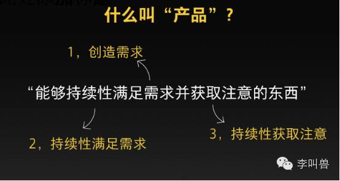

####1创造需求

任何的产品都是为了某个用户需求而设计的，而不是为了企业需求而设计的。

 

如果你看康师傅的公众号就会发现：说不出，它的存在到底是为了满足什么用户需求。

 

是的，我可以说“为了增加关注”、“为了获取销量”、“为了传播董事长的精彩演讲”来设计一个公众号产品。

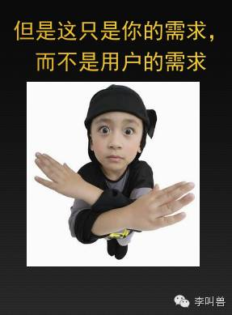

而产品是为用户的需求设计的。

 

比如李叫兽自己的公众号，定位的需求是“发现工作痛点，并看看我的内容能帮上什么”。

 

有一次我发现创意人吐槽甲方“过分注重短期传播KPI”后，写了《文案的策略性：为什么过分注重KPI没有用》，指出文案最关键的并不是传播量多少，而是如何帮助和协同企业的战略。

 这篇文章在一定程度上缓解了工作痛点——让人可以利用文章内容说服别人，或者改变观点。

 

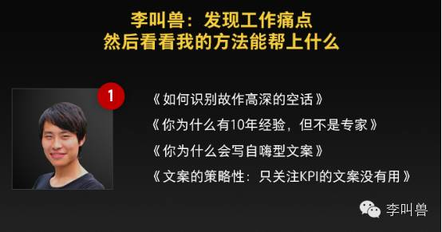

**产品必须为用户需求而设计****——这大概是中学生都能知道的基本常识**，很多人没有在设计新媒体的时候使用这个基本常识，往往是因为他们只把自媒体当媒体，而不是产品。

 

所以当你规划公众号或者社群等任何一种“产品化媒体”时，应该先问自己：

 

**“这个自媒体，到底是为了满足什么用户需求而设计的？”**

 

比如我看到有的企业公众号主要吸粉方式是“发红包”、“抽奖”，结果粉丝粘性差、效果不好。这是为什么？

**因为这个号满足的用户需求只是“金钱需求”，而自媒体并不是满足金钱需求最好的方式**——赚钱的方式多了去了，我为什么要通过关注公众号来专门满足这个需求？

 

这就像为什么“带打火机功能的手机”永远不会火一样，因为手机并不是满足点烟需求的好方式。

 

**那么一个自媒体一般能满足什么需求？**

 

最容易想到的需求是：**帮助用户消磨时间**——通过精彩的内容，帮助用户打发或者度过一段无聊的时间。这也是很多爆米花电影能够满足的需求。

 

**但实际上还有第二种更大范围的需求，工具需求**——这个自媒体创造的内容，并不仅仅是打发一段时间，而是帮助用户完成另一项任务。

 

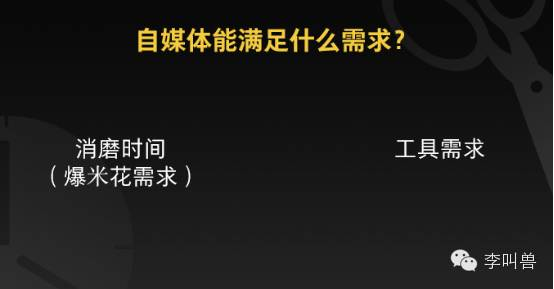

实际上，很多自媒体内容主要并不是帮人消磨时间，而是节约时间，帮助人们更好完成本来就要完成的某个任务。

 

甚至，有些公众号的内容能够在一定程度上替代“实物产品”的某些功能：

 

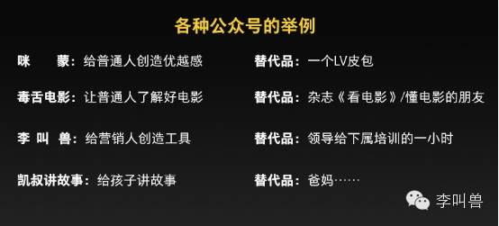

比如“凯叔讲故事”，替代了爸妈辛苦给孩子讲故事的这个工作。

####2持续性满足需求

任何一个产品，不光需要“创造并满足某个需求”，还需要**“****持续性地满足这个需求。”**

 

比如加多宝在不同时间、不同地点，都在满足“怕上火”的需求。

而如果上个月满足怕上火的需求，这个月却满足补充维生素的需求，或者在这一瓶满足减肥的需求，那一瓶满足提神的需求，就不能叫“一个产品”。

 

产品所满足的需求，必须是“持续性”的。

 

而如果你看康师傅公众号发的文章，就会发现：**不同文章根本就是在满足不同的读者需求。**

 

《羽凡老师早日康复……》，满足了八卦需求，干的是公众号“关爱八卦成长协会”的活；

 

《爱情公寓番外篇爆笑来袭》，满足了追剧需求，干的是公众号“芭莎娱乐”的活；

 

《雾霾迟迟不愿意走……》，干的是公众号“中国环境新闻”的活；

 

《康师傅用鲜活的水，灌溉了一群花朵》，满足了公益关爱的需求，干的是“美丽中国”的活；

 

甚至，《康师傅执行长韦均贤，数字化时代的营销思维》，讲营销思维，把“李叫兽”的活都干了！

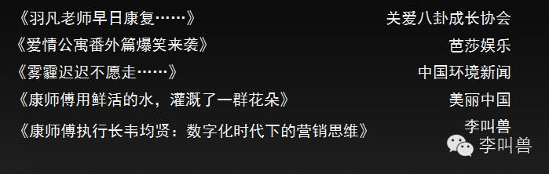

“关爱八卦成长协会”，定位了“八卦需求”，然后持续性几年如一日地去满足，所以是一个“产品”（跟加多宝一样）。

 

而康师傅公众号的文章，看起来更像是应付各个部门要求的产物（比如讲董事长发言，应了总裁办的要求），而不是持续性满足读者需求的产物。

 

所以，自媒体应该做“电视剧”，持续性满足某种需求，而不是做一个又一个的电影——满足不同的读者需求。

 
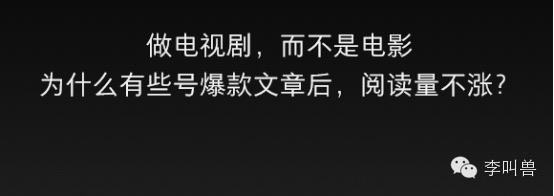

**这也是为什么有的企业号一篇10W+文章爆火后，往往后续的阅读量根本没有上涨的原因——你在做电影，而不是做电视剧。**

 

如果是电视剧，我们会因为前三集好看而期待第四集。

如果是电影，我们不会因为万达影院播放了《老炮儿》很好看，就会期待下一个《恶棍天使》。

 

####3持续性获取注意

自媒体如何获取注意力？很多人想到的第一方式就是——依赖推送通知（比如订阅号）。

 

但是如果一个自媒体依赖推送通知，就注定它没有持续性主动获取注意力的能力，注定打开率不到10%，注定要与几百个号进行越来越激烈的竞争。

 

而任何一个成功的产品，必须需要具备“持续性获取注意”的能力——**假设市场部解散，它仍然能够被人想起来购买。**

 

这些产品都解决了这个问题：“**消费者什么时候应该想起你？”**

举个例子：

 

“假设加多宝市场部、销售部解散，所有的广告都消失，你在所有的渠道也都看不见他们的广告，你还会想起来加多宝吗？”

 

“当然会”？

 

“什么时候？”

 

“怕上火的时候吧——比如吃一顿很辣的火锅。”

 

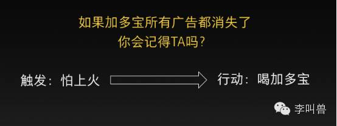
 

这就说明，通过多年的努力，加多宝已经在人的记忆中建立了触发，每次“怕上火”的时候都容易想到它。

 

**而产品化的自媒体，也能够形成某种“触发”——平时可能把它忘了，但是一到了某个时候、某个情景就会想到它。**

 

比如每次王自如都用“王自如方式”来解读新的智能硬件，并且都是在新品发布后几天做出视频。

 

平时你可能把王自如给忘了，但是一看到“锤子出了新手机T2”，立马就会想到：“这次，王自如会怎么说？”从而主动去搜索王自如。

 

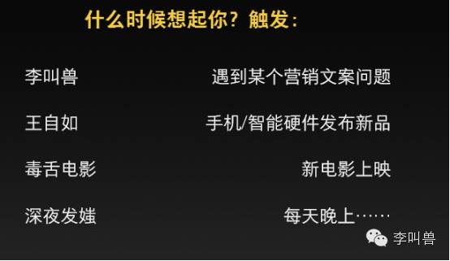

这种触发可能是某个时间（比如罗胖每天早上60秒语音），也可能是某个事件（比如新手机发布会后想到王自如），总之都是把你的产品（自媒体）同另外一件事进行绑定，让你的产品能够持续性获取注意力。

 

**那么对你的公众号来说，用户什么时候应该想起你？**

 

毕竟你不能占据别人所有的时间，只能定位到某个情景中——如果你是卖蛋糕的，没必要让用户在蹲厕所的时候想到你。

 

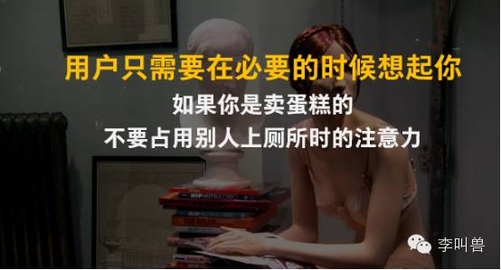

 

###二、产品媒体化

刚刚讲了第一个方面：“媒体产品化”，需要像设计产品一样，设计你的自媒体，让它能够持续性获取注意并且满足需求。

除了可以“媒体产品化”，像设计产品一样设计自媒体之外，还可以反过来，**“产品媒体化”——像设计媒体一样设计产品。**

 

**很多时候，产品本身就是最大的自媒体**——如果你能一年卖出几百万瓶饮料，那么这些饮料本身就是自媒体，可以带来价值。

 

产品媒体化——这并不是新潮的举动，实际上很早就有了。

 

比如，在我记忆中把产品当做自媒体来运营的，最印象深刻的就是这货：

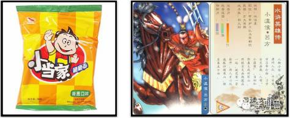

没错，我们小时候吃小当家干脆面时收集的水浒英雄卡，几乎拥有了一个自媒体的所有特点：

- 提供内容——相当于订阅了水浒故事；
- 为其他产品带销量——刺激小朋友为收集卡片而买更多干脆面；
- 引发传播——小朋友们相互比拼收集，传播量绝对不是一般social策划能比的。

把产品当媒体——这种价值有时候甚至比互联网营销还管用：

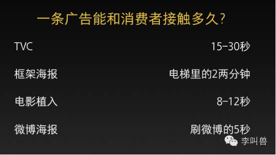

一条广告一般只能跟消费者接触几秒钟，付出的就是百万级的预算。而产品本身，可能跟消费者接触几分钟几小时甚至几天、几年。如果产品带有媒体属性，反而会产生巨大的价值。

**所以，既然可以说“一切皆产品”，也可以说“一切皆媒体”——你的产品本身，而不仅仅是公众号，也可以具备媒体价值。**

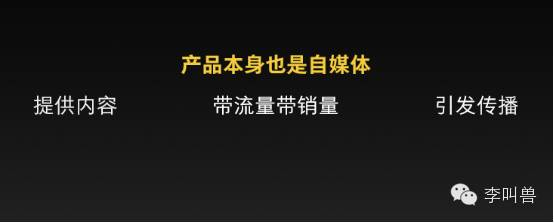

**比如，让产品像媒体一样，提供内容：**

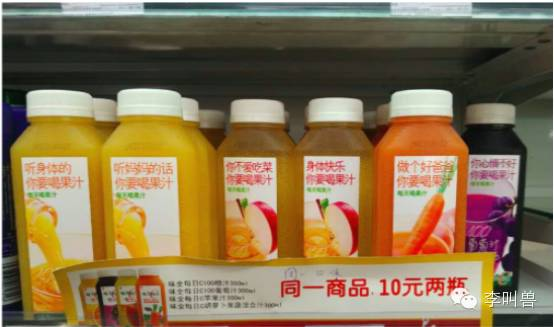

（某果汁包装盒：传递果汁的价值观——“听妈妈的话，你要喝果汁”、“你心情不好，你要喝果汁”。）

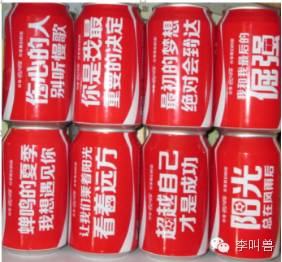

（可口可乐歌词瓶）

**比如，让产品像媒体一样，可以带流量带销量：**

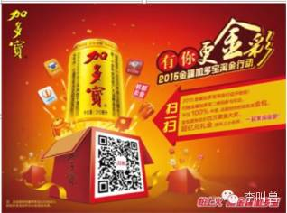

（无数品牌，反而让产品给媒体带流量）

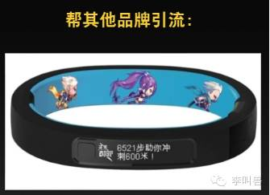

（还可以帮其他品牌引流，比如某智能手环变成了媒体入口，帮天天酷跑引流。）

**比如，让产品本身像媒体一样，可以引发传播：**

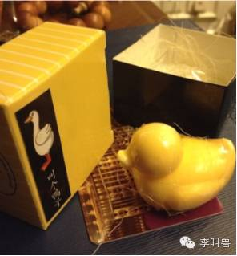

（叫个鸭子产品里送“鸭子肥皂”，鸭子有某男性工作者的含义，肥皂又有某男男之间举动的含义，鸭子肥皂本身就制造了话题）

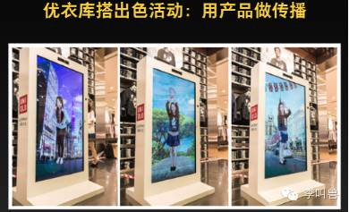

（优衣库在店内办的搭出色活动——穿着衣服照镜子，可以换背景拍照）

**实际上，你在媒体、广告文案上用的所有技巧——反差感、社交币、营造视觉感、绑定关注圈等，全部都可以用到产品本身上，让产品也能提供内容、带来流量、引发传播。**

**结 语**

如果需要我对2016的自媒体或者互联网营销做一个预测，那我首先想到的就是：

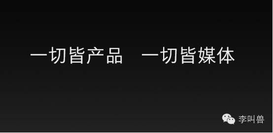

一切皆产品，一切皆媒体。

未来，会有越来越多的营销方式，被当做产品去运营。（比如锤子的发布会，与其说是营销，不如说是满足锤粉需求的产品。）

也会有越来越多的产品，被当做媒体去运营。

**像产品经理一样做广告；**

**像广告人一样做产品。**

