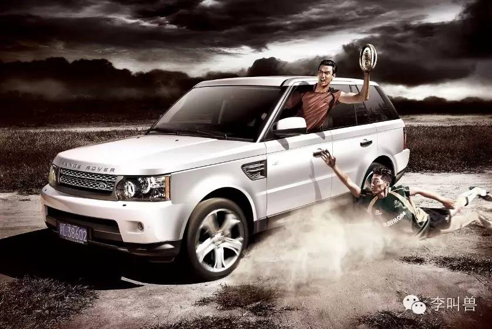
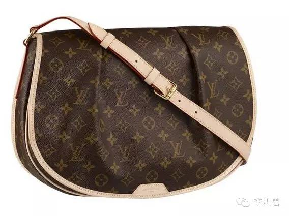
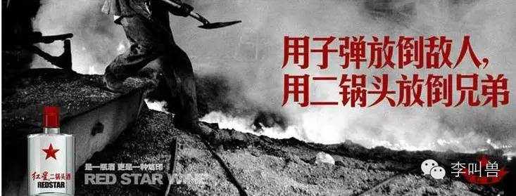
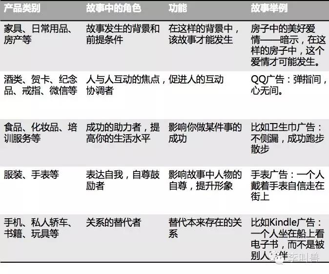
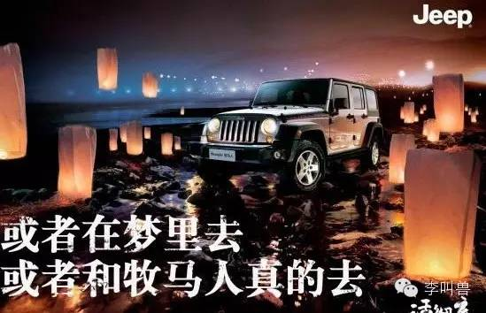
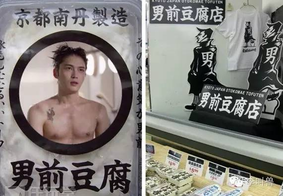

#【李叫兽】选择品牌人格的基本款方法
原创 *2015-11-25* *李靖* [李叫兽](https://mp.weixin.qq.com/s?__biz=MzA5NTMxOTczOA==&mid=400680596&idx=1&sn=4cd303ef929ef130e4ce2b0c3cb1989c&scene=21&key=cf558d6bdcc9fe6c2c05c5e05c202829453081b5f79d291481474dbffc660115f49186ca31a010861e7af0fc01f1a77d2fc95bbcae0d215708ca191613c2074c63080dd85eed4b753b0c274ea1390282&ascene=7&uin=MTc4OTM3ODkzOA%3D%3D&devicetype=Windows+7&version=6203005d&pass_ticket=V5w3mkkLQcmNI8VtqJK0C1erJipHSMkFDXxkSrQt9dQbXsQ8haTP3Q1NJmbFLNhV&winzoom=1##)

> 原文链接：http://mp.weixin.qq.com/s/VaGyIHkZHotlWiek96sVEA

上周发了文章：

[【李叫兽】品牌有哪些基本款性格](http://mp.weixin.qq.com/s?__biz=MzA5NTMxOTczOA==&mid=400577854&idx=1&sn=590aaec9e497caff34dc366379ae7218&scene=21#wechat_redirect)

有读者问：那我作为一个企业，面对这么多人格，怎么选呢？难道通过拍脑袋？

当然不是，李叫兽一直倡导“营销不能靠拍脑袋”，所以这一期就讲讲“选择并塑造品牌人格的基本款方法”。

- - - - - - - - - - -

品牌有哪些基本款人格？

**上周讲了：**

**真诚sincerity：**务实的、诚实的、健康的、愉悦的（比如佳能、农夫山泉）

**刺激excitement：**大胆的、活泼的、有想象力的、现代感的（比如杜蕾斯、小米）

**能力competence：**可靠的、聪明的、成功的、负责任的（比如微软、本田）

**精致sophistication ：**高贵的、迷人的、精致的、平和的（比如香奈儿、无印良品）

**强韧ruggedness ：**户外的，强壮（比如路虎、万宝路）

**这么多人格，具体怎么选？我如何决定我要塑造什么形象？**

关于人格形象定位，众说纷纭，但其实主要考虑3个因素：

1，消费者的人格；

2，产品扮演的角色；

3，竞争对手的形象。

###1消费者的人格

为什么很多品牌进行人格化的塑造？

因为消费者经常通过使用产品，来寻求人格的一致性。

如果我想去“野”，是一个渴望力量和自由的人，可能会买路虎。

如果我觉得自己是一个尊贵稳重的人，可能会去买辆奔驰。

**总之，产品是一个标签，它经常向别人表达“我是谁”，同时也不断告诉我自己“我是谁”。**

之前心理学家曾做过这样一个实验：

给一群女人分发一些名牌包包，告诉她们这是高仿假货，让她们拿着去商场走一圈。

接着再让她们做智力题测试，结果发现：她们作弊的比例大大增加。

**拿着“高仿包包”给这些人造成了一个潜意识心理印象，让她们感觉自己更像一个虚伪的人，从而在接下来的考试中，自动降低了道德要求，增加了作弊。**

“反正我是一个虚伪的人。”

这些影响都发生在潜意识层面，人不可能直接感知到——我们每天用的产品、选择的服务，其实都在潜移默化影响着我们的行为或性格追求。

所以，**作为消费者，如果能主动选择，我们更加倾向于选择和自己“人格形象”一致的产品。**

作为营销人员，首要考虑的就是：

你的产品人格和目标消费者的人格是否一致。

人的人格主要有两种：**理想人格（我们想成为的人）和现实人格（我们现在是什么人）。**

而产品人格塑造，要不就是跟目标消费者的理想人格一样，要不就是跟他们的现实人格一样。

一般来说：如果是**公开使用的产品**（比如衣服），往往是把品牌塑造成消费者的**理想人格**（这个时候消费者通过产品向外界展示形象）；如果是**自己使用的产品**（比如床单），往往是把品牌塑造成消费者的**现实人格**（这个时候消费者主要通过产品向自己展示形象）。

比如对很多人来说，手机是一种需要公开使用并且展示个人形象的产品，就经常有手机厂商塑造“理想人格”。

初期的小米手机主打“性价比”，消费者的现实人格应该是：精打细算的、务实的人。

而如果直接这样塑造品牌人格，可能会引来负面象征——小米，屌丝采用的手机。

所以小米塑造的人格是这部分消费者的“理想人格”——发烧友。并且说“为发烧而生”——我用小米手机，并不是因为我没钱买更贵的手机，而是因为我是发烧友。

再比如之前苹果塑造过“Think different”（与众不同）的形象，而它的消费者现实人格可能并不是这样（与众不同的是少数人）。**苹果当时塑造的，其实是它主要消费者的理想人格。**

而对于很多非公开使用的产品，则更加倾向于使用主要消费者的现实人格。

比如很多洗发水倡导“天然、健康”，这是它们用户在考虑洗发水时，本来就会展现的人格。

总之，选择品牌人格，你需要考虑：

我的主要消费者人格是什么？我要把品牌塑造成他们的理想人格，还是现实人格？

###2产品扮演的角色

所有的品牌人格，最终会体现在“品牌故事”中，所以塑造品牌人格，需要依据你的品牌故事。

什么是品牌故事？

众多说法五花八门，而我认为，所谓品牌故事就是：

**你的产品在什么故事情节下，扮演什么角色。**

比如红星二锅头酒，典型的品牌故事是这样：

> 两个一起奋斗了几十年的哥们（当年可能一起在大钢铁企业中挥洒青春、为祖国炼钢），在酒桌上用红星二锅头酒来回忆青春。

然后在这个故事中，红星二锅头酒，扮演了“**关系的协调者**”的角色，是两个哥们相互之间互动的焦点。

自然，在这个故事中，品牌就需要有“刚烈”“酣畅”“有力”这样的“强韧型”人格。

那么，如何构建你的品牌故事，让你的品牌有明确的性格？

**最重要的是寻找：你的产品，能够在消费者的什么故事中，扮演什么角色？**

这是一些角色举例：

**比如有些产品在品牌故事中扮演“关系的替代者”的角色，去替代本来已经存在的某种关系，成为你的陪伴。**

在Kindle电子书的很多广告中，Kindle扮演的就是“关系替代者”的角色，故事中本来至少应该有2个主人公并且发生关系。而Kindle替代了其中一个主人公——并不是你跟一个朋友玩耍，而是Kindle陪你看书思考。

再比如很多轿车的品牌故事中，就是一个人开着车在郊外驰骋，而这时候汽车的扮演的角色就是“关系的替代者”——是汽车陪你驰骋，而不是另一个主人公。

（注：有的产品根据企业定位不同，可以扮演不同角色，比如有的品牌把汽车定成了“自尊的鼓励者”，有的定位成了“关系的替代者”。比如很多服装品牌扮演“鼓励自尊”的角色，而NIKE则扮演“成功的助力者”。）

总之，任何的品牌性格不能凭空存在，它往往附着于一个具体的故事中，并且在这个品牌故事中扮演它应该扮演的角色。

**而在这个故事中，如果产品没有扮演合适的角色，就会难以被消费者接受。**

比如之前看到一个智能热水器的文案，讲到一个“为梦想闪耀”。

这就是一个不合适的品牌故事，也是一个不合适的品牌人格。

**在这个品牌故事中，热水器扮演的角色是“追求梦想的助力者”，并且塑造了“有想象力的、与众不同”的品牌人格，。而在大多数人的认知中，并不认为热水器可以扮演这么大的角色。**

“我只想买个热水器，洗澡的时候更舒服一点。而如果连洗澡的时候都要追求梦想，你累不累？”

###3竞争对手

选择并塑造品牌人格，需要考虑你的消费者——他们的理想自我是什么？现实自我是什么？

需要考虑你产品在故事中扮演的角色——在我的品牌故事中，我的产品扮演什么角色，应该对应什么人格？

**除此之外，还需要像一切营销手段一样——考虑竞争对手的行动。**

“如果你的大部分竞争对手都在扎堆似的塑造一个人格，不如换一个。”

比如豆腐给人的印象就是“女性化、柔弱”，而日本有家很火的豆腐店却反其道而行之，叫做“男前豆腐店”，塑造一种阳刚、力量的形象，同大众的对豆腐行业的固有印象形成反差，从而成功塑造深刻印象。

几乎所有的运动品牌都体现“刺激型人格”（倡导个人奋斗、挑战自我等），比如Adidas“没有不可能”，NIKE的“Just do it”，甚至国内品牌的“Keep moving”等。

但美国运动品牌UA却塑造“能力型人格”，体现“智能的、富有技术的、团队协作”的形象，就连广告中也是多人为主：

**巧妙避开竞争对手扎堆的品牌人格，从而塑造记忆——这就跟你对人的记忆是一样的：**

如果一个班级里都是学霸，你更能记住某个特征鲜明的学渣。

如果一个班级里都是学渣，你更能记住勤奋努力的学霸。

所以，选择、塑造品牌人格时，你需要问自己：**在我的可选人格中，有哪些是被竞争对手扎堆的？有哪些是我可以选择性突破的？**

再比如说到银行，大多人都第一反应都会选择“能力/称职”这个品牌人格属性，但是这样的人格也给人一种“死板、缺乏活力和变化”的感觉（任何性格都有正面和负面）。

所以招商银行寻求突破，喊出口号“因您而变”，避免死板、教条的银行形象，甚至主打的形象都是“向日葵”（可以跟着太阳变）。

**结语：**

品牌有人格，但品牌人格塑造不能靠拍脑袋，需要综合考虑你的消费者性格（理想自我VS现实自我）、产品扮演的角色（品牌故事）和竞争对手的选择。