#【李叫兽】最全清单：双十一的消费者行为

“双十一的“消费者行为学”：最全清单

如果你不了解你的消费者，如何能够在数百万计的商家中赢得消费者的选择？

今天李叫兽就讲讲双十一的消费者行为学。

双十一期间，消费者面临着**降价折扣、促销氛围、时间压力、繁杂信息，同时持币搜索、伺机秒杀、担心错过**——这种独特情景下的消费者行为，和平时悠闲自得的购买行为有很大不同。

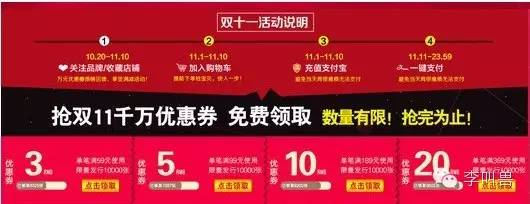

而李叫兽就讲讲在这种特殊的双十一情景下，消费者的决策机制、浏览方式到底产生了什么变化。

请看清单：

###1利他行为增加
双十一环境下，消费者的**利他性购买需求会增加**——也就是我们常说的送礼购买。

为什么呢？

因为双十一会支出很多人一大笔花销，从而产生负罪感，而利他行为可以**减轻负罪感**。

心理学家曾经做过这样一个实验：

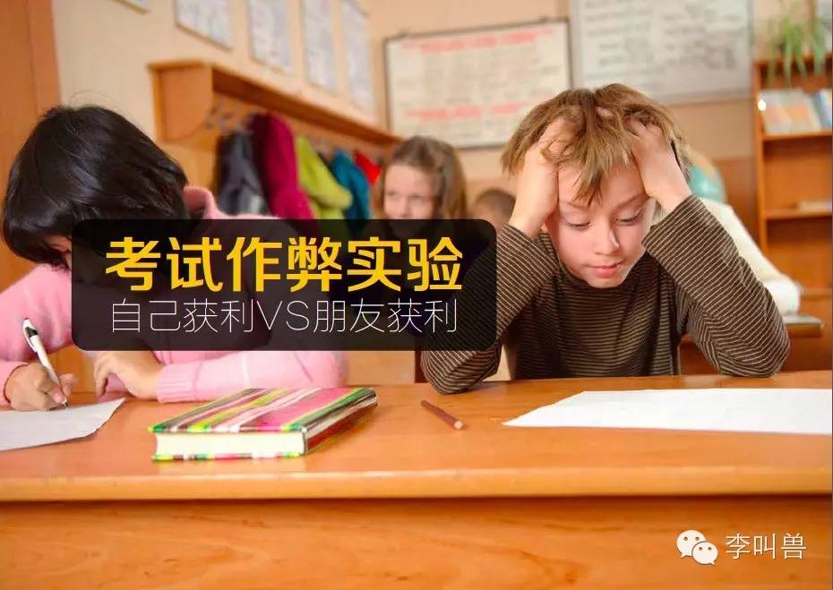

拉一群人进行智力测试，得分高的人可以获得更多奖金，发现作弊率不高——绝大部分人都保持着良好的道德水准。

然后拉另一群人进行同样的测试，但奖励发生了变化：**得分高的人，可以让一起来的伙伴获得更多奖金。结果，作弊率大量增加。**

这是因为在后一组实验中，人通过“利他举动”，减轻了自己负面行为的内疚感，更加容易合理化自己的行为。

同样，很多人在双十一会进行透支消费，或者买了平时根本不舍得消费的东西，这个时候会因过量购物而产生内疚感。

**而恰当的利他行为可以减少这种内疚感，所以很多消费者会在双十一增加利他行为——**

“你看，我又帮我男朋友挑了一件大衣，比我的都要贵呢！”

###2自制力释放

双十一之前，大部分人会刻意压制自己的购物需求，等到双十一再一起购买。

> “这双鞋子真好看！算了，还是等双十一再买吧。”

而对需求的压制会消耗人的自制力，从而导致消费者出现**集中的自制力释放行为——疯狂购物+疯狂娱乐**。

因为自制力跟肌肉力量一样，也是随着使用而消耗，随着休息而恢复的。

**心理学家曾经做过这样一个实验：**

让一群人先坐在摆满巧克力的房子中1小时，告诉他们不能吃。然后再让他们到另一个房间进行坚持握力的测试。

结果发现，比起坐在摆满石头的房间1小时的人，巧克力房间出来的人坚持握住的时间显著非常少。

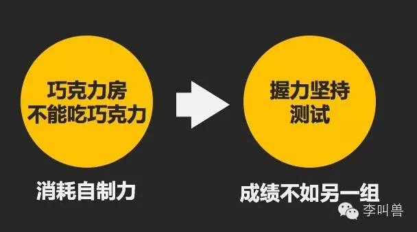

这是因为呆在充满巧克力的房间1小时却不能吃，消耗了这群人的自制力。所以在接下来的任务中，可用的自制力不多，自然坚持不了太久。

他们此时更加渴望的应该是释放自制力。

同样，**双十一的消费者们已经压制了很久的购物需求，购物的自制力被消耗殆尽，到了双十一那天，他们会几乎无法抵抗诱惑，进入“自制力释放”的状态。**

而人一旦进入自制力释放的状态（往往是经过了一段时间的压制），就会出现这些状况：

·购买一些平时不舍得购买的商品（因为没有自制力了）；

·娱乐需求增加；

·工作注意力降低。

如果你看天猫双十一的广告，就会发现它通过渲染几十个娱乐欢快的场景，进一步刺激消费者的自制力释放（狂欢吧）。

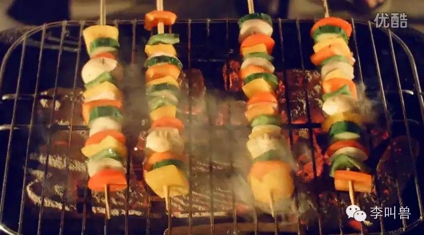

甚至，今年连晚会都开始搞了。

###3预期后悔式购买

双十一不断营造易逝感（过了今天就没了）、稀缺感（限量啊限量），会让很多消费者进入“预期后悔”的心理状态。

预期后悔就是指：**我做这件事并不是因为我真正想做，而是担心我不做会后悔。**

翻译成双十一的话就是：

“我买这些东西，是担心如果我不买，将来错过了就会后悔，将来买会更贵。”

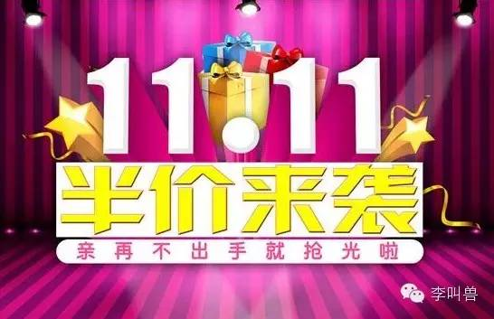

继续翻译成购物一族的逻辑就是：

“折扣的价格，等于不要钱。”

“今天不买这个包，等于损失了1万块。”

而当普遍消费者进入“预期后悔”的购买状态时，对品牌商来说，最好的营销手段就是：**进一步刺激预期后悔。**

比如，这样一个场景：

12月某一天，办公室

“哇，小王，这一身大衣和鞋子不错啊！不得大几千吧。”

“没有，一个月前双十一买的，不到一千。当然现在买的话，就贵了。”

###4尝试新选择增加

双十一一般是“囤货式”购买——一次性买好未来好几个月的衣服鞋子。

而在这种情况下，消费者会比往常更加**倾向于尝试新选择**，而不是维持过去的购买习惯。

心理学家曾经做过这个实验：

给被试者一张菜单，让他们根据菜单预定自己的饭。

A组被试者被要求每周制定下一周的食谱，而B组被试者被要求每天制定当天的食谱。

结果发现：**B组被试者每天的食谱类似程度很高，而A组消费者却选择更多花样。**

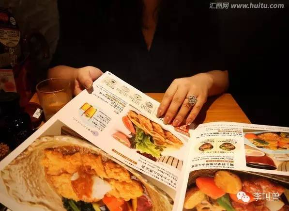

也就是说，当被要求制定未来一周伙食时，人更加倾向于多样化选择。

双十一也是这样。

平时购物时，我们经常只买现在要用的东西，所以会更加倾向于延续消费习惯，比如只盯着几个品牌的几类产品购买。

而到了双十一，**我们需要买未来很久要用的东西或者要穿的衣服，会更加倾向于多样化选择**——如果让你每个月买一件，你可能会买类似的；但是如果是双十一要把6个月的放进购物车，你肯定不会放6件类似的东西进去。

这就意味着：很多新品类，可能会在双十一面临机会。

###5决策瘫痪

双十一给消费者提供了海量的选择，商品琳琅满目，给了消费者充分的选择。

大部分人觉得“选择越多越好”，但是研究发现，**过多的同质选择，反而会让消费者进入“决策瘫痪”状态，最终放弃购买。**

有这样一个心理学实验：

摆出一系列昂贵的果酱，向消费者提供试吃机会和折扣。

实验分为2组，一组有6款果酱，另一组有24款果酱，全部都可以任意购买。

最后研究者发现，在提供6款果酱的组中，**有30%的试吃消费者选择了购买；而在提供24款果酱的组中，只有3%的人最终选择了购买。**

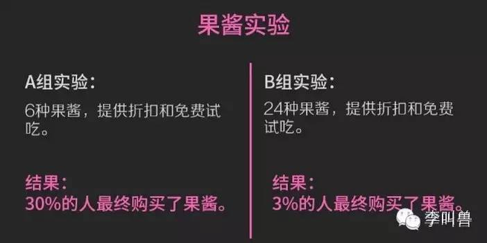

为什么呢？

因为更少的选择意味着更低的决策成本。在6款果酱的组中，消费者只需要比较6种口味并迅速通过排除法就可以做出判断，决定自己究竟买哪一种。

但是在24款果酱的组中，消费者总想“下一款是不是比这一款好一点？”，总想做出“最优决定”，结果在比较完24款果酱之前，他们就消耗了大量的大脑精力。最后出于节约精力的需要，他们索性放弃了购买。

**后一种状态就是“决策瘫痪”状态——过多的同质化选择同时出现时，人们反而会放弃购买，从而选择单一化的商品。**

而双十一就是这样的情况：大量的商品、大量的同质化选择，消费者不知道到底要买哪个。

这个时候，能够降低决策成本，帮助消费者迅速做决定的品牌就会容易致胜。

**比如卖鞋的直接说明：**

“20多岁职场新人必备制式皮鞋-3款”

还有大量的导购类网站、帖子，也容易分这杯羹。

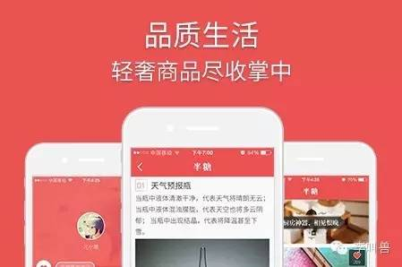

###6销量领先——更多使用”外周线索“

下面再说说消费者决策。

人在做决策的时候会收集信息，而这种信息来源主要是两种线索：

（1）**中心线索：与目标直接有关的线索**（一般是基于判断分析）

比如你买一个手机，中心线索就是：CPU主频、屏幕大小、轻薄程度、外观如何等。这些线索都是跟你买手机的目标（比如玩游戏、打电话）直接有关的。

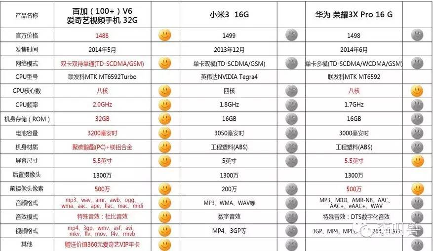

再比如你招聘一个文案人，中心线索就是：创造好奇心缺口的能力、顺应逻辑能力、利用基模的能力、唤起读者情绪的能力、策略思维能力等。

（2）**外周线索：与目标无关，但是可能会带来间接证明的线索**（一般是基于经验概括）

比如你买一个手机，外周线索就是：哪个国家产的、什么牌子的、谁代言的、买的人多不多等。这些线索和你用手机目标（比如玩游戏、打电话）没有直接关系，但是可能会当做间接证明。

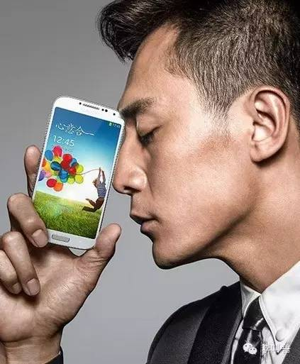

再比如你招聘一个文案人，外周线索可能有：哪个学校毕业的？拿过什么奖？做过什么成功案例？谁推荐的？

（说到这里你就发现了：如果用外周线索做判断，就是我们所说的偏见。比如某单位招聘不要女性，就是通过“性别”这个外周线索，而不是“实际工作能力”这个中心线索）

**帮助决策的时候，两种线索各有优劣：**

中心线索更加准确，决策质量更高，但是却更费脑力；

外周线索非常省力，但同时决策质量会偏低，容易受到无关因素影响，容易产生偏见。

（PS. 也说明了为什么智力水平偏低、知识偏低的人，往往偏见越多，因为靠偏见来决策省脑力。）

一般来说，人在做决策的时候，这两种线索会同时使用。

而在双十一的时候，一个重要的特点就是：**消费者会更多使用外周线索，大量降低中心线索。**

也就是说，消费者会更加容易受到：**品牌大不大、原产地在哪、谁代言谁背书、销量怎么样等信息影响。**

不容易受到：具体性能如何、用的什么原料、技术怎么样等信息的影响。

**为什么呢？**

大量的抢购、秒杀和紧张的气氛，给所有的参与者提供了“时间压力”，而“时间压力”大时，人的决策能力会降低，从而不得不更依赖“外周线索”做判断。

在一项实验中，心理学家眼球捕捉设备发现，给被试者限定决策时间后（比如必须24秒做一个购物决定），他们眼神更加停留在外周信息上（比如销量领先）。

大量的研究发现，**在购物决策时间压力大的时候，消费者的决策能力显著降低，他们往往更加会通过肤浅、单一、从众的方式来决策，也更加容易做出非理性决定。**

（这就是为什么强烈想要说服你的导购员，一定要你赶紧做决定，因为时间压力下的决定，更容易非理性，你也更容易被忽悠。）

所以在这种情况下，双十一各品牌更加有效的广告应该是以外周线索为主，比如知名品牌、前所未见的折扣、销量第一、原产地牛逼、XX代言。

而如果在这个时候强调：**XX黑科技、XX牛逼功能、分辨率提升70%，就基本没有用。**

与此相对应的就是“众筹”，产品众筹网站上大部分是未知产品，消费者没有一笔心理预算（双十一是有的），没有时间压力等，所以用户会更多使用中心线索来决策。而这个时候，众筹文案说的有没有道理、产品功能卖点是否打动人，就会更加重要了。

（PS.怪不得一个个众筹文案都这么长，包括李叫兽自己写的）

###7更容易接受单一信息

上面说了，时间压力之下，消费者决策能力下降，决策所需要的信息变少（不会考虑这么多了），所以会**更加依赖单一信息做决策**，而不是依靠综合信息做决策。

比如，决策能力低下的人，在选择自己专业的问题上，会仅仅考虑“专业是否热门”等单一信息，而不是像其他人一样综合考虑多种因素，收集多种信息（比如擅长程度、就业率、兴趣程度等）再做决定。

**而双十一消费者的决策行为更像前者——在决策时，往往只考虑单一信息。**

正是考虑到这一点，我在帮360智能摄像机搞双十一预热文案时，直接放弃了过去的描述方式——让消费者知道它能够远程看家、远程语音、分享视频、直播……

直接砍掉了所有的其他功能描述，用4个不同的场景情景，只体现1个功能信息：连上手机，远程看家。

再比如，就双十一当天文案来说，天猫坑位文案+商品标题基本上决定了转化率，平时无比重要的长长商品详情页，影响会降低（即使他们仍然会扫一眼。）

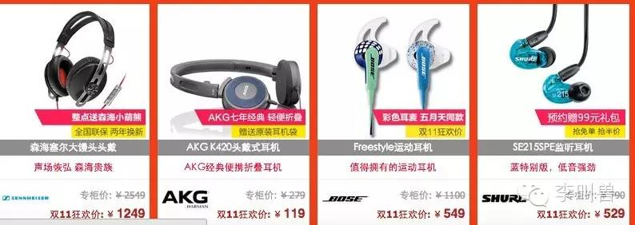

###8瞬间排除你——消费者使用非补偿性评估

消费者在商品评价阶段，一般有两种评估方式：

（1）**补偿性评估**：浏览一个商品，再看下一个商品，对每个商品建立一个大致心理打分。

这就意味着商品的属性优势劣势可以相互补偿——这个手机，CPU不行，但是新功能双镜头不错啊！

（2）**非补偿性评估**：先找到想要的属性，然后拿属性去筛选商品。

比如只看5.5英寸的手机，不符合的直接杀掉。

然后再比较第二个属性。

**这种情况下，商品属性的优势劣势不能相互补偿**——你一开始都把它踢掉了怎么补偿？

举个生活例子，假设你准备招收一个新媒体营销人。

**非补偿性评估就是，脑子中先想出一个标准（比如必须是985院校毕业），然后把不符合标准的全部杀掉。**

然后小王因为没上过大学，被淘汰了。

**而补偿性评估就是，先整体看完一个人，再做判断。比如小王虽然没上大学，但是你突然发现他竟然获得过艾菲奖金奖，而且只要月薪5K，这怎能不要！**

这里面，“艾菲奖”补偿了“不是985毕业”这个劣势。

而双十一存在大量秒杀、抢购、疯狂的信息量和选择情况下，**消费者的决策方式会倾向于非补偿性评估。**

这就意味着，只要是在消费者最关心的几个维度（比如手机的折扣力度、系统流畅、品牌如何）不突出，那么不论其他地方的创新做的多么好，可能都不会进入选择清单。

双镜头设计、突破型功能、婴儿般握感——**这些创新功能只有在消费者进行“补偿性评估”的时候才有用。**

###9稀缺性感知增强

全民哄抢、全民狂欢——这会导致消费者更加容易受到“稀缺性”的影响，而**对稀缺性的感知增加时，人会增加冲动性购买行为。**

比如心理学家曾经做过这样一个实验：

告诉A组被试者，坎贝尔罐头降价10%，结果平均每人购买了3.5罐。

**然后，告诉B组被试者，坎贝尔罐头降价10%，每人限购12罐，结果平均每人购买了7罐。**

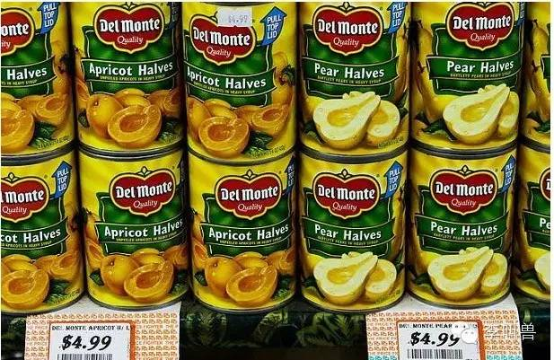

当消费者感知某个机会是稀缺的时候，就会增加购买。

双十一本身就是营造稀缺的节日（限时+限量的折扣抢购），大家聚集一天，也是在消费“稀缺感”。

这个时候，消费者会对任何稀缺的、稍纵即逝的信息更加敏感，如果能够营造这种感觉，就会比平时更能瞬间抓住他们的注意力。