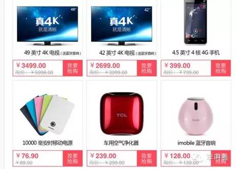

#【李叫兽】双十一：哪些价格策略让你欲罢不能
*2014-11-10* *李靖* [李叫兽](https://mp.weixin.qq.com/s?__biz=MzA5NTMxOTczOA==&mid=201219973&idx=1&sn=b0e9657ef1498c89b2be66bfcc0e74d2&scene=21&key=9ac7fff01cb28902361ebeab2505f8a707b1822d88d213f03c41a732f19b363494327e18585ee7675dca3973e080fb57ddcba203bdd364e95d37f15bf4f0162bd1e492821c93757ecc893e73df4f780e&ascene=7&uin=MTc4OTM3ODkzOA%3D%3D&devicetype=Windows+7&version=6203005d&pass_ticket=V5w3mkkLQcmNI8VtqJK0C1erJipHSMkFDXxkSrQt9dQbXsQ8haTP3Q1NJmbFLNhV&winzoom=1##)

> 原文链接：http://mp.weixin.qq.com/s/nqVSLr2fMd8ufwdH3KGlSQ

双十一无数电商开始大战，纷纷祭出“5折”大旗，各“剁手党”也摩拳擦掌，准备秒杀。

然而有些东西其实并不是真便宜，而是让你觉得便宜，因为电商的心理学真是学的越来越好了！

**那么电商有哪些价格策略让你感到便宜，难以自拔呢？**

###**1，锚定效应**

为什么商家经常会定一个很高的初始价格，再打折促销？

这是因为**锚定效应**的存在—**人对某件事的判断会受到前一个事物的影响**。

比如心理学家做过实验：

让消费者先写出自己的出生年份，再对某个廉价产品估价，**消费者普遍给产品估出了更高的价格：**

**这是因为之前写的出生年（比如1991）影响了消费者后续对价格的判断**，即使他们都否认自己受到了出生年的影响。

再比如我自己做过的一个实验，问A组消费者：**你觉得这盒感冒药多少钱？他们大部分估价30元左右。**

问B组消费者，你觉得这盒感冒药价格是高于还是低于1000元？**即时他们所有人都觉得这个感冒药不可能有1000元，但是他们仍然估出了不合理的高价格—200元。**

在这个实验中，B组消费者受到了“1000”元这个锚定的影响，即时他们不承认这一点。

**同样，你可以不承认或者没有意识到电商频繁的“促销折扣”给你带来的“锚定”，但是它其实一直影响着你。**

###**2，相对差异**

为什么有些中低端品牌的服装商会在其天猫店内放一些**永远也卖不出去的高价货**？

这是因为人们更多地考虑**相对差异**而不是**绝对差异**—在那些昂贵而且没有更好看的鞋子面前，**其他的鞋子显得价格更低，更可以接受了。**

**人天生就更加在意相对差异而不是绝对差异**—你在一家所有同事都月薪7000的公司里可能感觉不错，但是如果在一家公司，你月薪8000而其他所有人9000，你可能就不会这么开心了—即使你赚了更多钱。

所以，对于消费者来说，**如果甲显著比乙好，那么我们就会毫不犹豫买甲，而不去判断甲是不是所有选择中最好的。**对他们来说，“甲比乙好”就是一个天然的巨大卖点，是一个超脱理性的存在。

比如美国的Williams-Sonoma厨具店销售价格279美元的烤面包机，然后在他们**增加一个429美元的烤面包机之后，发现原来279美元的烤面包机销量增加了一倍**—消费者觉得，比起那个好不了多少的429元烤面包机，279元的那个显得太超值了！

如果你打开一个心仪的网店，发现某些产品明明款式质量都差不多，却被定了一个显著的高价，你就要小心了—**你会无意识觉得其他折扣产品更加实惠。**

###**3，概率折扣**

为什么同样是折扣优惠，有些电商会采取抽奖的形式？

这是因为“前景理论”（增加盈余账户因素的修正版）提出，而**当面对远小于购买力的利益时，我们倾向于增加风险。**

心理学家做过一个实验，某自动售货机上的1元零食本来打7折销售，后来变成概率折扣—**你购买时70%的可能性原价购买，30%的可能性退回全款（免费）。结果自动售货机销量增加了3倍。**

同时当我们**面对远大于购买力而且小概率的利益时，我们也倾向于增加风险。**

比如人们的买彩票行为。

**所以商家如果采取抽奖等概率折扣，而不是固定折扣，往往是基于上面2种原因，以满足你对“风险”的渴望。**

###**4，心理账户**

为什么现在电商越来越多地说“满1000减200”而不是“1000元后，打8折”？“满减策略”为什么大行其道？

**首先假设这2种情境：**

1，你某天因不小心剐蹭，修车花了1000元；心情不好，回到办公室，发现抽奖中了200元。

2，你某天因不小心剐蹭，修车花了800元。

**这两种情境下，你觉得哪种情境你会心情更好？**

我想大部分人会猜是第一种，而实验结果也是这么证明的。

为什么呢？这是因为**我们往往会为收益和损失设置不同的“心理账户”**，并且往往用不同的方法来看待不同的“心理账户”。

修车花费是在我们心里的“意外损失账户”里，这时**800和1000差异没有那么大**，给我们带来的损失痛苦差不多。**而“中奖”是在我们心里的“意外收获账户”里，200元比0要多很多，可以给我们带来很多快乐。**

同样，**满减策略**也是用了这个原理。

一件商品打8折，1000元的东西付出800就能买到，差异貌似没有这么大。但是如果是满1000减200，感觉是自己已经付出了1000块，（和800差异不大），然后**又额外收获了200元**（200比起0差异很大）。

更有甚者，很多商场采取**满额返券**的方式（比如满1000元，送你200元现金券，可以买任何东西），这**更加强烈了区分了两个不同的心理账户，让消费者觉得自己获得的优惠更多。**

所以，你也明白了中国的出口企业为什么享受的不叫“税收折扣”（比如出口商品交税打8折），而叫做“出口退税”（比如出口每交1000元的税，退给你200）吧？

###**5，损失厌恶**

**为什么很多商品明明货源充足，却让你抢购并且标明倒计时—**“距离优惠结束还剩4小时”？（即使4小时后又重置时间，变成距离优惠结束还剩24小时。）

这是因为**比起收益带来的快乐，我们更在意损失带来的不快乐。**通过抢购和限时优惠营造的“稀缺感”，让我们觉得如果不参与这个促销，我们就失去了一次机会。**而这种“失去感”激励我们想尽办法迅速下单购买。**

所以，我认识很多常住北京的人没有去过长城，而好不容易找到机会来北京5天的人一定去过长城—他们把不去长城当做一种“损失”，担心自己以后很难获得机会。

**再比如，做一个赌博游戏，随机抛出硬币，你赢了可以获得5万元，输了需要损失5万元，你会愿意玩吗？**

实验的结果证明大部分人不愿意玩，因为损失厌恶捡100元的快乐，难以抵消失去100元的痛苦。

同样，如果你想说服某个人，预期说“选择我，你会得到XX”，往往不如说“失去我，你就失去了一个XX的机会”。

###**6，捆绑损失，分散好处**

为什么商家会说“买3999元电脑，送耳机、送高档鼠标垫、送免费1年上门维修”，而不是把耳机、上门维修等价格都包在“3999元”里面？

**同样是花3999买了这一堆产品和服务，为什么要把某些部分说成是“免费”的？**

这是因为**人对损失和收益的感知并不是线性的**—假设你获得100元能得到某种快乐，而想得到双倍的快乐可能需要400元，而不是200元。同样，损失100元受到的某种痛苦，可能要损失400元才能感受到双倍的痛苦。

所以，如果把**所有的成本折到一起，给消费者一个总价，让消费者一次支出3999，而不是感觉到多次支出**（为电脑支出3000，为耳机支出200，为维修支出200……），消费者就觉得付出这些金钱没有那么痛苦。

所以，无数商家会说“买3000元电脑，包邮”，而不是说“总共3000元，其中电脑你花了2995，邮费5元。”

这就是为什么中国移动倾向于用“月套餐”让消费者一次性支出一大笔，而不是每次电话短信流量都要重新付费；这也是为什么人们更喜欢买房住（一次性支出）而不是租房住。

这就是为什么健身房一直坚持年费会员而不是按照次数收费—消费者觉得年费会员比每次都花50元更加优惠，但是实际上他们高估了自己将来的使用程度。

**同样，如果把“好处分散”，消费者感知到的“好处”就会增加。**

所以商家不会说“卖给你了一大推套装，其中包括电脑鼠标等”，而是说“买电脑，送鼠标耳机和维修”。

就像泰勒在《营销科学》杂志中发文说的：“别把圣诞礼物放在一个盒子里”。

总之，为了让你觉得你受到了优惠，电商们会千方百计地**捆绑损失，同时分散好处。**

###**7，尾数定价**

**为什么很多产品都标价399、299，而不是400或者300？**

而无数的实验也证明用尾数“9”来标价也确实会让消费者觉得更便宜。

为什么尾数定价让人觉得更便宜？

一种解释是“归类效应”—我们倾向于对事物进行分类，从而简化这个世界。

价格定位399容易让我们把商品分类到“300多块钱的东西”，而定价400容易让我们把价格分类到“400多块钱的东西”。

**我们大脑容量有限，导致我们不得不通过大量的分类来简化事物**，比如时间明明是连续的，但是我们仍分成了1小时、1天、1年等。对我们来说，12月31号晚11点59分59秒的意义和下一年的1月1日0点0分0秒的意义完全不同，即使它们本质上没有区别，只差了1秒。

同样，299元和399元虽然差了1元，但是让我们自动归到了不同的类别中，从而引起不同。对人们来说，简单归类可以造成巨大差异，某狮子座的婴儿可能因为晚出生1秒，变成处女座，从而招来无数偏见。

另一种解释是**尾数为9的价格给我们一种这种产品已经被打过折的感觉**，是一种隐性的锚定效应。实验也发现，定价400再在旁边写生“原价480”同直接定价“399”的效果比较类似。

总之，我们总觉得自己精打细算网上购物是理智的，其实已经被无数价格策略默默影响了。