#【李叫兽】为什么广告吸引人，最后却没买？
原创 *2015-09-08* *李靖* [李叫兽](https://mp.weixin.qq.com/s?__biz=MzA5NTMxOTczOA==&mid=208538871&idx=1&sn=8e8fe1520ab3da845adf52be22422d62&scene=21&key=ae0c59bce615bdd8fe5bb9e76598b96df5f18c0ac67067181388d51168011e4dfc7072809e4c907f8d446f7a4901e614253e05cba0f053fd376424d7abadba3cdf6f4864db5cc9b2ba6d0e598f050f13&ascene=7&uin=MTc4OTM3ODkzOA%3D%3D&devicetype=Windows+7&version=6203005d&pass_ticket=V5w3mkkLQcmNI8VtqJK0C1erJipHSMkFDXxkSrQt9dQbXsQ8haTP3Q1NJmbFLNhV&winzoom=1##)

> 原文链接：http://mp.weixin.qq.com/s/pDnny7cJPGdAcLairFfH6w

**“高通骁龙8核CPU”**

**“索尼1300万像素摄像头”**

**“2.5D弧面玻璃，全金属机身”**

**“这手感，真TM好”**

无数手机品牌鱼跃而起，各种牛逼文案亮瞎双眼，让用户看了纷纷心动，恨不得赶紧换掉手机。

可是，巨大的关注度可能最后没有转化成有效的销量。

“坚果手机看起来真不错！”说完下单买了个红米。

**为什么很多产品，广告有创意、产品吸引人、文案特牛逼，用户也很感兴趣，但是却最终没有购买呢？**

▼

**为什么？**

**“心动不等于购买”**

**这往往是因为很多广告和营销活动，仅仅解决了消费者的“兴趣问题”（“哇，这个产品看起来不错！”），却没有解决风险问题。**

而大部分人是风险趋避型，他们宁愿放弃自己的喜好，也要追求低风险。

**Johan Bruwer（2013）的研究发现，消费者在购买决策前，一旦感知到了下面5种风险之一，不论多么感兴趣，可能都不会购买：**

- **功能/健康风险**：产品不如说的那么好用怎么办？产品有害健康怎么办？
- **财务风险**：这次自己买贵了怎么办？
- **时间风险**：购买花费时间多怎么办？买了不合适又花时间怎么办？
- **社交风险**：买了之后形象不好怎么办？
- **心理风险**：买了之后心理有负担，有内疚怎么办？

Mitchell研究发现，在消费者购买阶段的两个阶段（收集信息和购买决策）时，都显著收到感知风险的影响：

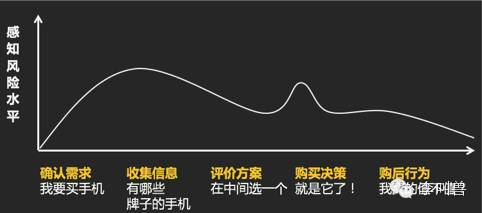

也就是说，如果一个品牌感知风险过高（比如担心有损面子、担心质量一般），不论打多少广告，都有可能根本无法进入消费者的备选方案。

或者即使被当做备选方案，也经常在决策前的最后一秒被放弃。

**所以，在营销活动中往往需要针对不同的阶段选择不同的营销手段，比如在“收集信息”和“购买决策”阶段，需要想办法降低感知风险：**

（PS. 请原谅李叫兽上面出现的反广告法词汇）

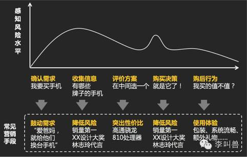

**那么怎么消弱这5种感知风险呢？**

下面就讲讲分析并消弱5种感知风险的常见办法。

###1**功能/健康风险**

**风险来源：消费者看到广告说的好，但是担心实际上产品不靠谱，功能达不到预期甚至有可能会损害健康。**

- 常见于功能性产品，比如：
- 担心某小品牌手机不耐用，或者辐射大。
- 担心某保健品吃了也没用。
- 担心小品牌耳机音质不好。
- 担心无名品牌食品吃了拉肚子。
- 担心淘宝上衣服不耐穿。

**常见降低感知风险方法：**

**背书（Endorsement）**：

找一个更有信誉、更可靠的人帮你背书。比如：专家作证、明星代言、上CCTV打广告……通过背书，可以巧妙把别人的信誉借用到你身上。

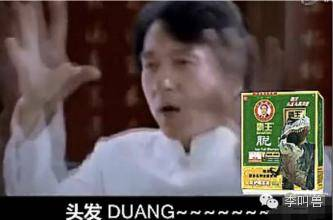

（当然，有些人会拒绝背书，如果你产品不靠谱）

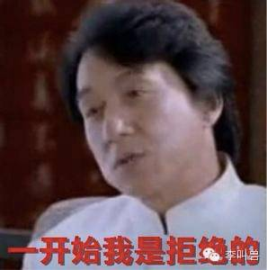

**品牌忠诚（Brand loyalty）**：

塑造过去一直被使用的感觉，让人感觉你有一大堆忠诚用户或者粉丝。

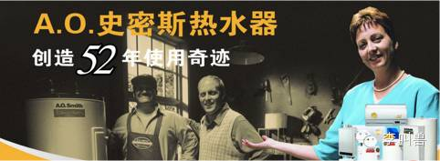

（毕竟，被用了忠诚用户用了半个世纪的，应该不是次品货。）

**大品牌形象（Major brand image）**：

塑造大品牌、被很多人买的感觉，毕竟我们都相信众人的选择不会错，大牌子不会坑人。

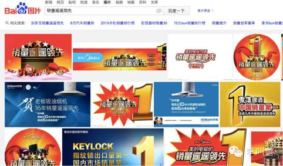

常见表达：全国销量遥遥领先、中国驰名商标、XX领导者、销量再次夺金、中国最大的视频网站……

（目测：这些都要违反广告法了）

**独立检测**：

利用第三方机构的检测，来证明自己的优势。

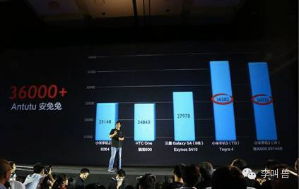

**利用商店形象（Store Image）**：

把产品放到一个高端高信誉的卖场去卖，也可以降低感知风险。

比如阿芙精油本来是纯在线精油销售商，却在高端百货店开设专柜。

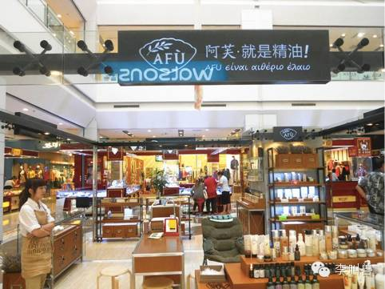

**这样，利用高端百货店的形象和信誉，降低自身产品的感知风险。**

“互联网卖化妆品不靠谱，别买阿芙！”

“谁说的啊？我前天还在新世界百货看到了它的店呢”

**提升价格**：

当不了解产品时，消费者经常通过价格来推测产品质量。当不知道哪个产品靠谱时，他们就会直接挑贵的买。

比如孕妇防辐射服，价格越高卖的越好。

再比如东阿阿胶当年不知名，涨价后反而大卖。

###2**财务风险**

**风险来源****：产品不符合自己支付的价格，担心自己买贵了。**

比如：逛街时发现一款特别喜欢的鞋子，但是担心自己买贵了，最终还是没有买。

**大部分消费者之所以想比较价格，其实并不是真正地为了能省多少钱，而是担心自己吃亏，担心自己没有做好最优选择。**

比如买回来鞋子本来兴高采烈，但是被说——你这鞋子啊，昨天京东上只卖299。

**而解决方案就是塑造一种“现在买并不会吃亏”的印象。**

比如：

**营造抢购****的感觉****。**（既然大家在抢，相比是买了不会亏）

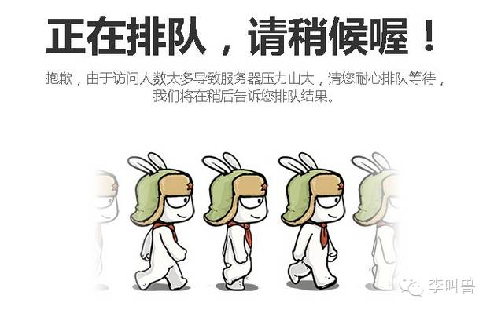

**限时降价。**（你看，打折只有18小时了，今天买肯定不会吃亏！）

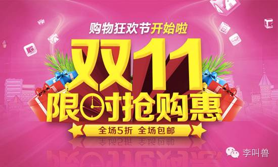

**退款保证。**（买贵了全额退款，这下放心了吧？）

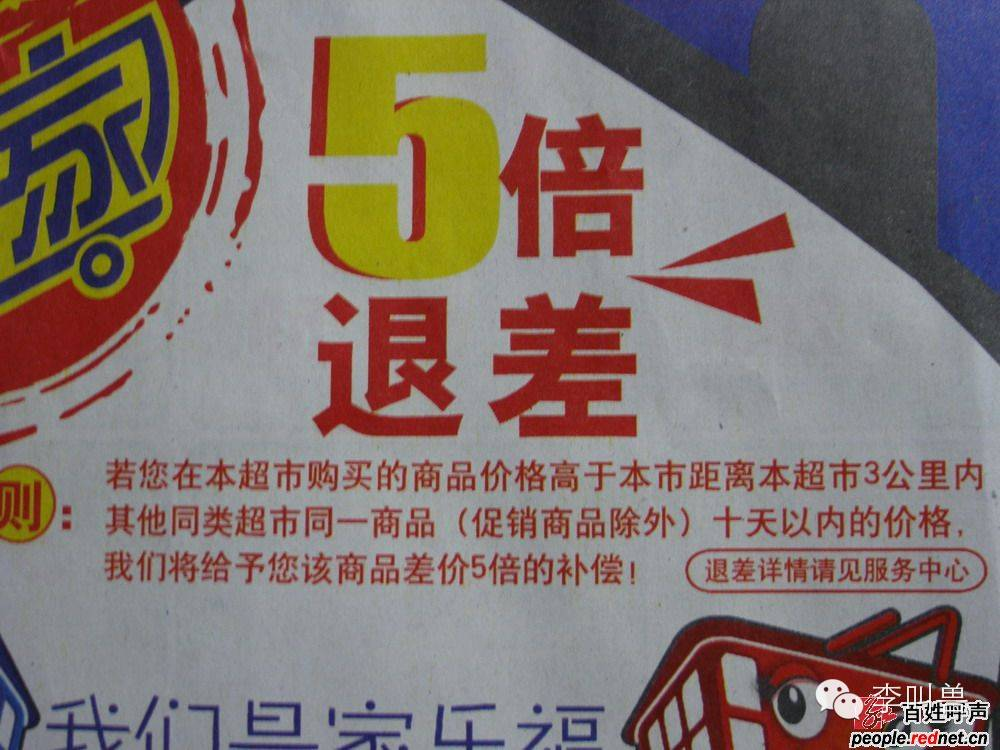

总之，消费者可能很想要你的产品，但是往往在最终决策的前一秒放弃了选择，可能是担心“现在买可能不划算，万一吃亏怎么办”。

**而你就需要想办法通过各种营销手段来减少这种财务风险的感知。**

###3**时间风险**

**风险来源：消费者担心购买花费时间长，或者购买失败后重新选择花费时间长。**

比如：

- 网购买西装，担心一旦无法符合自己的预期，重新选购又耗费大量时间。
- 互联网叫车服务，担心一旦没有叫到车，白白浪费自己的时间。

**常用的解决方案：**

**口碑推荐**：

注重用户的二次传播，想办法刺激用户的口碑推荐。（朋友用过的，应该没错！）

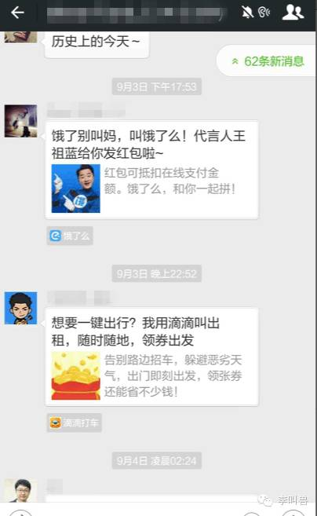

**试用机会：**

让用户可以提前试用产品，降低选择失败的时间风险

比如鞋子电商美捷步，允许顾客同时选购3个不同尺码的鞋子，并且免费退货其中2个。

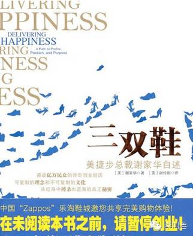

**营造熟悉感**：

比如根据用户过去的行为推荐，并说明——这是你习惯已久的产品。

###4**社交风险**

**风险来源：****用户使用了某产品后，担心自己会失去别人的认同，或者损失自己的形象。**

比如静心助眠口服液常年定位“更年要静心”，虽然产品有效，但是给人一种负面印象——“大众喝静心，我会被人觉得是犯了更年期症状。”

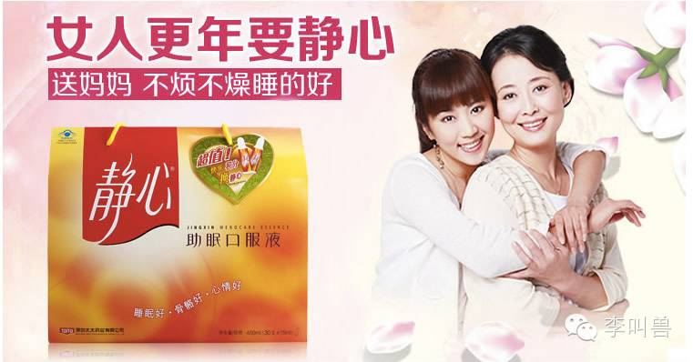

再比如零度可乐（无糖）曾经主打“减肥”，推广困难，因为当众喝零度可乐，会给人这样的感觉：

“瞧，那是个胖子，喝零度。”

**很多产品虽然功效很强，但是因为给它的消费者带来的负面印象，提高了他们的“社交风险”，从而销售受到限制。**

**那么怎么办呢？**

如果你参照一些营销成功的“功效型产品”，比如健身房，就会发现：

- 它们从来不会说“健身是为了减少肥胖”，而是会说“健身是为了拥有更好的身材”。

- 它们的广告中并不是饱受肥胖等身体问题困扰的人，而是身材超棒的健身达人。

- **它们呈现的并不是“健身前的问题”，而是“健身后的收获”。**

**所以，减少社交类感知风险的解决方案：扭转消费者对自身行为的归因，广告诉求变“消除负面”为“提升正面”。**

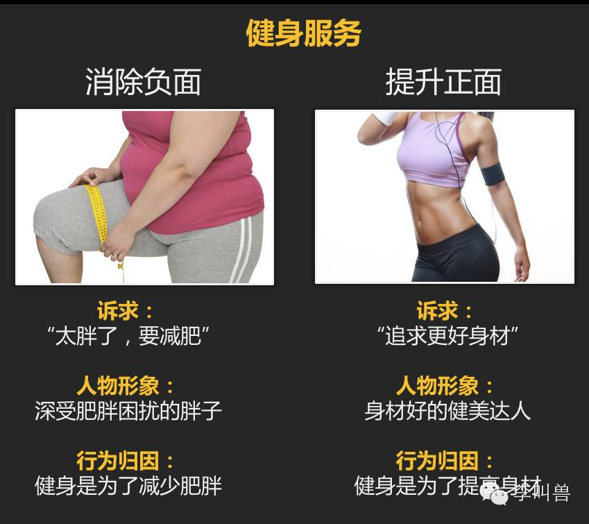

同样：

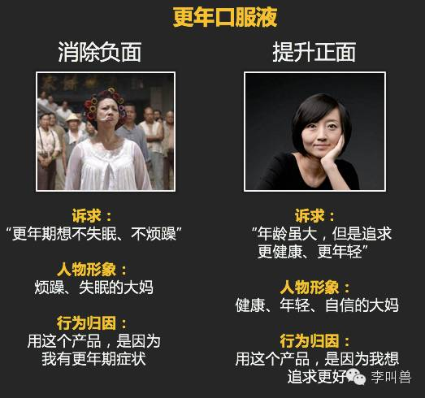

无糖可乐可乐消除社交风险，也可以这样：

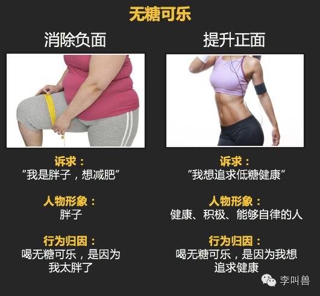

除了变“消除负面”为“提升正面”外，还有其他方式可以扭转消费者对自身行为的归因，从而降低社交风险。

比如小米手机初期喊“为发烧而生”，从而减少了购买廉价国产手机的“没面子感”，降低了社交风险。

**“我买小米不是因为我没钱，而是因为我是发烧友。”**

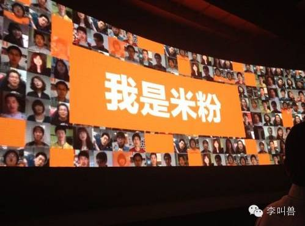

**总之，你需要仔细衡量：我的产品是否存在社交风险，可能会强加给消费者负面印象？**

如果有的话，你需要想办法减少，否则不论广告多么有创意，最终还是可能真实销量不高。

5**心理风险**

**风险来源：使用某个产品不符合消费者的自我印象，让消费者产生“内疚感”、“亏欠感”、“丢失道德感”等心理负担。**

常见于各种享乐型产品、奢侈品等，比如：

- 玩电脑游戏，我是不算太放纵了？

- 烟酒类产品，我太对不起自己了？

- 奢侈性消费品（豪华餐厅等），我太浪费钱了？

**常见解决方案：**倡导享乐、放松的感觉，减少消费者心理负担。

板城烧锅酒的广告：“板城烧锅酒，可以喝一点。”

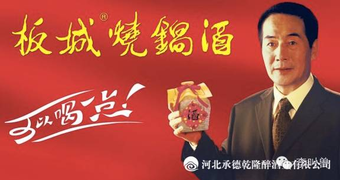

几乎所有的啤酒广告：爽快、放松、狂欢的感觉，减少心理负担。

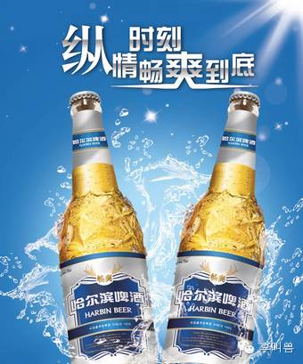

更贵的水饺，通过倡导“吃点好的，很有必要”，减少奢侈消费的心理负担：

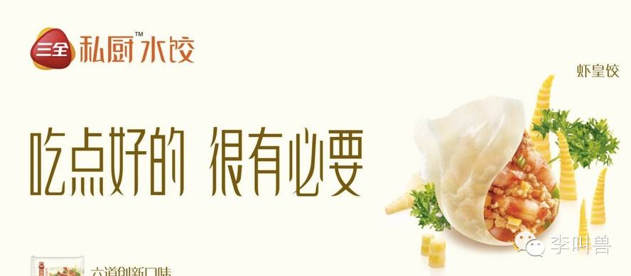

**结语**

**心动不等于购买。**

即使把所有的卖点都宣传给消费者，让消费者无比心动，也可能因为感知风险而放弃最后的购买，或者推迟购买。

“再看看吧……”

**这时候就需要重新回顾策略，问自己——我的产品规避了消费者的所有感知风险了吗？**

- **功能/健康风险**：他们担心功能不靠谱？担心有害健康吗？

- **财务风险**：他们担心这次会买贵了吗？

- **时间风险**：他们担心自己额外花时间吗？

- **社交风险**：他们担心买了之后有损形象吗？

- **心理风险**：他们买了之后有心理负担吗？

**引用文献：**

- D.E. Stern C.W. Lamb D.L. MacLachlan, (1977), "Perceived Risk: A Synthesis", European Journal of Marketing, Vol. 11 Iss 4 pp. 312 - 319
- Johan Bruwer Miranda Fong Anthony Saliba, (2013), "Perceived risk, risk-reduction strategies (RRS) and consumption occasions", Asia Pacific Journal of Marketing and Logistics, Vol. 25 Iss 3 pp. 369 - 390
- Taylor J.W. The role of risk in consumer behavior. Journal of marketing, April 1974, Vol.38, issue 2, pp54-60.
- Vincent-Wayne Mitchell, (1999), "Consumer perceived risk: conceptualizations and models", European Journal of Marketing, Vol. 33 Iss 1/2 pp. 163 – 195