#【李叫兽方法】一张图教你发现用户的痛点

“要找到用户的痛点！”

无数营销人产品人每天都在问这个问题。

今天，李叫兽就用一张图，讲一下如何利用已有的信息，找到用户的痛点。

**首先，我们先定义下什么是“痛点”。**

毕竟，克劳塞维茨说过：

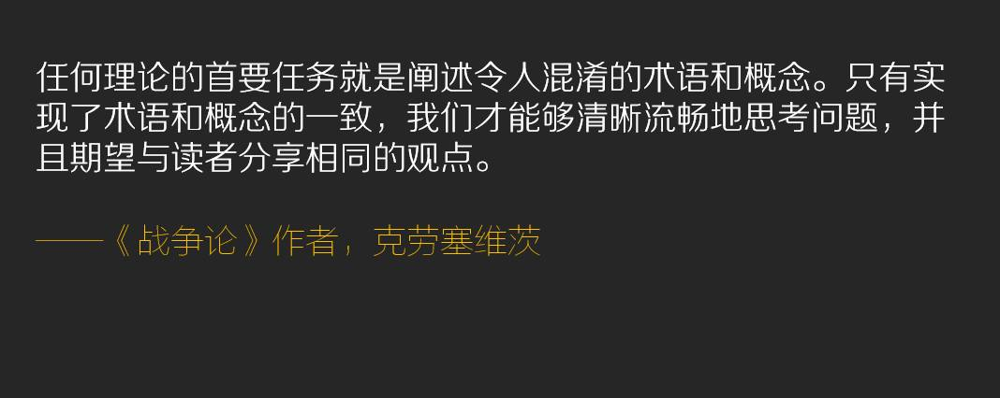

**本文讲的“痛点”，就是指让目标用户付出某种行动的最大阻碍。**

比如在美图秀秀之前，大部分图像处理软件（比如PS）都专注于提高处理图像的性能，这个时候，让用户使用图像处理软件的最大阻碍是什么呢？

我想可能并不是图像处理的性能——对大多数人来说，PS的性能已经足够好。

**这时，让用户使用图像处理软件最大的阻碍可能是易用性，因此“易用性”可能就是痛点，而抓住这一痛点，专注于提高易用性的美图秀秀就取得了初期成功。**

好了，那么如何像当初的美图秀秀一样发现用户的痛点呢？

**其实，只要你具备了基础信息，画一张图就够了。**

**首先，画一个横向的箭头，把用户使用图像处理软件的全过程：**

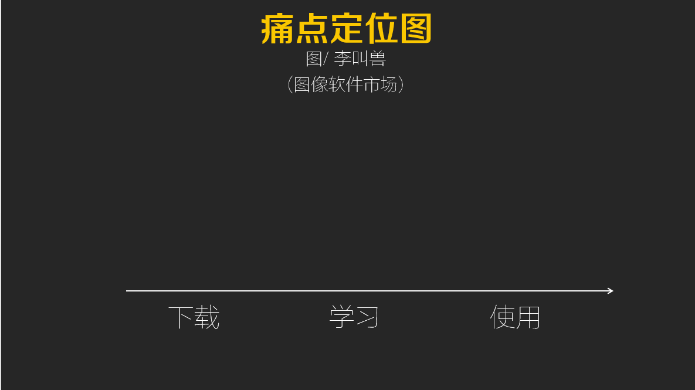

上面应该是一个正常用户使用图像处理软件的全部过程：先下载，然后学会怎么用，然后使用它做图片。

**然后，你需要找出在每个阶段，影响用户行为的关键因素有哪些？**

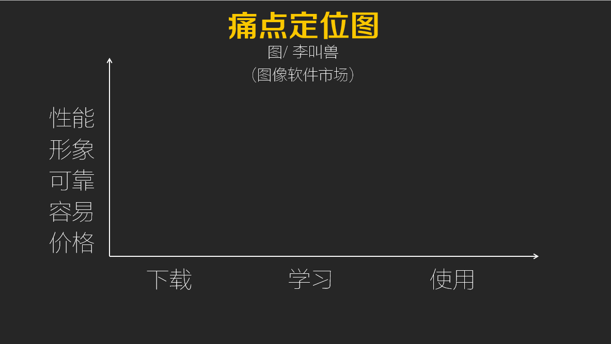

一般来说，可能影响用户行为的因素有：

**性能/效用**：这东西能不能达到我想要的效果？

**形象：**是不是符合我个人形象的？

**可靠：**是否存在风险？是否用起来不稳定？

**容易：**做出该行为是否很容易、不需要思考？

**价格：**做出该行为花钱多不多？

**接着，你先把过去市场上产品聚焦点描成“橙色”：**

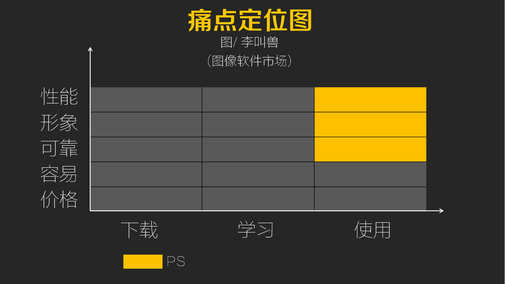

如果具备行业的了解，你就会发现：过去，以PS为主的图像处理软件专注于提高性能和可靠性，同时能够帮助它的使用者塑造“专家”的积极形象。

这个时候，你就需要问自己这样一个问题：

> **在图中的15块方格内，阻碍用户的最大因素是什么？（也就是痛点）**

你就会发现：下载、学习和使用3个过程都不够容易，而且在下载过程，往往需要付出价格。

（如果不知道，可以进行简单的用户访谈。）

**然后，你就可以定位用户痛点了：**

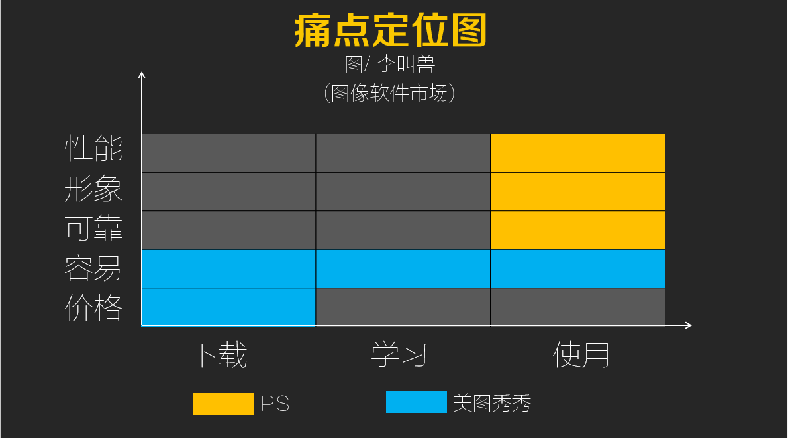

**为什么我们需要不停地寻找痛点？**

**因为用户需求和行业都在不断变化，过去被所有人“想当然”认为是痛点的属性，很快可能就不再是痛点，而这时在大多数厂商一窝蜂聚焦于“曾经的痛点”时，你挖掘了新痛点，就可能逆流而上。**

大多数人的思维是“基于原有的问题，我的解决方案是对的吗？”——“如何比别人更好地提高性能？”

而“寻找痛点”则是考虑“我是否提出了正确的问题？”——“提高性能是不是一个好问题？如果不是，应该问什么新问题？”

**所以，寻找用户痛点的过程，往往意味着“提出新的问题”，而不是“原有问题提出正确的解决方案。”**

如何寻找？你可以用上面讲过的方法，画出用户的整张“痛点定位图”，寻找对用户的最大障碍来源。

##1

纵向寻找
**在同一个过程中，纵向寻找阻碍用户的最大因素。**

比如过去的胰岛素（病人买回家自己注射，用来治疗糖尿病）市场，大部分公司的聚焦点在于使用过程中的“性能”和“风险”，致力于研发更高纯度、更高稳定性的胰岛素产品。

这在过去是合理的，因为比起纯度10%的胰岛素，纯度50%的胰岛素显然更能解决病人问题。

但是随着大部分知名品牌胰岛素纯度都提高到99%以上，继续提高0.1个百分点的纯度虽然耗费巨额资金，但是对消费者的使用却影响甚微。

这个时候，同类品牌都加入了胰岛素纯度的竞争（类似现在手机轻薄、屏幕等竞争），而Novo Nordisk却重新问自己这个问题：

> **此时，阻碍消费者使用最大的因素是什么？**

然后它发现其实并不是“性能”和“风险”，而是“形象”和“容易程度”。

- 形象：胰岛素消费者其实都不想让别人知道他们是糖尿病。
- 容易：过去的注射器非常麻烦，需要提前消毒并且注射。

**所以他们转变了战略的聚焦点，不再花费大量精力提高纯度和稳定性，而是帮助消费者提升形象和容易程度。**

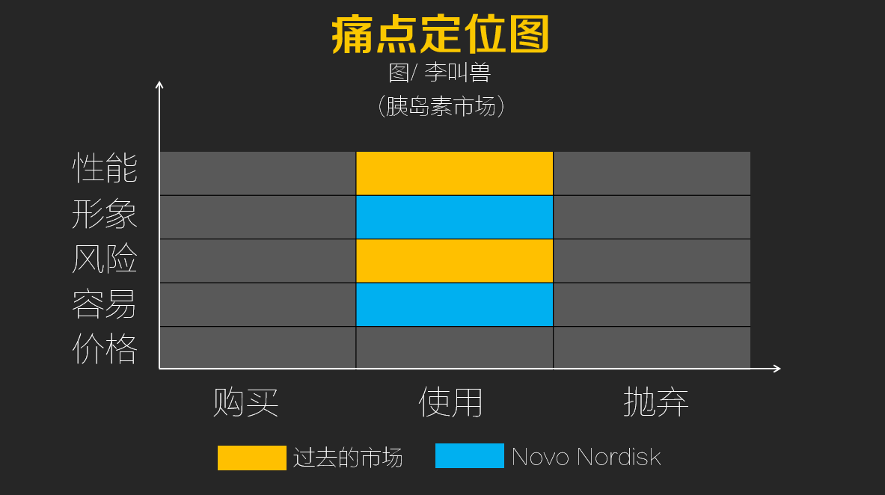

最终，他们研发出了这种“笔形”的胰岛素，不容易被识别，帮患者遮盖了“糖尿病人”的形象，同时不需要用针注射，提高了使用的容易程度。

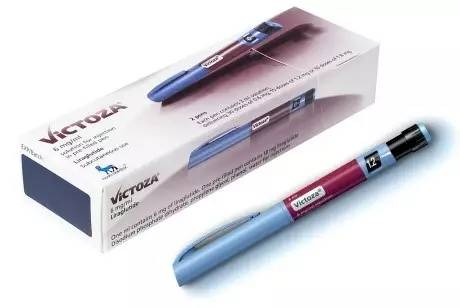

所以，纵向寻找痛点，你需要先找出影响某个环节的全部因素，然后看哪个因素是消费者现在的最大阻碍。

##2

横向寻找
**你还可以横向寻找：如果所有的竞争者都在关注用户的“使用”阶段，那么我可能应该看看其他阶段有没有痛点机会。**

比如汽车行业，用户前后经过了购买、使用、修理、抛弃（转售）这几个环节。

而在大众甲壳虫之前，欧洲所有的汽车公司几乎都聚焦于用户的“使用环节”。为用户造出性能越来越好、也越来越让人有面子的汽车。

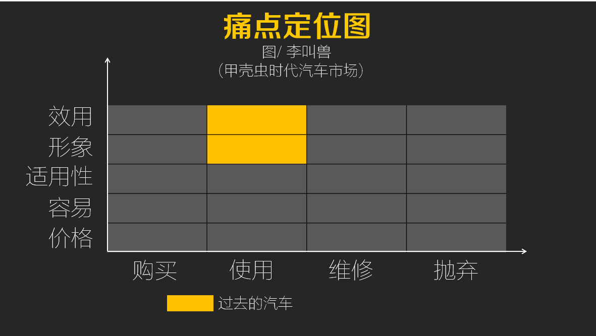

而甲壳虫却发现：这并不是当时对用户的最大障碍。因此适当降低了在使用阶段“效用”和“形象”上的投入，转而优化所有阶段的容易程度，同时提高使用阶段的适用性（适应更多的路面情况）。

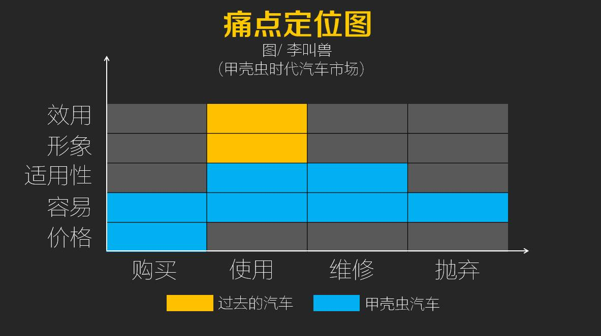

因此大众造出的甲壳虫外观常年不变，也不能让开车的人更有面子，但是容易买到（销售渠道）、容易驾驶、维修方便（因为使用了标准化配件）同时容易转售（因为样子常年不变）。

再比如，70年代在美国主打性价比的汽车品牌，在痛点定位图上是这样的：

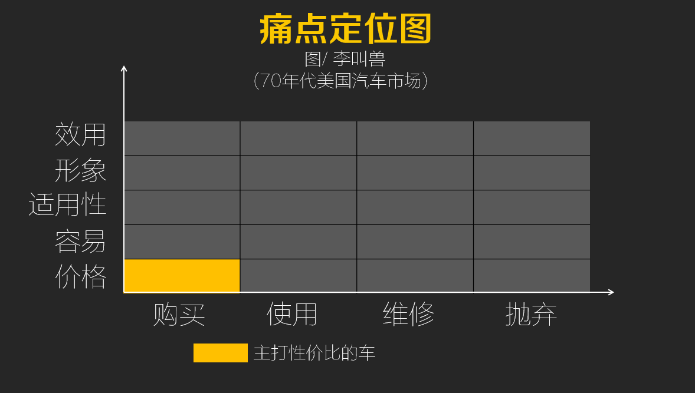

这个时候如果问：**价格敏感用户的最大阻碍是什么？**

就会发现这个关键阻碍并不发生在“购买阶段”，而是发生在“使用阶段”——因为石油危机，不论买的车多便宜，高昂的油价让人“买得起开不起”。

所以，主打省油的日系车大举进入美国市场，大获成功。

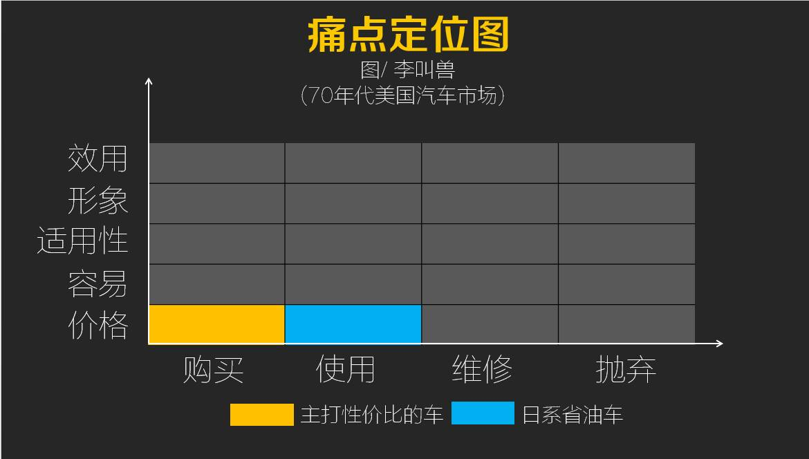

所以，寻找痛点时，可以问自己：**消费者用我的产品分为哪几个阶段？现在哪个阶段是他们的关键障碍？**

比如过去中国的手机市场是渠道为王，手机厂商几乎一半的利润分给了渠道商。通过大量的渠道，手机厂商提供了购买的便利性：

> **“消费者随时随地都能买到手机，可以拿在手上一一比较，而且可以当场买走，不用等待。”**

那么同样是1000-2000价位的手机，消费者的主要障碍发生在什么阶段呢？

其实很容易发现，**主要障碍发生在使用阶段（2000的手机性能太差），而不是购买阶段（想要很便利地买到）。**

所以这就是最初的小米手机，大部分厂商努力的重点在渠道（“购买阶段”），小米的努力重点在产品性能（“使用阶段”）。

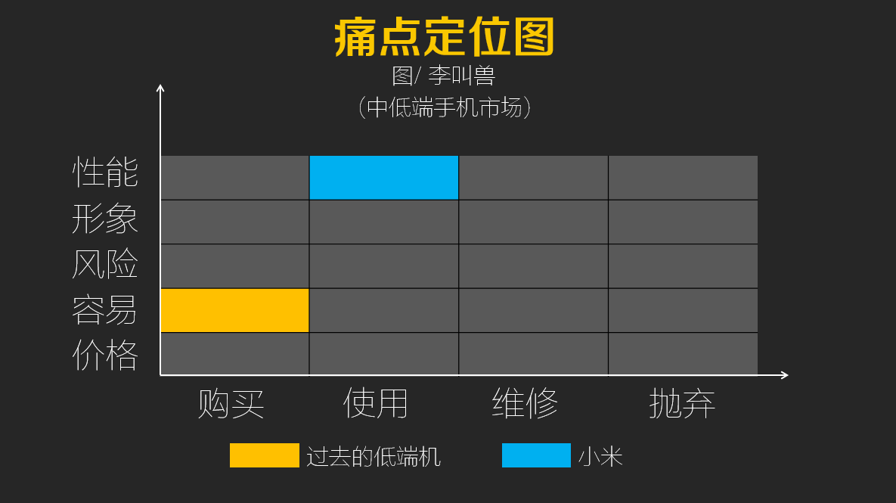

**不光可以用于寻找产品痛点，还可以用于文案痛点**

比如肯德基搞过一个在线优惠活动，文案如下：

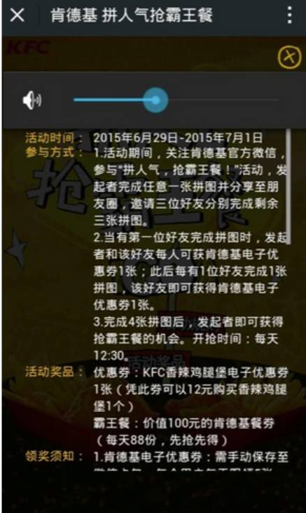

如何分析这个广告呢？

**首先我们先列出消费的行动过程：先看到文案，然后参加活动。**

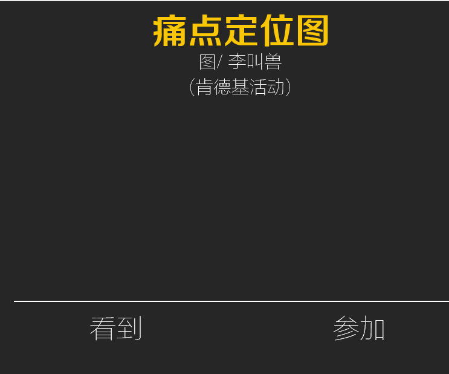

**然后找出每个阶段的主要驱动因素，比如：有兴趣、很容易做到等。**

就会发现这个文案的聚焦点在于：提高活动的吸引力，让人产生兴趣（比如足够的优惠）。

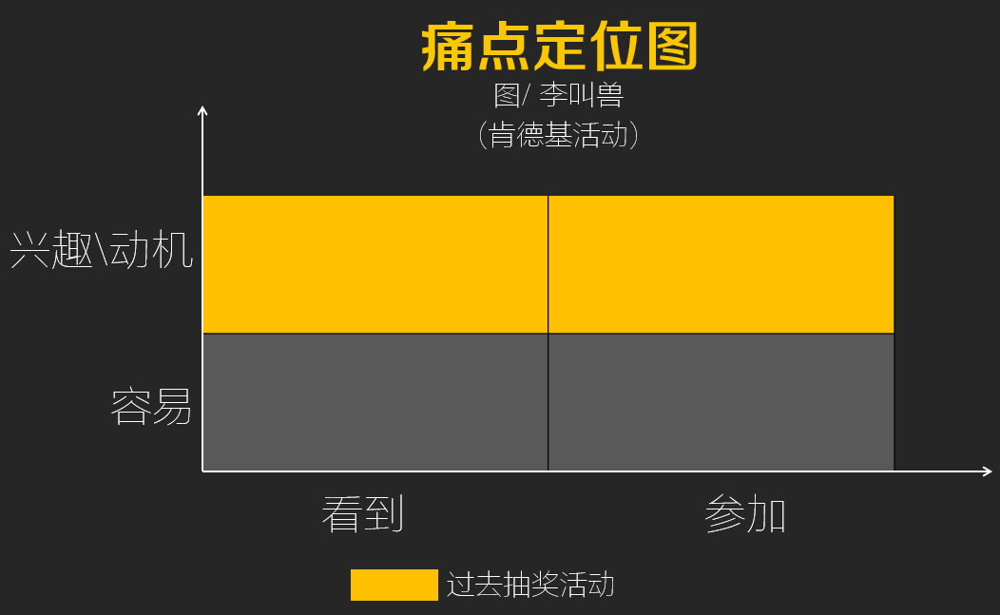

**但是如果问：现在限制消费者参加活动的关键因素是什么？**

答案应该是：整个过程太复杂，不够容易。

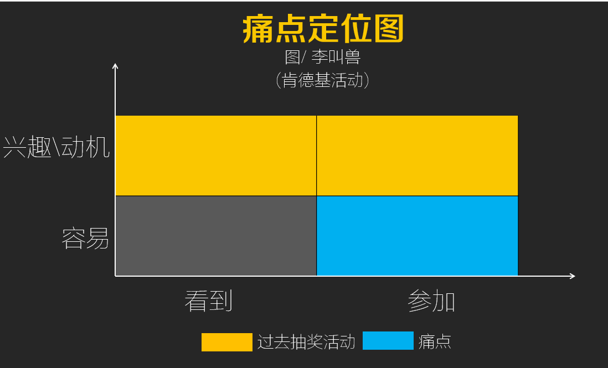

**这就意味着：刺激人参加活动，痛点应该是“降低复杂性”，如果不降低复杂性，一味提高奖励可能也没有作用。**

灵活运用方法，还可以换一种方式，分析文案的有效性。

**比如这个公益广告文案“真正的男人，不需要海豹鞭”。**

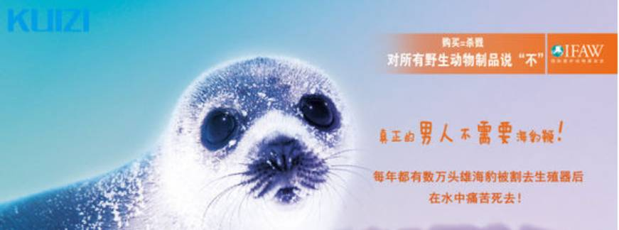

首先，我们先看人认知这一广告信息的过程

**注意：**注意到这个信息，激发了头脑的相关联想。比如看到“壮阳”联想到“性”等印象。

**理解：**理解这个信息的意思。

**信服：**信服刚刚所理解的信息。

**刺激行动**：因为信任这个信息而改变了行动。

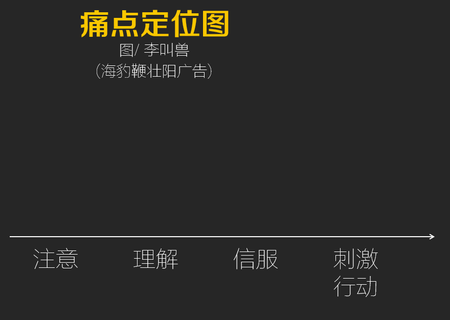

**然后我们在纵向写上广告想要让人接受的信息。**

比如“真正的男人不需要海豹鞭”实际上包含2层信息：

- 海豹鞭被认为可以壮阳；
- 吃海豹鞭的不是真男人。

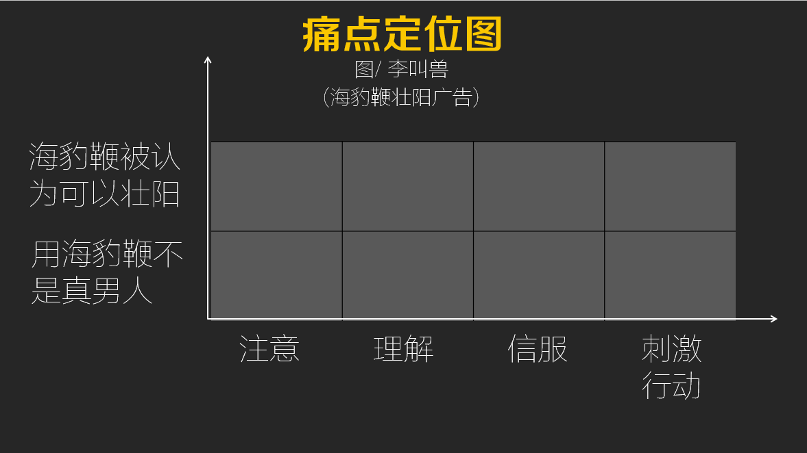

然后把这个广告产生的所有影响涂成橙色，就会发现是这样的：

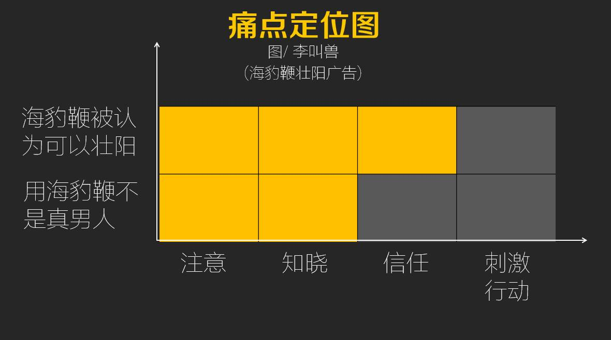

“用海豹鞭不是真男人”这个信息缺乏说服力，基本上只是引起了注意并且让人理解。

**然而，通过隐含“海豹鞭被认为可以壮阳”这个信息，让很多本来没听说过海豹鞭的人，第一次知道了海豹鞭可以壮阳，并且更加信服**（否则怎么会打广告说不要吃呢）。

所以，这个文案很可能会起到反面效果——为海豹鞭打了广告。

毕竟，如果是海豹鞭销售公司的广告文案，估计也可以这么写：

真正的男人不需要海豹鞭但，如果你没有他们那么强请联系我们购买：XXXX.com

这也是为什么自杀相关的新闻曝光后，自杀的人会变多。

总之，既然文案是为了改变用户的行为，那么设计文案的时候也要分析：

**限制用户改变行为的关键障碍是什么？**

**改变用户的某个习惯**

除了产品设计、文案设计，其实几乎任何一种涉及改变的活动，都需要分析痛点，找到影响对方的关键障碍。

比如假设你想帮助人戒烟，那么首先列出吸烟的全部过程：

然后列出每个过程对应的影响因素，比如：

**效用：**给人带来正面体验；

**形象：**提升形象；

**风险：**是否有风险

**容易：**过程是否容易做

**价格：**是否需要花费很大成本

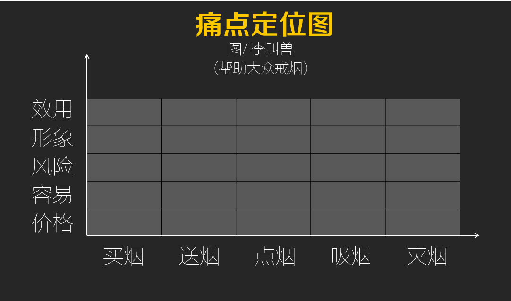

找到了这个矩阵，你就会发现过去几乎所有的戒烟干预方式，都聚焦于“吸烟”这个过程，而且是“吸烟”的风险这个过程：

（强调：吸烟有害健康）

比如这个创意广告：

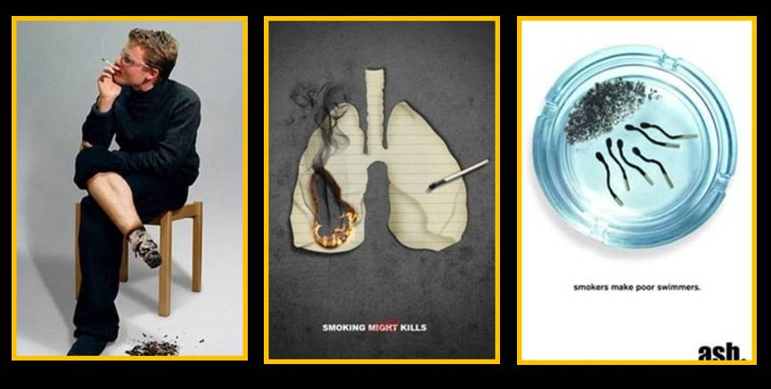

而其实可以有效干预的痛点有很多：

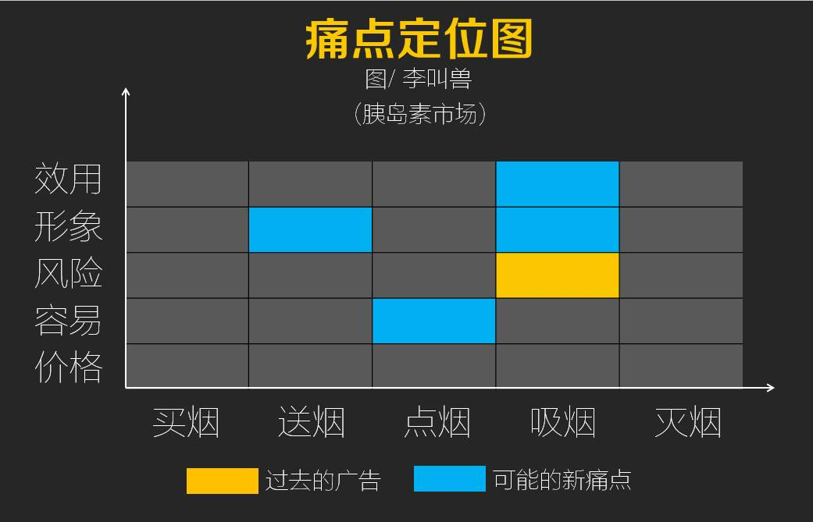

比如降低送烟的形象，想办法让送烟变成一种丢脸的行为。

比如降低吸烟的效用，让大众相信吸烟其实并不会提高注意力，等。

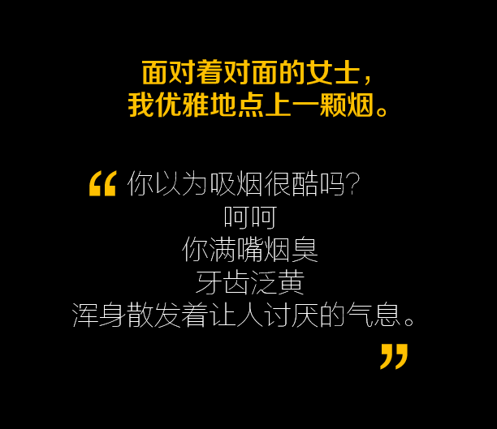

**甚至，构思这篇文章本身，李叫兽也在定位痛点：**

我的目标是让读者更多地学会如何定位用户的痛点。

**首先，我列出了定位用户痛点的过程：**

收集信息、了解哪些感受可以改变行为（心理学理论）、综合利用信息和理论。

**然后每个过程，都需要让读者“想要”这样做，并且“容易”做到（讲技巧）。**

最终，我发现读者看文章只有3分钟时间，不可能把所有的心理学理论概括清楚，也讲不完用户调查方法。而且发现大部分人的关键问题并不是信息或者知识太少，而是没有巧妙地利用这些知识。

**所以把这篇文章解决的痛点定位成了最右下角的一部分：**

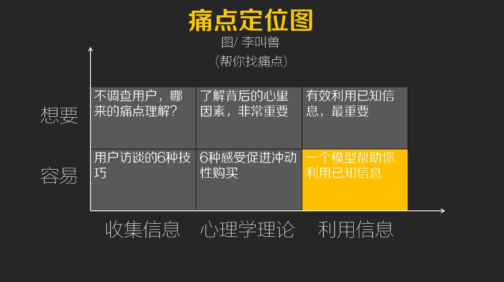

**结语：**

很多人没有找到用户的痛点，并不是因为欠缺信息（比如不知道用户怎么想的），而是没有有效地利用已有信息。

而如果你重新思考自己已经知道的，分析用户的每个动作过程，就会发现：痛点更容易找到！