#【李叫兽】创业如何回答：如果腾讯做了你怎么办？
原创 *2015-07-14* *李靖* [李叫兽](https://mp.weixin.qq.com/s?__biz=MzA5NTMxOTczOA==&mid=207716205&idx=1&sn=1a7185fa3b44cf108f6e4eba4c864f64&scene=21&key=3182596f85c59795ca016a2d68226100096c616797607e311041865747e6c5a0ccf3aac9179a4025580f6cb4f36b88bb3f5ad491da403cb91ee28ba2416f2c7ffc6e8e440ebec64c8191b49021d26d12&ascene=7&uin=MTc4OTM3ODkzOA%3D%3D&devicetype=Windows+7&version=6203005d&pass_ticket=V5w3mkkLQcmNI8VtqJK0C1erJipHSMkFDXxkSrQt9dQbXsQ8haTP3Q1NJmbFLNhV&winzoom=1##)

> 原文链接：http://mp.weixin.qq.com/s/sEU3uCLzzNzUUDbY72xMfg

前段时间，突然在知乎上看到这样一个问题：

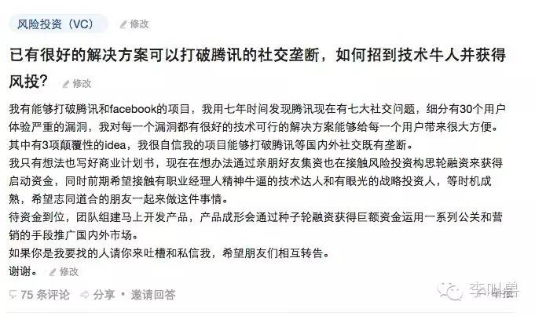

不禁感叹：现在的“民科”真是牛逼！

他们不光进入自然科学领域去证明哥德巴赫猜想和造永动机，还跑来了商业领域去颠覆微信。

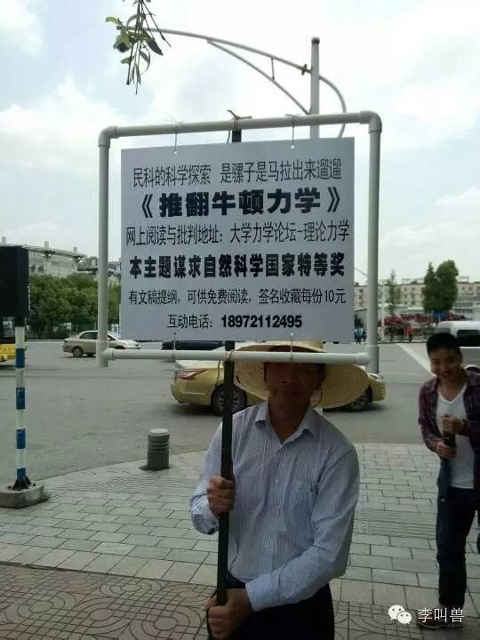

所有人都知道：他很可能无法颠覆微信，即使他招来了程序员并且拉到了风投。**因为如果他的想法仅仅是基于别人体验的漏洞，那么不论他使用什么策略，腾讯都可以比他更低成本地跟进它的策略。**

所以，在创业中，我们最害怕被提问的问题就是：

**如果腾讯做了这个，你会怎么办？如果XX做了，你会怎么办？**

好像，这样的问题是无法得到回答的，因为大公司总是有各种力量来打败你，总是有更多的资源来仿照你。

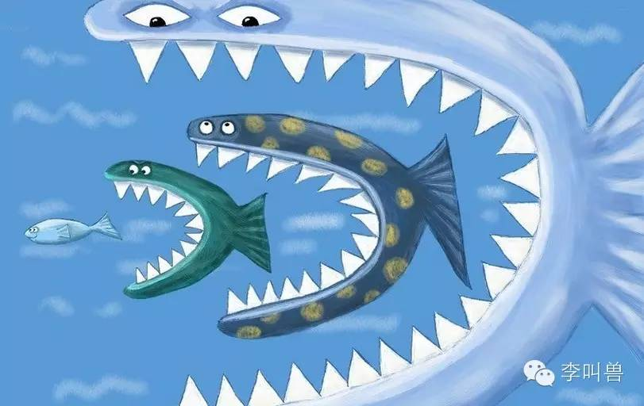

但是这样无法解释为什么不论有多少大公司围追堵截，仍然有创业的成功者，仍然有人在资源不足、人手不够、势力不大的情况下开启伟大的事业。

今天我们就讲讲如何创造竞争壁垒，让别人几乎没有办法模仿你。

创造竞争壁垒的关键就在于：

**让你的竞争对手不想、无法、难以跟进你的策略。**

###1**选择对竞争对手吸引力不强的领域**

如果你的选择对市场上主要的竞争对手诱惑很大，你显然难以得到成功。

比如上面的例子中，微信本身就专注于改进自己的产品，而如果你真的提出了对微信的改良策略，那么微信就会立马模仿你：你的改进策略对它的吸引力太大了。

**所以你首先应该研究并不是：行业第一正在做什么。**

**而应该研究：行业第一不想做什么，行业第一不重视什么。**

美图秀秀如何在图像处理行业颠覆Photoshop呢？

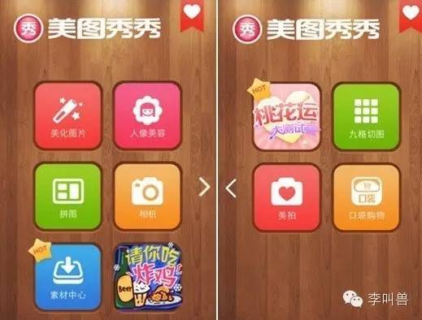

首先先看Photoshop重视什么：Photoshop重视自己极致的图像处理能力，其图像处理能力几十年来一直是行业标杆，通过售卖软件授权来获取利润。

那么PS不重视什么呢？

**既然它重视的是质量和价格，那么相对不重视的自然是“为易用性牺牲功能”和“不想付费的用户”。**

所以美图秀秀的策略就很明显了：其图像处理的智能虽然不如PS，但是因为更加易用简单和廉价（免费），吸引那些因为难学难用以及价格等原因不得不放弃PS的人。

对这些人来说（比如微信朋友圈秀照党），美图秀秀的修图能力虽然不高，但是总比没有要强。

所以，美图秀秀选择这个市场去进攻，自然对PS缺乏吸引力，因为美图进攻的是PS根本不在意的市场——**那帮不想学习P图，而且不愿意付费的人。**

**只有当你的策略对市场上强大的竞争对手缺乏吸引力时，你往往才有一战之力。**

你要进攻的，并不是主要竞争对手擅长并且想要的市场，**而是他们不屑一顾、对他们毫无吸引力的市场。**

就像棒球高手威利·基勒说的：敌人不在哪里，就在哪里打败他们。

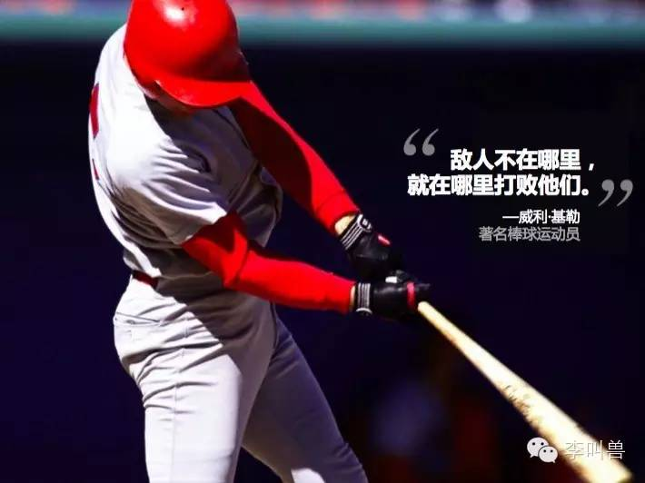

所以，如果你想颠覆腾讯，就要做腾讯一般看不上的市场或者。

我们知道腾讯等主要互联网公司看重的庞大的用户量，并且提供标准化的服务，而不是利润率（所以他们走免费模式）。

那么，可能相对小众但是高利润的市场，并且提供定制化的服务，估计就是它们不太看重的。

###2**让竞争对手损失利益才能跟进**

如果主要竞争对手跟进你的策略不得不损失一部分既得利益，他们往往就会不跟进你的策略。

脉脉是职场社交APP，它推出了“发现二度人脉”的功能——你可以看到自己朋友认识的人，并且直接加“朋友的朋友”为好友。

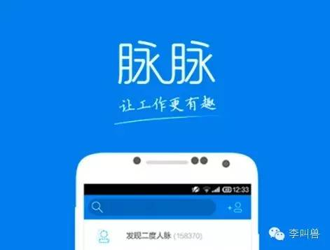

比如你好友通过二度人脉搜索，发现你竟然认识“李叫兽”，就可以直接加李叫兽为好友。（关系网无所遁形啊）

那么微信会不会跟进这个策略呢？当然不会。

这个功能非常好玩而且实用，但是微信一旦跟进了这个策略，就意味着放弃了自己“私密社交”的定位。

这样一大批微信用户就会骂：天啊，有了二度人脉功能，我勾搭一个美女都被老婆发现了！

所以，脉脉创造了一些微信无法跟进的功能，也就有了自己相对于微信的生存空间。

**再比如细分领域的电商网站“唯品会”，到底是定位“特卖网站”还是“卖衣服网站”呢？**

定位“特卖网站”的话，**就意味着网站上所有的商品必须是“特卖抢购”的模式，将来即使延伸业务卖家具，也是用特卖闪购的方式来卖。**

定位“卖衣服网站”的话，**就意味着网站上所有商品聚焦于衣服，将来即使加入非闪购的特卖的功能（比如像京东一样搜索购买），也是卖衣服。**

实际上，唯品会定位的是“专门做特卖的网站”，而不是“专门卖衣服的网站”。

为什么呢？一个很重要的原因是：**如果定位成卖衣服的网站，其他所有的竞争对手都可以0成本跟进它的任何策略，比如京东和天猫。**

它入住了一个新的潮流品牌，京东天猫也可以公关这个品牌去入驻；它降价促销，京东天猫也可以降价促销；它搞了微信发红包集赞的创意活动，京东天猫也可以搞。

当你的策略可以被竞争对手迅速跟进的时候，这个策略就只能让你“热闹”一阵，而无法提供持续的竞争力。

**而如果定位成“特卖网站”，京东和天猫等主要的竞争对手就无法跟进了。**

因为用户登录一个网站一般都有固定的使用模式，比如当你登录微博，自动就是滑动滚轮浏览微博，等你登录百度，自动就是输入关键词进行搜索。

京东通过长时间的营销，也让用户形成了使用京东的基本模式：登录jd.com，搜索想要的商品，迅速加单购买，然后等着第二天送到家。

**而如果京东跟进唯品会的“特卖模式”，就意味着要改变自己数亿用户的习惯**，让他们变成“逛逛，看看哪家店在搞特卖”这种模式。

这样的改变是京东无法做出的，因为这相当于让它放弃“既得利益”——过去用户使用京东的模式。

所以，**京东无法跟进唯品会的特卖功能，这也意味着唯品会围绕“特卖”功能使用的任何策略，京东都无法跟进**——比如策划一个“微信摇一摇闪购大会”等。

总之，如果你的竞争对手跟进你的策略，就不得不放弃一些既得利益，那么它们往往就不会跟进和模仿你的策略。

###3**建立先发优势**

如果你能基于自己的策略，迅速建立先发优势，成为大多数人的选择，那么后期即使有强大的竞争对手进来模仿，你也往往会站稳位置。

因为大部分人在选择商品时，并不是仔细比较各个商品的优劣，而只不过是看周围大多数人用什么。

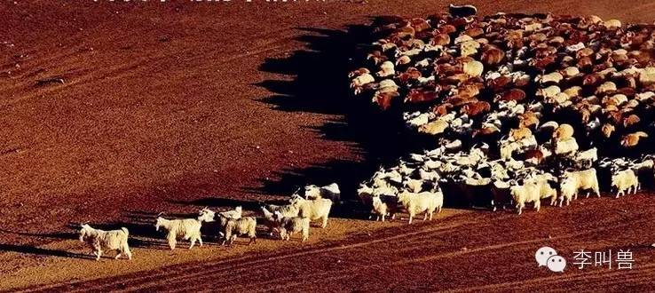

一个心理学实验几乎完美地模拟这个现象。

心理学家选择了48首歌曲，先找了几十个人当对照组，对所有歌曲的好听程度进行打分，不过所有人都不知道其他人的打分。

**用这种相对客观的方式，测出一首叫做《锁定》的歌曲排第26名（中庸的歌曲）。**

然后再找来几百个人，把他们分成十组，再对这48首歌曲进行打分。不同的是，这次模拟的是真实的社会情况，被打分较高的歌曲会显示好评和热度，这样后来听歌的人在听歌前就能看到其他人对这个歌曲的评价。

**结果这首排名中庸的歌曲竟然在其中一个组排名第一，而在另一个组排名第40（几乎倒数）。**

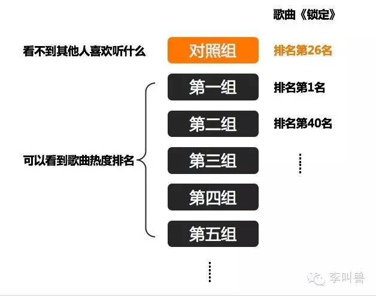

也就是说，**大众对歌曲的评价更多依靠的是“其他人怎么看”，而不是“自己判断是否好听”。**

所以只要这个歌曲在某个组恰好被前几个听的人打了高分并推荐，那么后续的人也会打高分和推荐。

只要被前几个听的人打了低分，那么后续的人可能就不会听了。

这就是为什么同一首歌曲，在有的组排名第一，而在有的组排名第40。**并不是因为质量差异，而是因为“前几个人的选择”。**

所以先发优势非常重要，往往只要一个产品在导入期占领市场，**被人们认为“这是大家的选择”、“这是排名第一的品牌”，就更加容易在后期一直占据第一**（即使它并不是最具性价比的选择）。

比如在冲泡奶茶的市场，**香飘飘和具备巨头背景的优乐美（喜之郎投资的）进行激烈的竞争。**

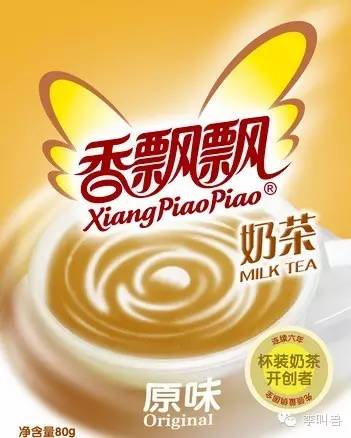

香飘飘在营销投入、渠道资源等各个方面都处于劣势，唯一的优势就是它做的比较早，所以前期的销量高一点。

所以香飘飘的策略就是极大地宣传这一优势——“奶茶连起来可绕地球X圈”，暗示这是大多数人的选择。

而优乐美却用了“你是我的优乐美”这样情感暗示的口号，最终被香飘飘打败——大部分用户并不是选择最具“情怀”的产品，而是选择“人们买的比较多的产品”。

所以，在行业初期迅速建立先发优势，并且传达“我是销量第一”“我是最多人的选择”这样的信息，往往可以阻挡后续强大竞争者的进入——即使他们生产了更好的产品。

**怪不得视频网站们都这么宣传：**

###4**拥有独占的资源**

这个是被最多人谈论的竞争优势，如果你拥有别人没有的某个资源——不论是关键的专利技术、强大的现金流、海量的粉丝，还是拿到了一块风水宝地，都可以创造竞争壁垒，减少别人模仿你的可能性。

比如罗永浩做手机，虽然没有先发优势，也没有让小米无法跟进的策略，**但是拥有一项独占的资源**——老罗的粉丝，从而也在激烈竞争的市场上占据了一席之地。

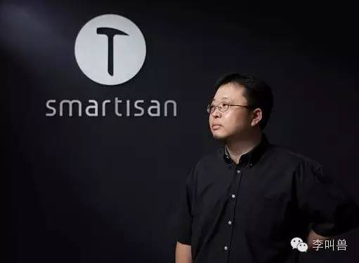

不过要注意的是，**只有当一个资源存在“独占性”的时候，这个资源才能给你提供持续的竞争优势。**

如果别人也能低成本的融资，那么“有钱”就不能给你提供竞争优势；如果别人可以绕开某个专利或者轻易组建自己的研发团队，那么“技术”就不能给你提供优势。

所以，文章开头的那几个“想法”其实并不能为这个创业者提供持续的竞争优势，因为“想法”本身不具备“独占性”。

不过，“独占的资源”这个路径，有点无聊，体现不出策略价值，所以李叫兽就不做过多讨论了。

###5**塑造协同的体系**

**塑造一整套协同的体系，让别人无法通过单独模仿任何一个环节而成功。**

就比如小米创造了一整套协同的体系，其中包括低成本的生产模式、高参与感的营销活动、迅速反应的团队、强认同感的粉丝群体、丰富的软硬件产品线等等。

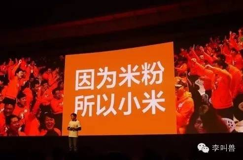

这些模式互相支持、互相加强，共同塑造了小米公司的竞争优势——**这就导致了你无法通过模仿其中任何一个环节来超过甚至接近小米。**

比如你可能尝试去模仿小米的文案风格，突出参数和性价比，以为这样就可以更加容易不被小米甩下。

但是你不知道的是：小米的文案与其商业模式有高度的协同性。

它的文案，协同的是自己“高性价比、优质性能”的产品形象——通过大量强调硬件参数，把大众的关注点从“外国货VS国产”以及“高端品牌VS低端品牌”转移到小米更加擅长的性价比上。

**而你并没有这种强大的形象，这就意味着小米的文案策略对小米是用处最大的，你仿照过来，用处就会降低。**

那像其他厂商一样，继续降价呢？小米卖799，我直接赔本卖499。

这同样无法超越小米，因为**价格战胜利的关键并不是“谁的降价决心大”，而是谁能在成本上进行领先。**

而你的成本相对小米又几乎没有什么优势（小米控制了更多的供应商、可以靠粉丝效应低成本营销等），这就意味着你几乎不可能长期取胜。

**学习粉丝经济、学习低成本战略、学习牛逼文案：很多小米的竞争对手都想通过模仿小米的某个环节来战胜小米，但是基本成效很低。**

因为小米设计出来的任何一个业务关节，都是对小米最有用的，用到你身上，用处就会降低

所以，如果你设计出一个环环相扣的体系，就会让竞争对手无法靠单独模仿其中任何一个环节而超过你。

就像猎豹长着独特的抓牙而冲刺速度飞快，而一只也想跑很快的山羊，通过嫁接这样的爪牙，就能一样速度飞快吗？

实际上这样是不可能的。

**猎豹加速飞快不光是因为爪牙，还因为脊椎骨容易弯曲从而可以跳跃式的加速奔跑，而这样的爪牙就是为了这种奔跑方式而设计的。**

那为什么山羊不像猎豹那样，也弯曲脊椎骨，从而跑得更快呢？

那是因为山羊做不到。猎豹只食用肉食，牺牲了对素食、野草等的消化能力，从而缩短了肠道，让腹部很容易弯曲、运动。而山羊主要依靠这些野草来生存，如果进化出非常短的肠道，它首先就会饿死。

所以，猎豹的启动速度是由锋利的爪牙、细长的腿部、腹部弯曲而且细长（牺牲了对野草的消化能力）、高发热量（牺牲了长途奔袭能力）等一些列的环节共同造就的。

**其中的每个环节都是最适合这个猎豹的，放在山羊身上效用就会降低——这就意味着山羊无法依靠模仿任何一个孤立的环节（比如爪牙）而超越猎豹。**

所以，你模仿了小米的文案，也不会为你打败小米提供任何优势。

模仿了杜蕾斯的微博，也不会为你打败杜蕾斯提供任何优势。

模仿了Uber的“跟司机社交”，也不会为你打败Uber提供任何优势。因为“跟司机聊天”这样的设置就是为了Uber“低价&有趣”的专车形象而设计的，放到你身上效果会降低。

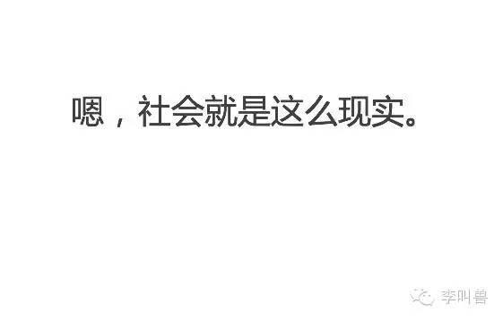

相反，如果你基于自己的优势，打造一套属于自己的协同化体系，别人也难以通过模仿你的某个功能而超过你。

比如神州专车并不是模仿Uber的“司机社交”，而是反其道而行之，定位“安全专车”，降低专车的社交属性。

**结语：**

“我想到了一个伟大的创意”，基本上没有什么卵用，因为竞争对手可以随意地跟进你的策略。

而真正能够给你创造竞争优势的策略，必然需要给你的竞争对手创造某种“壁垒”，让他们难以跟进，或者不得不放弃某些利益才能跟进。

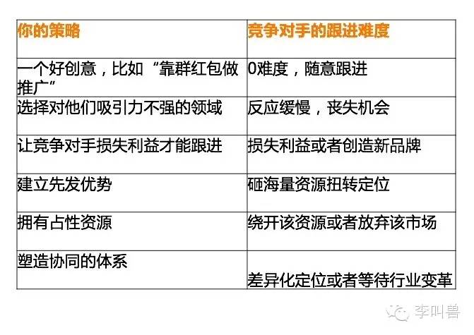

**【李叫兽】免喷声明：**

本文只带来启发，不提供解决方案。并不是说你用了某个策略，就一定胜利，也并不是说你没用某个策略，你就一定失败。

商业策略远远比上面的分析复杂，上面文章仅仅作为科普和启发，真正使用，你需要具体问题具体分析。