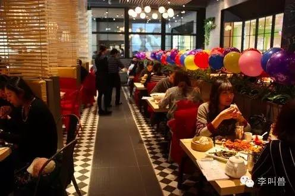

#【李叫兽】场景营销：互联网化不是搞个APP
原创 *2015-07-07* *李靖* [李叫兽](https://mp.weixin.qq.com/s?__biz=MzA5NTMxOTczOA==&mid=207492493&idx=1&sn=196c97c7d022730a8a19e0f0525d38fa&scene=21&key=3182596f85c59795cd498dc75c328eb85988422c159489ca4a73a9ff330a9ff837cf69d148ae70d355de8c67717999208a71c9da446a949fef6975eba2f8335628faf87c440ca0442f2c8550fbab47cc&ascene=7&uin=MTc4OTM3ODkzOA%3D%3D&devicetype=Windows+7&version=6203005d&pass_ticket=V5w3mkkLQcmNI8VtqJK0C1erJipHSMkFDXxkSrQt9dQbXsQ8haTP3Q1NJmbFLNhV&winzoom=1##)

> 原文链接：https://mp.weixin.qq.com/s/JHY6nSOFS0F-Ozd8VdvQuA

今天咱们谈谈：传统企业如何**互联网+**

几乎所有的传统企业都深深地感受到了互联网的威胁，纷纷投入资金要进行互联网网化，这样的企业就连我都遇到不少。

> “李叫兽，我是做餐饮的，现在准备进军互联网搞一个APP，快告诉我怎么做？”

**可是，谁说“互联网+”就是搞APP？**

**其实不搞APP，也可以互联网化，方法很简单**——像设计APP一样，把你的店面看成一个“场景”，用设计APP的思路，去设计你的店面。

当你在设计APP的时候，你真正设计的并不是代码和UI，而是一个“场景”，这个场景包含内容、社交、游戏、用户分享等行为。

同样，**当你在设计店面的时候，你设计的并不是装修和桌子，而是一个“场景”**，这个场景同样应该包含内容、社交、游戏、分享等行为。

**“不是要跟风做APP，而是要用APP思维重新设计的你的场景。”**
- - - - - - - - - - -

前几天，跟几个朋友去一家新派粤菜餐厅吃饭。

在等菜的过程中，我突然意识到一个问题：

**这个餐厅简直是浪费了人流量。**

餐厅好不容易把我们这些顾客吸引过来，结果简单吃顿饭就走了，岂不是浪费人流量？浪费客户？

**如果像设计一个APP一样，用互联网思维重新设计这个餐厅，给它加上内容、游戏、社交、跨界合作等，会怎么样呢？**

**首先，饭菜不应该只是饭菜，还应该加入内容。**

比如这道避风塘炒蟹，有什么故事、用什么原料，何不扫描二维码看一看？

担心顾客等待的时候无聊，可以在后厨放几个智能摄像机，设置成直播模式，让顾客打开手机，就能看到师傅正在炒什么菜。

**餐厅也不再是餐厅，而是互动。**

上菜的碟子上有二维码，扫描二维码，就知道是哪个大厨做的。一眼看到TA的故事、照片，顺便加一下TA微信，没准能勾搭一下，约TA周末来家里做一顿私房菜呢。

这样厨师估计也更有动力做出好菜，毕竟不能让别人指着名字批评吧？

**一个人来吃饭？没关系**。

本餐厅提供“约吧”服务，单身来的顾客可以请在场的美女帅哥服务员一起共进午餐。

然后就等着顾客晒朋友圈吧：“今天第一次和服务员共进午餐！”

**甚至餐厅的一切，都可以像MIUI一样根据用户的需求进行迭代。**

用户登录餐厅微信页面，可以对服务员的衣服进行投票，哪个投票最高，服务员第二天就穿什么衣服。（这个可以跟优衣库合作，他们非常喜欢搞这种活动）

甚至猜测的结果，都可以跟投米网（一家P2P）合作，利用旗下的“猜宝宝”产品，让大众去猜第二天投票最高的服务员衣服。

（注：本产品属李叫兽虚构PS）

猜中的人将获取最高的投资收益率。

**然后，餐厅也不再是一个餐厅，而是一个社交场所。**

微信扫描桌子上的二维码，可以看到之前在这个桌子上吃饭的人，以及他们主动晒出来的照片，还可以给他们留言。

当然，如果有什么想说的，也可以通过扫描这个二维码，在桌子上的虚拟空间留言，像漂流瓶一样被下一个来这个桌子吃饭的人看到。

**菜肴也不再是菜肴，而是游戏。**

上一道“求爱甜点”或者“众筹炸鸡腿”，用户扫描二维码，即可邀请微信好友帮忙付款，远程请客吃鸡腿。

届时，就会看到朋友圈有人分享：

“点进来，请我吃鸡腿！”

当然，远程请你吃鸡腿的人，可要求你发一张“吃鸡腿自拍照”……

**还有，吃饭也不再是吃饭，而是一个秀场。**

餐厅靠墙位置的独立区域，设置一个“直播桌”，桌子上摆着公开直播的智能摄像机，所有在这个桌子上吃饭的人，都能被万千网友通过实时直播看到。

作为回报，只要在这个桌子上直播吃饭，同时发挥吃货本能，一次性吃完超大份干炒牛河，就能免单哦。

以后，如果这个直播观众越来越多，保不准有些三线明星，为了出名而跑来专门直播吃饭呢。

好了，就到这里了（其实还有更多玩法）……

**所以，你的餐厅不只是餐厅，而是一个“场景”，在这个场景内，人们可以社交、玩游戏、秀自己、分享观点……**

但是大部分线下店和传统企业仍然不理解这一点，他们的思维还停留在“流量经济”时代，觉得只要想办法通过营销推广招来大批顾客，就可以了。

对他们来说，一个餐厅仅仅是一个餐厅，一瓶汽水仅仅是一瓶汽水，他们的营销任务只不过是让更多的人知道世界上有这么个餐厅或者有这么一瓶汽水。

在我眼中，这种行为无疑是在浪费人流量——你好不容易把人吸引过来了，吃顿饭就走了，不觉得可惜吗？

**“初学者在设计产品，而大师在设计场景”。**

那么如何精心设计一个场景，让它内容更加丰富呢？

**既然要像设计APP一样设计一个线下产品的场景，那么不妨先看看APP上设计了什么：**

1，有内容

2，有游戏

3，有跨界合作

4，有社交

5，有分享

6，有用户反馈权

###一有内容

几乎任何的APP都有内容，而不仅仅是空洞的功能。比如你在健身APP keep 上不光可以根据指导健身，还可以看到其他人的健身结果，还可以感受到健身的意义。

同样，设计线下场景，就要让参考APP的设计思维，**让产品不再是产品本身，而是提供意义、故事和内容。**

比如“多肉”只不过是一种再普通和廉价不过的植物，但是有人为它赋予了独特的意义：

智能体质分析仪，也不仅仅是一种测量体脂率的工具，而是宣扬一种意义：

**“我们对脂肪的态度也是对世界的看法”。**

从而催生了“脂肪派”、“脂肪主义者”这种亚文化族群。

西少爷餐厅也不再是餐厅，而是大学毕业生北漂的创业故事。

就连再平淡无奇的可口可乐，通过台词瓶的设置，也增加了“内容”，让可乐不仅仅是可乐，还是对某个经典电影场景的回忆。

任何一个精心设计的“场景”，必然是有内容的。人们真正消费的，可能并不是你的干炒牛河，而是其背后的故事、充满谈资的制作工艺以及吃一盘牛河所代表的意义。

所以，塑造场景，先多讲讲故事吧。

###二有游戏

APP上设计了很多互动游戏，同样，你也应该在**线下的场景中设计更多的游戏，以此来丰富你的场景，让用户“玩起来”。**

比如罗辑思维发布“真爱月饼”，设置“众人支付”的玩法，用户把月饼购买链接分享到朋友圈，可以让朋友每人3块5块，很快把几百元的月饼订单凑齐。

再比如优衣库在自己的门店中组织“搭出色”的活动。

在门店中设置一个巨大的镜像屏幕，用户站在屏幕前，屏幕会自动把人像扣出来加到屏幕的背景图片中（比如巴黎夜景）。

这样，用户可以秀自拍发朋友圈，说自己“在巴黎”。

所以，如果想丰富你的场景，何不加入更多的游戏，让用户玩起来？

###三有跨界合作

手机APP经常引入各种跨界合作，比如专注为女性大姨妈提供服务的“大姨吗”，可以跟任何与大姨妈相关的产品合作（比如新的姜茶发布），因为它通过APP成功塑造了女性考虑大姨妈问题的场景。

**同样，你的店面、产品既然塑造了场景，何不引入各种跨界合作？**

比如很多人用智能手环跑步，智能手环就塑造了“跑步”这个场景。在这个场景下，可以嵌入其他品牌的跨界合作——某智能手环跑步公里数可以兑换“天天酷跑”游戏的金币。

再比如用户喝可口可乐也是一个场景，为了丰富这个场景，可口可乐直接跟优酷跨界合作，共同推出娱乐性质的台词瓶。

优衣库的排队是一个场景，就跟人人网合作推出了“排队游戏”。

所以，你的产品不再是产品本身，而是一个场景，而在这个场景下，就有了跟其他品牌跨界合作的可能。

专车不仅仅是一种出行服务，更是塑造了一种乘车场景，这个场景自然要好好利用。

易到跟单读空间跨界合作，推出“单读车”，让用户在车上读书。

还可以跟花色优品旗下的午睡神器“睡小宝”合作，推出睡眠车……

甚至，罗辑思维联合创始人吴声讲互联网场景的新书《场景革命》本身，都是一个场景——一本书不再是一本书，而是一个读书的场景。

在这本书内，作者讲到了任何一个公司的案例（比如易到用车案例），就把该公司APP二维码附上，**读者扫描书页上二维码，就可以获得优惠券。**

（算了下，书里优惠券的金额远远超过书籍售价，哈哈）

还有，每个人甚至都可以打造自己的场景——你自己也不再是自己，而是一个场景。

比如我认识的一个韩国妹子娜娜，在手机直播APP花椒上直播自己吃韩国菜，结果引来了大批粉丝的关注。

接着她可以直接去跟很多餐厅跨界合作，像每个邀请她去直播吃饭的餐厅收取赞助。

总之，你的产品、店面甚至你自己都可以变成一个“场景”，引入更多的跨界合作。

###四有社交

既然要像设计APP一样，设计你的线下场景，那么怎么能少了社交功能？

你可以为你的场景加入各种各样的社交属性。

比如航空业往往竞争激烈，各个航空公司除了大价格战之外基本上毫无策略。

而维珍航空意识到人们坐飞机本身也是一个场景，何不加入社交功能，丰富这个场景？

**所以维珍航空推出了“约空姐”的号召，鼓励乘客在飞机到达后，在目的地主动约空姐空少共进午餐。**

再比如小猪短租提倡“有人情味的住宿”，让旅客直接住在当地的人家，感受本地的文化。

这样住宿也不仅仅是住宿，而是社交。

几乎任何的线下场景，其实都可以加入社交。

上次我自己坐一趟Uber，司机是一个60多岁的退休工人，跟我说：

**“我啊，开Uber，只不过是想多和你们年轻人聊聊天，总比在家里整天跟老婆子吵架强。”**

###五有分享

用户喜欢分享，而且尤其喜欢通过分享获得一时的出名机会。

所以既然要像设计APP一样设计场景，不如把这个需求也纳入到线下场景中。

比如上次去一家叫做“南京大排档”的餐厅吃饭，发现台上有人唱曲，我就纳闷：

**为什么不在旁边直接加一个弹幕屏幕，这样边吃饭边聊天、评论和吐槽，岂不美哉？**

既然要设计一个丰富的场景，就要刺激人的分享需求，让所有用户可以“表达自己的想法”，而不是坐在那里沉默。

###六有用户反馈

小米的MIUI操作系统是在用户反馈的基础上建立起来的——每周根据用户的建议去迭代产品。

同样，这样的思路也适用于任何一个线下场景。

**比如上面提到的，用户可以投票选择餐厅服务员第二天的衣服。**

比如TFboys的成功就是深谙此道——他们甚至会按照粉丝的建议去修改发型。

EXO的鹿晗在是否单飞等重大问题上，也都参考粉丝的意见，让粉丝投票。

所以，既然要丰富场景，让你的产品、店面更加互联网化，比如把品牌的控制权教给用户。

**结语**

想互联网化，引入更多玩法？与其做个APP，不如学习APP思维做“场景营销”，给你的场景加入内容、游戏、社交、互动等。

**最后，给读者出一道题：**

李叫兽公众号，目前基本只有文章内容，没有变成一个“场景”，那么如何把我这个公众号也给场景化呢？

比如设计游戏？找跨界合作？促进社交？给粉丝秀自己的机会？根据粉丝的反馈进行改进？

想一想，真是玩法很多！