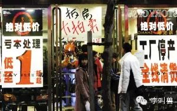
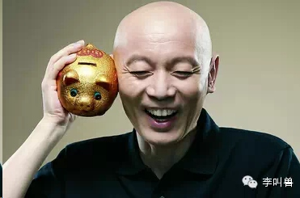
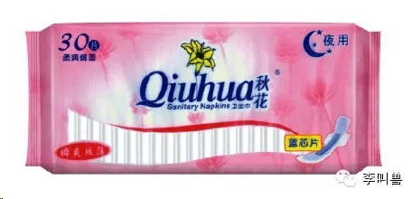
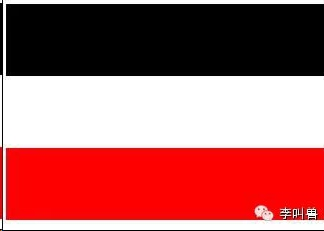
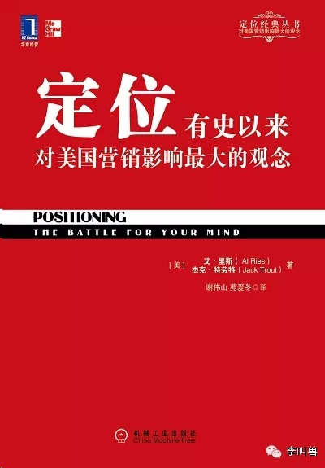
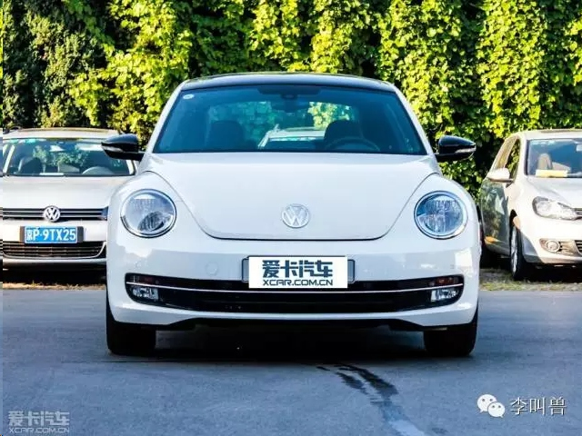
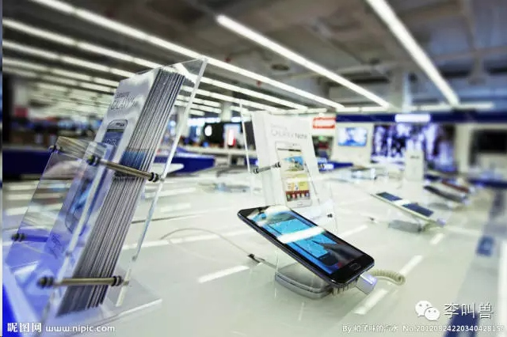
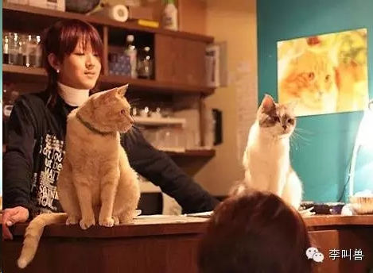
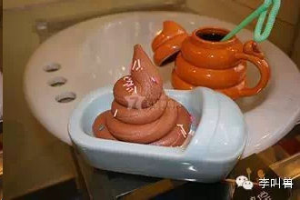

#感官营销：线下店如何逆袭电商？

随着电商的市场份额越来越大，几乎所有的线下店都感受到了冲击。

那么在这种过程中，线下店如何保持竞争力呢？

当然最容易被想到的办法就是“**降价**”，而这也是无数线下店应对危机时正在做的。

**而如果你拿所有的精力来追赶别人的固有优势（比如低价），你怎么可能打败别人？**既然因为本身成本的限制，线下店即使再降价也不会比电商更低价，那么单纯地降价就能保证你存活吗？

当然是不能。

**如果要保持竞争力，自然要依靠别人无法超过你的部分—对线下店来说，这部分很重要的就是“感官体验”。**

感官体验是指人对外界的所有感觉，包括嗅觉、听觉、视觉、触觉等。而受小小屏幕的限制，**电商在这方面自然无法超过线下店：**

- 嗅觉直接没有
- 听觉—音量等不受自己控制；
- 视觉受到屏幕限制
- 触觉只有冰冷的屏幕玻璃，也受到限制。

而可笑的是，无数线下店只顾着降价，忽视了自己最大的优势，对顾客的感官体验设计得无比粗糙。相反是很多电商通过更好地交互设计来提高感官。

那么如果要巧妙地利用感官进行营销和产品服务设计，应该怎么下手呢？

毕竟消费者不可能永远宅在家里呆在电脑前，**而只要他离开家出门，就是你通过各种感官进行刺激的机会：**

###**1，鼻子**

你早上路过一家糕点店，即使他们还没有开始做糕点，你已经闻到了蛋糕的芳香，很想走进去—**这往往不是因为蛋糕很香，而是一种代号为RV184的香精经过扩香机扩散的结果。**

刚刚打开一本期待已久的新书（纸质书，不是电子书），一阵笔墨香迎面而来，让你增加了阅读和学习的欲望—**在印刷书籍的纸浆中加入一点CJ5，就可以有这个效果。**

走进高档的新车，立马闻到一股**新鲜皮革的味道**，让你觉得这部车真是物有所值—在此类产品中加入一点C30，就可以达到这个效果。

再比如一个打扮时尚的异性走近你，他（她）看起来也没那么好看，身上也没有特殊的香气，但是一靠近就让你产生了“好感”甚至“动情”的感觉—**在身体上喷一些费洛蒙**，即使人感知不到这种气味，它通过你的嗅觉直接作用于你的大脑，让你产生好感。

**气味无处不在，大部分我们都没有意识到，但是它们却极大地影响着我们的体验。**如果线下店仔细设计自己气味，就会让消费者感觉到莫名其妙的开心和“物有所值”。

为什么呢？

**为在大脑中，嗅觉神经是距离大脑负责决策的区域最近的感官。**在远古时代，人类需要通过嗅觉来区分腐烂的食物，并直接作出决策。

举个例子，想象一下你觉得很恶心的一个东西（比如翔），你是更加难以忍受闻到它的气味，还是看到它？我想大部分人的选择是：宁愿看，我也不想闻！

所以，如果你想提高线下场所的体验，一定要巧妙地控制气味。比如假设你在经营银行，什么气味合适呢？**研究发现类似“香草”的气味最合适，因为香草气味直接刺激的大脑区域也是我们感觉到“信心”这个心理状态的大脑区域，香草的气味会让你的银行更加可信。**

甚至有很多公司都在找高端香水公司帮它们设计独有的“气味”LOGO，某个公司独有的气味可以起到像视觉上的LOGO一样显著的效果。

###**2，耳朵**

如果说“嗅觉”是跟人的生存直接相关的，作用于大脑当中负责关键决策的部分；**那么“听觉”则直接作用于人大脑中负责情感和情绪的部分（比如杏仁核体）。**

所以，如果你想激怒一个人，相同的文字，发语音给TA远远比发文字给TA要效果显著地多。同样，如果真正想打动一个人，也一定要让TA听到你的声音。

**无数的线下店利用不同声音对情绪的影响来改变顾客的体验和购买：**

有研究发现，在超市的音乐中加入微不足道的**婴儿的哭声**，结果女性购买了比平时更多的食物—细微的婴儿的哭声激发了她们潜意识中母性的本能，但是这些消费者往往不会意识到也不会承认这一点。

因为在远古时期的进化中，**听到婴儿哭就迅速找食物的妈妈更容易让自己的孩子活下来**，从而延续自己的基因，这就导致女性对这种声音有一种基因给予的本能。（惹女朋友生气了？用手机偷偷放一点婴儿哭的声音，她的母性就会被激发出来，变得没那么气愤了）

在欧洲的超市里进行的研究发现，**播放意大利音乐后，超市中的意大利面销量会上升**，而德国酱菜的销量下降，即使所有的消费者都不会意识到这一点，他们都觉得自己是“理智购买”。

如果想要表达“主导感、成熟感、安全感”，没有什么比低沉的声音更好的了—甚至动物都会倾向于主动跟随发出低音的个体。

如果经营咖啡厅，**播放一曲缓慢的音乐可能比降价20%的促销效果更好**，而前者不需要牺牲利润。

所以，相比于文字信息，声音的作用如此隐形，可以不知不觉间改变人的体验。

**甚至即使人们完全听不清声音的内容，也会对人的潜意识产生影响：**

比如有这么一个实验，在周围嘈杂的声音中有人悄悄说了一句“Addie周三不能来了”，你询问在场的人，没有人表示自己听到了这种信息—这个信息没有进入人的意识。

但是到了周三，你问前几天在场的人：今天Addie会来吗？他会不假思索地说：不会来！

但是你问他如何知道的这个信息，他又不知道了，只能说：“**我第六感就是这么准！**”

**除了声音的选择，音量也很关键。**比如背景噪音的音量升高，人会提高刺激和兴奋，但是也提高打扰程度。

比如**50分贝**左右时人最能集中精力，适合做有创造力的工作。低于50分贝，人在创造性工作时因为环境噪音刺激不够，就会发困（这就是为什么很多人一跑到安静的图书馆就发困，因为很多图书馆不到40分贝）；而高于50分贝，人就难以高度集中注意力。

而**65分贝**最适合进行枯燥的工作，比如重复性计算或者复制表格。65分贝也被称之为“美丽的噪音”，它在咖啡厅中可以转移一部分注意力，降低约会时谈话的尴尬；又不至于太大干扰，打扰到愉快的对话。

总之，作为任何一个线下场所，巧妙选择自己的音量都很关键—如果担心无聊需要提高刺激，那么就提高背景音量；如果担心打扰到顾客，就降低背景音量。

###**3，眼睛**

眼睛应该是被传统营销开发最多的感官了，但是对于线下店来说，巧妙地利用光线、形状、颜色，仍然可以达到超出预期的消费者体验。

**光线。**

光线强度对我们的心情有着极大的影响，因为光线起到挑战我们生物钟的作用。

在连续地下雨天，光线不佳时，一部分人就会因为生物钟挑战的问题而出现情绪低落，从而显著导致产品销量下降、店面体验下降。

一个很好的解决办法就是用带“光线传感器”的灯，让店内的光线尽量不受阳光的影响，在晴天或者阴天都可以保持类似的亮度。

**颜色。**

不同的颜色也可以激发不同的情绪反应。（当然都是无意识的）

比如**蓝色和粉色**一起会让人联想到“女性、温柔、童年”等印象，所以很多姨妈巾的包装会使用这两种颜色。**如果你想通过店面的设计激起人对于童年的回忆，不妨尝试这种颜色。**

而**黑色和红色**会让人联想到“男子气概”等印象，所以有些游戏包装，甚至定位商务的Thinkpad都是用这两种配色。

再比如某品牌想要同时表达“信任”和“活力亲和”，应该怎么组合颜色呢？我想没有比**深蓝色**（表达信任）+**橙色**（活力）更加合适的搭配了。联邦快递的LOGO不就是这样吗？

既然颜色有这么大影响，这里还不得不提一个“最引人注目”的颜色组合，那就是“**黑白红**”，如果你想让你的招牌吸引注意或者瞬间“印象深刻”，这无疑是最好的选择。

比如很多国旗就选择了这个颜色组合。

所以，如果你想在会议中“引人注目”，最好的服装搭配是什么？自然是“**黑西装、白衬衣、红领带**”了。

这个应用如此广泛，就连研究这行的专家，**《定位》的作者特劳特先生都选择这个颜色组合当他书籍的封面：**

所以，如果想让你的店面极致地提高用户体验，找一个专业的配色师、光线解决方案等非常有效。

**形状。**

在视觉上，形状也非常重要。实际上你的视觉系统往往在1秒以内就通过形状产生了偏见，并且难以改变。

比如在全球大部分人看到“**高、瘦、腹部平坦的男性**”就会觉得很权威而且很有智力，即使身材和智力并没有显著关系。

（看下图中间的那位“高、瘦、腹部平坦的男性”看起来多有专家形象！怪不得可以成为顾问公司的董事长）

**那么对于产品或者店内摆设，形状上应该如何提升呢？**

很重要的一个原则就是：**让你的一切东西越像一个面孔越好。**

实际上如果你的产品外形在无意识中激活了消费者大脑中的面孔识别区域，往往会提高他们对你的喜好。

比如知名的甲壳虫汽车：

如果你能进一步激活这样的面孔的感觉：

**圆的、对称的、小鼻子、大眼睛、高额头、笑的……**

那么恭喜你，你已经被消费者的大脑在1S内归类到了“很重要很好的产品”类别中。

###**4，皮肤**

触觉也是人类很重要的一个感官。

而对触觉来说，一个很重要的方面就是“重量感”。

在你看到一个东西时，在无意识中，你的大脑前运动皮层就会自动开始计算它的重量（以防你需要拿起它）。

而假设拿起的东西重于或者轻于刚刚大脑计算的重量，人就会不由自主地把东西放回去，往往不会购买。

比如我在某手机体验店中见到消费者拿起一个手机，然后惊呼“**啊，怎么这么轻啊！**”接着立刻把产品放了回去。

**所以你需要根据消费者的感知来设计某个产品的重量**。

比如人潜意识觉得贵的东西就是重的，那么如果你卖一个很贵的东西但是又特别轻，怎么办呢？总不能让消费者拿起来又放回去吧？你可以在包装中增加质量（比如手机包装厚厚的纸盒）。

除此之外，触觉在各个方面都会影响人的情绪。比如餐厅顾客生气时如果恰好捏到很软的东西，那么气愤程度就会下降。

**再比如任何形式的抚摸都会刺激情感**—所以有的咖啡厅故意弄一些小猫来让客人服务，刺激情感。尤其是对女性—女性皮肤表面连接到大脑感知抚摸的神经元数量10倍于男性。（小TIP：女朋友生气了，先想办法摸她。）

###**5，多感官协同**

上面讲了嗅觉、触觉、视觉、听觉各种感官，但是这些感官并不是独立的。

**如果你让消费者从好3个感官上得到一样的信息，那么对他来说，这就是最终的信任和喜欢**，几乎超过一切营销方式。

比如你在某个店内布置了**香草的气味**（激发信任感），呈现整体**深蓝色的色调**（视觉暗示信任感）并且配合**低沉舒缓的声音**（听觉暗示信任感），那么你就会给消费者整体呈现一致的信息：我们是值得信赖的！

但是如果不同感官传达的信息是不一样的，激发了不同的感觉，那么往往会带来不适。

这就是为什么人类会晕车晕船。因为在你眼睛的感官中（比如低头看手机），车是不动的；而在你耳朵（可以感知人运动）的感觉中，车是在运动的；这两种感觉相冲突，导致你特别难受。

所以，你看到大便餐厅，应该也很难受。（视觉和嗅觉等刺激不一致）

