#【李叫兽】如何挖掘创业机会：你怎么知道台风来了？

说到创业，首先你得找到一个机会。

既然所有人都想找好机会，那么如何在复杂的市场信息中挖掘出这样的机会呢？

用挖掘机显然不行，凭借一时的灵感显然也不靠谱，难道真的“靠人品”，好机会都是撞上的？

以下5个商业理论告诉你，“好机会”原来是可以预测的！

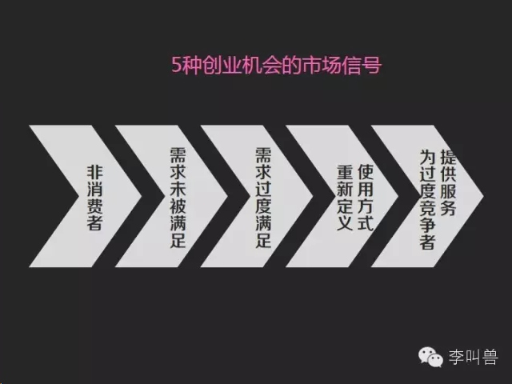

精准识别下面5个市场信号，你也可以“顺势而起”！

###**1，市场存在非消费者**

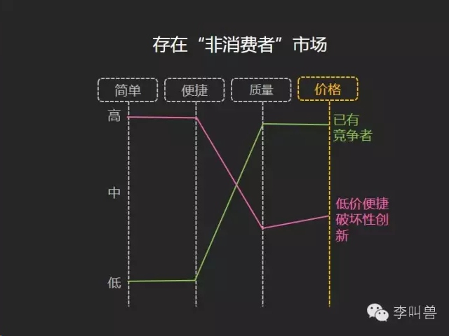

**非消费者是指因缺乏资金或者不够便利而放弃某种消费的人**，非消费者的存在使得创业者能够在“大公司看不见的领域”发起破坏式创新，颠覆传统的商业模式。

相比于消费者，“非消费者”更加在乎低价、便捷和易用，他们能忍受产品质量低下，因为“有产品可用”总比“没产品可用”要强。

**无数的破坏式创新来自这个领域：**

**太阳能先在非洲取得成功。**

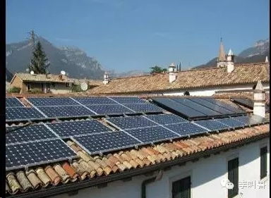

太阳能比火电性能更差—比如电压不稳，但是具有低价和便捷优势（火电必须集中供电，但是太阳能可以自家发电）。太阳能一开始在美国推广失败，因为美国人已经是“火电”的消费者，他们对用电质量要求很高，太阳能无法满足需求。但是太阳能却在非洲最先取得成功，因为非洲很多地方没有“国家电网”，**对非洲人来说，太阳能可以让他们自己发电，即使发电质量差，但是总比没有电可用要好。**

**索尼WALKMAN便携式收音机进攻“非消费者”**

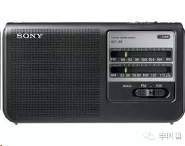

刚推出时，索尼WALKMAN比传统大型收音机音质差很多，但是具有低价和便捷的优势（体积小）。因此它没有去进攻当时的主流消费者（已经开始听收音机的人），而是聚焦“非消费者”—那些因为买不起大型收音机或者经常出门在外而无法享受音乐的人。**对这部分非消费者来说，WALKMAN虽然音质差，但是有音乐可听总比没有要强。**

（后来WALKMAN音质不断提升，又被差音质的mp3颠覆，是一样的道理）

**苹果个人电脑**

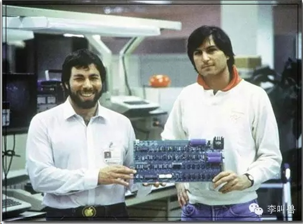

苹果个人电脑比当时流行的“小型机（商用）”性能差很多，但是具备低价优势。因此它没有去进攻被“小型机”占据的公司市场，而是聚焦没有电脑可用的个人。对这些非消费者来说，**个人电脑虽然比不上公司采购的小型机，但是回家后有个电脑可用总比没有要强。**

**柯达傻瓜相机**

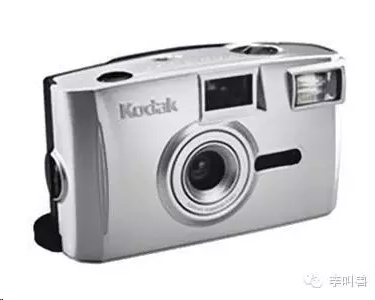

柯达发明“傻瓜相机”，虽然比传统相机成像效果差，但是更加便捷易用。因此它没有去进攻传统相机占据的专业人士市场，而是进攻非消费者—他们自己不会照相，要是想照相必须请专业摄影师帮忙。**对这些非消费者来说，傻瓜相机即使成像效果差，但是总比自己完全不会照相要强。**

（可笑的是，柯达十几年后被同样道理的破坏式创新-数码相机打败）

**美图秀秀**

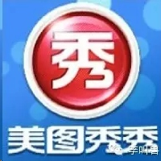

作为图像处理软件，美图秀秀比PS的功能要差，但是更简洁易用。因此它没有去进攻被PS占据的专业市场—也就是那群看不起别人用美图的PS高手们。而是进攻非消费者—他们没有精力而且也懒得学PS这么复杂的软件，以前想修图只得找朋友。**对他们来说，美图秀秀即使功能永远比不上PS，但是有个修图软件可用总比啥都不会用要强。**

**脸萌**

脸萌是漫画头像生成软件，虽然不如真正的漫画那样高度相似面孔，但是更加简洁易用—经过简单拼接，即可生成你的漫画头像。它进攻漫画头像的非消费者—他们自己不会漫画，以前想漫画只能找朋友帮忙。**对他们来说，即使脸萌的漫画效果永远比不上真正的原创漫画，但是自己能把自己头像漫画出来总比没有要强。**

**在线教育**

在线教育虽然质量比不上线下教育，但是更加低价和便捷。因此它进攻的是传统教育的“非消费者”—他们是那群因为资金不足或者“不想跑那么远”而不得不放弃线下教育而看书自学的人。**对他们来说，在线教育虽然互动性、质量等方面永远也比不上线下教育，但是总比自己啃书本要强。**

**质量不一定总是重要！**

从上面的案例可以看出，当大公司已经占据了高质量的消费者市场时，往往总有一部分消费者是被放弃的，如果用质量没那么好，但是更加低价和便捷的产品进攻这部分“非消费者”，往往能在大公司“看不见的地方”对他们发起冲击。

就像著名棒球运动员威利•基勒说的"**他们不在哪里，就在哪里打败他们。**"

那么如何准确识别“非消费者”呢？

**你可以观察是否有一群人因为以下的某些原因而不得不放弃高质量产品：**

**①价格太贵。**

创业者使命：“第一次，人们终于可以买得起或者用得起XX了！”

（沃尔玛VS百货店、美林证券VS高盛、华为VS思科、西南航空VS美国其他航空公司、本田摩托车VS哈雷、喷墨打印机VS激光打印机、知乎VS个人咨询服务）

**②体积太大、太重。**

创业者使命：“第一次，人们终于可以在某个情景下（比如出游时）使用XX了”

（索尼WALKMANVS大型收音机、耳机VS音响、耳塞VS耳机、平板电脑VS笔记本、速溶咖啡VS咖啡机咖啡、移动电源VS电源）

**③必须集中到一个地方或者集中一个时间。**

创业者使命：“第一次，人们终于可以在家做XX了！或者，人们终于可以拥有属于自己的XX了！”

（在线教育VS线下教育、在线购物VS线下购物、个人太阳能VS国家电网、3D打印机VS大型工厂、个人电脑VS公司用的计算机、家教服务VS上学）

**④必须花费很多精力才能学会或者使用。**

创业者使命：“第一次，人们可以自己做XX了！”

（美图秀秀VSPhotoshop、脸萌VS漫画头像、柯达傻瓜相机VS传统相机、微博VS个人博客）

以上的对比案例中（比如“在线教育VS线下教育”），前者是定位非消费者者的破坏性创新，**它们质量更差以至于在初期达不到主流消费者需求，但是却往往更加低价、便捷和简单易用，让那些本来买不起、搬不动、走不远、学不会的消费者第一次享受到了服务。**

看到本文的同时，何不看看自己周围有哪些“非消费者”呢？说不定这就是一个大机遇。

###**2，市场存在需求未被满足的消费者**

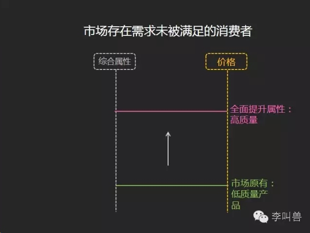

如果你发现周围存在这么一个市场—只有低端产品，虽然价格很低，但是普遍无法满足高端消费者的需求，这说明这个市场存在“需求未被满足的消费者”。

**如果一个产品或者服务已经“足够便宜”，显然让它进一步变得更便宜是无法取悦消费者的，这时应该全方面提升产品属性，满足高端消费者需求。**

**比如下面的案例：**

**西少爷肉夹馍**

对“享受着”4万多一平房价的北京人来说，区区几块钱的“肉夹馍”显然是一个已经足够便宜的产品。但是如果你宁愿花更多钱买更好的肉夹馍呢？显然之前的市场缺少这样的产品。于是“西少爷肉夹馍”全方位提升肉夹馍的产品属性，并且提高了售价—9元1个，再加上“互联网营销”，赢得了市场。

**黄太吉煎饼果子**

街边随处可见的“煎饼果子”可谓最屌丝的食品之一了，但是如果你想花更多的钱买个更好的煎饼果子呢？黄太吉就做了这个生意—销售20多元一个的煎饼果子。

**ROSEONLY玫瑰**

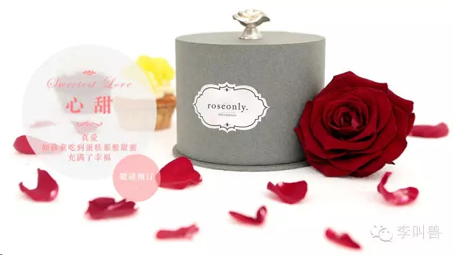

玫瑰历来是“求量不求质”的市场，一朵玫瑰花足够便宜，但是如果你想送一朵足够精致的玫瑰呢？过去的市场无法满足你，而ROSEONLY卖的520元一朵外加精致包装的玫瑰正好可以满足这部分需求。

**智能无线路由器**

相对其他电子产品，无线路由器真是便宜（50几块）又耐久，那么消费者是否愿意花更多的钱去购买一个足够好的路由器呢？智能无线路由器（几百块）应运而生，速度更快、功能更多，目标是传统路由器需求无法被满足的高端市场。

当然如果你仔细观察可以发现，大部分产品都沿着质量越来越好的方向发展—汽车、酒店、航空服务、手机等，这也是大部分大公司一直在做的事情—不断提升质量，抢占高端市场，就连上文提到的低价破坏性著称的丰田也推出雷克萨斯等车型进军高端市场。

但是这并不意味着初创企业在这个领域内没有机会，**仔细观察周围的生活，看看是否听到了这些抱怨：**

“要是XX就好了”“要是有XX功能就好了！”“XX普遍没什么新意！”

或者甚至搜索一下那些用品是我们经常消费但是实际使用成本很低的？消费者是否愿意付更多的钱来购买更好的产品？

###**3，市场上存在需求被过度满足的消费者**

市场营销的一个重要定律是“消费者不愿意为超过其需求的东西支付溢价”。

比如手机四核处理器体验比双核要好，消费者也愿意支付溢价；但是如果是十六核处理器对比八核处理器，消费者可能就没有觉得有太大差异了—即使十六核处理器仍然更快，但是这0.01秒的快消费者已经难以感知到了。

**然而大部分公司仍然不断提升产品质量，以满足其最高端消费者（主要利润来源）的需求，这时就产生了一部分需求被过度满足的消费者—他们并不需要全部的功能。**

因此初创者就可以通过降低某些高端产品的属性，来挖掘这部分“需求被过度满足的消费者”市场。

比如“**雕爷牛腩**”（定位轻奢餐的中高端餐厅）的例子。

本来餐饮行业的高端市场是这样的：

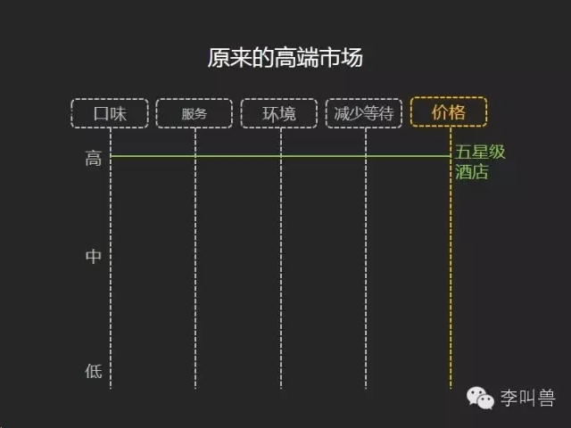

在消费者关注的每个领域内，高端的五星级酒店都是高水平的，当然也包括价格。

但是这时就存在这样一部分**需求被过度满足的消费者**—他们渴望有五星级酒店的菜品口味，但是不怎么在乎服务质量和就餐环境，同时更加不在乎“等位”。对他们来说，五星级酒店花费巨大成本提升的服务和环境可能超过了他们需求，他们宁愿没有这些而便宜一点。

因此就出现了雕爷牛腩，定位这部分消费者—想要最顶尖的口味，但是不愿意为环境、服务和等待便利而支付溢价：

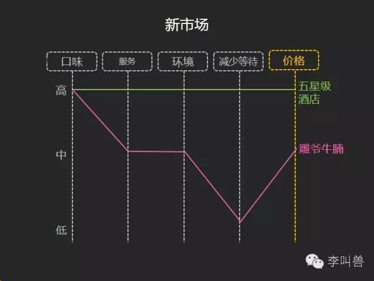

当然其实很多其他近些年初创的餐饮连锁店也遵循类似的道理，比如海底捞—定位崇尚高质量服务，但是不怎么在乎其他属性的人。

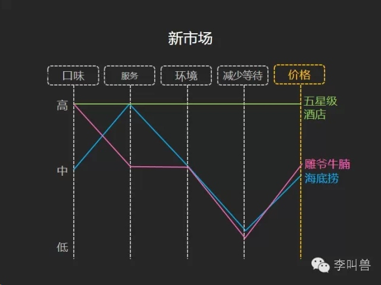

类似，服装行业的ZARA、优衣库，PC行业的DELL、联想，都适用了类似的理论，在行业已经进入成熟的同质化竞争时杀出一条血路—定位“需求被过度满足的消费者”

###**4，重新定义消费者使用产品的方式**

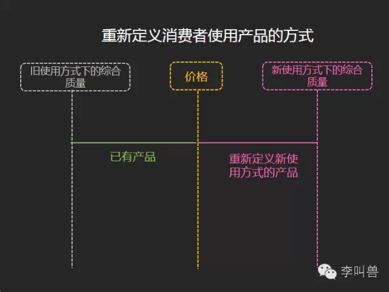

除上述之外，同样伟大的创业还可能来自“**重新定义消费者使用产品的方式**”，并以此开创全新的产品功能体系。

**比如以下案例：**

**iPhone:谁说手机就是用来打电话的？**

手机本来是个经典的通讯工具—人们用它来打电话发短信。直到乔布斯重新定义了人们使用手机的目的—看资讯的终端、便携式音乐设备和游戏机。所以iPhone在杀死诺基亚前，可能已经杀死了报纸行业—它真正的竞争对手可能不是非智能手机，而是华尔街日报、mp3以及掌上游戏机。

**Beats:谁说耳机是用来听音乐的？**

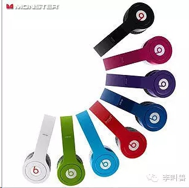

耳机是一个经典的听音乐终端，AKG、森海塞尔、拜亚动力、歌德等一众大品牌厮杀了半个世纪，音质一代比一代好。但是突然冒出的BEATS让这些传统耳机品牌傻眼了，因为BEATS重新定义了人们使用耳机的方式—耳机不再只是一个听音乐设备，而是一个首饰。所以BEATS真正的竞争对手并不只是AKG等，还有项链、珠宝甚至蝴蝶结。

**王自如：谁说评测就是为了帮你选手机？**

王自如同锤子手机罗永浩的大战让更多人的认识了这个手机测评人。

现在问题来了，为什么那么多手机测评人，就王自如最出名？难道其他人都不如他专业？

我认为是王自如是无意识重新定义了人们使用测评视频的方式：过去少数人看测评视频就是为了帮自己选手机的，所以如果2年换一次手机，那么你2年看一次视频就够了。但是王自如通过加入了大量的手机设计的分析，让**人们看测评视频是为了“补充知识、提升逼格”的—自从知道了什么叫做“白平衡”和“边角过曝”，我也可以跟朋友们吹科技知识了！**

所以，你可以仔细观察周边的产品，问自己：**这个产品除了完成它本来的功能，人们还可能用它达到什么目的？**

###**5、为过度竞争的行业提供服务**

如果经过上述4大策略的思考仍然没找到创业思路，发现周围都是一个个过度竞争的市场，那么还有一条路是为“过度竞争的行业提供服务”，从而获得较高利润。

为什么呢？

因为在一个纵向的稳定产业链（比如电脑的原材料供应商、芯片等零件供应商、电脑组装商、电脑销售商）中，**产业的总利润一般难以变化，因此一个局部利润下降后，其相邻的两个产业往往会得到高利润。**

比如电脑行业，先假设所有纵向产业利润率一样：

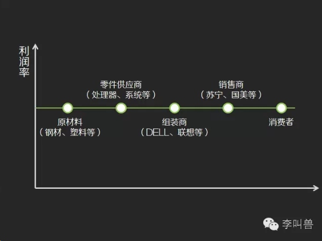

这时DELL、HP、联想等众多的厂商看到电脑赚钱，都来做电脑，引起过度竞争，导致电脑组装品牌商整体利润下降。

因为电脑过度竞争，联想们的供应商（英特尔、微软）和渠道商（比如苏宁）在跟联想谈判时底气更足了—“哼，不想跟我合作，大不了我找惠普！”

最终导致联想等组装品牌商相邻两个行业利润上升，于是出现了英特尔+微软独霸天下，苏宁国美黄金发展：

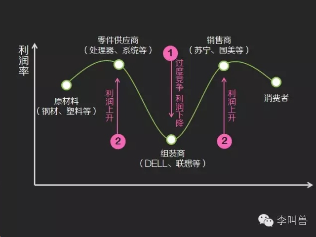

所以，为了提高利润率，当年英特尔才扶持联想，加强电脑组装环节的竞争。所以，2011年高通（手机处理器）害怕三星等独霸安卓，才扶持小米，加强竞争。同时，反过来华为怕被高通绑架，开始自己做海思芯片。

所以，如果你不幸处在一个过度竞争的行业中，消费者貌似所有的需求都被挖掘干净了，你可以选择为过度竞争的行业提供服务。

比如现在手机APP过度竞争，创业公司一大堆，那你可以选择给他们提供服务啊—外包设计及代码服务、外包APP发行服务、外包APP营销服务。

**声明：**

- 以上仅仅说明了非常有可能带来市场机会的“信号”以及分析方法，但是不代表存在这些信号的一定是绝佳的创业机会，你需要考虑很多其他因素。
- 同时，本文也仅仅列举了部分信号，超出本文理论之外的，仍然有很多创业机会。
- 文中所引用公司仅仅作为案例，不代表本人产品偏好。