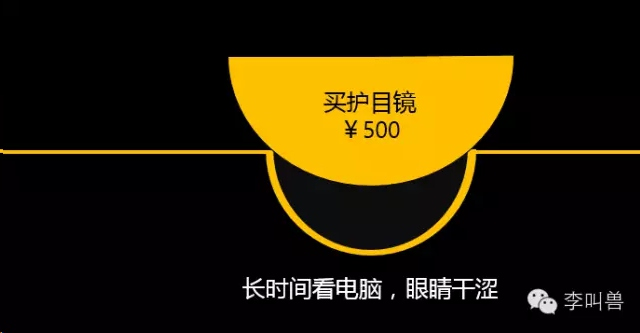

#【李叫兽】解冻文案Ⅱ：为什么有些文案怪怪的？
原创 *2015-12-29* *李靖* [李叫兽](https://mp.weixin.qq.com/s?__biz=MzA5NTMxOTczOA==&mid=401258543&idx=1&sn=ab481b57097ffa209017374e84b9809d&scene=21&key=a269c8ed3afb88d86f1020c3d88eb3a4b77b6503b0eb72fcc3a0c98ab2d8c654319b36f06d18736035242e802baa7789e65b1671deae7f51a73f276b15be7e9fd3bd5e68a4bec87bae53a40d9dd99774&ascene=7&uin=MTc4OTM3ODkzOA%3D%3D&devicetype=Windows+7&version=6203005d&pass_ticket=V5w3mkkLQcmNI8VtqJK0C1erJipHSMkFDXxkSrQt9dQbXsQ8haTP3Q1NJmbFLNhV&winzoom=1##)

> 原文链接：http://mp.weixin.qq.com/s/9Ty_9kpI9l4fl2dKJkNnjg

上周李叫兽发了解冻三部曲的第一部《解冻—新产品文案如何唤起痛点》，

[【李叫兽】解冻文案：不要让用户关注你的产品，先让他们关注自己](http://mp.weixin.qq.com/s?__biz=MzA5NTMxOTczOA==&mid=401148893&idx=1&sn=b3225b36fa34045cafdb09c2a21b000a&scene=21#wechat_redirect)

那么前面唤起痛点后，后面怎么写呢？

**本周方法：解冻三部曲第二部《重新冷冻—新产品文案如何解决痛点》**

为什么有些文案，明明写得很华丽，却总让人感觉怪怪的？

比如这个文案：

文案主体部分通过诗一样的语言，表达了作者对青春的呼唤，刺激了用户的情绪，引起了大众的共鸣。

但是为什么就是让人感觉“怪怪的”？

**其实，你只要跳出“文案人”的视角，站在用户的角度，自然很容易发现它们奇怪的原因。**

我们假设有这样一个年轻人，他有500万（假设是爸妈给的），对于这500万怎么花，他面临两大类选择：

1，去环游世界、去辞职、去创业；

2，买套房子保值、居住。

他正在这两个选择中犹豫的时候，突然看到这样一句话：

那么你认为，他在看完这句话后，**会变得更加倾向于选择“环游世界、辞职、创业”呢，还是会更加倾向于选择“买套房子”呢？**

我想大部分人直觉上就知道是前者——因为房产在我们的文化中是一种“稳定性”选择，它代表的不是“青春放肆”，而是“安守本分”、“稳定生活”。

而如果通过“如果青春不曾放肆，老来何以话说当年”这样的文案来刺激“放肆青春”的情绪，那么人反而会变得更加不想买房。

**试问：一个房地产公司，为什么要刺激人不想买房的情绪呢？**

而这就是很多文案明明语言华丽而且走心，明明能够“激发需求”，却还是“让人感觉怪怪”的原因——**对你唤起的需求来说，你的产品并不是用户直观感觉上的最优方案。**

你发了青春文学般的豪壮誓言，鼓励人“无悔当年”，让人想要“放手一搏”，结果后面竟然让用户买房。

所以很多自嗨文案，经常并不是因为“没有唤起需求”、“没有打痛点”，而是后面的产品没有解决这个痛点。

**那么文案到底如何解决痛点？**

一般来说，绝大部分新产品文案都分成两部分：

**解冻——前面唤起某种痛点或者需求；**

**重新冷冻——后面产品介绍的露出，解决此痛点或需求。**

我在前一篇文章中讲过，唤起一个人的需求（也就是解冻），有且只有两种方式：提高一个人的理想状态，或者降低一个人的现实状态。

比如“你用着上千块的香水，却用39元超市洗发水”，就是降低一个人的现实状态，让人觉得现状不合理，急于想要改变——**相当于在人的大脑认知里挖了一个坑。**

**而你的产品信息，就是要填上这个坑。**很多失败的文案，就是因为挖了坑之后，没有填上。

比如前面的广告中，你用“放肆青春”来刺激人的“理想状态”，相当于挖了一个坑，而在人的直觉中，下面的产品信息（买房），却偏离了这个“坑”。

总之，前面的“放肆青春”本身是好文案，但是并不适合为这个产品挖坑，也并不是“买房”行为能够解决的用户需求。

不信，我给同样的文案，换一个产品，你就发现没有这么强的违和感，感觉合理多了：

所以，写文案：

那么在“重新冷冻”理论中，如何避免“填坑错误”，如何让文案不显得“怪怪的”？

**你需要站在用户的角度，仔细检查这4类错误：**

###**1.坑位错了**

有的时候，你前面唤起某种需求，但在消费者的直觉上，你的产品并不是该需求的最佳解决方案。

有一期李叫兽研究会的学员作业是帮“三剑客3D定制衬衣”写解冻文案，有的学员是这样写的：

为什么这个文案让人感觉怪怪的？

其实你很容易就发现，对于前面文案唤起的痛点（“对销售员的厌恶”），其他产品可能会更好解决：

总之，当你觉得一个文案怪怪的，无法做决定的时候，最简单的方法就是：**看看消费者如何做决定。**

比如上面的文案，先唤起的痛点是“销售员虽然表面和气，但内心嘲笑你的形象”，这个时候用户可能有什么选择呢？

1，“讨厌的销售员，下次不去这种店了”。

2，“下次我得好好提升形象，不让销售员嘲笑。”

**这两种选择，哪种是大多数人直觉上的第一选择呢？**

我想大部分人是第一种——毕竟面对轻微的不爽体验，大部分人的第一反应是回避体验（下次不去了），而不是改变自己，证明给TA看（提升形象，证明给销售员看）。

而如果人的选择是第一种，那么对应的解决方案（产品信息）就应该是：**上天猫，远离坑爹销售员。**

**好，假设仍然有人直觉上的选择是第二种**——下次我得好好提升形象，买更好的衣服。

这个时候，你仍然需要问自己：**当我的用户产生了“我得好好提升形象，买点好看衣服”的需求时，他有什么选择？直觉上的第一选择是什么？**

我想绝大部分人的第一直觉选择是“买更贵的衬衣”，而不是“不买成衣，买定制衬衣”。

总之，对你的产品来说，你唤起了根本不合适的痛点——**这个痛点可能会引导消费者“更想网购，而不是在实体店购买”，可能会引导消费者“多买点更贵的衬衣”，但就是很难引导消费者“买定制的”。**

因为对他们来说，“定制衬衣”并不是解决该痛点的第一直觉方案。

也就是说：你挖错了坑，导致产品不能把坑填上。

是的，这些文案就是这么简单的错误。

你甚至不需要看1000个优秀案例，不需要读个广告学，不需要有10年工作经验，只是多花一点点时间，站在用户的角度，研究用户的选择，就会发现错误如此显而易见。

再比如，对这件3D定制衬衣，另一个李叫兽学员的作业是这样的：

这个作业文案，前面用生动感人的语言，想要唤起用户对“不一样”的追求。是啊，每个人都是不一样的，我为什么要跟别人穿一样的衬衫，我要量体裁衣独家制定的！

可是，为什么这个文案还是让人感觉怪怪的？

用李叫兽独家“重新冷冻”分析模板来分析一下，其实问题很明显：

假设用户产生了“我就要穿不一样的”这种痛点，**用户的第一直觉解决方案是什么呢？**

我想可能是奇装异服——别人穿普通正装衬衫，我穿个性设计的衬衫。

而不太可能第一反应是“定制衬衣”，毕竟定制衬衣版型、外观参照的都是经典款普通衬衣，表面上看起来肯定是“一样的”。

不信的话，把下面两个广告放在一起，你看看哪个转化率会高一点：

我想很可能是前者。

所以，这个文案仍然是填坑填错了。

而如果看下面这个文案，就会发现没有那种“怪怪的”感觉：

因为对于这个痛点——“人的体型有成千上万种，但衬衣型号只有十种”，最符合消费者直觉的解决方案就是“衬衣要定制，而不是买成衣”。

所以，你前面文案通过“降低现实状态”挖了一个坑，后面的“定制衬衣”正好填上了这个坑。

因此，写文案的时候需要不断问自己：

**“对你唤起的需求来说，你的产品，是不是直觉上的好方案？”**

毕竟，我们文案人，不能跟用户的直觉和心理做斗争，只能借助他们的直觉和心理。

###**2.坑太大**

刚刚讲了“坑位错了”的例子，还有的挖坑失败，其实是因为“坑太大”——**唤起了过高的需求，以至于产品无法填补该需求。**

比如360儿童卫士智能手表，之前很多宣传中，塑造儿童走丢的场景，通过唤起恐惧感来让人购买。

这样有什么问题吗？为什么“防孩子走丢”的定位很难成功？

其实你不用学复杂的理论（比如李叫兽之前关于恐惧营销的文章），自己利用“重新冷冻分析模板”分析一遍就知道了：

假设你是一个妈妈，有人跟你说：“最近周围人贩子特别多，孩子走丢的很多，你可要小心啦！”（唤起痛点）

**这个时候，你为了消除这个“恐惧”，第一直觉反应是什么？优先选择的解决方案是什么？**

我想大部分人的第一选择是：“天啊，太恐怖了，还是不要让孩子外出了。”

而很少有人会觉得“买个儿童定位手表”可以消除这种恐惧感——

> “孩子丢了？孩子被人贩子抓跑了？没关系！有了360儿童手表，你知道他走丢的前一刻在哪里！（假设人贩子抓孩子时候会摘掉他手表）”

这消除了恐惧感吗？当然没有。

即使有了定位手表，刚刚描述的“走丢场景”，仍然很吓人。也就是说，你唤起了一个过大的痛点，而产品无法解决这么大的痛点。

挖了一个很大的坑（降低用户的现实状态），但是产品在用户的直觉上，无法填满这个大坑。

这就会导致：**用户看了这么恐惧的广告，更多会选择回避恐惧，而不是购买产品。**

而如果换一个场景，唤起非常轻微的恐惧感——熊孩子逗家长，故意藏起来。

然后再说，360儿童手表，随时知道孩子在哪儿，就会变成直觉上的第一方案，给人的感觉不会那么“怪怪的”。

总之，并不是所有的产品都能改变世界，也不是吹嘘能满足的需求越高越好，而是：**你的产品能填补多大的坑，就挖多大的坑。**

###**3.坑太小**

刚刚讲了“坑太大”的情况——唤起了过高的需求，但产品很难在直觉上解决这么大需求和痛点。

其实还有“坑太小”——**唤起的需求太小，很容易被一个很简单的行为来解决，用户没必要购买产品。**

比如之前给一个电脑护目镜构思详情页文案的时候，首先被大家想到的思路是：

> 长时间看电脑，眼睛干涩。
> 
> UG电脑护目镜，保护眼镜。

实际上，这也是大部分淘宝店同类产品的通用诉求——减少电脑辐射，缓解眼睛干涩。

这样有什么问题吗？

既然自己不知道，我们还是站在用户角度看吧。

假设你是一个经常用电脑的白领，当你感觉到眼睛干涩，被唤起了这种痛点的时候，下面几个选择，哪个是你的第一直觉方案：

1，暂停用电脑，揉一揉眼睛；

2，立刻下单，买一个500元左右的护目镜。

我想大部分人的第一直觉选择是揉一揉眼睛，而不是立刻选择下单一个500元左右的护目镜。

毕竟，“眼睛突然感觉干涩”是一种即时性需求，本来可以通过一个非常简单的行为（揉揉眼睛）来短期缓解，不太会有人会用一个复杂而长期的行为来缓解。

毕竟，**等过了3天护目镜到货了，对现在当下的即时性痛点——“眼睛干涩”并没有什么用，而且还要花这么大一笔钱**——消费者都是短视、非理智、懒惰、想要立刻解决需求的。

也就是说，这个文案唤起了一个可以被轻松解决的痛点（眼睛干涩），却要用户付出这么大一个行为（购买500元护目镜），就是：坑挖得太小了，最终填不上。

总之，所有人都有这样的本能："**如果能用更加短期、懒惰、简单的方式来解决一个问题，我是不会用复杂、长期、辛苦的方法来解决的。**"

不光是人，动物也是这样。童话寓言里讲“乌鸦喝水”的故事，动物学家的实验也确实发现：乌鸦在喝不到水的情况下，的确会叼石子填充瓶子，最终喝到水。

可是为什么自然环境中，没有乌鸦这么做？乌鸦为什么没有通过学习这种高级技能，在进化树上爬得更靠上一点？

**很简单，因为自然环境中的乌鸦，有更简单的喝水方式，没有必要使用这种复杂手段**——“我从河边叼来石子放进瓶子，还不如直接去河里喝水。”

这是任何动物的本能，如果用户有更简单的方式缓解眼睛干涩（揉揉眼睛），为什么还要用复杂手段（花500元，并且改变自己的习惯）？

所以“眼睛干涩”这个痛点是很难被产品解决的。

那么这个电脑护目镜真正的痛点是什么呢？应该唤起什么痛点，用户才能想通过“购买护目镜”来解决问题呢？

**我认为用户真正的痛点并不是“眼睛干涩”本身，而是“因为由眼睛干涩带来的负罪感，导致不能长时间用电脑。”**

比如我之前有段时间，周末整天看美剧，但每连续看8小时，就会产生负罪感——“不行，这对眼睛不好，不能再看了。”只能忍心暂停。

所以，我们创造的护目镜，并不是“缓解眼睛干涩”的护目镜，而是可以让人“连续看12小时美剧眼睛都不干”的护目镜，而是可以“让人连续玩30小时LOL”，或者“盯着电脑做20小时PPT”的护目镜。

而如果换成这个痛点，就会发现：购买电脑护目镜，是最好的解决方案。

###**4.没有石头填坑**

前面讲了各种填坑失败——坑位错了，坑大了，坑小了，还有最后一种错误是：**单纯唤起了痛点（挖坑），但没有石头填坑（用户根本不知道你要做什么）。**

比如这张海报：

“假设我真的被你打动了，我真的被唤起了痛点和需求，真的想像你说的“跟你走吧，一起去创造”，但是能不能麻烦告诉我：你到底是什么？具体要我做什么？”

你可能觉得这广告太低级了，但其实这种广告非常常见，尤其是新产品广告。

你在前面讲一大堆痛点（挖坑）——“你想飞黄腾达吗？你想结识高人吗？你想改变命运吗？你想XXXX吗？”

但却忘记了解释产品是什么，不能让用户建立理解——是的，文案作者有背景知识，但不代表用户有，他们根本不知道你是谁。

**最终，用户摸不着头脑，感觉像一个陌生人对着他狂喊，却又不自我介绍，就会直接放弃理解。**

这就相当于：挖了坑，然后走了，没有“石头”填坑。

**结 语**

“李叫兽解冻三部曲”的上一篇讲了如何唤起痛点，这期就讲如何解决痛点。

这一期几乎没有使用任何的营销理论、心理学理论，因为**对于这个话题，可能10本书的理论都概括不了。**“解决痛点”——这个太复杂了。

而李叫兽又一直致力于弱化营销理论的复杂性，想为营销人提供简单有效的工具，怎么办呢？

索性这期不讲任何理论知识，只是通过提出“正确的问题”，让营销文案人更好利用自己已有的知识。

**毕竟，很多人的文案如此“自嗨”，并不是因为缺乏知识和理论本身，而是缺乏看待文案的正确视角。**当他们真正站在用户的视角，不断问自己“用户看到这句话，最可能的选择是什么？”的时候，文案就会有明显的提升。

就像我多次提到过：**文案是对用户感受的设计，而不是创造这些感受的文字的设计。**

主动去设计用户的感受，而不是盲目发挥自己的创意，你会发现，“解决痛点”的能力，其实你早就拥有了。

期待下一篇，下周二晚，“解冻三部曲”最后一部：**进入大脑。**

这是2015年最后一篇更新，提前祝读者新年快乐！

——李叫兽