#【李叫兽】解冻文案III：90%营销人写文案前的第一个错误

**
很多人在写第一句文案之前，就犯了一个错误。**

这是一个很关键的问题，因为它可能让你所写的任何文案都变得毫无意义。

**这个错误就是：你认为用户很关心你在说什么，但实际上他们没有。**你认为别人很关心“迷上黑的魅力，恋上白的优雅”意味着什么，但实际上他们没有。

你不能认为用户站在电梯里的广告牌面前，就表示他们正在关心你。

（PS.是的，我们经常关心的投放量、曝光量可能本身缺乏意义。）

一种可能是，他们正在想着怎么把昨天的女孩约出来、今天晚上去哪儿吃饭以及《星球大战》是不是要上映了。

所以，**在给用户一个“关注你的理由”前，他们是不在乎你写什么的。**

**他们在乎的永远是自己的事情**，在乎的是自己的职位，自己的金钱，自己的晚餐，自己的恋人和自己喜欢的电影。

只有当你的文案、文章开头足够吸引人，给他们一个“不得不关注你的理由”时，他们才会停止想这些问题，转而看看你到底要说些什么。

所以我自己在写完文案的时候，总是把文案放入下面这个极端验证模板，并且假设成一个路人，看看注意力会不会被周围的8个“有趣”信息吸引走。

比如下面这个文案，就明显无法跟其他8个信息竞争，用户没有任何理由放弃其他8个信息来关注中间的文案：

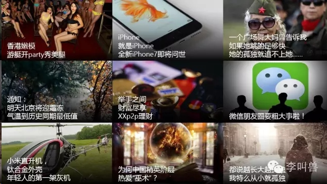

**那么怎么给用户这个“不得不关注你的理由”？**

在这个“注意力稀缺”的时代，到底怎么跟数以亿计的广告、新闻、软文、电影、段子抢夺只有24小时的注意力？

很多人说文案“要有创意”、“要配高质量图片”、“要有场景感”、“要走心”，甚至有的上升到玄学领域，说“文案的关键是要有灵魂”。

**可是，本质的原因到底是什么？**

实际上，任何信息能吸引注意力，是因为它能够用某种方式**“逃”过大脑的信息筛选。**

**我们面临的信息太多，而大脑处理能力有限，所以大脑中有一个海马状突起，扮演信息筛选器的职责，帮我们过滤绝大部分无关信息。**

**海马状突起把我们眼前的绝大部分信息过滤掉，只让少数信息进入注意力。**

比如你看到下面这些信息，可能会首先注意到“炸裂，李叫兽这篇文章是假的”这个信息，它可能比其他信息更加容易通过过滤器的过滤，进入你的大脑。

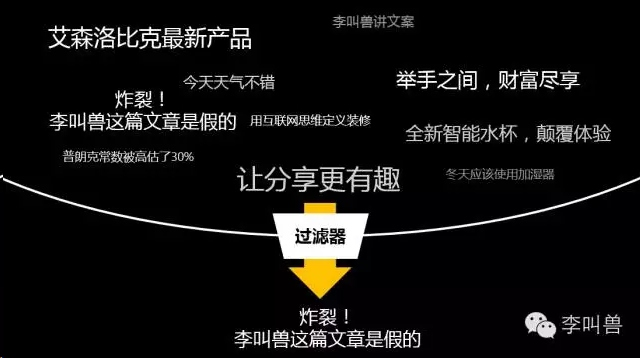

这就是为什么在你毕业的那年，会感觉“今年毕业相关的新闻这么多”，网易新闻上到处都是各个学校的人拍的奇葩毕业照。

实际上并不是那一年毕业的新闻变多了，而是那一年毕业相关的新闻更加容易通过海马状突起的筛选，进入你的大脑，从而让你感觉变多了。

**那么，什么样的信息能够通过海马状突起的筛选呢？大脑到底喜欢什么的信息呢？**

为了生存，一般来说，大脑只关心具备2个属性的信息：**1，与我相关；2，反差信息。**

在长期的进化中，为了生存，大脑只关心与自己密切相关的，并且对反差、变化类的信息异常关心——一动不动的狮子可能你不关心，但一只跑过来的狮子你就得注意了（反差）。

比如下面4类信息，对一个普通的北京市民来说，肯定是右上角的信息更加容易进入大脑：

所以对于写文案吸引注意力来说，就必须满足这两个条件：
**1， 与我相关-绑定“关注圈内的信息”；**

**2， 反差-让关注圈内的信息出现变化**

##1**与我相关-绑定“关注圈”内的信息**
是的，上面说了，人们在乎的永远是自己的事情。在乎的是自己的职位，自己的金钱，自己的晚餐，自己的恋人和自己喜欢的电影。

假设上面这些是用户大脑的关注圈——他们自己的职业、金钱、晚餐等是“与我相关”的信息。

可是我就是一个卖床垫的，就是一个做APP的，本身和用户普遍关注的范围没有关系，怎么办？

毕竟，没有谁闲着没事就关注一个床垫。

那怎么办呢？

**既然产品不在“关注圈”内，可以想办法绑定一个用户关注圈内的内容啊。**

在正常情况下“0压力床垫”抓不了注意力，用户大脑直接就把信息过滤了，转而去关注什么“XX嫖娼被抓”这样的内容。

**但如果你把该信息同用户本来就容易关注的信息进行绑定，就不一样了**——假设所有人都对“美女”信息比较敏感，我们就绑定这样的信息，然后说：

我们对“床垫”这类信息不敏感，它们会被大脑过滤。但即使你是路人，往往也对“腰细臀翘的美女”这种信息比较敏感，它们很容易瞬间进入你的大脑。

所以，如果你的产品本身不在用户的关注圈内，就想办法让你的产品绑定一些“关注圈”内的内容。

**找“关注圈”的内容，把你“领进门”。**

因此，为了避免“写文案的第一个错误”，你在写第一句文案之前，就应该先列出：**我的目标用户，现在正在关注什么？什么信息，容易被他们认为是“与我相关”的？**

**那么人们一般会关注些什么，认为什么信息是“与我相关”的呢？**

（1）人都有一些**固定的长期兴趣**，孩子、美食、性、熟悉的品牌、成功的捷径等。这些长期兴趣相关的信息，很容易进入大脑。

《香港嫩模游艇开party秀美腿》

（2）每个人都关心**自己的切身利益**。

《通知：明天霜冻红色预警，史上最强！》

（3）每个人都不想脱离群体，都想**关心其他人关心什么（热门消息）**。

《最近朋友圈疯转的H5，到底是什么鬼？》

（4）人们关心**和正在做的事情有关的**。

《惊，李叫兽文章出现重大bug！》

（5）**和人们普遍存在的情感有关的。（反对或者支持某件事）**

《这个姑娘发明了一本可以喝的书，改变了6.63亿人的命运》

而你要做的，就是拿你的产品，和这些目标用户关注圈内的信息进行绑定。

###**（1）绑定用户的长期兴趣**

比如前面的0压力床垫本来在关注圈外，通过绑定用户关注圈内的“美女”，就容易吸引注意力。

“腰细臀翘的美女会不会因为腰碰不到床而不舒服？”

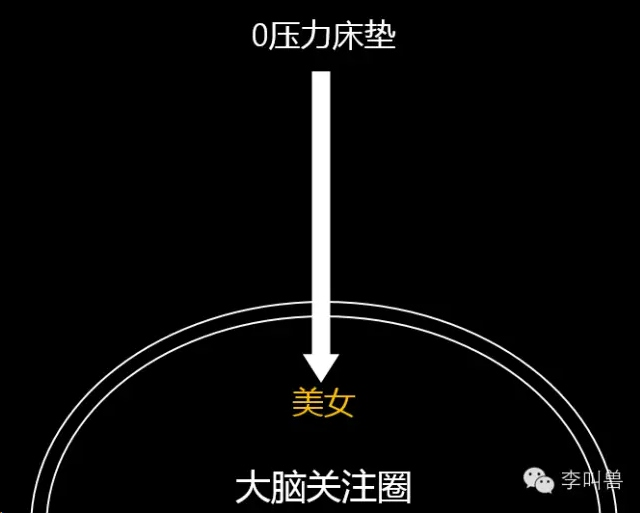

**所有人的大脑一般会对某些信息长期感兴趣，只要让你的产品跟这些长期感兴趣的熟悉信息进行绑定，就容易进入大脑。**

比如：美食、有趣的人物、成功的捷径、孩子、免费、奇闻异事、熟悉的品牌等。

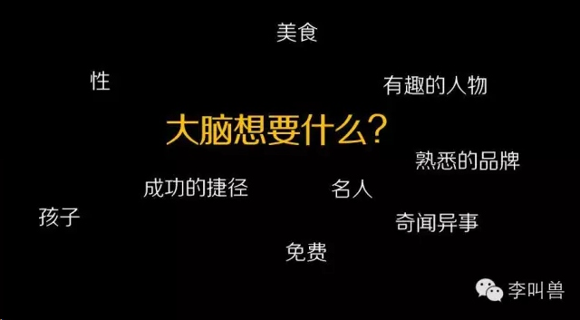

假如你在写一个关于水果的文案，发现这种水果（比如青梅）距离大脑的关注圈有十万八千里。

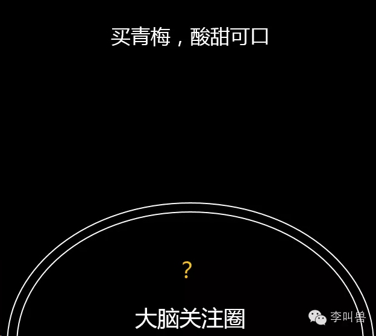

这个时候要做的，就是与关注圈内的某个信息建立联系——比如和青梅有关的“奇闻异事”。

所以有人写文章这么说：

《这种水果，改变了三国格局》

对青梅不关心，但对三国故事关心，所以建立联系就完了——青梅煮酒论英雄。

再比如有人问：李叫兽总是说自嗨文案，同样的文案（比如“再一次改变一切”），苹果说出来就不是自嗨，而我说出来就是自嗨呢？

因为苹果这个品牌通过长期的成功建设，**已经进入了用户的“大脑关注圈”，成为了一大堆用户的“长期兴趣”**，和苹果相关的信息，本身就非常容易进入大脑。

而你的品牌和产品，却往往在这里：

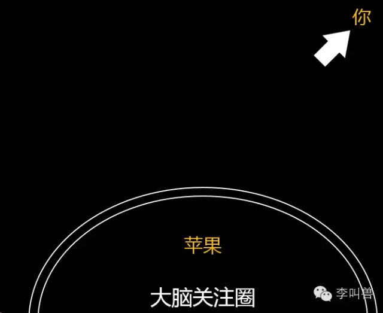

你想引起关注，就不得不先绑定“关注圈”内的某个信息。

当然也的确有人是这样做的：

所以当柯震东成为了一些人的兴趣时，同颜色的键盘也就容易火了，因为和关注圈内的某个信息建立了联系。

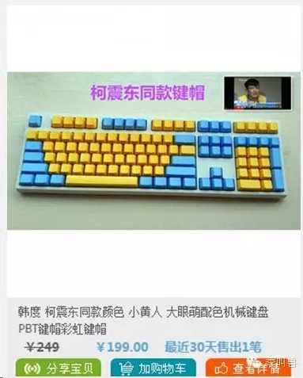

###**（2）****绑定用户的切身利益**

和切身利益有关的，自然容易进入关注圈，所以如果想逃过信息筛选，可以绑定用户的某个切身利益。

比如，下面这些信息本身很难引起用户的关注，毕竟你产品这么好，和我有什么关系？（用户只关心和自己有关的）

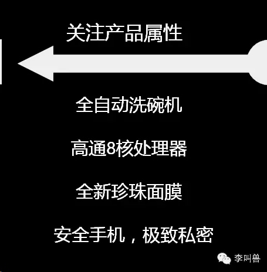

**但是如果和用户关心的“切身利益”进行绑定，这些信息就可以逃过大脑的信息筛选，容易进入大脑了。**

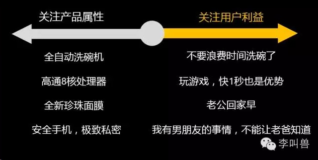

**实际上，各种实验证明，任何一种未被满足的利益，都会捕获大脑，迅速逃过大脑的信息筛选。**

二战快结束时，为了调查人在饥饿状态下的反应，美国的心理学家组织大学生进行一个长达几十天的实验——在一个封闭的训练营中，逐步减少他们的食物供给，让他们处于长期轻微饥饿状态。

这些大学生各有各的理想，有的想成为科学家，有的想成为商人。

但是在经过几十天的轻微饥饿后，心理学家却发现大学生们的态度被极大地改变了：有的人说自己梦想是成为厨师，有的人梦想开个餐厅，有的人想成为农夫——饥饿感改变了他们的理想。

甚至，研究者发现：他们在看电影的时候，**即使电影中有火辣的性爱镜头，他们的关注点却竟然不是性爱，而是男女主角旁边的汉堡。**

当“食物”这个基础利益处于稀缺、未满足状态时，所有和食物有关的信息都捕获了这些人的大脑，比其他任何信息都容易逃过海马状突起的信息筛选。

**所以，如果你想让你的信息进入大脑，一种方法是：与目标用户现在未被满足的某种利益进行绑定，就会发现你的广告可以瞬间进入大脑。**

（ps. 这也是为什么很多60后家长一定要逼迫自己孩子进入事业单位等稳定工作，即使对这个孩子已经是显而易见的不理智选择——他们年轻的时候经历了很多次动荡和被剥夺，长期未被满足的“稳定需求”捕获了他们的大脑，改变了态度，就像实验中饥饿改变了大学生的理想。）

###**（3）绑定其他人关心的信息**

所有人都不想脱离群体，如果一个信息是被很多人关注的，那么和它相关的一切都更加容易进入大脑。

比如“验证算法服务，精准有效”这种信息本来很难进入大脑，就可以想办法绑定一个大家都在关注的信息，从而逃过大脑的信息筛选。

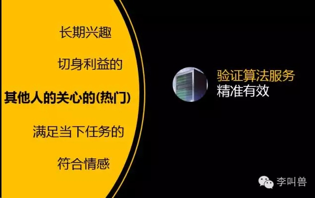

关于验证算法大家有什么普遍关心的热门？

前段时间大家都在关心12306验证码，所以你可以说：

再比如李叫兽之前有个文章《品牌有哪些基本款人格》，详细讲述了品牌人格的构成，其实可以帮助很多人规划品牌，但因为没有绑定关注圈内的内容，导致看的人比较少。

但是如果绑定当时的某个大家普遍关心的内容（比如小米百货开张），就可能引起更大关注：

《有10个公司曾跟小米走一样的路线》

绑定一个其他人正在关心的内容，逃过大脑信息筛选**——到了这里，聪明的人就反应过来了：这尼玛不就是很多人说的“借势营销”吗？**

是的，很多借势营销之所以容易引起关注，就是因为“大家都在关心的内容”本身就是大脑关注圈内的，其他内容，一旦与它们成功绑定，就容易逃过海马状突起的信息筛选。

举个例子。

**假设你当时看到无数朋友疯转和哀悼这样一个新闻：**

《天津塘沽发生大爆炸》

**就在同样几天，网易新闻同时滚动了这两条新闻：**

《天津塘沽一学霸高中即获得艾菲奖》

《上海浦东一学霸高中即获得艾菲奖》

你的大脑首先会关注哪条新闻？

我想只要你不是上海人，一般是关注第一条。

为什么呢？**因为天津爆炸的新闻，让“天津塘沽”这样一个地点进入了大脑的关注圈，与它相关的信息自然也容易进入关注圈。**

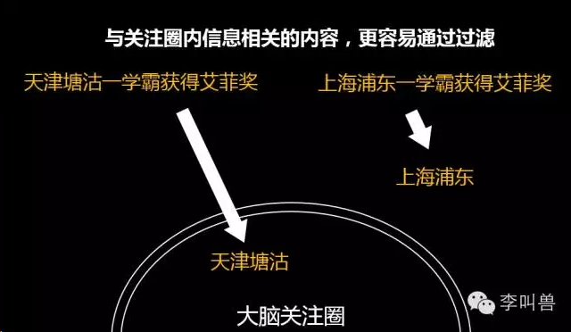

而“上海浦东”这个地理信息，就没有进入大众的关注圈。

###**（4)绑定当下任务**

当人们处于某个情景，正在完成某件任务的时候，与该任务无关的信息更容易被海马状突起过滤。

而如果某个信息和当下任务有关，就容易进入大脑的关注圈。

这就是为什么前面讲过的这个信息容易逃过过滤：

《炸裂！李叫兽这篇文章是假的》在平时你可能不会关注，但是现在因为你在看李叫兽的文章，与你当下的任务有关，它就会通过大脑过滤，进入关注圈。

（ps.另一个原因是这个信息还具备反差性，下面会讲。）

人的大脑很容易过滤掉与当下任务无关的信息。

有个著名的心理学实验，“看不见的大猩猩”证明了这一点：

在实验中，被试者需要看一段打篮球的视频，在看视频前，他们被分配了一个任务：**数数白色衣服的人一共传了多少次球。**

实验开始了，被试者聚精会神地数传球次数。结果到了实验结束，心理学家文他们：**你们有看到视频中走过并且跳舞的大猩猩吗？**

**结果超过一半的人回答没有看到**——他们聚焦完成数球的任务，“大猩猩”这么大一个反常信息都没有进入他们大脑。

实际上，很多情景相关的广告，经常绑定人们在看广告时正在完成的任务。

比如大学考试临近，学生们忙着复习，这个时候和辛苦复习这个任务有关的信息就容易进入他们大脑，所以饿了么有个海报是这样设计的：

而失败的，很难进入大脑的广告，则经常忽略人们看广告情景中要完成的任务：

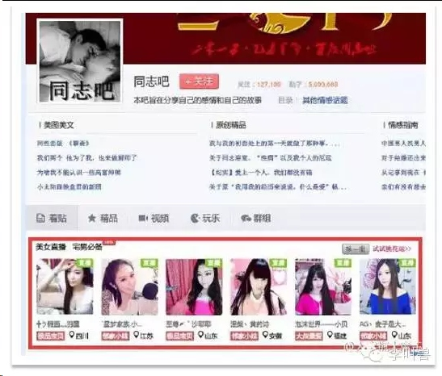

（图：同志吧里面的美女直播广告）

###**（5)绑定情感**

每个人都有自己的喜好，都有自己支持、反对、愤怒的事物，这类情感信息，往往是处于关注圈内的，容易通过大脑的信息筛选。

**如果与任何一种普遍存在的情感、情绪进行绑定，也容易逃过大脑的信息筛选。**

比如：

某课程价格很便宜，这类促销信息如此之多，可能已经难以进入大脑。

但是如果跟已经有的情感进行绑定，表达了对某种事物的支持反对，就容易进入大脑：

（图：老罗英语培训绑定“人吐槽通货膨胀”这种情绪）

再比如李叫兽之前设计南孚的新媒体海报时，也是遇到类似问题：

电池是微不足道的物体，日常也看不见它，距离人大脑的关注圈，简直得有5公里那么远。（即使同样的广告，手机广告都比电池广告容易进入大脑）

好吧，只能一步步推进，既然电池距离关注圈5公里，那么电池相关的电器可能会距离近一点吧？所以文案要借助电池用的电器。

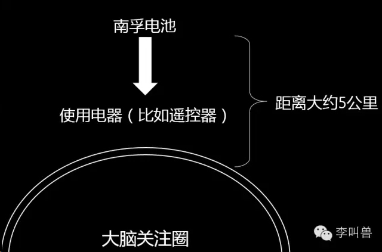

但是这仍然不行啊，电器距离关注圈估计还有一公里——没有人闲着没事刷微博的时候对电器感兴趣。

最后一公里问题怎么解决？

其实可以通过电器来绑定某个情感（比如吐槽感情失落）。

比如其中一个文案是这样的（ps一共8个版本）：

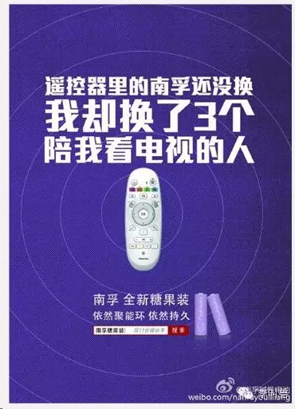

**总之，用户只关心跟自己有关的信息，他们大脑有一个关注圈，你的产品是关注圈内的吗？是已经被用户认为和自己有关吗？（像苹果那样）**

**如果没有，又想逃过海马状突起的筛选，请老老实实绑定关注圈内的某个信息。**

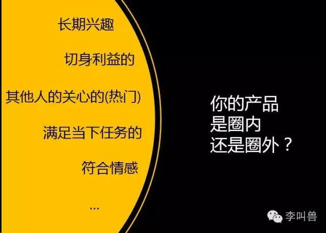

##2反差-让关注圈内的信息出现变化

刚刚讲了：让你的产品信息绑定用户关注圈内的某个内容，**这是因为用户真正关心的是自己**——自己的兴趣、自己热爱的明星、自己的利益、自己的情感、自己的任务等。

但实际上这样仍然不够，你还需要让关注圈内的信息出现反差和变化，**大脑往往对一成不变的信息麻木，而对反差、变化的信息比较敏感。**

这就是为什么《惊！李叫兽文章是假的！》容易引起你现在的关注——不光是跟正在做的事情（看文章）有关，还是反差信息。

也就是说，你的文案要很明显让人感觉到，你在跟什么对比——时间对比？大小对比？其他对手对比？

比如今日头条的slogan“你关心的，才是头条”，很明显让人知道是在跟什么对比——没有个性化推荐引擎的新闻客户端。

**而大多数文案，只是在说“绝对正确的话”，缺乏反差对比：**

对比的方式有很多种，比如：之前VS之后、最大VS最小、有VS没有、快VS慢等，而你需要做的，仅仅是把之前的“关注圈”模型变成一个矩阵，加入这些对比。

比如“切身利益”的减少：

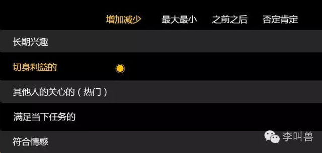

**某个台湾钢琴学校的文案：“学钢琴的孩子，不会太坏。”**

比如对其他人关心事物的否定：

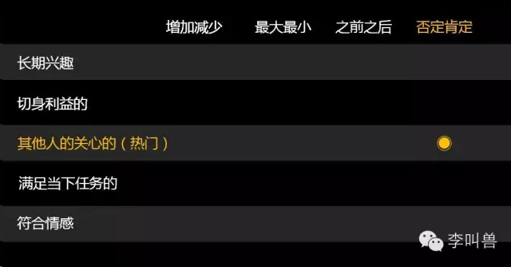

《为什么说，“可以喝的书”其实是忽悠》

（篇幅所限，别的例子方法不多说了，反正我想你也会了。）

**结 语**

记住，今天讲了最关键的一点：

大部分人在第一句文案之前，就犯了第一错误——你认为你的用户对你很关心，但其实不是。

**实际上，他们大脑中的海马状突起，帮他们过滤了绝大部分信息（可能包含你的文案），而作为文案人第一笔要解决的，就是：如何逃过这种过滤。**

如何逃呢？

**进化的原因，海马状突起能够放行的信息，一般具备两个特点：1，与我相关（关注圈内）；2，反差。**

所以，你要想办法让产品信息绑定用户的关注圈。

这还不能完，还得是关注圈内的反差信息。

否则就容易自嗨。

毕竟，与海马状突起战斗，是每个营销人的光荣使命！

- - - - - - - - - - -

写在后面：

李叫兽文案解冻三部曲至此全部更新完毕。请期待下次的李叫兽独家方法！

导读：

[解冻三部曲第一部：不要让用户关注你的产品，先让他们关注自己](http://mp.weixin.qq.com/s?__biz=MzA5NTMxOTczOA==&mid=401148893&idx=1&sn=b3225b36fa34045cafdb09c2a21b000a&scene=21#wechat_redirect)

[解冻三部曲第二部：为什么有些文案怪怪的？](http://mp.weixin.qq.com/s?__biz=MzA5NTMxOTczOA==&mid=401258543&idx=1&sn=ab481b57097ffa209017374e84b9809d&scene=21#wechat_redirect)