#【李叫兽】文案的策略性：只顾KPI的文案没有用
原创 *2015-09-23* *李靖* [李叫兽](https://mp.weixin.qq.com/s?__biz=MzA5NTMxOTczOA==&mid=208729968&idx=1&sn=6f06a47c936ff0f23537ab76a9575c1d&scene=21&key=5aaf2501774a6b9f86cda5d67387cf97581b0f1dd14bf6cf0a9f5701ef7d3e0f31e07a1f8dd4fab307c3544a820b5f47c1a0c765182c0ce52e551d4d5648f2fc0413b23fbc3e1f4e450bc81e38193049&ascene=7&uin=MTc4OTM3ODkzOA%3D%3D&devicetype=Windows+7&version=6203005d&pass_ticket=V5w3mkkLQcmNI8VtqJK0C1erJipHSMkFDXxkSrQt9dQbXsQ8haTP3Q1NJmbFLNhV&winzoom=1##)

> 原文链接：http://mp.weixin.qq.com/s/CGdRMk898q_nWWaUTE-nSw

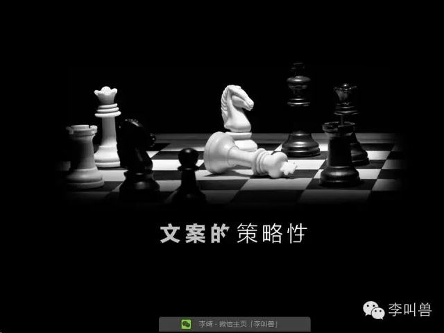

李叫兽在Weltwater做了个在线分享演讲。主题为《文案的策略性：为什么文案不要只看KPI？》以下为主要文字内容和演讲视频（在最后）。

**一说到文案，大部分人想到的都是『文字走心』，『疯狂转发』，就好像只要满足了这些KPI的文案就是好文案。**

而今天我就讲讲：文案不只是有看得见的KPI，更有看不见的策略性。

在开始之前，先讲个故事：

假设你是神州专车的市场人员，被要求策划一个营销活动以及配套文案。

经过了一个下午的头脑风暴，你的团队想了这个创意：

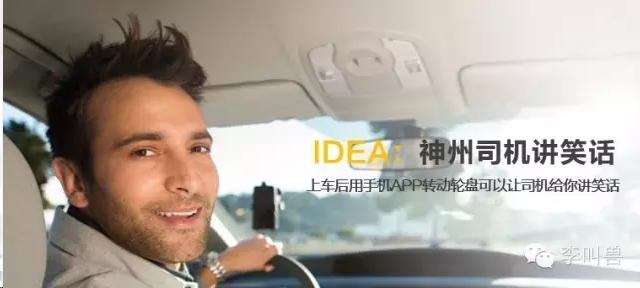

『神州司机讲笑话活动』：上车后，拥堵的等车时间，手机APP转动轮盘抽奖，可以让司机现场给你讲笑话。

然后，经过详细的策划、执行和推广后，该营销活动和文案取得了非常喜人的成果：

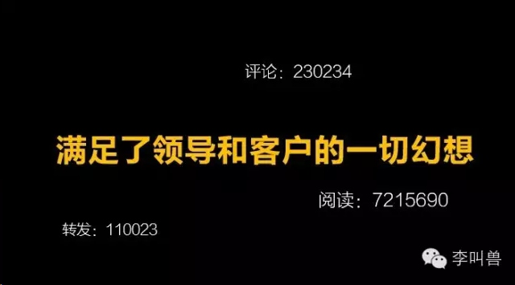

转发11万多；

评论23万多；

阅读700多万……

**这个结果满足了领导和客户，对营销人员的一切幻想：**

不是要转发量吗？不是要社会化轰动吗？不是要考核我这个月的KPI吗？

现在全部都给你。

可是，等等，这个方案有什么问题吗？

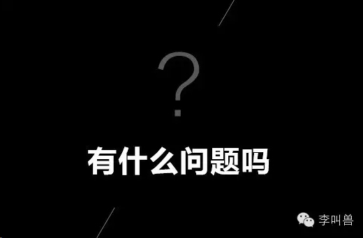

这个方案虽然取得了KPI数据上的胜利，但是实际上可能并不是好方案，因为它不具备策略性。

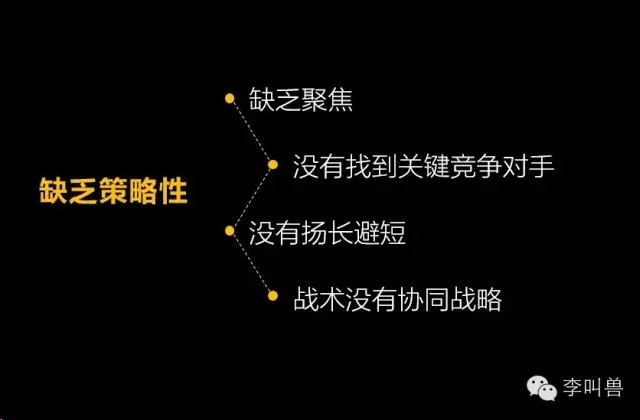

比如：

**没有扬长避短**——神州专车的优势是『全部是自家车辆，专业司机』，而它的竞争对手优势是『走平台模式，车辆来源广』。

这个营销活动主打『有趣』，并没有利用神州的优势，反而更像竞争对手的优势（他们有各种形形色色司机——投资人、歌手等，更适合搞有趣的活动）

**战术没有协同战略**——神州专车的战略是『塑造安全专车的形象，并让更多人认为安全重要』，而营销策划一个有趣的活动不仅与公司的主要战略没有关系，还会减少战略的有效性（更多人反而会觉得有趣更重要）。

也是是说：**刚刚策划的创意活动，并不是一个好方案，但是却是最容易得到通过的方案。**

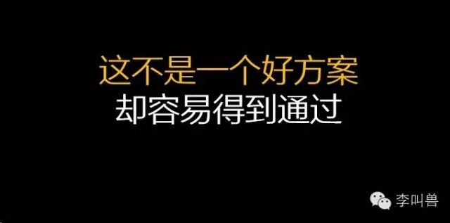

**因为『策略性』虽然重要，但是却经常在开会时被所有人阻挡在讨论圈以外。**

在大部分会议中，好像你只能讨论『转发量』『传播量』和『走心文案』，而一旦你开始讨论策略问题，就会被扣上『假大空』『不接地气』的帽子。

为什么？

他们其实不知道，**文案的写作其实有2个关键的层级：**

**一个是你看得见的，也容易用KPI衡量，但是相对不是最重要的『表现层』**：文案是否朗朗上口？文采好不好？转发高不高？

**另一个是你看不见，但是却非常重要的『策略层』：**你的文案是否有战略聚焦？是否定位到了关键竞争对手？是否扬长避短？是否战术协同战略？

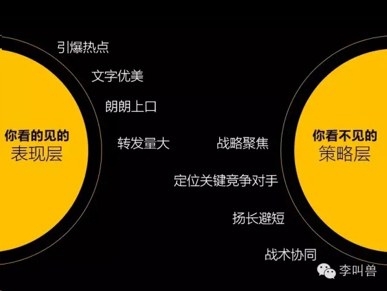

大部分时候，当我们讨论文案的时候，我们讨论的是『可见层』，是文字优美、语言走心和转发量大。这并不是因为这些『可见层』非常重要，而是因为它们更加容易被看到。

然而就像一个童话书《小王子》里说的：

**『最重要的东西，用眼睛是看不见的。』**

战略聚焦、定位关键竞争对手、扬长避短、战术协同——这些虽然看不见，虽然让人无法制定KPI，但是却是最重要的。

**而我们今天讨论的，就是这些看不见却很重要的策略思维——如何让你的文案具备策略性：**

###一，**战略聚焦**

当我讲到战略的时候，首先想说的就是：

**战略的第一步是放弃。**

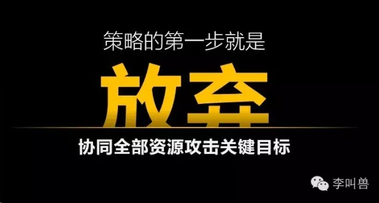

战略并不是列出你的理想愿望清单，然后一个又一个去实现。而是协同你的关键资源，选择实现一些重要目标，放弃其他目标。

**真正有效的好战略，从来都不是使用所有的资源去达成所有的目标，而是选择战略性聚焦关键目标并且让所有的资源为其让步。**

在军事领域，这是重要的金科玉律。

1991年的海湾战争，美军开展了『沙漠风暴』行动，使用『正面佯攻、侧面包抄』这样一个简单无比的战略，骗过了萨达姆，以极小地代价赢得了战争。

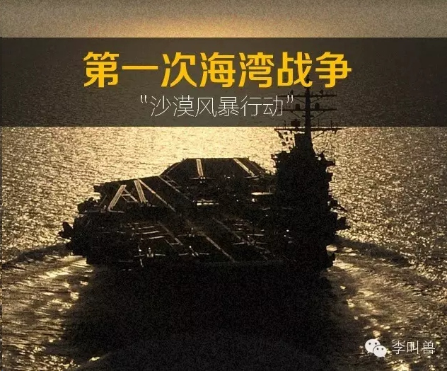

（美军击溃了54万伊拉克兵力，只用了100小时，而且首日伤亡只有8个人。）

很多人觉得这样的战略非常简单，谁也能做到，但是其实不是——这**个战略难就难在，它是一个如此单一、聚焦的战略，而这样的战略非常难以割舍和执行。**

当时的将军，为了执行这一战略，让8000名美国最高傲的海军陆战队在波斯湾打酱油，让美军精英的空降师仅仅作为佯兵，否决了空军提出的『同时攻打巴格达计划』……

总之，当时的战略**放弃了一大堆资源（比如海军陆战队），放弃了一大堆其他目标（比如空炸巴格达）**，并且压制了所有不符合主要战略的提议，而这种割舍和聚焦，几乎难以被复制。

**『战略的第一步是放弃』——当你聚焦关键资源去攻击少数而单一的正确目标，往往可以收获可喜的成果。**

**相反，想要同时实现多个互相冲突的目标，就会陷入被动，最终无法实现任何一个目标。**

而就文案来说，我遇到的最多的情况就是——写文案的人妄图同时实现多个目标，无法进行战略聚焦。

比如这张框架海报（放在电梯里）：

这样放在电梯里的海报存在什么问题呢？

**存在的最大问题就是：资源不多（消费者看海报也就3秒），但是却想要实现又大又多的目标。**

首先，这个海报主文案『用脉脉实现职业梦想』所体现的战略目标太大——占据『实现职业梦想』的这个概念。

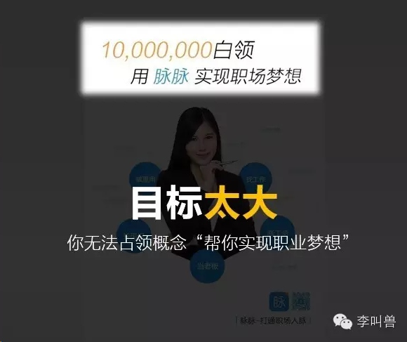

而脉脉能够有效地占据这个概念吗？

其实百度一下就能知道。

**我百度了下『实现职业梦想』，发现了数以百计的公司在打这个概念，其中包括各种培训机构、商学院、书籍……甚至还有买西装的：**

这就意味着，作为一个职场社交类的创业公司，不太可能直接占据『实现职业梦想』。

毕竟，当你想到『职业梦想』，脑中浮现出的第一个产品可能是『培训机构』或者『猎头公司』，而不太可能是一款社交APP。

**而这样的文案就是缺乏策略性的。**

**策略意味着聚焦，而很多明明是细分市场的小产品不断通过文案表达出自己永远不可能占据的概念：**

- 只为健康生活；
- XX，休闲人生；
- 让生活更便捷……

甚至还有产品直接说：『让生活更美好』

**（这个市场足有整个中国的GDP这么大，因为所有的产品都可以说『让生活更美好』）。**

**
**

**这强烈体现了一个文案人的懒惰、难以割舍、缺乏基本的策略思维。**

相反，通过策略性地聚焦，尝试通过文案或Slogan占据一个优势概念，就会通过上面的『百度搜索测试』。

比如你搜『怕上火，喝』，就会发现：**除了加多宝就是王老吉。**

这意味着真正地占据了『怕上火』这个概念，而没人能够真正占据『生活美好』这个概念。

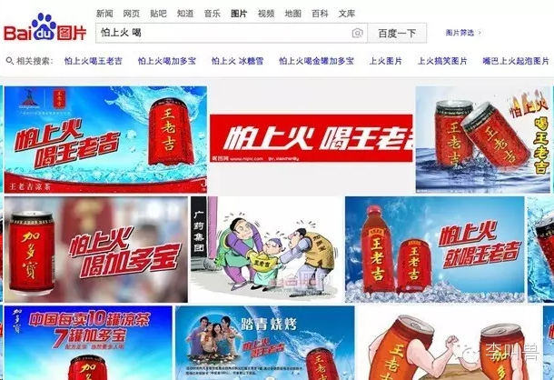

我想，如果回到十几年前，让『缺乏策略性』的文案人来写王老吉的文案，可能会写：

除此之外，上面脉脉框架海报还存在的策略问题是：**过于分散的目标。**

战略意味着放弃一些目标，集中优势资源去攻击另一些目标，而脉脉海报上却同时体现了5个并没有明显联系的目标：

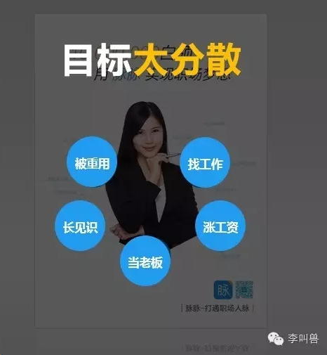

**而这样的话，其实不叫『战略』，只能叫『理想目标清单』**——你在写文案的时候，先找到自己所有的理想目标（比如让消费者知道涨工资、当老板、长见识等），然后认为剩下的事情就是把理想目标清单列进去。

但是，战略不等于理想目标清单。

把全部的理想目标列到文案里，最终可能导致的就是消费者对任何一个都没有建立印象。

比如『找工作』，消费者如何感受到『脉脉可以帮我找工作』呢？

**他的大脑首先应该被唤起自己需要找工作的需求（痛点），然后想象出自己找工作的过程，接着了解脉脉的具体功能……最终，他大脑才能浮现出一幅找工作的画面。**

这整个过程可能需要5秒，然后接下来还要依次感受到『涨工资』、『长见识』、『当老板』……（估计总共花费30秒都难以记住）

**而消费者可能只会看整个海报3秒钟**——这就意味着3秒内，消费者可能眼睛会扫过这些信息，但是没有一个在大脑中留下了显著的印象。

这就意味着你必须要割舍，策略性地使用消费者的这3秒钟。

**所以，战略不等于理想目标清单**——如果用户只能看你3秒钟，你需要策略性、有所取舍地使用这3秒钟，而不是把全部的理想目标都放进去。

###二，**定位关键竞争对手**

**当考虑文案策略时，你还需要考虑『我的竞争对手到底是谁』——我到底要从谁那里把顾客抢回来。**

如果错误地定位了竞争对手，就可能会导致文案在策略上失效。

举个例子。

假设在某个商城5楼有电影院，然后它在商城的2楼挂了个牌子，上面写：

这个文案有什么问题吗？

它最关键的问题就是——**没有定位到正确的竞争对手。**

通过文案『可能是北京最好的电影院』可以看出，它想要通过证明自己比其他电影院好，来跟其他电影院抢市场。

而这时应该回到看这个文案的真实用户上——**他们此时面临的选择是什么？**

既然是商城里面的文案广告，那么大部分用户面临的选择应该是：

**『我到底是继续逛服装店，还是去4楼咖啡厅喝一杯，还是去5楼看个电影』**

而不是：

**『想看电影，到底是应该去5楼的电影院，还是打车去3公里外的电影院？』**

既然这样，对这个文案的情景来说，这家电影院的竞争对手应该是『同在一个商城的咖啡厅、服装店、电玩城』，而不是其他电影院。

那么基于这个竞争策略，可以使用的文案可能是：

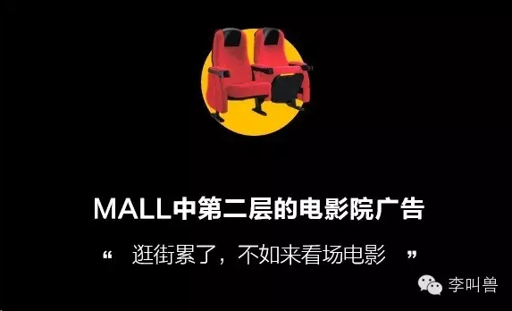

（只需要让用户想要看电影就行了）

而如果这个广告文案是放在『电影团购网站』上，自然就不适合这样说——『废话，我要是不想看电影，干嘛来电影团购网站』。

这时，你真正的竞争对手就变成其他电影院，而本来的竞争对手——**同一个商城的咖啡厅、服装店等，就变成了你的『合作者』而不是竞争对手。**

这个时候你就可以说：

**『不仅可以看电影，更有全城最浪漫的餐厅』**

（PS. 当然，暂且不考虑广告法问题，哈哈）

很多人认为『竞争对手』就是自己的同行，其实不是。**竞争对手是一切跟你争夺客户资源的东西，在某个情境下，谁跟你争夺客户资源，谁就是你的竞争对手。**

比如专车行业刚起来的时候，神州专车面临的问题是『大部分人不习惯坐专车』，那么它真正的关键竞争对手就是出租车、地铁、公交等其他交通工具，文案也应该是呼吁人坐专车。

到了后来专车行业逐渐成熟，它的竞争对手就变成了优步、滴滴等其他品牌的专车，整个文案的策略也就相应地改变——强调坐专车就要坐安全的。

所以，写文案前，需要找到自己最关键的竞争对手，才能通过文案的力量，帮你在竞争对手那里抢来顾客。

###三，**扬长避短**
任何策略，在长期行之有效的前提就是『扬长避短』。

扬长避短就是想办法找到一个有利战场，在这个战场内，**自己的优势变得更加重要，而劣势变得不那么重要。**

**只有想办法创造自己的有利战场，才有可能以弱胜强。**

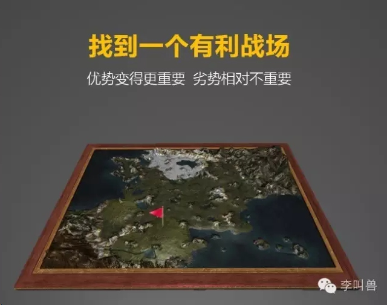

而不是想办法弥补自己的劣势，跟别人斗争。

所有人都知道神话中『大卫战胜歌利亚』的故事——弱小身体的大卫战胜了威武雄壮的歌利亚。

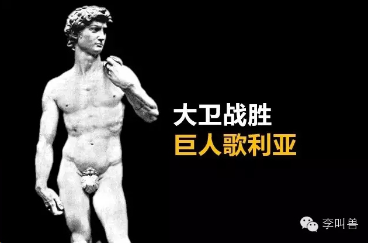

在大卫出征前，周围人都知道大卫太过于弱小，因此劝他穿上更厚的盔甲。

但是大卫知道，**穿上盔甲只不过是在弥补自己的劣势（防御小、身材小），而这个劣势无论怎么弥补都不会改变最终结果**——更厚的盔甲可以帮他多挡几下续命，但是不能不能扭转败局。

而他真正需要做的，**是想办法找到一个有利战场，能够发挥自己的优势**——身材灵活、速度快、投射准。

所以大卫反其道而行之，脱下了盔甲以最大化速度优势，选择了远程投石攻击（对自己的有利战场），最终战胜了歌利亚。

**大卫没有一味地想办法在对方擅长的战场，以自己的劣势跟对方斗争。**

**而是『找到自己的有利战场』——远程攻击，在这个战场内，自己的所有优势（身材小、速度快、投射准）都可以得到最大化发挥，而竞争对手歌利亚的所有优势（身材高大、强壮等）都发挥不出来，甚至身材高大在新的战场变成了『劣势』——靶子更大。**

当你找到自己的有利战场，你就会限制竞争对手的发挥，而最大化自己的优势。

而这就是『扬长避短』。

这就是为什么一开始为神州提出的『神州司机讲笑话』创意是缺乏策略性的——**它没有扬长避短。**

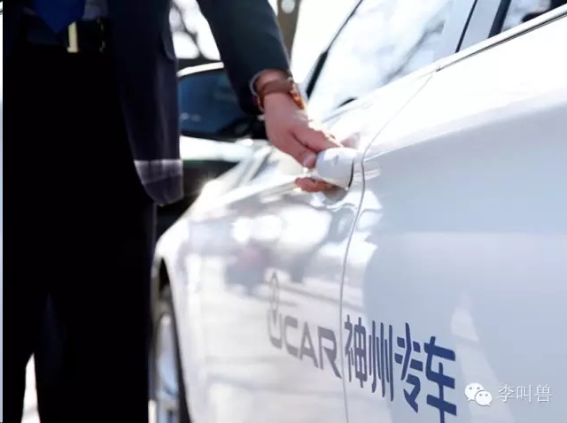

**这个营销活动会让更多的用户认为『专车就应该有趣』，而这其实是掉入了别人的有利战场（就像大卫跟歌利亚打近战一样）**

**——竞争对手的专车走的是平台模式，司机来源广泛，意味着它们更加容易策划出有趣的营销活动。**

它们的司机可能是投资人、夜店歌手、退休老大爷……这意味着即使不投入任何营销预算，都会产生很多有趣的营销点。

**而神州司机全部都是招聘的专业司机，策划有趣活动是天然的劣势。**如果在这个战场跟别人竞争，几乎永远也不可能胜利。

『你投资100万搞一个有趣的营销活动，别人可能不花钱就能办到』

那么怎么办呢？

扬长避短的关键方法是——**改变消费者的心智和行为，使之变得对自己更有利。**

既然神州专车的特点是『全部是自有司机』，优势是给人一种安全稳定的感觉，那么只要想办法让更多消费者认为『安全很重要，有趣不重要』，自然就会占据优势。

所以神州专车才重新定位为『安全专车』，以创造有利战场。

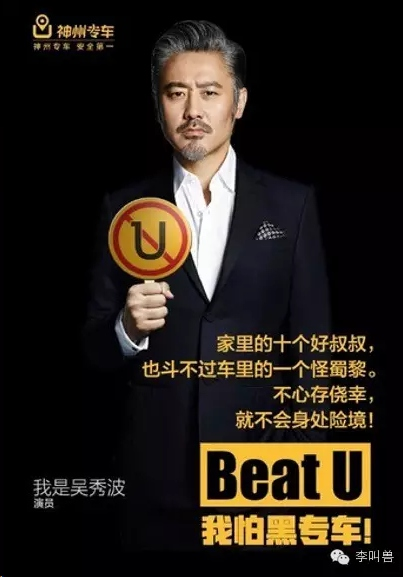

**所以，我的目标并不是证明『我比你还有趣』，而是让更多的消费者认为『安全比有趣更重要』，然后在安全这个有利战场，利用我的优势打败你。**

这就是扬长避短的策略。

然而这并不符合大部分人的直觉反应。（因为好战略本身就是反直觉的）

大部分人，看到某些友商通过大量的有趣营销活动变得逐渐火爆，你产生的第一直觉就是——**我也要策划类似的活动，也要火起来。**

**只有少数人才会去思考：什么是我的优势之源？如何找到我的有利战场？如何改变消费者的观点，使之对我更有利？**

再比如我在给一款创新的小睡枕头『睡小宝』写产品文案的时候，周围大部分人一开始想到的文案是：

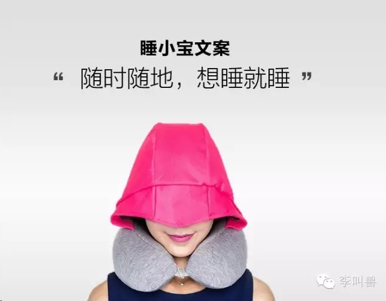

他们觉得『文案就是要说出消费者心中的那句话』，而这句话描绘了消费者在使用U型枕的那句话。

但是文案的目标并不是为了『写出消费者心中那句话』，而是为了『最大化达成战略目标』，文案不是让人舒服的诗歌，而是占领市场、击败竞争对手的手段。

所以，我的第一反应是：**这个文案具备策略性吗？有没有扬长避短？**

**首先，『随时随地，想睡就睡』体现的是产品的便携性。**

而经过分析，这款产品真正的竞争优势并不是『便携性』，而是『舒适性』——它的关键竞争对手是大量的淘宝货，而它们没有帽子，反而给人一种更加便捷的感觉。

所以，我们应该改变消费者，把他们拉回到『舒适性』这个有利战场上来。

因此最终的文案就是：

扬长避短，就要想办法改变用户，使情况对自己更有利。

再比如我遇到的一个做彩色隐形眼镜（美瞳）的客户，叫米欧米，让我来分析它和竞品的文案策略。

**比起它的主要竞品，米欧米的特点是这样的：**

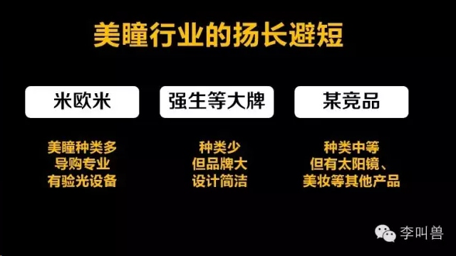

它的有利战场是什么？

自然是：**消费者经常换美瞳，渴望用不同的美瞳。**

如果更多消费者渴望用各种花样的美瞳，那么米欧米产品品类多、导购专业等竞争优势就会最大化发挥，而竞争对手在设计简洁的优势就发挥不出来。

所以米欧米可以说：

**『你会在办公室和夜店穿一样的衣服吗？当然不会。眼睛的形象同等重要，所以你也不应该在办公室和夜店使用一样的美瞳』**

只要更多的人像换衣服一样换美瞳，那么米欧米就赢了。

###四，**战术协同**

通过定位竞争对手、扬长避短等方式找到你的有利战场，制定了文案策略后，最关键的一步就是：**让战术行动能够协同战略。**

> 如果战术不能协同战略，战略就会变成一句口号。

比如【李叫兽研究会】曾接过静心口服液战略转型的项目。

静心口服液过去定位『更年治疗』的形象，销售受到限制，因为很多人认为这是药，而是药三分毒，不能经常喝。（即使它可以每天都喝）

所以需要转型成『更年调养』的形象，让大众理解：静心是保健品而不是药品，是用来调养的。

**这个时候，我就看到有学员写了一组看起来不错的文案：**

（下面仅仅是大致内容思路）

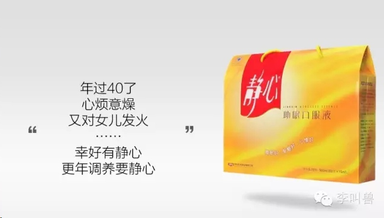

那么这个文案存在的问题是什么呢？

存在的问题就是：**文案仅仅是在文字上把『治疗』改成『调养』，并没有在整个体系上协同新的战略。**

也就是说：战术行动（文案）并没有协同战略。

怎么说？

我们都知道，提升任何一个事物的效果都有两种思路：一种是降低负面，另一种是提升正面。

比如公司管理，降低负面就是『控制、绩效考核、惩罚』，提升正面就是『激励员工、鼓励创新』，这两种方式都可以带来绩效提升。

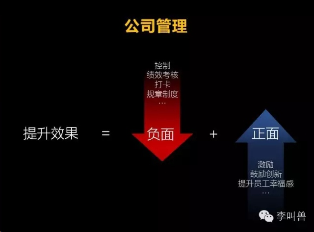

同样，我们的身体健康也是这样：

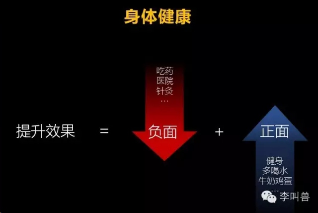

而左边的形象就是过去的静心——『更年治疗』，给人吃药打针的感觉；右边的形象就是要转型的静心——『更年调养』，更加像健身、牛奶、鸡蛋。

**同样，这两种方式所使用的人物形象也不一样：**

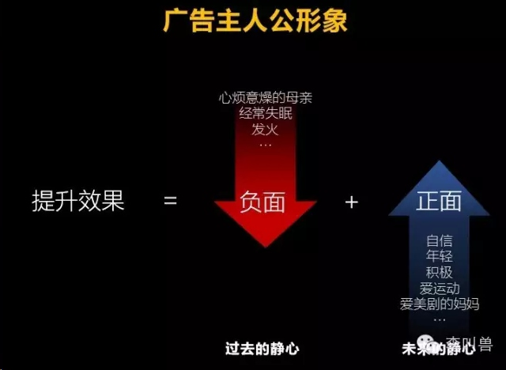

满足的消费者诉求也不一样：

所以，可以看到：前面的文案虽然把文字从『更年治疗』换成了『更年调养』，但是并没有在整个广告形象、诉求表达等方面协同整个新战略。

既然前面说『年过40，整天发火』，那么带给人的就是一种『要治疗』的感觉，仍然会掉回到之前的『降低负面』的定位中。

也就是说：**文案的战术行动，并没有完整地协同战略。**

战略不是口号，不是会议文件，不是一个PPT，而是企业一切行动的指导方针。战略定出来了，就意味着一切的活动都要协同整个战略。

**否则，缺乏战术协同的战略，就会沦为一句口号。**

神州重新定位为『安全专车』，就意味着所有的文案都要强化『安全』这个定位，意味着会议上讨论的所有关于『有趣』、『专车奇遇记』等文案创意，全部都需要被压制。

即使你真的想出一个关于『专车浪漫邂逅』的伟大创意，也需要把它进行转变，变成强化安全定位。

所以神州有一个框架视频广告是这样的（PS. 微信插入视频不方便，各位长按识别二维码看吧）：

总之，文案永远只是一种战术层面的企业行为，它必须符合企业的战略。

可以因为企业的战略抹杀一个好创意，但是不能因为单纯想到一个好的传播文案，就为之改变战略。

这就像如果发现给孩子买的好看衣服不合适，你应该把衣服换了，而不是把孩子换了。

因为『衣服』是一种战术，而『孩子』是一种战略。（PS.至少对很多父母来说是的）

**结语**

文案并不是仅仅为了满足KPI（传播多少？转发多少？），而是为了最大化帮助企业的战略，成为一个公司强化优势、扭转局势的工具。

而为了做到这一点，在文案的讨论中，战略就不应该被规避到讨论圈以外——它虽然看不见，但是真的很重要。

李叫兽。

**下面是演讲视频（粗剪版）：**

<iframe allowfullscreen="" class="video_iframe" data-src="https://v.qq.com/iframe/preview.html?vid=e016671xsxf&amp;width=500&amp;height=375&amp;auto=0" frameborder="0" height="501" scrolling="no" src="https://v.qq.com/iframe/player.html?vid=e016671xsxf&amp;width=668&amp;height=501&amp;auto=0&amp;encryptVer=6.0&amp;platform=61001&amp;cKey=2/sKP6zWXhoYuja5sgChvBvazCfz9mHmH0dH3mei5S7mWdV9l3M6I1HGhjtsi80t" style="margin: 0px; padding: 0px; max-width: 100%; box-sizing: border-box !important; word-wrap: break-word !important; display: block; z-index: 1; width: 668px !important; height: 501px !important; overflow: hidden;" width="668"></iframe>
