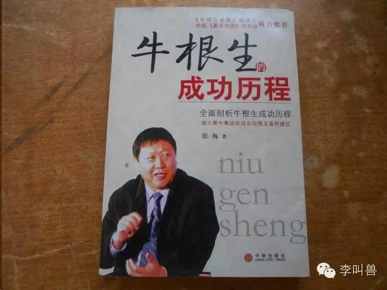

#【李叫兽】“放弃30万年薪去创业”：常见创业故事的5大惯用情节
*2015-03-17* *李靖* [李叫兽](https://mp.weixin.qq.com/s?__biz=MzA5NTMxOTczOA==&mid=203723600&idx=1&sn=a99b0a030a0ea6379e02228f23dfcf5d&scene=21&key=1a602d525bf2cc7ae0e509bb71fe2c59534f87594da5b8117257f60872e1b499dadc0a6ffbe633374ab178732023d950d0bbaff3f639585a492f6861a635c36f72356ebfa68d48ad53d96bc884e1f49c&ascene=7&uin=MTc4OTM3ODkzOA%3D%3D&devicetype=Windows+7&version=6203005d&pass_ticket=V5w3mkkLQcmNI8VtqJK0C1erJipHSMkFDXxkSrQt9dQbXsQ8haTP3Q1NJmbFLNhV&winzoom=1##)

> 原文链接：http://mp.weixin.qq.com/s/SKoC4v80YRxDOl0Gb0v4Pg

《一个北大硕士毕业生的自述：我为什么卖米粉》《对不起，我只过1%的生活－伟大的安妮》《三里屯从此多了一家价格很奇葩的酸奶公司》《我为什么在22岁辞去年薪150万的工作》……
**无数互联网创业者初期靠自己的“创业故事”赚得眼球，在社交网络大量传播。甚至有“产品未到，故事先行”的势头。**
实际上，这样的做法并不新鲜，几乎每个大品牌背后都有一个“心灵鸡汤”式的故事。
肯德基当年有“创始人推销炸鸡秘方被无数快餐店拒绝”的故事，换成现在，估计标题就是**《被拒绝1009次炸鸡秘方：65岁的老人为什么能坚持到最后》**

蒙牛当年的牛根生有“被伊利辞退，然后创蒙牛东山再起”的故事，换成现在，估计标题就是《**被辞退的伊利副总裁：我为什么要把我输掉的赢回来》**

就连孙中山当年都有“弃医从政”的故事，换成现在，估计其微信公众号发文的标题就是**《香港毕业的高薪西医：我为什么放弃稳定工作》**

细看每个在互联网上广泛传播的创业故事，无不是跌宕起伏、惊心动魄、扣人心全、拍案叫绝，几乎都是活生生的电影剧本。
而这些故事的传播对其初期品牌的构建、产品的营销起了非常大的作用—**几乎是效果最好的免费广告。**
好的创业故事就像好电影一样，能够把观众带入故事的情节，**让观众的心理跟着故事的主人公“起起伏伏”，甚至能够让主人公成为观众心里的“自我象征”。**
那么这些创业故事的情节如何构造呢？本期李叫兽教你巧设情节，分分钟演绎创业故事。
**一般的创业故事都至少包含以下5种情节的一种：**

###**一挑战情结**

**你一定对下面的这类故事不会陌生：**

“300斤体重的胖妞，最终减肥成了100斤的美女”“XX运动员得了癌症最终却重返赛场”“农民白手起家变千万富翁”“足球比赛连追3球完成绝杀”（比如伊斯坦布尔奇迹）
一直以来，人们都对“故事主人公完成挑战”的故事津津乐道，其中有无数**以弱胜强的故事、反败为胜的故事、最后绝杀的故事、麻雀变凤凰**的故事等等。
实际上，这也是电影剧作家们最喜欢的情节之一：《当幸福来敲门》中穷困潦倒的爸爸：《中国合伙人》中找不到出路的大学生；《智取威虎山》中面对上千敌人的解放军小分队；《指环王》中面对强大黑暗魔君的弱小霍比特人；

几乎每个“扣人心弦”的电影的主人公都面临着难以逾越的障碍和挑战，而整个电影就是关于主人公如何应对这个挑战的过程。
而这也是创业故事中最喜欢的情节之一—**创业故事的主人公经常背负了一个艰巨的挑战，而故事的观众非常容易被创业者克服挑战的过程吸引。**
**比如罗永浩就是每次利用“挑战情结”，而且每次都屡试不爽的高超“故事家”。**
在最初的成名作—“罗永浩怒砸质量不合格的西门子冰箱”中，主人公“老罗”塑造了“勇敢挑战权威”的形象，成了观众心中“勇敢维护消费者权益”的代言人。

然后在“锤子ROM发布会”中，罗永浩又塑造了另一个挑战：**乔布斯之后，世界上没有人再能够结合人文和科技了。**（而他作为一个初创者，却要接受这个挑战。）

再到后来老罗的巅峰之作“第一代锤子手机产品发布会”中，他花费了大量的时间去讲自己作为小公司被供应商拒绝的过程、弱小的团队却解决困难的设计问题的过程等等。
给故事的主人公“自己”塑造了一个又一个挑战，让观众边看边感觉“老罗真是不容易，克服这么多挑战”。

这些故事的作用有多大？反正在当时的发布会后，对老罗的批评瞬间变成了几乎一面倒的赞许。
（PS. 李叫兽非锤粉也非锤黑，只做客观分析，不做道德评价，此处的例子仅为分析用，不代表本人对锤子的态度。）

再比如之前“伟大的安妮”的创业故事《对不起，我只过1%的生活》中，**塑造了安妮面对重重质疑、克服重重不可能的挑战，最终证明自己的过程。**

在这个创业故事不光巧妙地使用了“挑战情结”，**更是写了一层又一层的挑战，挑战情结的密集程度简直堪比《西游记》，有九九八十一难的即视感：****
**先是“你成为漫画家的概率，只有1%”；
然后成功创办公司，又被说“公司活下来的几率，不到1%”；
接着又是公司濒临破产，最终又克服困难把产品做出来……
再比如之前90后创业者、“超级课程表”的CEO余佳文说的，**公司破产、投资人撤资，自己查出淋巴癌，然后打动了员工不拿工资陪着他没日没夜的干**……

总之，很多堪比营销神器的创业故事，就跟电影一样，在不厌其烦地使用“挑战情结”，把观众带到主人公的挑战感中，让自己成为“励志克服挑战的象征”。

###二联系情节

实际上，几乎所有动人的经典爱情故事都利用了这个套路，让两个人“**跨越鸿沟建立联系**”，其中包括但不限于：

高贵的女神爱上了屌丝（比如《泰坦尼克号》、《罗密欧与朱丽叶》、《转角遇到爱》、《牛郎织女》……）
高贵的男神爱上了出身不好的女孩（《灰姑娘》、《康熙微服私访记》、《50度灰》……）
甚至跨越种族（《美人鱼》、《阿凡达》、《人鬼情未了》……）

还有“辞去年薪100万的工作去环游世界的CEO”、“战争中放弃贵族身份去当战地医生的美女”、“放弃高收入工作去主动当囚犯的帅哥”（《越狱》）等等，**都是把原本两个“地位”“种类”差异巨大的事物联系在一起。**
**通过这样的“联系情节”，把两个差异巨大的事物放在一起，塑造了强烈的“反差感”，让人产生了极大的“一探究竟”的欲望**，这也难怪无数创业故事喜欢套用这个经典情节。
比如：
《我为什么放弃年薪30万的薪水去卖肉夹馍》（让彼此冲突的“高薪白领”和“卖肉夹馍的”建立联系）
《北大硕士：我为什么毕业要去卖米粉》（让彼此冲突的“北大硕士”和“卖米粉的”建立联系）
《传统行业的无名小卒获雷军千万级投资》（让彼此冲突的“无名小卒”和“雷军”建立联系）
甚至《穷困潦倒的农民竟获国家领导人3次上门邀请》（好吧，我承认这实际上是“三顾茅庐”的故事）
**不光是创业故事，甚至很多故事型广告也采用了这个套路。**
比如顾爷给淘宝旅行设计的故事《一亿元》，就描绘了一个穷困潦倒的流浪汉遇到马云，得到1亿元借款的故事。

这个故事把两个彼此冲突的事物联系在了一起—“流浪汉”和“马云”，让人不得不读下去并“一探究竟”。
所以，营销你的创业故事，也可以使用“联系情节”，去“跨越鸿沟建立联系”。

###三创造情节

如果一个故事能够以“打破常识的方式”来解决人们内心的疑问，往往可以吸引人不断读下去。

**这种情节就是“创造情节”，它往往包含“解决人们的迷思”、“创造新的方法”、“为常见的问题做出与众不同的解决方案”等。**
比如《盗梦空间》中用梦境来说服别人的道姆·柯布，《三国演义》中草船借箭的诸葛亮，《智取威虎山》，《惊天魔盗团》中靠变魔术来犯罪的魔术师，以及几乎所有的侦探剧、悬疑剧、推理剧等，几乎都使用了“创造情节”。

**创造情节的核心在于“以打破常规的方法来解决问题”，无数创业故事中都利用了这一点：**
比如雕爷牛腩花500万买秘方（不同寻常的解决菜品研发的方法）；
比如李彦宏创业时在咖啡厅蹭网开发搜索引擎（不同寻常的公司解决上网的方法）；
比如黄太吉煎饼果子用奔驰送外卖（不同寻常地解决外卖问题的方法）；
甚至当年的肯德基老爷爷的创业故事中，都有这么一段：

> “肯德基餐厅的生意虽然不错，但有一个难题始终摆在上校的面前：炸出一个香味可口的鸡腿，顾客要等上三十分钟才可享用，这是因为受到了传统炸鸡方法的限制，这让上校感到头疼棘手。
> 直到1939年，一个压力锅的展览会让他“灵光一现”，通过压力锅的启示，他做了各种可行性实验，终于发现一种快速而又独特的炸鸡方法，可以解决炸鸡时间长的难题……”

所以，如果创业的公司曾经有过“不同寻常地解决某个问题的经历”，不妨试试在创业故事中加入“创造情节”。

###**四救赎情节**

**堕落的人良心发现、浪子回头最终完成“自我救赎”的情节可谓是众多故事的经典桥段。**

知名的微电影《老男孩》就是这样的场景：2个生活落魄、不思上进的人，最终参加选秀比赛，通过不断努力找回了自己的自豪感。

在任何一个“自我救赎”的情节中，都闪烁着主人公人生观的变化，从过去的“**自暴自弃、不信任别人、宿命论、任性、懒惰**”到后来的一步步“**自信、信任、积极、勤奋**”。
这样的情节能够让观众感觉到身处其中，好像自己也能跟着主人公一步步变好。
很多创业故事就是利用了这样的“救赎情节”，比如：

> **王锐旭：从网瘾少年、大学生创业者到总理的座上宾**

再比如知名的“西少爷肉夹馍”创业故事中，也有这么一段：

> “半年后，女朋友却跟我提出了分手，因为我在北京没有房，给不了她安全感。那天是平安夜，我一个人走在冷冷的街上，放声痛哭，那一夜，我被这荒诞的现实击垮了。
> 身处宇宙中心，我却发现自己其实是这座城市的边缘，每天都伴随着枯燥的Java、MySQL、C++、Python加班到深夜，面对现实沉重的压力，我开始怀疑自己的价值……”

然后接着就是自己的勇敢创业，华丽丽地完成了“救赎”。
所以，如果公司创始人曾经发生过一段“救赎”的故事，也可以写出来，**毕竟“浪子回头”的故事即使过去千年，也是一碗好鸡汤！**

###**五惩罚情节**

有救赎，就有惩罚。有“堕落的人完成救赎”，**也就肯定有“成功的人变得堕落，从而遭受惩罚”。**
那些成功之后就忘乎所以、盲目自大甚至抛弃妻子的故事（比如电影《华尔街之狼》），总是被人传播一遍又一遍。

很多本身励志的创业故事中，有时也会中间插入了这种惩罚情节，让故事显得更加波折。
比如凡客的故事《**陈年：我曾经生产出的服装都是垃圾》**，该故事描绘了公司创始人陈年被眼前的胜利冲昏了头脑，盲目扩大产能、扩大规模、增加烧钱数量，却忘记“专注产品”，最终被大量消费者抛弃的故事。
屌丝逆袭固然精彩，巨人跌跟头也经常动人心弦—所以，广泛传播的很多创业故事中，中间往往也会加入“惩罚情节”。
以上就是创业故事经常套用的几个经典“情节”，这些情节也同样被电影、小说等反复使用，如果你想让你的创业故事变得“扣人心弦”，从而达到营销效果，不妨尝试一下。
PS.本文只分析创业故事的撰写技巧，并无支持“恶意营销炒作”的意思。创业更多的是需要机遇、战略思维和优秀的团队，切不可盲目依赖故事炒作。

