#【李叫兽】“创意”本身真是没有创意：89%的创意广告来自这6个模板

我们都知道，“创意”对广告来说非常重要。实际上，在互联网时代，“有趣的创意”更加重要—既然你无法像电视广告那样强迫别人关注，那么依靠“好玩的创意”来引起大量的转发和关注就尤其关键。

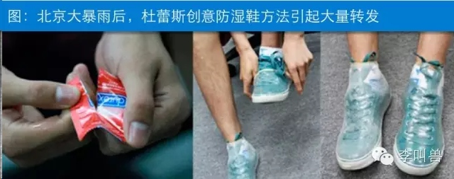

**那么如何构思一个绝佳的广告创意呢？**
大部分人的理解是：把一群人放到会议室里奇思妙想、发散思维，然后就可以得到“伟大的创意”。很多人甚至把“广告创意”想象成了“不经过专业的学习和训练就能自动掌握的东西”。
但是实际上“创意”的过程并没有大多数人想象得那么有“创意”：很多的创意是遵循规则的产物，是大量学习的结果，而不是漫无方向的发散思维。
Goldenberg在顶尖营销学术期刊《Marketing Science》发表的一篇研究显示：**89%的优秀获奖创意广告实际上来自6个创意模板，而在没有获奖的创意广告中，只有2.5%的使用了这6个模板之一。**

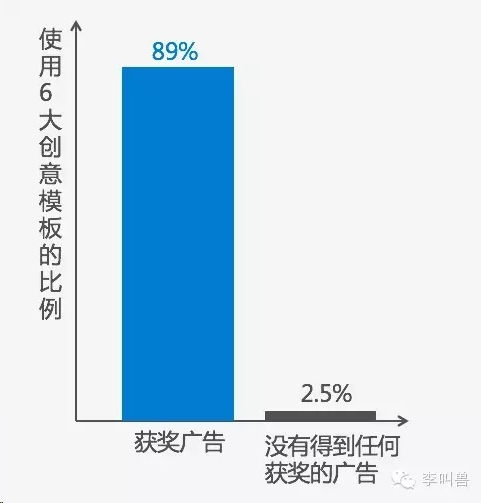

所以，**“广告创意”是一门关于“引起好奇、惊叹和关注的科学”**，而不是随便开个会就能“头脑风暴”出来的奇思妙想。
而研究发现，大量的创意广告实际上遵循了6大模板，巧妙地使用这6大模板可以在广告中“人为地制造惊叹”。
**这6个模板分别是：**
形象化类比—The Pictorial Analogy Template
极端情景—The Extreme Situation Template
呈现后果—The Consequences Template
制造竞争—The Competition Template
互动实验—The Interactive Experiment Template改变维度—The Dimensionality Alteration Template
调查发现，在获奖广告中，这6种模板的使用频率为（美国市场的数据）：

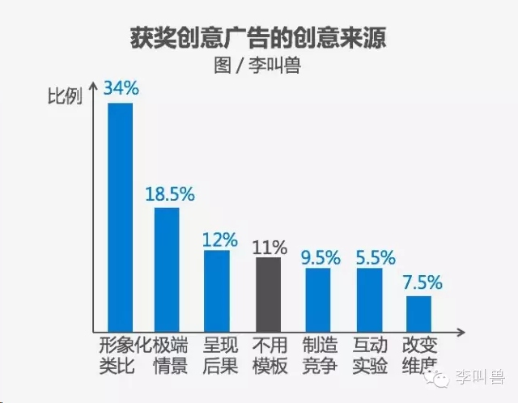

**那么如何参考6种模板来“人为地制造惊叹”呢？**

###**1形象化类比The Pictorial Analogy Template**

**把某个象征性的物品，加到你的产品上。**

比如如何突出避孕套很薄？

1,**首先想一下在大众心理中，“薄”的象征是什么？**（比如吹的气泡是薄的象征）。
2,**然后再想一下产品的那个方面可以跟某个“薄”的象征物联系起来**（比如产品的包装、LOGO、形状等）。
3,**创造某个创意的新形象，把两者联系起来。**

比如这个杜蕾斯的广告就是把“薄的象征”（气泡）和产品的形状联系起来，从而给人一种“杜蕾斯很薄”的感觉：

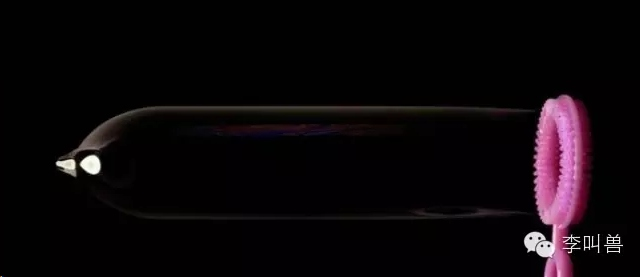

**它建立联系的过程是这样的：**

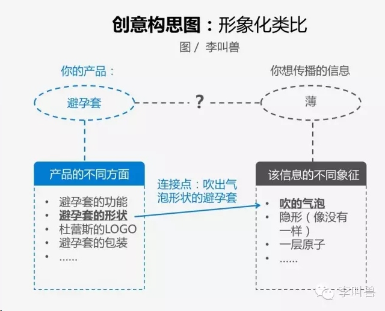

一个产品的广告往往要表达一个抽象的概念，比如“轻薄”、“可靠”、“安全”、“迅速”等，而**大众对这样的抽象概念往往难以产生直观感受。**
因此就需**要给这样的抽象概念找一个“象征物”**，然后把这个象征物和自己产品的某个方面联系起来。
比如上面杜蕾斯的例子中，“薄”的象征物是“气泡”，就把这个气泡用杜蕾斯避孕套的形状联系了起来，做出“避孕套形状的气泡”，让人直观感觉到：杜蕾斯像气泡一样薄。

无数的创意广告使用了这个方法，为自己的某个产品特点找到了象征：

**护肤品创意广告：按下岁月的暂停键**

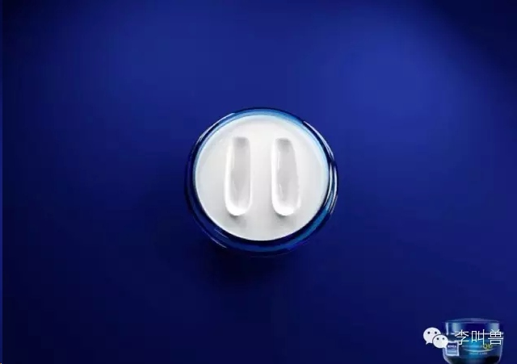

要表达的信息：让你不再变老
该信息的象征：播放器中的暂停键
连接点：面霜被使用后的样子，类似暂停键
**某糖果广告：你愿意随身带在身上的糖果**

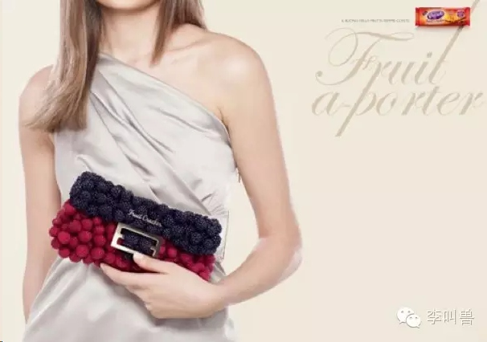

要表达的信息：随身带在身上
该信息的象征：钱包（钱包是人人随身带着的东西）
连接点：用糖果的形状做的钱包

**喜力啤酒：在罗马举行的欧冠决赛赞助商**

要表达的信息：罗马的欧冠决赛
该信息的象征：罗马角斗场连接点：喜力啤酒瓶做的罗马角斗场

**纯天然棉花制造的床上用品**

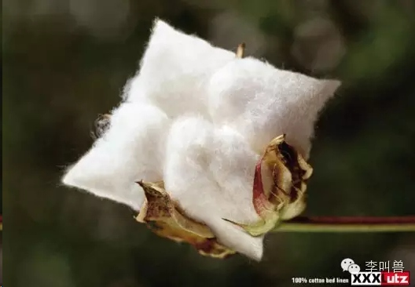

要表达的信息：天然
该信息的象征：自然界生长的棉花连接点：床上用品（枕头）形状的棉花

长城是中国的象征，超人是正义的象征，子弹是速度的象征，钢铁是坚固的象征，乌龟是长寿的象征……总之，**几乎任何一个抽象的概念，你都可以找到不只一个“象征物”。**
把它同自己产品的某个方面（比如形状、LOGO、包装）结合起来，你就得到了一个“形象化类比”的创意广告。

###2极端情况The Extreme Situation Template

**找到一个情形，在该情景下，产品的一个卖点重要到了不切实际的程度。**
比如宜家为了突出“鞋柜不够用了，你需要买个好鞋柜”，呈现一张“因为鞋子放不下而不得不把一只鞋塞到另一只鞋”的图片。

**再比如为了说明车“非常灵活”，就塑造一个极端到不切实际的情景：**为了到达下面这个房子，车的灵活性非常重要。

为了塑造这样的“极端情形”，一个最常用的技巧就是“荒谬的取代”—通过一个极端情形别人暗示：**你不必购买我们的产品，其实有替代方案……**

比如在奥迪车GPS导航的广告中，塑造了一个极端情形：**在荒无人烟的地方，你没有我们的GPS服务也可以，你可以用路线上的巨大路标来取代。**（这是荒谬的，不可能的）

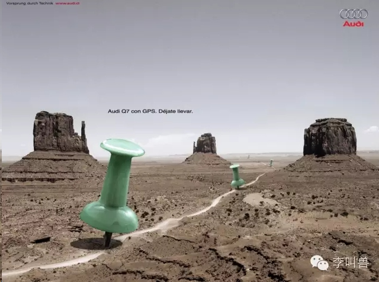

这个“荒谬取代”的构思过程是：

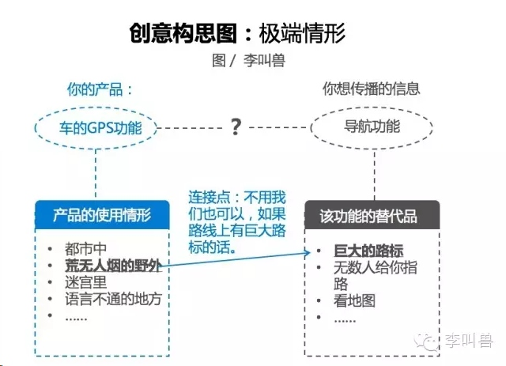

再比如烧烤餐具的广告：野炊时可以没有我们，你可以用扫把作为替代方案。

###3呈现后果The Consequences Template

**向消费者呈现使用产品的极端后果（甚至是负面的后果）。**
比如杜蕾斯为了突出避孕套避孕效果好，呈现了使用产品的极端后果：**所有人都用杜蕾斯，结果导致人类文明的衰落**（没有生孩子的人）。

**OLAZ美白产品广告：**不要用我们的产品，否则你会变白得签证官都认不出你！

这个广告的构思过程是：

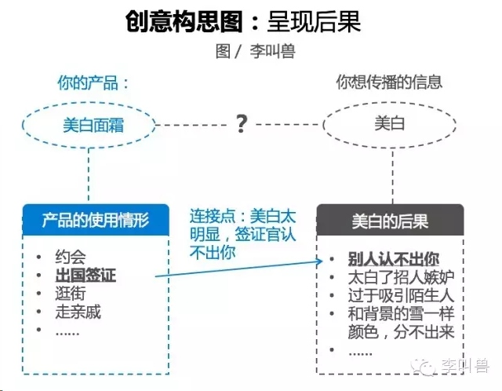

联想笔记本太薄了，让你一不小心容易丢到下水道里！

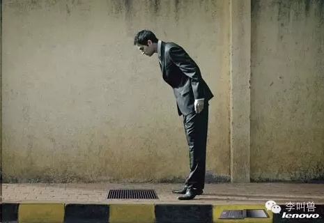

谁说广告一定要夸产品好？**有时候你创造性地呈现一些“因为功能太好而导致的负面后果”，往往可以加强消费者对产品功能的认可。**
为了说明男士香水太好，你可以说“不要给男朋友买我的香水，否则会有太多女生追他！”
为了说明车载音响声音大，有的创意广告提醒消费者：不要在过桥的时候开音响，否则会把桥震塌陷。
甚至我前几天偶然看到一个美女的签名都是“**胸厚得听不到心跳**”。

###4制造竞争The Competition Template

**把你的产品跟非同类的产品进行对比和竞争，以突出产品优势。**
比如NIKE球鞋广告，让代言人C罗跟布加迪威龙跑车进行百米跑比赛，结果C罗赢了。

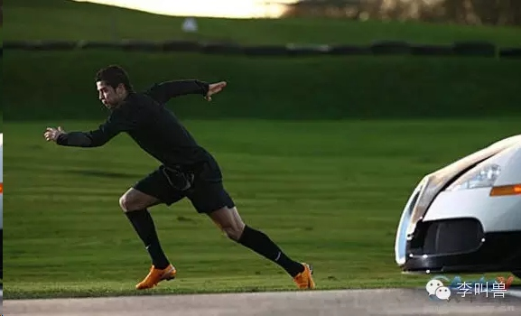

这个创意的构思过程：

再比如著名的谷歌Chrome浏览器创意广告视频：为了突出Chrome快，让它和闪电的速度进行竞争。

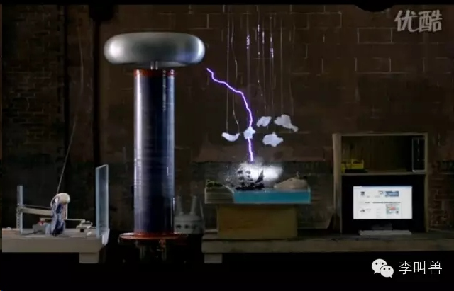

再比如为了突出麦片的“停不下来”，让某人在来电话时，犹豫是继续再吃一口麦片，还是接电话。（吃麦片和接电话的竞争）
除此之外，很多创意广告为了“制造竞争”，会让产品处于某个“不常用的情形”下，以替代更加常用的产品。
比如为了突出牛仔裤结实，有创意广告塑造这样的情形：**车抛锚后拖车来了，但是没有绳子，于是让拖车用牛仔裤拖着后面的车走。**（牛仔裤同绳子竞争）

###5互动实验The Interactive Experiment Template

**让消费者根据广告的描述，完成一个行动。或者让消费者想象完成行动的情景。**比如洗发水广告用一个黑色的纸贴头皮，让人看到后就也会这么做（或者这么想），从而对自己的头皮屑问题更加敏感。

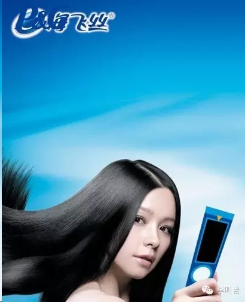

再比如手表广告，把公交车把手换成手表的样子，让人产生“戴手表”的假想行为：

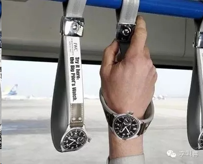

###6改变纬度The Dimensionality Alteration Template
对产品进行时间、空间上的转换，比如：把它复制、把它分解、把它放到未来或者过去等。
**把它复制，创造新的关系**比如把有的饮料品牌用无数个易拉罐组成变形金刚，或者下面找个鞋的品牌，用无数鞋印踩出人的头像等

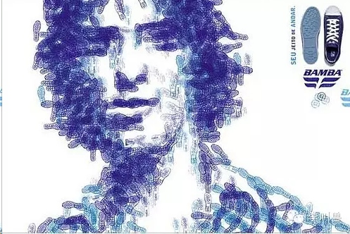

**把它分解：比如摩托车把零件分解，组成了人头。**

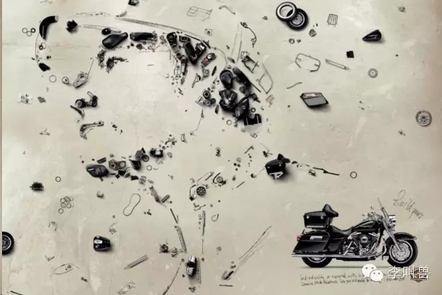

**把它放到未来：**比如某保险公司的广告中，丈夫在天堂中和妻子争吵到底要不要买保险（为时已晚）
**把它放到过去：**比如某时尚产品让古代的皇帝爱不释手等。
好了，结合这6个模板，我想你可以开始设计一个创意广告了！
**说明：**
1,创意并不是万能的，而且创意也不是广告的必备因素（有很多简单粗暴的广告也取得了成功），因此不要只依赖创意。
2,感谢“李叫兽讨论群”的群友们参与本文的前期讨论。