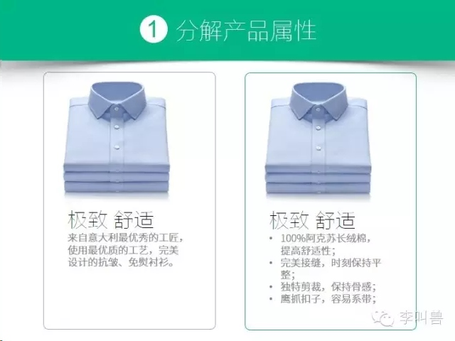
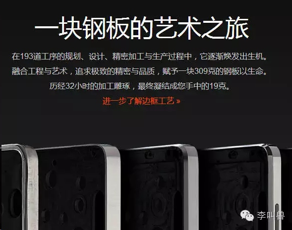
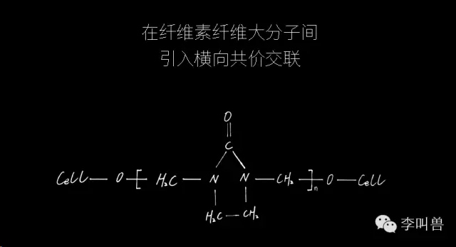
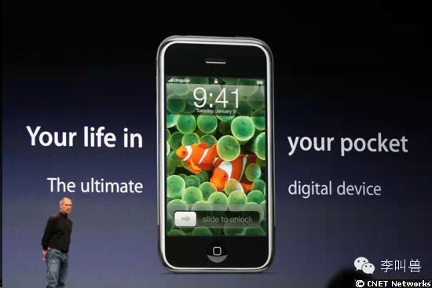

#【李叫兽】7页PPT教你秒懂互联网文案
*2014-09-22* *李靖* [李叫兽](https://mp.weixin.qq.com/s?__biz=MzA5NTMxOTczOA==&mid=200758444&idx=1&sn=b477d6f3897a271c3fad8b8aef4be8ee&scene=21&key=9ac7fff01cb289020b5c29d366c26dfb2cd40a6c67d772cec3885c54779590b0b54eab5927f65e3dc46ee8f256e52d1a84375b1d4b5e3a0ea33a20dc426ba58e75a3ee33a4744ead774cd42cb1b3b27d&ascene=7&uin=MTc4OTM3ODkzOA%3D%3D&devicetype=Windows+7&version=6203005d&pass_ticket=V5w3mkkLQcmNI8VtqJK0C1erJipHSMkFDXxkSrQt9dQbXsQ8haTP3Q1NJmbFLNhV&winzoom=1##)

> 原文链接：http://mp.weixin.qq.com/s/KUrDbb7JjXkvF-nX8_Vgow

用互联网思维写文案—小公司也可以颠覆大品牌。

小米、凡客、雕爷牛腩、皇太极煎饼，无数打着“互联网思维”的小公司0成本营销，逆袭大品牌，其“互联网味”的文案功不可没。

那么如何写一个互联网思维的文案呢？

###**1，分解产品属性**

互联网初创公司无不把产品分割成一个个独立属性。小米先是给我们普及了CPU、GPU等，到了小米4，竟然开始给我们普及材料学知识—“小米4，奥体304不锈钢，8次CNC冲压成型”。

就连跟雷军取经的凡客陈年也不甘示弱，在衬衫的发布会上普及化学知识—如何让衬衫不皱，在纤维素大分子间增加横向共价交联。

（没错，下面不是化学老师的PPT，而是陈年产品发布会的PPT）

**为什么互联网文案需要分解产品属性？**

因为这有助于它们弥补和大品牌的劣势。

消费者选购产品时有两种模式—**低认知模式**（不花什么精力去思考）和**高认知模式**（花费很多精力去了解和思考）。

大部分时候，消费者处于“低认知模式”，**他们懒得详细了解并比较产品**，更多的是简单地通过与产品本身无关的外部因素来判断—“这个大品牌，不会坑我，就买这个！”“这个德国产的，质量肯定比国产好，就买这个！”

**在这种情况下，小品牌是打不过大品牌的**，因为消费者直接通过“品牌”来推测产品质量，而不是详细比较产品本身。

**怎么办呢？**

应该把消费者变到“**高认知模式**”，让他们花费很多时间精力来比较产品本身，而不是简单地通过品牌和产地来判断。

而“分解产品属性”就是一个很好的方法，可以让消费者由一个“模糊的大概印象”到“精确地了解”。

所以雷布斯在2011年产品发布会上，就开始巧妙地用这关键一张图来分解产品属性：

这就是为什么大品牌的广告往往强调一个整体的印象（“再一次，改变一切”“极致设计”等），而小品牌往往会详细地分解产品属性，让消费者进入“高认知模式”。

同样的道理也适用于招聘，假设一个清华的和一个武大的去应聘，HR只有10秒钟来判断要谁，那么武大的毫无机会—10秒钟只能对比“品牌”了；但是如果HR有1小时时间来判断要谁，那么就是胜负未定，看个人能力了。

###**2，指出利益：从对方出发**

文案进行“分解产品属性”还不够，你需要把利益点说出来—**这样的属性具体可以给对方带来什么**。

比如上面的转租房间广告，右边的说出了具体的“利益”，显得更加吸引人。

无数销售员败在了这一步，他们详细地介绍了产品，但是顾客抱怨说：“**你说的这些特点都不错，可是对我来说有什么用呢？！**”

无数的应聘者也败在了这一点，他们详细介绍了自己的经历，但是HR抱怨说：“**你的社团、实习经历都不错，可是对我们公司具体有什么用？**”

如果想写出中国好文案，你需要转变思维—不是“向对方描述一个产品”，而是“告诉对方这个产品对他有什么用！”

###**3，定位到使用情景**

当被要求描述一款产品，大部分人首先想到的是：

“**这一个XX**”（定位到产品属性）

有些人还会想到—“**这是一款专门为XX人群设计的产品！**”（定位到人群）

其实还有第三种—“**这是一款可以帮你做XX的产品**”。（定位到使用情景）

实际上，针对互联网产品的特点（品类复杂、人群分散），你应该更多地把产品定位到使用情景—**用户需要用我的产品完成什么任务**？

比如如果我描述“这是一款智能无线路由器！”（产品类别），你可能不知道我在说什么。

但是如果我说“你可以在上班时用手机控制家里路由器自动下片”（使用情境），你可能就会心动。

所以，最重要的并不是“我是谁”，而是“我的消费者用我来做什么？”

###**4、找到正确的竞争对手**

消费者总是喜欢拿不同的产品进行比较，因此写文案时，需要明确：**我想让消费者拿我的产品跟什么对比？我的竞争对手到底是谁？**

比如上图中，我假想的上述两种加多宝凉茶的文案，前一种是跟预防上火的中药比，虽然更加突出了“防上火”功能，但是人觉得“是药三分毒”，可能不敢喝；后者跟饮料比，增加了“防上火”功能，给人感觉“不再为喝不健康饮料而有负罪感”了。

**无数的行业创新产品都涉及了这样的竞争对手比较：**

在线教育的竞争对手其实并不是线下培训，因为对那些肯花这么多时间和金钱参加培训的人来说，在线教育显然满足不了其对质量的要求；它的竞争对手其实是书籍、是网络论坛，因为它的客户是因为没钱没时间而无法参加培训，以至于不得不看书自学的人。

太阳能的竞争对手最初并不是火电，因为对于性能稳定的火电来说，太阳能太不靠谱了；它的竞争对手是“没有电”—太阳能最初在美国失败，但是却在非洲首先商业化，对美国人来说，太阳能太不稳定了，但对没有电网的一些非洲国家来说，自建太阳能发电器总比没有电用要好。

凡客抗皱衬衫的竞争对手其实并不是价值几千块的商务衬衫（像它宣传的那样），因为肯用这些商务衬衫的人瞧不起凡客；它更可能的竞争对手是T恤和POLO，因为它的消费者是那些因为害怕挤地铁把衬衫挤皱而不得不穿T恤的人。

第一代iPhone真正的竞争对手并不是诺基亚手机，因为比起诺基亚手机，它续航不行、通话质量不行；它真正的竞争对手是华尔街日报、游戏机、视频播放器。在当时的主流观点下，作为一款手机，它有无数缺点；但比起其他视频播放器、报纸等，它却好多了，还有打电话功能。

**所以，构思好文案、好宣传，先找到你产品真正的竞争对手。**

###**5、视觉感**

你的文案必须写的让读者看到后就能联想到具体的形象，比如上图文案，如果只说“夜拍能力强”，很多人没有直观的感觉；但是如果说“可以拍星星”，就立马让人回忆起了“看到璀璨星空想拍但拍不成”的感觉。

优秀的文案看到后能让人联想到具体的情景或者回忆，但是**太多文案写的抽象、模糊、复杂、假大空，让人不知所云：**

- 教育课程广告： “我们追求卓越，创造精品，帮你与时俱进，共创未来！”
- mp3广告：“纤细灵动，有容乃大！”
- 芝麻糊广告：“传承制造经典！”
- 男生求婚：“我们一定会幸福生活，白头到老！”
- 政治演讲：“我希望追求平等，减少种族歧视！”
- 面试者：“我有责任感、使命感、一丝不苟、吃苦耐劳！”

**如果同样的意思，加入“视觉感”的描述，效果就显著不同：**

- **教育课程广告： “我们追求卓越，创造精品，帮你与时俱进，共创未来！”**
“我们提供最新的知识，以帮你应对变化的世界。”

- **mp3广告： “纤细灵动，有容乃大！”**
“把1000首歌装到口袋里！”（来自乔布斯）

- **芝麻糊广告：“传承制造经典！”**
“小时候妈妈的味道”
- **男生求婚：“我们一定会幸福生活，白头到老！”**
“我想在我们老的时候，仍然能牵手在夕阳的余晖下漫步海滩。

- **政治演讲：“我希望追求平等，减少种族歧视！”**
“我梦想有一天，在佐治亚的红山上，昔日奴隶的儿子将能够和昔日奴隶主的儿子坐在一起，共叙兄弟情谊。”（来自马丁路德金）
- **面试者：“我有责任感、使命感、一丝不苟、吃苦耐劳！”**
“我为了1%的细节通宵达旦，在让我满意之前决不放弃最后一点改进。”

**为什么视觉感这么重要？**

因为形象化的想象是我们最基本的需求之一，人天生不喜欢抽象的东西。所以古代几乎所有的抽象理念都被形象化—因为“正义慈悲”太抽象，所以直接创造一个形象化人格化的神出来；因为下雨过程太抽象，所以虚构出“雷公电母”。

心理学中有“鲜活性效应”，是指我们更加容易受一个事件的鲜活性（是否有视觉感）影响，而不是这个事件本身的意义。

当年伊拉克战争时，美国记者不停地报道“数千美国人死亡”，但是少有美国人动容；但是一旦报道某个家庭妻子失去了丈夫的故事，整个国家反战的情绪就起来了。这不是因为一个丈夫的生命比几千人生命重要，而是因为这样的故事显得“更加鲜活”。

所以，写文案，一定要有“视觉感”，否则别人看了不知道你到底在说些什么。

###**6、附着力—建立联系**

作为小公司，你可能会发布全新的创新产品。但是人们不喜欢陌生，从而经常不买账。这时候你就应该为文案建立“**附着力**”—**将信息附在一个大家熟知的物品上。**

比如上图，假设你完全不了解电视机顶盒，它宣传“**自由遥控**”，你可能没什么概念；但是如果说“**让电视1秒变电脑**”，你就明白了—原来是可以像电脑一样自由操控电视啊！

你很想让自己的产品文案流行起来，但是一个让人陌生的东西是难以流行的。为了让全新的产品或者概念流行，你需要把它同一个大家熟知的东西联系起来。**比如：**

- 乔布斯发布第一代iPhone时，并没有直接推出iPhone讲解功能，而是说要发布3个产品—1个电话、1个大屏幕iPod、1个上网设备，这3个产品都是大家熟悉的。然后乔布斯才说，实际上我们只发布一个产品，它具备上面3个产品的功能，那就是—iPhone。

- 为了让陌生的新兴球星火爆起来，媒体往往给他们起一个外号—“智力C罗桑切斯”“德国梅西马林”。这是为了把陌生小将同知名球星联系起来，让大众更容易理解。

- 同理，你知道为什么有中国科技圈的“雷布斯”了吧？

**为什么“附着力”这么重要？**

这是因为人的记忆模式。

人的大脑记忆就像高坡上的一条条河流，新记忆就像一滴水，这滴水如果滴到土地上，就会立刻蒸发；如果能够滴到河流里，就能融为一体，到达大海。同样，如果新知识无法同旧知识建立联系，人很快就会忘记它；如果和旧有的熟悉的东西建立了联系，人就容易记住它。

所以，你需要提高文案的“附着力”，让它和旧有的东西联系起来—**甚至就连电话发明者贝尔当年申请的电话专利，名字都叫“一种新型电报改良技术”。**

###**7、提供“导火索”**

文案的目的是为了改变别人的行为，如果仅仅让别人“心动”，但是没有付出最后的“行动”，可能让文案功亏一篑。最好的办法就是提供一个显著的“导火索”，让别人想都不用想就知道现在应该怎么做。

比如上图，为了让你关注本主页，肯定是右边的文案更有效—它让你想都不想就知道现在怎么做。

无数现象证明了这一点：

之前美国某大学设计了破伤风疫苗宣传手册，但是问题是每年不论如何提高手册的警示力—使用患病者的恐怖图片，都难以让学生们去打疫苗。最后问题解决了，在手册附了一张校医院地图以及疫苗时间—**原来学生们只不过是懒得去网站查地图和时间而已。**

心理学家还做过这样一个实验—在透明玻璃门的冰箱内放满食物，很多人去偷食物；但是给这个冰箱上个锁，在把锁的钥匙放在锁旁边，结果几乎没有人去偷食物了。因为偷食物这件事由“**想都不用想就知道怎么做**”变成了“**需要想想才知道怎么做**”，就显著降低了别人做这件事的欲望。

所以，永远不要低估“伸手党”的“懒惰程度”，必要时在文案中明确告诉别人：现在你应该怎么做！