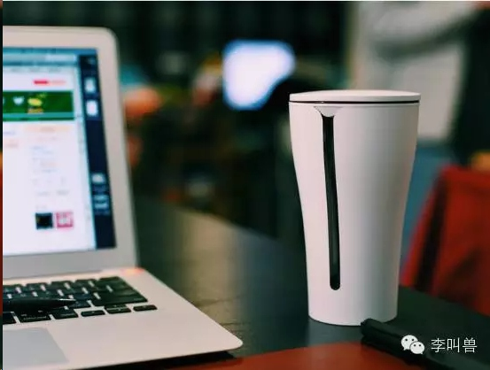
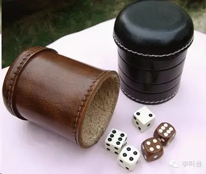
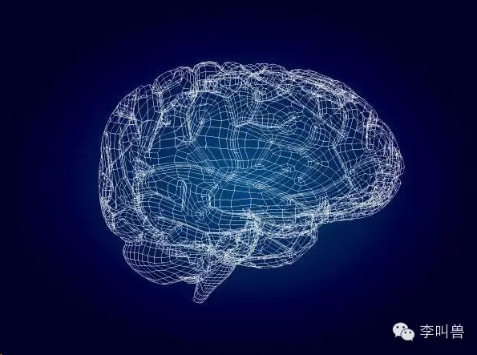
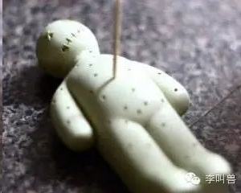

# 【李叫兽】迷信，满足了你什么需求？

原创 *2016-02-16* *李靖* [李叫兽](http://mp.weixin.qq.com/s/0tgrKfwKdDFlOwjzMg8Hdg##)

    请点击上方“李叫兽”订阅公众号

> 原文链接：http://mp.weixin.qq.com/s/0tgrKfwKdDFlOwjzMg8Hdg

迷信行为，有10000个不合理——比如正月不能剪头发，除了给生活造成不便之外，看起来没有任何存在价值。

**但是它之所以能够长期存在，是因为它有效满足了用户需求。**
 

是的，任何一个事物能够长期存在，一定是满足了某种市场需求，迷信也不例外。只不过越来越多的互联网产品取代了迷信，来满足这些需求。

- - - - - - - - - - -

【货物崇拜迷信】

 

如果你登上一些太平洋的小岛国，可能会发现当地土著有这样奇怪的行为：

 

他们扛着竹竿，列队在岛上一圈一圈地行走，以此来祈求神灵的到来，赐予他们食物。这样的习俗，深深植入他们的文化不能质疑，不能违反，只需要相信就行了。

 

这当然是迷信，所有的证据都会证明“扛着竹竿列队行走”不会带来什么食物，至少肯定不如去海边打渔带来的食物多。

 

那么这样滑稽的习俗是怎么形成的呢？

 

原来在二战的时候，美军为了打太平洋战争，曾经进驻过这些小岛。然后岛上的土著就发现了奇怪的现象：

> “这些白人，既不打渔，也不种田，就只是每天扛着长棍（实际上是枪）到处列队巡逻，这些行为在他们看来毫无意义（有这精力，怎么不去打渔）。但是却有大量的船每天送来可口的罐头、奶和牛肉，给这些无所事事的白人。”

 

**所以岛上的巫师得出了结论：**

这些白人看似在做无意义的行为，但实际上是一种独特的召唤仪式，在召唤“船货之神”。只要跟他们做一样的事情，船货之神就会到来，送来食物。

 

**后来战争胜利，白人走了，但岛上的土著们却形成了这样的仪式：**

扛着竹子，在岛上列队前进，召唤船货之神，渴望赐予食物。也以此形成了一个宗教“船货崇拜宗教”。

 

这样的迷信如此滑稽，如此经不起推敲（就跟我们测生辰八字、正月不能剪头发等一样），但是却有大量的人相信并且持续地去做，为什么呢？

**这是因为这些迷信行为（或者习俗），跟微信这样的产品一样，被设计出来，满足了某种心理需求。**

 

比如上面的“船货崇拜”行为，**虽然无法满足物质需求（获得更多食物），但是满足了土著的心理需求**——提高了“控制感”，让土著们觉得自己更能控制周围的事物。（即使他们心理并无法意识到这一点）

 

除了迷信，同样能满足“控制感”需求的，还有各种产品：比如定时提醒饮水的智能水杯，真正对身体健康的提升可能有限，但是满足了“控制感”这个心理需求。

 

**而任何一个事物（不论是产品，还是迷信的习俗），只要能持续满足某种需求，往往就会持续存在。**

 

那么，一般来说，迷信满足了哪些需求？如何洞察这些心理需求，以设计产品和文案？

 

1**控制感** 

对任何一个动物（包括人类）来说，这个世界都太多未知，太多难以预测，太多不确定因素——甚至不知道哪天小行星会突然撞地球把你毁灭呢。

 

如果承认这一切，就意味着我们会无时无刻不感觉到事物正在脱离我们的控制，意味着我们无时无刻不生活在恐惧中。

 

这显然是不利于我们的生存发展的，所以**我们的大脑会主动寻求“控制感”，通过制造一些虚假的想象（迷信），来让我们自己相信“周围的环境在我们掌控中，不用害怕。”**

心理学家曾经做过这样一个实验：

 

当机器摇骰子，自动筛选出刮刮乐（可能有奖）并且让人购买时，人们愿意为这个刮刮乐支付2美元。

 

而当人们自己摇骰子选择刮刮乐的时候，却愿意为它支付9美元——这就意味着人们潜意识觉得，自己摇骰子提高了中奖的概率。（虽然这是不可能的，摇骰子是随机的）

之所以这样，是因为自己摇骰子提高了“控制感”，而控制感是一种非常重要的心理需求。

 

人类大量的迷信行为都跟获取“控制感”这种心理需求有关：

 

海边地区的人吃鱼不能翻过来——想要通过“不翻鱼”的行为来获得控制感，降低感知上的翻船风险。

 

过年吃鱼，获得对“年年有余”的控制感。

中国人圣诞吃苹果，获得对“平安”的控制感（通过谐音），即使西方人圣诞并不吃苹果——ps.按照这个道理，西方人过春节岂不是要吃弹簧（弹簧和春天在英语中是一个单词）？

 

还有，足球运动员C罗每次先穿右脚的袜子，走出更衣室也要先迈右脚，他认为这个意识会带来好运，但实际上是为了获得心理上的控制感，降低对比赛失败的恐惧。

 

还有大量的烧香祈福、拜神、运气数字（8=发，6=顺）等，本质上都是为了满足“控制感”需求。

**虽然客观上，拜神并不会影响成功概率，但拜神的行为，让我们觉得“命运控制在自己手中”**，就像摇骰子实验中“自己摇而不是别人摇”一样，提高了控制感，让我们心理上“更爽了一些”。

 

**如果这些迷信行为是“社会自发设计出来的产品”，那么它们很好地满足了控制感需求，同样，很多人为设计出来的产品，也满足了这个需求。**

 

比如很多保健品，即使真的有效果，也是身体感知不到的（你吃了人参，身体是没什么感觉的），可是为什么还很多人能够坚持去吃呢？（毕竟李叫兽之前说过，“如果一个产品的价值不能被感知，那么就相当于没有价值。”）
一个重要的原因是：**保健品提高了人的“控制感”，让人觉得自己通过每天早上吃燕窝，可以控制自己的健康，而“控制感”是可以被感知的。**

实际上，很多互联网产品，除了实用价值之外，也提供了类似迷信行为能提供的“控制感”价值。

 

比如各种记录类、健康类的APP——大姨吗（管理月经）、KEEP（管理健身）、FEEL（综合管理健康状态），提高了我们对自己身体的控制感。

 

还有一些培训课程，号称“1小时学会策划千万级传播”，虽然实用效果有限，但提高了很多职场人的控制感，让他们感觉“我为提高自己能力做了些什么”，缓解了职场竞争焦虑，提高了控制感。

 

所以，你的产品除了满足“吃”“穿”“用”的需求，想办法满足隐藏的心理需求，也能获得市场（比如控制感）。

 

实际上，研究发现：**人越是处于焦虑、无助、悲观的状态时，迷信行为就越多，对能够提供“控制感”的产品需求也就越多。**

 

比如一项调查发现，美军的轰炸改变了中东地区的部分文化，在轰炸越严重的地区，迷信行为就越多——他们想在不确定中获得控制感。

 

**所以，如果发现一个人群担心不确定、充满焦虑和未知，那么为他们提供控制感的产品，可能会大受青睐。**（比如很多传统行业老板对互联网转型存在焦虑，一些缺乏实际专业能力的江湖术士，都能通过抄袭来给他们上课了，不管实际有没有用，至少提供了控制感）。

2**认知需求**

**未知是可怕的，所以我们大脑天生需要了解未知世界，了解事情的原因、结果。而很多迷信行为，能够满足这一需求。**

 

比如古人并不知道天上为什么下雨，如果按照科学的原则——“如果我不知道，我会承认自己不知道”，就意味着日常生活中这么大一个事件（下雨）无法得到解释，充满未知感，自然让大脑受不了。

 

所以为了满足这种“认知需求”，古人YY出了一套“龙王、风婆、雷神”组成的下雨系统，把下雨解释为神仙的操控。**这虽然毫无根据，但是以形象化和简单的手法，解释了下雨这一未知现象，填上了心中的疑问。**

 

**人几乎无法长时间容忍未知感，所以很多迷信、文化等，就从这个角度来满足用户的需求。**

 

这也是为什么现代医学理论体系明明很发达，但仍然大量的人相信传统医学。因为虽然现代医学理论满足治病救人的需求远超传统医学，但在满足“认知需求”方面其实远远落后（因为科学太复杂了，难以被理解）。

是的，**医学理论的存在并不是光满足治病救人的需求，还具有满足“认知需求”的功能，让人们能够理解未知的人体。**

 

而在这方面，传统医学远超现代医学。比如同样解释“痤疮”的原因，请看下面两种解释方法：

 

> （1） 痤疮是因为青少年阳气旺盛，在皮肤表面堆积无法外排。
 

> （2）痤疮成因复杂，一般是因为内分泌变化导致睾酮水平提高，睾酮水平的提高促进了皮脂腺发育，从而分泌大量的皮脂。同时毛囊皮脂腺导管的角化异常造成导管堵塞，皮脂排出障碍，形成角质栓即微粉刺。毛囊中多种微生物尤其是痤疮丙酸杆菌大量繁殖，痤疮丙酸杆菌产生的脂酶分解皮脂生成游离脂肪酸，同时趋化炎症细胞和介质，最终诱导并加重炎症反应。
 

如果你学识不高，又没有时间仔细研究，但是又需要迅速理解痤疮成因，**哪种解释可以迅速满足该需求？**

 

**肯定是第一种传统医学上的解释。**

“阳气旺盛”“上火”等，非常形象化、容易理解（即使没有证据证明其存在），从而满足了大众的“认知需求”。

而如果是第二种现代医学上的解释，一个普通大众需要系统化学习生物学，了解什么是内分泌系统、什么是细胞、什么是细菌，解决认知需求的成本简直太高了。

总之，人有认知需求，想要理解周围世界的运行，减少未知感，而很多理论、产品的存在，重要的价值就是满足人的认知需求。

 

比如大量的养生健康类公众号，商业分析类公众号，虽然内容并不严谨，甚至是没有经过任何证明的理论（比如“支付宝布局失败的3大原因”），但是**以相对简单轻松的方式解答了大众对于自己身体、商业社会的疑惑，从而满足了“认知需求”。**

 

这个时候会有人问：可是，这不是真相啊？我们的认知需求，难道不是为了获取真相吗？这些理论又不是真相。

当然不是。实际上，认知需求并不是“了解真相”的需求，**人本能大脑想要的，是对自己最有利的解释，而不是真相。**

 

**因为我们的大脑被生物进化设计出来，并消耗了整个人体超过四分之一的能量，并不是用来追求真相的，而是用来保证机体存活和基因延续的。**

比如一个物体在40米距离外以10米每秒的速度向我们脸靠近，我们大脑会在直觉上判断2秒内物体就要到了，所以赶紧伸手抱头。而真实的时间却是4秒。

这个时候，我们大脑的直观判断并不是真相（4秒），而是比真相更快，因为**这样虽然远离了真相，但更加有助于我们的生存（加快反应速度）。**

 

**一句话解释：对大脑来说，真相并不能当饭吃。**

 

总之，“认知需求”是一种基本需求，人的大脑渴望简单、形象化地理解周围的事物，特别是情况未知的时候。而能够持续满足这一需求的产品，也会持续存在。（这就是为什么会有大量的人做科普，科普是简化的科学，能够满足认知需求。）

3**宣泄需求**

人日常生活中总是会受到各种各样的挫折、憋屈和不满，这些不满都需要一定的宣泄途径，而有些习俗、迷信等，就是为了满足这种宣泄需求。

 

比如**很多地区扔保留着“跳大神”的习俗**——生病时候不去医院，而是找巫婆解决。

 

跳大神经常把治病的原因归因成亲属成员义务和行为规范不到位，比如某男性生病，巫婆的结论就是“早年死去的媳妇，因为受不到善待，而冤魂来找。”

 

**这些解释看似无厘头，但是也满足了需求**（任何存在的事物一定是满足某些需求的）——让很多人无法公开表达的不满得到了宣泄，比如后辈对长辈的不满，媳妇对婆婆的抱怨，家庭财产分配的不公等。

 

迫于文化压力，这些不满长期被压制无法宣泄，会造成心理扭曲，而跳大神通过把病因归因于“亲属行为不合理”，给这些受到压制的人以宣泄的机会，从而长期存在。

 

再比如“扎小人”等迷信，也是为了满足宣泄需求。

“宣泄”是一种非常重要的心理需求，我们生活在压力中，遇到很多不公、挫折，需要找到释放口。而很多互联网产品，就替代了跳大神，满足现代社会的宣泄需求。

 

比如某些社交软件的匿名吐槽功能：

比如某些新媒体账号发的文章：《贱人，我为什么要帮你！》（咪蒙）
4**掩盖动机** 

**很多迷信或者社会习俗的存在，是为了掩盖一些真实的动机。**

 

比如一些地方有闹洞房的习俗，参加婚礼的人经常对伴娘或新娘有性骚扰，或者让新郎新娘当众做出亲密性行为。

 

之所以产生了闹洞房，一方面是源于过去没有自由恋爱，新郎新娘不认知，而且没有性经验，闹洞房可以加快新郎新娘熟悉，避免初次跟陌生人性生活的尴尬。另一方面，也可以让同村的人释放一下多年被压抑的性需求。

直接这样说的话，估计没人想来了，所以习俗自然演化出了“辟邪”之类的说法，用以掩盖真实的动机。

 

**人的行为非常复杂，一个行为的背后可能有多种动机，而其中很大一部分动机是需要被掩盖的。所以很多产品、营销的重要策略就是帮助用户掩盖动机。**（就像闹洞房是为了辟邪一样。）

 

比如纸尿片刚进入市场的时候，主打“方便”（不用洗尿布），虽然产品很好，但推广缓慢。原来是因为很多家庭主妇不好意思用纸尿片，因为这在婆婆面前塑造了“懒媳妇”“只想省力，不顾孩子”的形象。

 

后来，纸尿片广告中主打“柔软”“透气”“对婴儿好”，结果大获全胜。因为它帮主要用户家庭主妇掩盖了动机——“我用纸尿片不是因为我懒惰，而是因为我爱孩子。”

 

再比如，小米当年的“为发烧而生”——我用小米，不是因为追求性价比买不起好手机，而是因为我是发烧友。

 

陌陌的广告，突出“寻求改变”——我用陌陌，不是为了约炮，而是为了改变。

 

宝马7系等豪华车广告，并不说豪华本身，而是反而强调驾驶技术——我开宝马，不是为了炫耀，而是因为我喜欢智能空气悬挂系统。

 

 

**其他：**

 

除了上述，很多社会习俗、迷信还满足了其他需求，比如：

成就需求——过年抢头香（类似支付宝年度账单排名）

分类需求——星座理论等，满足把人分类的需求；

心理防御需求——相信来世等（类似心灵鸡汤文章）

 

**结 语**

我们为什么迷信？

 

任何事物的存在，一定是因为其满足了用户需求。

 

迷信行为、社会习俗等大量存在（即使表面上看不合理），是因为他们满足了很多隐藏在表面之下的心理需求。而这些需求，其实都可以被商业公司设计的产品来满足。

 

**极有可能，随着科技、商业的不断发展，迷信行为会减少甚至消失，因为有可能某个APP、某些文章会比迷信更能满足“控制感需求”“认知需求”“宣泄需求”等。**

 

毕竟，如果翻开市场营销的教科书，会发现营销（Marketing）的定义就是：

“比你的竞争对手更有效率地满足目标市场的用户需求。”

 

如果你比迷信更有效率满足这些需求，早晚你会替代这些迷信或者习俗。

 

 

**说明：**

李叫兽分析迷信的动机，但并不支持迷信。就像病毒学家研究病毒，但并不支持病毒。

部分研究引用来源：

**· Bleak, J. L., & Frederick, C. M. (1998) Superstitious behavior in sport: levels of effectiveness and determinants of use in three collegiate sports. Journal of Sport Behavior, 21(1), 1–15.**

**· Burger, J. M., & Lynn, A. L. (2005). Superstitious behavior among American and Japanese professional baseball players. Basic and Applied Social Psychology, 27(1), 71–76.**

**· Dudley, R. T. (2000).The relationship between negative affect and paranormal belief. Personality and individual differences, 28,315–321.**· **MacDonald, D. A., & Holland, D. (2002). Spirituality andboredom proneness. Personality and Individual Differences, 32,1113–1119.**

**· Watt C., Watson S., & Wilson L. (2007). Cognitive and psychological mediators of anxiety: evidence from a study of paranormal belief and perceived childhood control. Personality and Individual Differences, 42, 335–343.**

**·《从若干仪式行为看中国国民性的一面》——李亦园 摘自论文集《中国人的性格》**