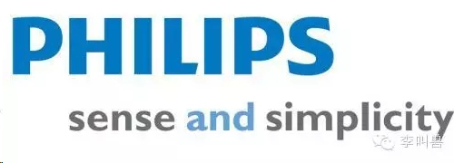

# 【李叫兽】扼杀创新的4种方法：为什么鼓励创新的公司却缺乏创新

*2015-04-21* *李靖* [李叫兽](https://mp.weixin.qq.com/s?__biz=MzA5NTMxOTczOA==&mid=204564254&idx=1&sn=5ee644f3fa66a7c5bdcb4936076adc83&scene=21&key=82438a29ddf26010e4a81246874c223a2d4666ce15e38660d5030859447ecd84a21add548eb3d9e0922f34a4b999e6b1e9a87b37d568322a21e2d024a0355c7246b45fb09da46e0b2fa9c7952e21eeda&ascene=7&uin=MjQwNzMxODYwNQ%3D%3D&devicetype=Windows+8&version=6203005d&pass_ticket=qHEsmSpsM1vfm1Yy82spWVIyZuHWv1bJO3FWhbvcvVcpH1D2DKk0W03H5eveJftb&winzoom=1.125##)

> 原文链接：http://mp.weixin.qq.com/s/eYSGIglaXYr9isX_wEErjQ

几乎所有的企业都声称自己是创新企业、鼓励创新。

比如我曾经参加过一个飞利浦的一位高级副总裁Fredrick Spalcke主持的讲座，他说：

> “飞利浦是非常创新的企业，实际上，创新是我们价值观中非常重要的一部分。”

然后我在现场提了一个问题：

> **你好，就像您提到过的飞利浦非常创新，那么飞利浦公司内有哪些规定或者工作流程是为了保证创新而设置的呢？**

这时Spalcke先生先是重复了下我的问题（应对提问的好策略），然后说：

> **“实际上，我们并不缺乏创新，我们反而是创新的想法太多了，重要的是想办法如何筛选……”**

嗯，这就好像一个人宣扬自己很成功很会赚钱，但是当你好奇地问：

“请问你具体是通过什么方式赚钱的呢？”

他回答：“其实，我最大的问题并不是赚不到钱，而是钱太多不知道该怎么花……”

- - - - - - - - - - -

是的，如果你去参加任何一场招聘宣讲会，你就会发现**几乎所有的企业都声称自己鼓励创新。**

但是当你问到底是怎么鼓励创新的时候，到底施行了什么规定来降低组织惯性、提高对新想法的容忍度的时候，往往会发现他们其实缺乏这些方法。

很多人觉得“提倡创新”只要喊出口号、表现出态度就行，殊不知**“提高创新”其实跟提高“利润”一样，态度和口号没有直接作用。**

所有的企业都想“提高利润”，但是这种想法本身并不能提高利润；

同样，**所有的企业都想“鼓励创新”，但是这种想法本身并不能真正鼓励创新**—就连无法适应变革而倒下的柯达和诺基亚，其实也是号称“鼓励创新”的企业。

**因为人和组织天生就有这些惯性，导致拒绝创新：**

一不必要的假设

请先看这样一个段子：

> 一位父亲和他的儿子发生了车祸，父亲当场就死了，儿子被人匆忙送入医院。手术室里，外科医生看到这个男孩说：“我不能给他做手术，他是我的儿子”

**当你看到这个故事的时候，你的第一反应是什么？**

我想很多人的反应跟我一样：**男孩可能是外科医生的私生子。**

打住！在你尽情幻想整个故事的狗血情节之前，请看这个故事最真实的解释：

一个孩子的爸爸死了，当医生的妈妈在手术台前看到这个孩子。

是的，没有什么私生子，没有“狗血八卦情节”，这其实只不过是一个非常寻常的车祸案件。

**但是你为什么第一反应是“这个孩子是外科医生的私生子”呢？**

因为在你大脑的潜意识假设中，外科医生是男的。而且整个故事大量出现的“他”“男孩”等男性词汇，更加强化了你的这一假设。

**而实际上，在你做这个故事的判断的时候，这种假设是不必要的。当你怀着根本不必要的假设来判断一件事时，你就容易做出错误的判断。**

但是我们长久形成了某种固定的习惯（比如见到的大多数外科医生都是男的），导致这种过去的习惯被我们当成了“现实”或者“金科玉律”。

而当我们拿这种所谓的“金科玉律”来处理新问题的时候，就往往就会拒绝创新。
**
比如，多年以来，美国的航空业就有这样的金科玉律：**

> “长途航线好，短途航线不好！”

为什么呢？

因为本来美国的航空业存在价格管制，为了促进小城镇发展，**政府强制降低了短途航线的价格，使它低于运营成本**；然后让航空公司靠长途航线的盈利来弥补。

这个时候利弊就很清楚了：“**多跑长途，因为盈利好！**”

因此政府又加了限制，规定航空公司必须保证一定比例的短途航线。

所以航空公司一边垂涎高利润率的长途航线，一边又不乐意地继续经营短途航线。

这个时候政策突然出现了变化—**政府逐步放松了对航空业的管制**，航空公司可以自由选择自己的业务了！

**如果你是这时航空公司的高管，你的策略是什么呢？**

> 我大多数人的第一直觉很简单：既然不再强迫我一定要跑短途了，我就多跑长途呗！

而这也是美国联合航空公司的做法：**直接放弃全部短途航线，全部跑长途。**

毕竟“长途好，短途不好”可是行业多年来的金科玉律。

**这里有什么问题呢？**

这里的问题就是：**这个“金科玉律”存在的时间太长了，导致大多数人忘记了存在的前提假设—“短途航线是因为价格管制而利润低”。**

但是这个前提假设已经不成立了，现在政府取消了管制，航空公司可以自由定价，短途行业完全可以提升价格，创造利润啊！

而且长途航线之所以存在盈利的前提假设也不存在了。

之前长途航线能稳定盈利是因为价格管制，各个航空公司无法打价格战。而现在价格管制取消，疯狂增加长途行业业务的航空公司势必展开激烈的价格战，利润微薄。

**这时短途航线因为存在定价空间而且竞争不激烈，才是最佳的选择。**

而这个“新环境”下的最佳选择，却并不符合行业的“金科玉律”。

很多所谓的“金科玉律”，其实并不是独立存在的，它们存在的前提是一些“假设”。而一旦某一天这些假设变得“不必要”时，这些金科玉律也失去了存在的基础。

公司慢慢发展壮大，自然会在内部形成一定的金科玉律，比如“本公司不允许迟到”，“我们是一家专注XX领域的公司”或者“自己生产产品而不是外包”。

这些金科玉律往往是公司的创始人定下来的，当初的存在一定有合理性。**但是随着时间的流逝，人们逐渐忘记了这些金科玉律存在的假设前提。**

导致某一天这些金科玉律“存在的前提”已经消失，人们还是会拿这些已经失去了存在意义的规则来封杀创新。

“你不懂，我们公司一直以来就这样，这是我们20年来生存的保证！”

这时你应该问：

“那么请问这条规律合理的假设前提是什么呢？这个假设前提现在还是必要的吗？如果某个规律存在的假设已经不必要，我们干嘛要遵守？”

二过度追求可预见性企业或者任何组织压制创新的另一种方法就是对**“可预见性”**的追求。

对“可预见性”的追求几乎是所有人的天性，当听到一个陌生的想法、某种陌生的工作流程，或者仅仅是见到了一种陌生的产品，大部分人内心天然就是拒绝的。

**想想有多少人在智能手机刚出现的时候对它嗤之以鼻就知道了**—“这个太难学会了吧？”“不会用”。

你难道不会对这样的评价感到震惊？竟然有人觉得20个按键的手机比1个按键的手机还要“易用”，而且这些人在几年前竟然是大多数。

**其实他们潜意识中真正的原因并不是智能手机难用，而是智能手机“太陌生”。**

有研究发现，在全新产品上市时，不论大多少广告，都有80%以上的人只“感兴趣”但是不购买。

大部分人在看到自己的朋友用某款新产品之前（不论是智能手机还是智能手环），自己是绝对不会买来试试的。

这就是人天生的本性，而**这样的本性导致企业内出现大量的压制创新的行为存在。**

如果你有类似的经验，你一定对这样的场面非常不陌生：

你经过了长时间的思考和分析，终于想出了一个绝佳的策略—“根据目前的情况，我们需要改进团队的工作流程……”

然后你兴冲冲地找到上司去讲，就会发现：对方在1S之内就开始皱眉头，然后感觉不行。

**可是人怎么可能在这么短的时间内完成思考呢？**在这么短的时间内完成问题界定、可行性分析等过程，然后最终得出答案是不行—人怎么可能做到这一点？

**这一切都说明了拒绝你的人根本没有进行最起码的“思考”，而是完全处于对“陌生感”拒绝的本能。**

一旦被这个本能激发，剩下的时间就简单了：他们会质疑你没有详细的数据支撑、会指出你图样图森破，会吐槽“竞争对手做了吗？竞争对手没做，我们急什么。”

然后他们会发现这样的逻辑连自己都说不过去（毕竟只有做竞争对手没有做的东西，才能享受先发优势），最后会拿“我还是看看吧”、“现在资源很紧”等原因拒绝。

人对“可预见性”有着天生的需求，对陌生也有着天生的恐惧。

不信你回家跟爸妈说：

> “妈，我不去考公务员了，我想去思路特（李叫兽自己编出来的名字）工作”

这时你爸妈根本不去了解思路特比公务员的优势，不去花任何1S了解思路特的前景，甚至都懒得问你思路特到底是什么，就会直接拒绝。

他们的拒绝既不是理智分析的结果，也不是所谓的“人生经验的积淀”，**而是纯粹的对陌生感的天然厌恶。**

而这样对“可预见性”的需求简直是公司内“扼杀创新”的巨大杀手。

他们一定要求详尽的数据分析，一定要求做别人已经做过的事情，一定要至少找一个“标杆企业”对比一下，这些追求有时候并没有降低项目风险，**它真正降低的其实是“陌生感”，它带来的并不是“效益提升”，而是“心理慰借”。**

所以如果有机会，你可以问这个问题：请问你的拒绝是仔细了解情况后分析利弊后的产物，还是处于天生的对陌生感的拒绝和对可预见性的追求？
三只想减少错误

严格的控制以减少出错—不论是控制每一个生产流程还是控制员工的KPI，是很多企业得以成功的保证。

多年来，无数管理咨询公司正是因为像企业兜售“严格控制”的方法来。

不论是强调精益管理，还是推销六个西格玛理论（把错误率控制在百万分之几的水平），本质都是在通过“严格控制以减少出差”来提升效益。

笃信“严格控制论”的公司认为成功就是“把错误减少到最小”。

但是实际上并不是，因为公司或者个人的成功其实依赖2方面的因素：

成功＝减少坏事＋增加好事

**是的，想办法“减少一切的错误”并不让一个公司持续成功，一个公司的成功还取决增加“好”的方面—比如不断地创新。**

单纯地“减少坏事”并不足够。就像你把自己所有的病都治好了，也不代表你变健康了，你只是变的“没有病”而已。而要想变健康，还要“增加好事”—比如健身、游泳、规律作息等。

但是很多公司关注的焦点只是“减少坏事”，他们笃信“控制论”，认为自己只要控制了一切过程、所有的地方都不出错，就能获胜。

有些公司的分析师团队就是这样。他们把所有的时间都花在了“遵守内部规定”上，而不是“寻求新的发现”。

他们大量的精力用在了遵守既定的模型、符合现有的PPT模板上，因为这样至少可以按照要求“交活”。

这样虽然在一定程度上“减少了坏事”，但是同样也“减少了好事”—杀死了创新。

实际上，很多公司内伟大的创新都是工作流程之外的产物—比如3M便利贴、谷歌邮箱等。

**正是这样“妄图通过严格控制来降低一切错误”的行为，压制了创新—因为没有了试错的空间。**

（PS. 这并不是说不要“减少错误”，而是应该平衡“减少错误”和“增加好事”，不能只关注一方。）

二压制意外

在美国911恐怖袭击之前，FBI的有一名特工肯尼斯·威廉姆斯曾经发现了一些巧合：

有几位阿拉伯男子在学习开飞机，自相矛盾的是，他们并不想学习起飞和降落技术，而这两项恰恰是最难掌握的而且最关键的飞机技能。

这引起了威廉姆斯注意：**一个不会起飞，不会降落的飞行员能做什么呢？这样学习飞机有什么用？没有任何一家航空公司愿意雇佣这种人。**

然后一个可怕的想法进入这位特工的脑中：**这样学习飞机，唯一的用途就是劫机并且自杀式袭击吧？**

这个特工立刻致信给总部，要求调查全国学习开飞机的可疑人员，并且发出了可能有“劫机事件”的警告。

但是这样的警告被上司忽略了，他们认为这个意外完全是巧合，不知道考虑。

的确，在很多人眼里，“意外就是意外”，它只不过是巧合而已。

**他们只想完成今天的工作，在他们看来，探究新奇的想法、渴望在意外事件中发现线索简直是不成熟的行为，所谓的成熟的人必须跟他们一样：**

> “只想尽快把工作搞定。”

在这样的团队中，只要有一点打破常规的东西，就被视为按时完成计划和按部就班的威胁。

想象一下，假设公司的项目已经做了90%，这时你突然创造性地发现这个项目存在严重问题，然后提出提议：

> “王总，现在突然发现这个项目有严重问题，我建议我们重新考虑一下，换一种方法做。”

这时你觉得你会得到什么样的回复呢？

在大多数情况下，你得到的回复是：

> “不行，我们还是按照现在的计划来，这样都能按时无误地完成计划。”

而上面那个例子就是“挑战者航天飞机失事事件”前发生的事情—**即将升空前几天，工程师突然发现了航天器的问题。但是这个问题被当作了按时完成计划的威胁，所以被否决了。**

最终航天器在升空不久后爆炸了。

**结语：**

大部分人喜欢固定和重复，而这部分人组成了公司的大部分人，再加上组织本身自带的惯性，让大部分公司天生就对创新是排斥的。

- 他们往往**坚持所谓的“金科玉律”**，却忽略了它成立的前提假设，而这个假设可能早就变得不必要。

- 他们**讨厌陌生**，渴望“可预计的感觉”，相信：只要符合既有想法的思路，往往是对的。
