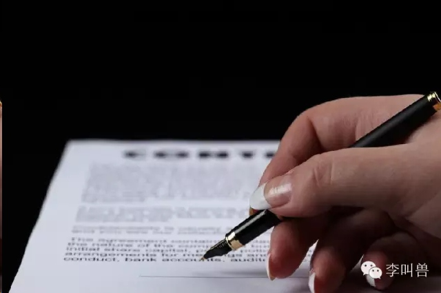
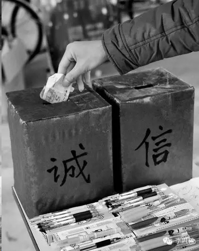
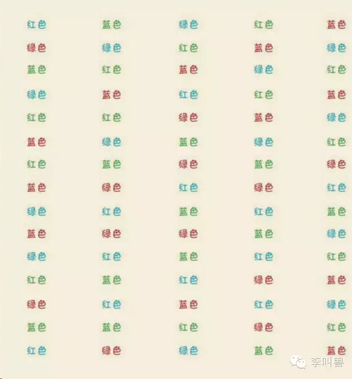

# 【李叫兽】如何减少被欺骗：为什么“狼人游戏”让人变坏？

*2014-10-13* *李靖* [李叫兽](http://mp.weixin.qq.com/s/K3J7vOGqMXJvlhvZ-zDL_A##)

> 原文链接：http://mp.weixin.qq.com/s/K3J7vOGqMXJvlhvZ-zDL_A

**期末考试和奶奶健康的关系：**

**迈克•亚当斯**教授曾经做过一个研究，根据对美国高校的大量调查，发现：美国大学生期中考试临近时，**奶奶去世的可能性是平时的10倍**，而期末考试时是平时的**19倍**。

亚当斯教授还进一步发现，**考试不及格的学生失去奶奶的可能性是考试及格学生的50倍。**（调查数据来源于各高校教授收到的请假邮件和推迟交论文的申请）

纳闷的亚当斯教授尝试用“群聚动力”理论去解释这个现象—学生升高的学术压力对奶奶的健康造成了影响。

最后发现实际很简单—**期末考试时时间不够用，学生们编造了大量的“奶奶去世”的请假借口。**

**“骗子太多，傻子完全不够用了！”**

欺骗如此之普遍，即使几乎所有的公司、高校的“价值观”描述里有一个一个叫做“integrity”的词。

那么如何降低欺骗行为呢？如何让你的公司、团队以及朋友更少的欺骗、更多的真诚呢？

如果问政府高官和企业高官如何减少员工多报发票、谎报绩效等行为，他们都说“加强监管”、“施行零容忍政策”、“制度透明”，但是**研究证明这些方法往往不具备什么显著效果。**

**怎么办？下面的几条会告诉你：**

**1，欺骗不是“成本收益分析”**

人什么时候会欺骗？经济学的说法是“当人们觉得欺骗的收益超过其成本时，人就会欺骗。”

**但是实际上不是这样，有这样一个实验：**

让一群人算数学题，算出一道题给两美元，算完后让他们自己对答案，对完答案后不用上交答卷，让他们直接汇报自己答对了多少道题并且领奖金。

结果发现大部分人多报了自己的答题数（跟对照组比较）。这时实验者试着增加激励，把**每道题2美元上升为5美元，看看是否会有更多人在金钱激励下作弊。**

**最后发现谎报的金额反而变小了—欺骗收益上升后，欺骗的动机反而降低。**

为什么呢？因为人欺骗主要有**两种动机**：

①通过欺骗获得利益；

②在获得利益的同时能够保持对自己的良好感觉。

金额上升虽然让被调查者得到的利益上升，但是**这使得他们很难合理化自己的行为—增加的金钱让他们的作弊不能像在办公室拿走一只铅笔这么轻松了。**

**实际上，更多的研究证明，对欺骗行为真正产生影响的，并不是“能够获得多大利益”或者“多大可能性被抓住”等经济原因，而更多的是我们是否可以在欺骗中合理化自己的行为，是否可以抵消掉欺骗的罪恶感。**

就像杰罗姆在小说《三怪客泛舟记》描述的一个钓鱼者：

“当我钓鱼到40条，我会谎报是40多条或者50条，但是不会再多了，因为欺骗是罪恶的”

**2，降低欺骗和后果的心理距离**

你一定会这个故事很有“熟悉感”：

老师打电话给小林的爸爸：“小林偷了同学的铅笔。”

小林的爸爸非常生气，教训了他很长时间：“**偷窃和说谎都是不对的！如果你真的需要铅笔，为什么不直接告诉我，你知道我可以从办公室拿回好几盒呢！**”

本质上相同的行为，我们觉得有些可以接受，有些难以接受。“偷同学的铅笔”给人一种很大的罪恶感，但是“偷公司的铅笔”就没有那么大心理负担了。

心理学家通过实验证明了这种现象：
**他们在麻省理工（MIT）学生宿舍的公共冰箱里放了6听可乐和6美元现金。结果不到72小时，冰箱的可乐就被人偷偷喝掉了，但是6张一美元现金仍然没有任何人动。**

为什么学生可以选择去偷拿一瓶可乐，但是不会偷拿1美元并从旁边的自动售货机里买一听可乐？

这是因为**直接偷钱的话，我们很难合理化自己的行为**—MIT的高材生怎么能偷钱呢？太LOW了吧？毕业可以拿十几万美元年薪，干嘛要偷这1美元？

而偷可乐和偷钱相比，有着更远的“心理距离”—可乐放着没人喝，我拿一瓶不为过吧？

同样，你可能会偷吃室友的一包零食，但是不太可能偷偷在室友的钱包里拿出10块钱去买零食。

同样是为了个人利益而欺骗，你可能会尝试去下载盗版电影，但是很难去偷同学的钱。

**因为“偷同学的钱”中，“欺骗”和“后果”的距离很近，你可以直接感受到自己欺骗的后果，并觉得很可耻。但是去下载盗版电影就不同了，欺骗的后果是“侵犯版权，从而侵犯作者的利益”，这个距离太远，很难联想到。**

所以，如果想减少欺骗，可以“降低欺骗与后果的心理距离”，明确说明欺骗会带来的后果，并且通过类比说明—这和偷你朋友的钱没什么区别！

**3，增加欺骗所需付出的行为**

为了维持对自己的良好感觉，我们经常在内心中把自己的欺骗行为解释为“无心的”或者“无意识”的，从而可以让自己的欺骗看起来和“个人性格”无关。

**想象一下你在打高尔夫球，如果你对手去上厕所了，你想把球移动10厘米而作弊，这时你会怎么做？**

①用球杆轻轻碰一下球；

②用脚轻轻踢一下球；

③弯腰用手把球捡起来，并挪到10厘米外的地方。

**实验证明，大部分人选①，少些人选②，只有很少人会选③—用手捡球。**

**这是因为一旦用手去做，我们就很难在内心觉得“这是无心”的，很难掩饰动机和意图，从而难以合理化自己的行为。**

所以如果想减少别人的欺骗，可以增加他们欺骗所要付出的行为。

比如实验证明，把冰箱锁上并把钥匙放旁边，都可以显著降低别人偷冰箱食物的可能性—因为拿起钥匙开锁的过程显著增加了付出的行为，从而导致他们无法向自己内心掩饰自己的意图。

**4，不要活雷锋—降低说谎的利他性**

在同样的“做数学题”实验中，A组被试者多算对一个题目会让自己多得到2美元，B组被试者则只会让周围的朋友多得到2美元，结果发现B的作弊概率和程度远远超过A组。

**如果欺骗纯粹是为了他人获取利益，而自己得不到利益，那么欺骗就会增加。**这是因为一旦我们的欺骗具备了“利他性”，我们就很容易合理化自己的行为，这样“欺骗行为”本身就很难损害我们对自己的良好印象。

**所以如果回忆一下你上中小学时，做评价时，你可能很少给自己多打很多分，但是你经常给老师多打分**—利他性提高了你欺骗的程度。

所以，本来很正直的高材生，进入了当年的安然公司，也难以不加入欺骗的大军—在工作中欺骗客户是存在利他性的，不光让我们自己获得利益，更能让公司赚钱，所以容易合理化自己的行为。

**5，道德提醒可以显著降低欺骗**

有人觉得“光说不干没有用”，但是实际上“说”特别重要。

**在加州大学洛杉矶分校的一个实验中，让被试者背诵《十诫》中的内容，发现他们作弊的概率远远低于对照组。**

这是因为对自己道德的提醒让他们更加难以在内心合理化欺骗行为。

所以，如果想降低欺骗，签署道德声明书等步骤特别重要。如果让别人事先书面承诺并加以道德提醒，他就会显著降低欺骗的可能性。

比如申请报销时往往有一行签字栏，目的就是为了提高道德提醒—我通过签字确认说的话是对的。在一项研究中，**心理学家发现把签字栏放到第一行远远比常规的放到最后一行效果好—他们发现底部签字的平均多报销9.62元，而顶部签字的只有5.27元。**

所以，设计签字栏时，一定记得把签字栏放前面哦！

**6，降低任何可能的隐性欺骗行为**

心理学家曾经给AB两组人发了相同的名牌包，并让她们带着这个包在商场走一圈。不同的是心理学家告诉A组人包是冒牌的，但是告诉B组包是正品。

走完一圈后，两组人被要求做一个测试，结果发现**觉得自己刚刚带冒牌包的一组人作弊远远超过另一组。**

也就是说，**仅仅“带冒牌包”这个行为本身就提高了你的不诚实程度。**

为什么呢？

心理学有个“**自我知觉理论**”：我们的态度往往是模糊的难以察觉的，而我们判断自己态度的方式跟判断别人的方式一样，都是通过行为来判断。所以就像你看到某个朋友带冒牌包会觉得他可能不诚实一样，当你带冒牌包，你也会觉得自己是一个不诚实的人。

一旦你通过这种不起眼的小行为强化了“自己不诚实”的印象和习惯，你就更容易在任何事情上增加欺骗。

**同样，如果你玩了很多不得不说谎才能赢的游戏（比如“狼人游戏”和“保皇扑克”），你就无形中强化了自己的说谎习惯和自我印象，从而在长期内无形降低你的正直程度。**

即使你可以说“游戏就是游戏，我不会在现实生活中这样”，但是你的大脑可能没有这么听话，游戏对人的改变远远超过人的预料—**还有研究证明长时间玩俄罗斯方块后，被试者整理自己桌子的意愿增强了。**

所以，如果想降低别人的欺骗，最好要减少各种隐形的说谎行为。
**7，增加被监控感**

在一个实验中，所有人可以自由喝茶，只要在临走时自觉把喝茶的钱投到钱箱中就好了。结果在钱箱上贴了一个“人眼注视”的图片后，人投钱的数量增长了3倍。

这张图片就像“稻草人”一样改变了他们的行为，因为它增加了人们被注视的感觉。

当人感觉有形无形中被监控时，就会显著降低欺骗行为，即使这种监控感并不能提高欺骗者被抓住的概率。

**8，避免在过度劳累时要求诚实**

人在过度劳累时，因为自律能力已经被消耗殆尽，所以更加容易说谎。

在一项实验中，被试者要求快速说出下面每个文字被涂了什么颜色（非常耗费脑力），然后进行数学测试。

结果发现这些人谎称的答题正确数是对照组（没有消耗这么多脑力的人）的**197倍**之多。

所以，如果想要一个人说实话而不是继续编谎言，请在不要在他非常劳累的时候问他。因为这时他的自制力已经被消耗了，更加难以自律，容易说谎。