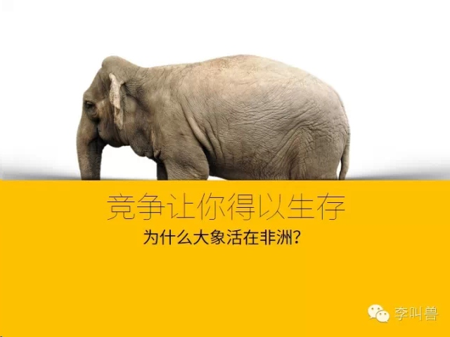
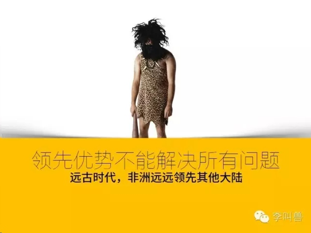
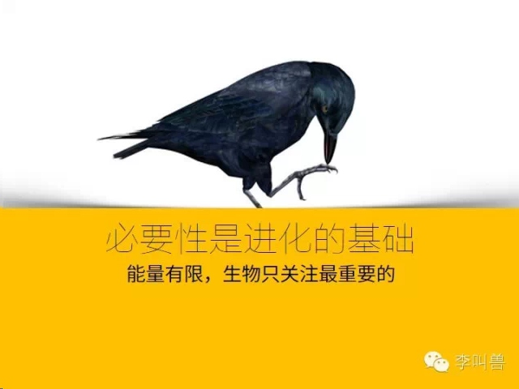
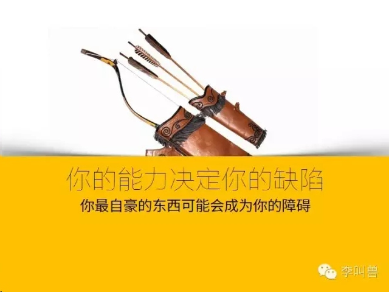
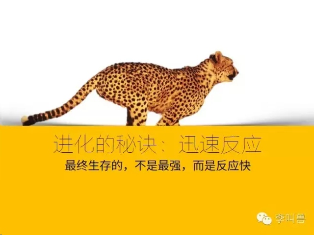
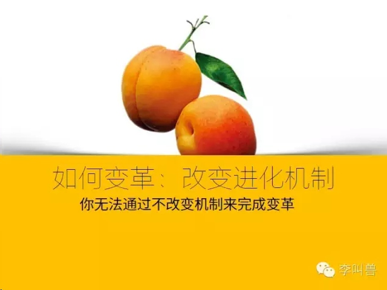

## 【李叫兽】“进化论”教你商业思维：为什么大象都在非洲

*2014-10-06* *李靖* [李叫兽](http://mp.weixin.qq.com/s/Zwy8EW0Sl754pKppj1agHQ##)

有人问：如何具备商业思维？

我想说，你无法在真正理解“竞争”之前，真正理解商业。

关于“商业竞争”的教科书很多，但是我想回到竞争最本质、最纯粹的地方—绵延百万年的生物生存和进化的竞争，并希望从中得到一些答案。

**1，竞争让你得以生存：为什么大象活在非洲？**

随着人类逐渐定居全球，许多大型陆生动物遭到人类猎杀而灭绝，比如新西兰的恐鸟、马达加斯加的大狐猴等，甚至在现在的美洲、澳大利亚等大陆，几乎没有任何大型陆生动物。

**但是总有地区存在例外，非洲就是其中最典型的一个**—它是大型哺乳动物的天堂。在非洲有数不清的大象、狮子、羚羊、角马等大型哺乳动物，它们都没有随着人类的进化而灭绝。

**为什么澳大利亚的大型动物在短短几百年的猎杀中灭绝，而非洲的大型动物却存活到了当代？**

这不是因为非洲人更加“动物保护主义”，而是因为非洲的大型哺乳动物已经和人类共同进化了几百万年。

非洲是人类的发源地，是人类最早出现狩猎技术的地方，而由于几百万年前人类狩猎技术很低级而且提高得很慢，这给了非洲动物充裕的时间来形成对人类的恐惧并逐步进化—它们不得不变得更快、更隐蔽、更凶狠以躲避人类捕杀。

而澳大利亚大陆最初并没有人类的定居，那里的动物在没有人类猎杀的情况下已经存活了百万年。

因此当人类的航海技术足够发达并移民到澳大利亚时，人类已经进化百万年的狩猎技术直接面对没有经历过猎杀的大型哺乳动物，最终导致它们的迅速灭绝。

**所以，在人类后来才移民的地区，几乎看不到像非洲那样的大型哺乳动物，因为它们没有同人类长时间共同竞争。**

同样，在商业环境下，完全地规避竞争虽然可以为企业创造高利润和舒适的环境，但是往往也会导致企业缺乏足够的能力应对新的竞争者。

比如中国长时间的封闭和贸易保护主义曾让国内一批企业迅速发展壮大，但是也导致它们缺乏应对激烈竞争的能力，所以突然的开放让一些企业面临绞杀的危机。

因此，如果想培养竞争力，重要的一步是离开舒适区，积极参与而不是消极规避市场竞争。

**2，领先优势并不能解决所有问题**

我们总觉得资源、技术上的领先优势难以被超越，并在此基础上培养出盲目的自信，但是事实并不是这样。

如果把一个考古学家送到公元前11000年，让他来一次环游世界，并以此预测以后各个大陆的命运，**他肯定会认为非洲将是未来世界的核心：**

当时的非洲具有最高的人口多样性，最先进的狩猎技术（当时全球几乎都是狩猎文明），最高级的社群组织，事实上，非洲比其他任何大陆早500万年就出现了原人。

**但是实际上当代非洲几乎是最落后的地区**—有些部落还在使用公元前11000年的技术。非洲曾经比其他大陆领先百万年，但是这百万年的技术领先在数千甚至数百年时间就被超越了——移民到新西兰的人仅仅花了数百年时间就进化出了像非洲一样复杂的人类社会。

我们总是习惯于用领先优势来解释问题，但是**你花费数年甚至数十年打造的领先优势并不代表你的竞争者会花费同样的时间才能赶上。**

BEATS耳机在短短几年时间就迎头追赶拥有半个多世纪高端耳机制造历史的森海塞尔、AKG等；小米只用了3年时间就赶上了拥有巨大“技术积淀”的众多手机厂商；同样，对于现在仍然在行业内领先的微软、麦肯锡和高盛等，我们可能高估了其资源、技术和名誉的领先价值。

**3，必要性是进化的基础**

我们都听说过“**乌鸦取水**”的故事—乌鸦也会把石子扔到水瓶中，以提高水瓶的水位来取水。而且大量的动物实验也证明乌鸦的确具备这种“高级智能”。
**那么为什么乌鸦没有继续进化成人类一般的智慧动物呢？**

研究发现，在实验环境之外，乌鸦在日常生活中从来不用这种方法取水—自然界到处都是水，乌鸦只要飞一飞就能发现水源，没必要学习“工具”这一高级技能。也就是说，乌鸦并不会进化出对其并不必要的能力。

竞争一直都是激烈的，而生物的精力和能量总是有限的，这决定了只有把有限的能量用在最必要的环节，它们才能存活。

比如小蛇往往有毒而大蛇往往没毒，这是因为大蛇已经足够保护自己—它们把能量用在了长大上；而小蛇体型不能保护自己，把能量就用在了长出毒牙上。

同样的情况也适用于商业环境。

**为什么中国电影质量很坑爹？**

除去能力差距之外，这是因为电影质量在中国并不是必要的。即使是质量低下、逻辑混乱的电影，仍然海量观众买单。

这就决定了：把公司有限的资源投入到并不关键的“电影质量”“故事逻辑”上，还不如投入到公关费用、媒体推广、明星出场费上。毕竟如果某个市场问题你可以通过简单“请某个人吃顿饭”来解决，就没必要通过复杂地“提升电影质量”来解决。

同样，为什么铁道部的网站设计很坑爹，而微信的设计很“友好”？为什么中国移动、工商银行等服务很差，但是海底捞服务很好？因为对铁路公司、工商银行等来说，取悦大众消费者可能并不是关键的竞争因素—与其花费精力提升服务质量，还不如想办法争取其他资源。

所以，**必要性是进化的基础—企业只会进化出对其成长最必须的能力。**如果你想培养一个能力，最重要的并不是去“投资”，而是先创造一个“必须使用该能力”的环境。就像如果你想开始学英语，最好的方法就是先给自己创造一个必须使用英语的环境。

**4，资源禀赋：你的能力决定了你的缺陷**

在进化的过程中，一个进化优势也往往决定了一个劣势。

我们知道，在人类历史上，先进的农耕文明是晚于狩猎文明才出现的。

在狩猎时代，最受受青睐的是拥有高山丛林、靠近海洋、大型动物丰富的地区，因为猎人有丰富的资源去狩猎。在这些地区，人类建立了最先进的社会，社会发展远远超过那些平原、无大型动物的地区。

**然而正是这些地区的优势，导致了它们在向农耕文明的进化中落后了。最早发展出农耕文明的，正是那些缺乏海洋和丛林，逼迫人类不得不进行农耕的地方。**

同样在商业中也是这样，在破坏性创新的浪潮中，最先被淘汰的往往是那些极度适应过去的环境并锻炼出极高能力的企业。

比如在电子游戏行业的“移动化”浪潮中，过去最擅长做桌面游戏的团队往往难以在移动游戏中取得成功。

这些团队锻炼出了最适合桌面游戏的能力—设计出效果最好、剧情最复杂、技术含量最高并且能让玩家长时间集中注意力的游戏。

**但是这些能力反而成为他们在手机游戏取得成功的绊脚石**—手机游戏需要剧情简单、容易学会、省电、省流量而不是一味追求效果，这些正好与桌面游戏团队的能力背道而驰。

所以我们看到过去的桌面游戏公司网易游戏、搜狐畅游等在手游发展不利，而过去没有游戏经验的新公司设计出了水果忍者、愤怒的小鸟。

当然，聪明的腾讯为了避免这种情况，启动新的团队（天天游戏）来做手游而不是使用过去在桌面游戏取得成功的团队。

所以，你的能力决定了你的缺陷。**过去你为了适应某个环境而锻炼出的优势可能成为你适应新环境的绊脚石。**就像过去茂盛的丛林成为发展狩猎文明的保障，但是后来也变成了限制这些地区进一步进化出农耕文明的障碍。

**5，进化的秘诀：迅速反应**

达尔文说过“**最终能够在丛林激烈的竞争中存活下来的，并不是速度最快、身材最大、牙齿最锋利的物种，而是能够对环境改变做出最迅速反应的物种。**”

就像上文提到的，在不同的环境中，一项优势可能会迅速变成一项劣势。厚重的皮毛可以让动物适应寒冷的气候，但是也导致它们无法适应温暖的环境。

**但是不论如何，对环境的迅速反应可以让生物更容易存活**—温度升高，厚皮毛的动物受不了，但是远古人类可以选择直接把皮衣脱下来，换上草衣。

同样，为什么小麦等植物可以被人类驯化改良变成优质的农作物，但是同样拥有使用价值的橡树却一直没有被人类驯化？

这是因为小麦基因的改变非常快—小麦是1年生作物，寿命只有1年，这意味着古代人类可以每年选择把颗粒饱满的小麦种子留下来种植，而淘汰颗粒小的，这样几年下去，小麦质量就一年比一年好。

而橡树是多年生植物，培育一代的周期超过30年，这意味着如果5年可以改良一批小麦，那么需要150年才能改良一批橡树。

所以，如果想要变得更“好”，最好的方式就是迅速改变，迅速反应。

**商业世界也是这样，最成功的公司往往并不是现在专利最多的公司，也不是市场最大的公司，而是能够对环境变化做出最迅速反应的公司。**

比如IBM的历史：
IBM最初是做打孔机和制表机的，后来该市场萎缩并且赶上第二次世界大战，IBM未雨绸缪，把民用生产线转军用，制造出著名的勃朗宁步枪和M1冲锋枪。二战结束后，武器市场萎缩，而政府的战后重建需要大量的统计工作，IBM就利用二战时积累的政府关系再次转型—为政府提供统计服务。到后来，IBM又踏上了制造计算机的浪潮，成为“蓝色巨人”。再后来PC行业增速放缓时又把PC业务卖给联想，开始专注云计算和咨询类业务。

**6、如何变革？改变进化的机制**

生物的进化过程是如何扭转的？**往往不是生物有意识的扭转进化过程，而是决定其进化的“机制”产生了改变。**

人类驯化杏仁的历史充分证明了这一点：

最初杏仁是苦涩而且有剧毒的，**因为这有助于杏的遗传**—杏长出香甜的果实是希望动物们把它摘下来以散播种子，而杏仁（杏的种子）却苦涩而剧毒，是为了让动物不要吃种子，从而可以让种子被留下而生根发芽。

后来人类如何无意识地驯化了杏仁呢？

**人类的行为改变了杏的进化机制：**

假设有一棵杏树产生了基因突变，长出了没有毒的杏仁，它们在野外是留不下任何后代的，因为鸟会把这些无毒的种子给吃光。

但是如果人恰好来到了这颗杏树，出于好奇随便尝尝，竟然发现这颗树的杏仁不苦而且无毒。被利益驱使的人类就把杏全部采下来拿回家种植成杏林，最终经过一代代的选择，杏的进化过程被扭转，杏仁变成了不苦的。

**也就是说，过去杏仁是“越苦越有利于生存”，当人类到来后变成了“越不苦越有利于生存”。**

同样的情况适用于公司—**如果你想完成变革、扭转局势，你必须改变公司的激励机制。**不改变激励机制，仅仅靠“抓某些坏人”、不断开会喊口号是没有办法完成变革的。

改变激励机制意味着过去被鼓励的行为将来可能被批评，过去被轻视的行为将来可能被鼓励。

比如一个设计桌面游戏的团队如何更适应手机游戏的业务？这意味着重塑激励体制—过去设计出精美画质和复杂剧情的人会得到上司赏识，现在为了省电省流量而牺牲画质的人会得到公司的赏识，而过去“完美主义”的人可能被逼最终离开该团队。

**7、如何更经济？圈养你的消费者**

**在人类进化的历史中，为什么农耕文明比狩猎文明更加有效？**

人类虽然是杂食动物，但是自然社会中仍然有95%以上的动植物是无法被人类食用的，其中包括有毒的蘑菇、咬不动的树干、低营养的树叶等等。

狩猎社会就意味着一片土地中只有5%的作物是有价值的。**但是通过种植和选育—把不能吃的动植物杀掉砍掉，留下能吃的，人类把这5%提升到了80%。**

总之，一片麦田比一片森林能养活更多的人，所以古代农耕文明发明了先进的钢铁、城堡和文字，而狩猎文明的人还在茹毛饮血。

同样的道理适用于商业。对于大部分产品来说，95%的人并不是你的消费者，这意味着如果你向大众做广告，95%以上的钱是白花的—如果你在CCTV上做冰球球鞋的广告，可能99%钱花在了没用的人身上，就像一个猎人拿出了大部分时间去观察他不能吃的植物。

但是如果你能想办法把消费者聚集起来，就会有用的多。

比如在冰球俱乐部做广告，或者购买百度搜索的词条，或者使用大数据精确定位潜在的冰球爱好者。这种行为就像农耕文明下，农民把自己喜欢吃的食物集中种在一个地方，从而避免跑到森林里不断寻找。

**当然更经常的做法像农民圈养鱼一样圈养你的消费者**—也就是塑造粉丝文化。当你像苹果、小米那样塑造了粉丝文化，并且拥有了和企业固定粉丝沟通的渠道（比如微博），你就不再需要“出海打渔”，只需要“在鱼塘培养鱼”了。