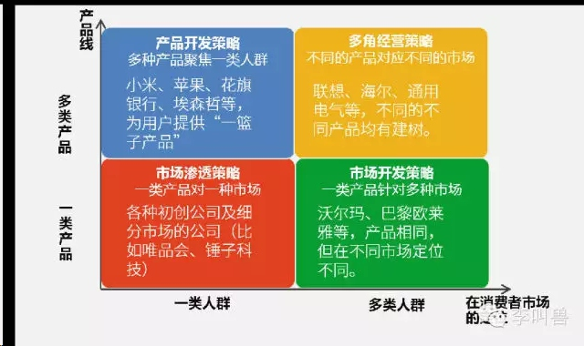
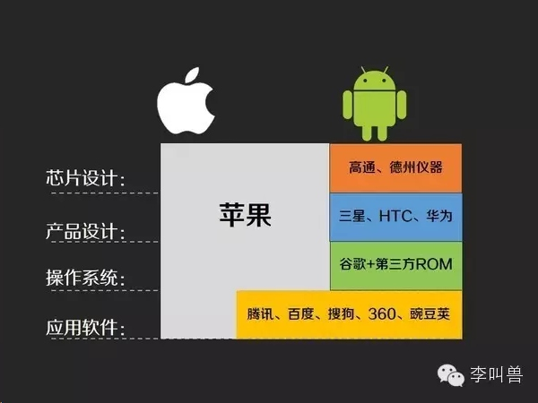
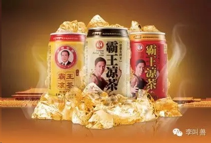
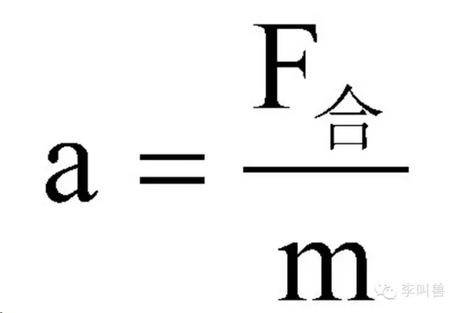
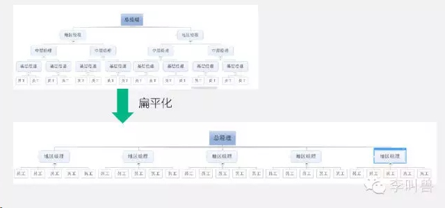

## 【李叫兽】自媒体经常用来忽悠读者的10个商业理论

*2014-08-25* *李靖* [李叫兽](https://mp.weixin.qq.com/s/5jwNVyT2syVh0u6cRivRpA##)

**科技媒体的“大侠们”经常对商业世界指点江山、挥斥方遒，并成功地使用一套套理论来忽悠，比如：**

- 电商做平台必死！
- 垂直电商难以长远发展！
- “极致的用户体验”是致胜王道！
- 初创企业要像小米那样的“粉丝经济”
- 扁平化管理是新时代管理结构的王道。
- 成败关键在于：满足用户需求。

任何理论都有适用条件，没有绝对“好”的策略—如果“粉丝经济”就是好策略，那么所有人都会去用了。

**下面盘点10个经常被大师拿来忽悠人的商业策略：**

**1，粉丝经济**

**忽悠指数：☆☆☆**☆****

“如何选择产品策略？”

大师：“开发多种产品针对同一群体消费者，提供一篮子解决方案，构建产品生态圈，你就能打造像小米、苹果一样的“粉丝经济”！

**【叫兽解读】**

各种产品策略均有优势劣势，每种策略都有成功案例，需要根据行业和企业情况灵活选择。

**比如小米的初期策略，针对一种市场（发烧友）的一篮子服务**

**优点：**

聚焦一种人群，容易开展粉丝文化；

各种产品相互协同促进（比如一旦你买了iPhone，就更有可能买同一体系下的Macbook）；

**缺点**：

依赖单一用户群，风险大；

单一用户群规模有限。

而如果是针对不同市场开展不同产品（比如海尔），虽然难以像小米、苹果那样开展“粉丝文化”，但是却极大降低了企业的风险—没有把鸡蛋放在一个篮子里，即使一个市场垮了，另一个市场还能盈利。

**2，产品体验是王道**！

**忽悠指数：☆☆☆**

“大师您觉得我这产品有戏吗？”

大师：“你们的产品比对手都要好，肯定能行！”

**【叫兽解读】**

销售员回来后总是抱怨：我们的产品明明比竞争对手好很多，可以他们怎么就这么傻，不选我们！

嗯，**我们总是假定消费者知道自己想要什么，并且会花费大量时间去寻找自己想要的。**

而实际上消费者往往既不知道自己要什么，可能也不会花费大量的时间去比较优势劣势。对很多人来说，买某个东西可能只是因为习惯。（对于一个已经习惯用海飞丝10年的人，你能用比海飞丝“更好一点”的产品来打动他吗？）

所以产品性能和体验很重要，但是并不能决定一切。你需要考虑其他因素。

**【类似案例】**

- 即使易信产品体验（比如语音质量、UI设计等）真的比微信好，你会放弃微信转战易信吗？

- 新出一款凉茶，防上火功能更强，它能打败加多宝吗？

- 交往了好几年而且相爱的男友，这时出现一个“性能”（比如更体贴、身材更好）更好的追求者，你会立刻放弃现任男友吗？

**3，自主研发核心技术，打造极致产品！**

****忽悠指数：☆☆☆**☆**☆********

“大师，我的公司如何像苹果那样成功？”

大师：“你需要像苹果那样，掌握核心技术，自主研发，控制产品各个环节，一体化设计，以达到最佳的用户体验，从而获得亿万用户的青睐！”

**【叫兽解读】**

苹果的“自主研发”和小米、DELL等的“分散外包”各有优势，需要根据公司和行业的具体情况来决定。

苹果更多采取“共生型产品架构”，主要零件、系统等自主研发，并且不与其他品牌的系统兼容。优势是**产品性能**（比如流畅性、稳定性），劣势是**高价格**和**低灵活性**。

DELL、小米等公司采取“模块化产品架构”，主要零件、系统等全部采用外部供应商的解决方案（比如小米使用高通设计的芯片、谷歌的系统等），优势是**价格**和**灵活性**，劣势是**产品性能**。

**为什么？**

**①性能：**模块化产品对兼容性的要求严重限制了工程师发挥的自由和前沿技术的应用。安卓工程师设计的功能需要保证所有三星、小米、锤子等都能用。而苹果公司可以完全针对自己的产品设计芯片、系统，不需要考虑兼容其他品牌。

**②成本：**模块化公司可以把业务外包给能以更低成本进行研发和生产的企业。而苹果公司自己设计的芯片智能自己用，不能顺便卖给其他公司来收回成本。

**③灵活性**：因为兼容性高，小米可以随时把芯片从高通的换成德州仪器的；但是苹果并不能把芯片从A7换成高通。这意味着苹果无法采用机海战术来满足不同消费者需求。

所以，一般来说，在行业发展的初期，产品性能普遍较低，消费者更加看重性能（比如流畅性、稳定性），因此苹果这样的共生型公司更加容易成功；

而行业的中后期，随着主流产品性能逐渐超过消费者需求（比如现在的8核处理器超过了一般需求），消费者就不再那么在意性能了，转而关注价格和灵活性，这时小米、DELL这样的模块化公司更有可能成功，而iPhone的市场份额会下降。
所以说，苹果的“自主研发”并不是万能的，这取决于你想要以什么优势去参与竞争。

（本理论详细信息可关注本主页并回复“行业”）

**【类似案例】**

- 苹果的MAC及iPhone总是在行业初期大放异彩，而在行业后期被模块化的DELL、HP、联想及三星、小米等赶超。

- 擅长一体化研发的通用、福特在行业初期占据市场，而后来被擅长“分散外包”的丰田等日系车打败。

- 初期施乐采取共生型架构，不与其他公司兼容墨盒，所有流程自己设计，一度成为打印机的代名词。后来佳能、惠普等高度模块化的公司（兼容其他公司的墨盒）占据市场，把施乐赶向高端市场。

**4，进军主流市场！**

****忽悠指数：☆☆☆**☆******

“大师，我创业开发了一个在线培训产品，如何定位消费者？”

大师：“肯定是利用价格及便利等优势，把新东方等庞大的线下客户源抢过来！”

**【叫兽解读】**

“进军主流市场”并不是万全之策，对于以“低价”“便捷”为优势，而不是“质量”为优势的产品，进军主流市场往往困难。

当你进军主流培训市场，你的顾客可能质疑销售员：“教育质量、现场互动等能比得上线下培训吗？我还是不去在线培训了。”

而当你进军因为价格、便捷（距离太远）等因素而无法参加线下培训的消费者时，你的顾客就会想“虽然教育质量没那么高，但是有个培训班上，总比没有要强。”

所以，如果你的产品以“性能”取胜，更适合进军主流市场，因为这部分消费者愿意为更高质量的产品买单。

而如果你的产品以“价格”和“便捷”取胜，更适合进军被其他主流产品所放弃的那部分市场，**取悦那些“巨头们不屑于去取悦的消费者**”，因为对他们来说，“有，总比没有要强。”

**【类似案例】**

- 太阳能在美国推广失败，但是却首先在非洲取得成功。因为太阳能虽然便宜、便捷，但是电力不稳定，这达不到美国人的要求。而在非洲很多地方，根本没有电网，所以太阳能虽然电力质量不好，但是总比没有电用要强。

- 索尼随身听比传统收音机更加低价而且小巧，但初期无法得到音乐主流消费者的喜爱，因为音质太差。然而索尼随身听定位“买不起大型收音机”和“爱出门”的人，对他们来说，随身听虽然音质差，但是总比出门没音乐听要强。

- 初期的小米，并不是拿“价格”作为优势去抢三星和苹果的客户，而是去聚焦买不起三星苹果的人。

**5，品牌延伸**

**忽悠指数：☆☆☆☆☆**

“如果提高盈利范围？”

大师：“使用原来的品牌，开发新产品！”

**【叫兽解读】**

品牌延伸（使用原来的品牌开发新产品）既有优势也有劣势，不能盲目使用。

品牌延伸更加能借助原有品牌的知名度来推广新产品，但是又可能会扭曲品牌定位，模糊化了消费者对该品牌的含义。

比如在消费者心智中，“霸王”就是防脱发的代名词，而当霸王推出了凉茶，反而扭曲了其在“防脱发”上的定位，使原品牌元气大伤。

因此品牌延伸策略并不是万能，需要根据具体情况来决定如何使用。

**【品牌延伸成功案例】**

- IBM由商业服务器品牌延伸到消费者领域；
- 华为由通信设备商延伸到消费电子领域（手机）；
- 京东由自营B2C延伸向平台型电商；

**【品牌延伸失败案例】**

- 霸王凉茶
- 皮尔卡丹延伸到男装、女装、袜子、皮具、香水、巧克力、饭店、家具等多领域，最终模糊了品牌含义，导致失败。
- 长虹手机
- 格兰仕空调
- 哇哈哈童装等

**6，经济激励**

**忽悠指数：☆☆☆☆☆**

“大师，员工工作没有积极性怎么办？”

大师：“绩效与奖金挂钩，提高激励！重赏之下必有勇夫。”
**【叫兽解读】**

外部激励（金钱、职位、惩罚等）并不一定会导致绩效上升。有研究证明，对于需要创造力的劳动，外部激励会显著降低绩效。

比如有实验证明，让A组实验者自由解决一个智力题，同时给B组金钱激励让其解决智力题，结果发现A组实验者解题速度和准确性远远超过B组。

**这是因为对金钱的关注降低了我们的内在驱动力（热爱、兴趣、好奇心等），使得本来充满创造力和乐趣的事情变得索然无味。**

所以，规定“随地吐痰罚款2元”后，发现随地吐痰的人变多了，因为规定罚款之前，大家觉得随地吐痰是可耻的，但是一旦出现了罚款规定，人们忘记了内部激励（比如耻辱感），只关注外部激励（罚款），从而导致大家觉得吐痰没什么大不了。

为什么这样？

因为**内部激励**（热爱、兴趣、创造力等）和**外部激励**（金钱、惩罚）难以同时存在，当人被外部激励驱动，自然会丧失兴趣和降低创造力。

**所以，当一个工作是不需要创造力的重复性工作（比如搬砖、纯粹的线性计算等），外部激励更加管用；而当一个工作是需要创造力的复杂工作（比如设计、分析、写作等），内部激励更加管用。**

这可以解释为什么在很多需要创造力的公司（比如腾讯、谷歌、麦肯锡），其绩效和工资并不是完全直接挂钩的；而在很多工作简单且重复的公司，业绩提成几乎就是一切。

**【类似案例】**

- “这个月做好了就给你升职，做不好就走人！”—这会让员工更加热爱工作、发挥创造力，还是更加胆小、不安和缺乏想象？

- 立法强制读书会提高读书积极性吗？

- 立法“常回家看看”是更加促进了回家看父母的积极性，还是摧毁了这种积极性？

- 大学生志愿活动与奖学金直接挂钩，是提高了大学生献身公益的积极性，还是摧毁了其对公益活动的热爱？

**7，大量投入资源**
**忽悠指数：☆☆☆☆**

“大师，公司开了新项目，如何提高其成功率？”

大师：“加大对该项目的投入！人才、资金海量支持！”

**【叫兽解答】**

**资源投入需与市场规模相适应，过量投入资源可能会害死一个项目。**

苹果当年开发“牛顿牌PDA”，对新兴小市场大量投入资源，却忽视“市场容量增长本身就有限”，渴求迅速成功，最终项目失败。

而腾讯开发微信项目时，一开始保证张小龙团队能够独立运营，并未投入全公司资源，这给了张小龙团队宝贵的试错机会、成长空间和决策自由权，使的微信可以自由开发各种功能，最终取得成功。

“小市场无法解决大团队的增长需求”，如果想从0开始做起新市场新项目，你可能需要创造一个“能够为5万元订单为欢呼雀跃的团队”。

因为牛顿第二定律也告诉我们：

物体质量越小，改变其加速度所需要的合外力也越小。**（质量越小，越好调头。）**

**8，满足顾客需求**

**忽悠指数：☆☆☆**

“大师，如何学会营销？”

大师：“想尽一切办法改进产品，满足顾客需求！”

**【叫兽解读】**

是应该“**满足顾客需求，为现在的顾客改进产品**”，还是应该“**满足产品需求，为现在并不完美的产品找顾客**”并不是绝对的，这取决于具体的情况。

比如晶体管刚刚发明出来时，虽然体积小、稳定性高，但是运算能力远低于电子管，还无法满足计算机的需求。**当时可选的战略有两种：**

1，满足顾客需求，投入全部精力研发，直到晶体管的性能能够达到计算机的要求。

2，满足产品需求，先为不完美产品找市场。

最终晶体管采用策略2，先找到了“**对计算能力要求低，但是对体积要求高”的助听器市场**，并实现了商业化，多年以后随着性能的不断提升，才逐渐出现了收音机、计算机上。

一般来说，当市场明确、产品性能提升稳定（比如现在的智能手机行业）时，“为现有市场改进产品”可能更有机会。

而当市场不明确（比如晶体管刚发明时），可能更加应该“为产品找市场”。总之，策略并不是绝对的。

**9，企业并购**

**忽悠指数：☆☆☆**

“大师，收购企业时应该选什么样的啊？”

大师：“相信我，一定要选业务相关的企业，不要选与你主营业务无关的！”

**【叫兽解答】**

选择“同行企业”还是“非同行企业”并不是绝对，这部分取决于你如何平衡风险和收益。

**如果选同行业企业，一般能够增加你在本行业优势、扩大市场份额，但是可能会增加风险**—万一这个行业不行了，血本无归。比如当年HP以创纪录的价格收购“康柏”，从而一跃成为PC行业的领头羊，但是随着PC行业利润逐渐变低，这一收购后来反而拖累HP。

**如果选不同行业企业，能够有效地减少风险，但是可能各个业务难以互相支持。**通用电气涉足医疗、金融、电器等多个领域，即使一个行业不行了，但是鸡蛋不在一个篮子里，整个集团不会垮。

**当然这样可以“减少风险”收购还常见于同一产业链上：**
比如某零售商收购地产商，假设未来地产行业不行了，租金降价，正好自己的零售业务能够赚钱；而假设未来地产行业再次飞奔，租金涨价，虽然零售业务亏钱，但是地产业务赚钱了。不论哪种结果，都不会太坏。

所以，没有说“一定要收购相关企业”，具体怎么做，你得看你的目标。

**10，扁平化管理**

**忽悠指数：☆☆☆**

“我的企业应该怎么管理？”

大师：“学习国际先进经验，扁平化管理！”

**【叫兽解读】**

所谓扁平化管理，就是减少管理层级，增加管理幅度：

很多人把扁平化管理当万能药，而实际上你需要在它的优势和劣势中取舍。扁平化管理可以增加管理系统反应速度、增加灵活性、减少管理人员成本，但是同时会提高管理者的管理难度、增加横向沟通难度等。

【总结】

商业理论不是“迷信”，而是“科学”。

“迷信”会告诉你：XX一定是对的！XX永远是正确的！XX是宇宙真理！

相反，“科学”不会告诉你真理，**科学告诉你的永远是模型、假设和理论，而这些理论都是有“适用的前提条件”的。**

所以，没有什么商业策略是可以“在所有情况下都适用”—如果“一体化战略”永远是好的，那么所有企业都会一体化了。

怒写此文，希望为那些“使用绝对真理来指点江山”的商业分析者们泼点冷水：**一切抛开适用条件来讲理论的行为都是耍流氓！**

本文参考书目：

《定位》《创新者的窘境》《竞争战略》《驱动力》《怪诞行为学》《营销管理》

