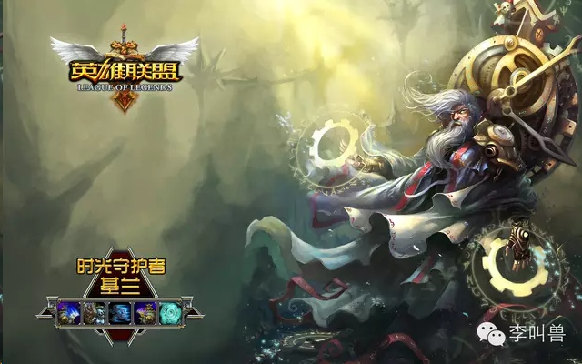

# 【5月30日分享文稿】游戏教我如何提高团队凝聚力

*2014-06-03* *李靖* [李叫兽](http://mp.weixin.qq.com/s/DZO6PfDZftDxvnjzrKR1MQ##)

> 原文链接：http://mp.weixin.qq.com/s/DZO6PfDZftDxvnjzrKR1MQ

游戏教我如何提高团队凝聚力

无数的领导者都在抱怨：为什么我已经如何努力，团队仍然像一盘散沙？如何才能让下属享受工作过程？

一方面，团队的凝聚力和士气已经成为了管理的世界性难题，无数CEO和部门主管为此抓破头脑。

另一方面，大家在玩电脑游戏的时候却永远充满动力、团队凝聚并且不知疲倦。如果能让员工对游戏的投入感和享受感放到工作上，那么就永远不愁团队凝聚力和士气问题了。

游戏为什么让人上瘾？它能交给我们什么？

根据简·麦戈尼格尔的研究，游戏的构成有4大要素：目标、规则、反馈以及自愿。对这4个要素的有效强化可以让人不断地投入精力，甚至达到“忘我”的理想状态。

**1、目标：玩家努力达成的具体结果。**

所有的游戏都会明确告诉玩家“Why we fight”，会告诉他们明确的目标以及这个目标背后的意义：

- 经典飞机大战：获得更高的分数，不断地打破自己的记录，不断地超过你的朋友。
- CS：消灭恐怖分子或者消灭警察。
- 英雄联盟：干掉对方的老巢！

游戏为玩家提供了清晰的、共同的目标，让玩家可以知道自己现在的努力会得到什么。这让游戏具备了让人上瘾的第一个条件。

同样，在团队中，也要为员工提供清晰的目标和远景，让他们知道自己做的事情背后的意义。否则，员工很快就会丧失动力。

请对比以下两种表达：

A：给你一个月时间，你负责邀请50名嘉宾！

B：此次的会议对公司非常重要，而为了保证会议的进行，我们需要邀请50名嘉宾，我觉得这个工作你一定可以胜任。给你一个月时间，做好了会有更多机会的！

记住，任何一个游戏都不是毫无意义的，同样，任何一个领导者都无法让员工长时间高度投入在自己认为没有意义的工作。

因此，不要觉得你的员工是机器人—你只需要告诉他们去做什么，而不必告诉他们为什么去做。你需要告诉员工：他的努力在公司中有什么意义，这次任务他的目标是什么！

**除了“给员工一致而明确的目标，让他们的工作产生意义”之外，还需要保证每个人的目标和能力尽量有效匹配。**

一般来说，目标匹配能力的状况有3种：

- 休闲—目标低于能力
- 心流（Flow）—目标等于能力
- 挑战—目标高于能力

**①休闲—目标低于能力**

给员工分配远低于其能力的目标（比如让员工去收拾一下会议室）。

优势：降低压力、舒缓工作节奏、安逸

劣势：让他们觉得不受重视，能力无处发挥。任何员工如果长期处于这种状态，要不能力下降，要不因受不了被低估而离开团队。

**②心流（Flow）—目标等于能力**

给员工分配最能体现他能力的目标，最让人沉浸其中、享受工作，但是能力难以提升。几乎所有游戏让人沉迷的秘诀就是：为现在的玩家提供匹配他能力的目标，让他长时间处于flow状态（一种最高境界的沉浸和投入感），比如玩家如果升级，游戏敌人能力也增加。

优势：最让人享受和幸福感的状态，让人觉得有意义，能够长时间忘我投入甚至会表现出“牺牲精神”。

劣势：难以真正提高员工的能力。

**③挑战—目标高于能力**

给员工分配高于其能力的目标。

优势：能够激发潜能、提高能力；

劣势：会造成持久的压力和紧张感、未知感，长此以往会让员工因压力大而离开团队。

因此，为了最有效地提高团队的长期凝聚力和斗志，你需要匹配员工的目标和能力：让他们长时间处于目标和能力的相等状态以获得幸福感，短时间给予他们高于能力的目标以提高能力，而且有时候也需要给他们低于能力的目标来舒缓节奏。
**2、规则：对玩家如何达成目标做出限制**

在游戏中，你失败的次数可比现实中多得多（很多游戏没几分钟你就要“死”一次），你需要不断地面临被打败甚至被虐的状态，但你却很少对这个游戏产生愤懑、抓狂和不满，为什么呢？为什么现实中我们失败得更少，却有更多的愤懑和不满呢？

因为游戏有明确的、所有人必须遵守的规则，当发生任何一个冲突的时候，我们只需要按照既定的规则和原则，就可以避免大部分不满。
请假设这样一种情况：团队中A把自己负责的项目做完后，B提出了更好的方案，作为管理者你会选择继续用A的方案，还是用B的方案？

实际上这时往往你不论做什么，都难以让大家满意—如果选择B的方案，A会很不爽，觉得你不公平，这本来是A的任务。如果选择A的方案，又牺牲了团队的效率。那怎么办呢？其实只需要在团队成立之初，像游戏一样声明“游戏规则”，不打算遵守这些规则的人可以选择不加入这个团队。

这样，假设你事先声明了“本团队是追求任务效用最大化，谁的好用谁的，不会照顾个人的自尊”，大家遵守这个规则以后，做事按照规则来就完了。

只要有人来管和处理的地方，就往往存在无数的矛盾、冲突、愤懑和不满，因为人无法做到公平，而所有人又渴望着公平。相反，如果管理者像游戏的设计者一样，“制定游戏规则”，各种冲突就会容易很多。

**3、反馈：让玩家能够看到自己距离目标有多远**

为什么很多人把游戏当成了一种积极参与的习惯？为什么顶级的游戏发烧友，每天吃饭走路甚至做梦都惦记着今天能升到多少级？

因为游戏有世界上最先进、迅速和视觉化的反馈机制，每个人可以迅速地知道自己现在努力的成果（比如打了5分钟怪获得10点经验值），也可以清晰地知道自己现在距离下一个目标有多远（距离50级只有3000点经验了）。

而现实中往往没有这么有效的反馈机制，所以很多计划需要消耗大量的自制力。如果你不知道自己距离梦想有多远，如何能在这条路上坚持呢？如果不知道今天的努力有什么成果，如何在第二天充满动力？想象一下，如果一个游戏不告诉获得了多少经验或者通过了多少关，你还会玩吗？而很多低效的管理者就是这么做的—他们没有给下属提供迅速、清晰的反馈。

**那么应该怎么做呢？下面是几个Tips：**

①积极反馈：对于团队其他成员的工作，要迅速反馈并针对内容进行详细评价。比如：“这次的策划师开头使用了大量的实证数据，很有说服力！”

②成果可视化：让团队成员的“闪光点”可以被看到。比如，把某成员做出的成就转发给团队所有人；设置团队“纪念墙”，记录谁做了什么，做出了那些改变。

③分享：每周开一次团队讨论会，每个人有4分钟时间展示自己过去一周的成果。比如谷歌每周五下午就有团队沟通会。

**4、自愿：让玩家能够因为内在动力而完成目标**

为什么在游戏中你能发挥潜能，完成一个又一个现实生活中不愿意接受的挑战？因为所有的游戏都有“自愿性”，你不会觉得自己是被金钱或者威胁所迫而游戏，而是为了兴趣、热忱等内在动力来玩游戏。

而现实的工作中，很多管理者喜欢用“胡萝卜加大棒”这样简单粗暴的方式来管理员工，他们依赖奖惩机制（也就是威逼利诱）来管理，而不是激发员工的内在动力和兴趣。这样会导致员工越来越讨厌这份工作，因为他们觉得自己被金钱所迫而工作的。

有这样一个著名的例子：

有人家楼下有一堆孩子踢球，每天吵得他数不着觉。因此他想了一个办法，跟孩子说每次来踢球都可以拿到10元钱，这样一下子第二天踢球的孩子更多了。一周以后，他又说，每次来踢球给孩子5元，这时来踢球的人变少了。又过了一周，他说现在没钱给孩子踢球了，这时孩子们愤怒地离开了，不再来踢球了。

为什么这样呢？因为人的动力系统有2个—内在动力（兴趣、热忱、使命感、成就感）和外在动力（物质激励和处罚），而这两套系统往往无法共同存在。也就是说，人同时要不因为内在动力而行动，要不因为外在动力而行动。因此当外在动力（物质激励和处罚）控制一个人的行为时，人就不会再为这件事感到有趣了。这就解释了为什么世界知名的大公司中，员工的绩效和薪水只是弱相关关系—他们知道把绩效和薪水直接绑定只会让员工丧失工作乐趣。相反，有些中小公司之间拿订单量和薪水进行绑定，这样的公司人员流动率高，团队凝聚力也低。

**结语：如果你拿设计游戏的方式来设计团队管理，你可能得到的是一批充满投入感的高效员工！**