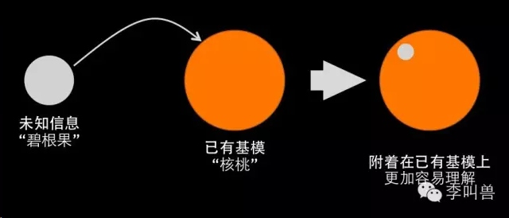
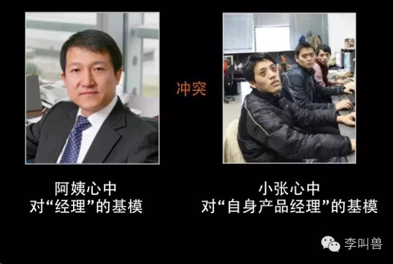

# 【李叫兽】过年回家，如何解释家人听不懂的那些概念

*2015-02-16* *李靖* [李叫兽](https://mp.weixin.qq.com/s?__biz=MzA5NTMxOTczOA==&mid=203182210&idx=1&sn=901a61fdf2ac3cb67591149874a5431c&scene=21&key=82438a29ddf260104c940c7395c0572b644bc15c5e05ad9bf1bb3504225714b1829fc8258ed71b453a5340a10b121bd15a6c51b0a4734460e7be4e38f7ab4658d747ce4fe432c1877457cf8f290f325a&ascene=7&uin=MjQwNzMxODYwNQ%3D%3D&devicetype=Windows+8&version=6203005d&pass_ticket=xOhI1VQDG%2FzwbhWgqYvgjLhswwNIUGjt8DUL4fp00EDxCVadhAwYny0MJ9B2H%2Fmr&winzoom=1.125##)

> 原文链接：http://mp.weixin.qq.com/s/Y8iZWXAXg0muMtLKvCkgrA

**［本期主题］**如何在简单的信息中装入更多的内容。

**过年回家，你可能会被亲戚阿姨问：**

“小张啊，毕业有一年了吧，你是做什么工作的啊？”

“是啊，阿姨，我去年毕业的，现在在互联网公司做产品经理。”

“这么牛啊，刚毕业1年就当了经理啊，我就说吧，我从小抱过的孩子将来都有出息！说说，现在手下管了了多少人？”

“阿姨，您搞错了，产品经理不是管人的，而是相当于管产品的，而且在我们公司也不是高级职位。”

“这不一样吗，产品还是要人去做的。真有出息，这么年轻当经理，想你王叔叔快40岁才当上经理”

“阿姨，经理并不代表着非要管人啊，我现在还很初级，有很多需要学的。”

“那产品经理是做什么的啊？”

你觉得实在词穷了，求救万能的百度百科，然后读给她“产品经理就是企业中专门负责产品管理的职位，产品经理负责调查并根据用户的需求，确定开发何种产品，选择何种技术、商业模式等。并推动相应产品的……”

“哎，小张，晚上在我这吃饭我给你煮羊肉饺子好不好？”看来阿姨也放弃了。

**你可能经常需要在极短的时间内，向别人解释一个非常复杂的概念，而且对方还缺乏理解这个概念的背景知识。**

比如，

- 你**过年回家**向吴阿姨介绍“什么是产品经理”，向张大叔介绍大学专业“市场营销”；
- **新电影上市**，制作方让大众和新闻媒体了解这是什么风格的电影；
- **创业家偶遇投资人**，在电梯内1分钟解释自己的商业模式；
- **公司宣讲会**，HR向提问的应届生解释“我们的项目助理岗位实际上不是秘书，而是XX”；
- 甚至，你**向朋友推荐**一个全新的智能硬件产品，或者他没有吃过的一个水果。

这对所有人来说都是一个困难的任务—**在短时间内向0基础的人解释一个复杂的概念，这意味着你需要在相当简单的信息中装进去更多的内容。**

但是文字本身的表现力总是有限的，你又怎么能在短时间内装进去这么多内容呢？

实际上这是可以做到的，方法就是：**利用对方已有的基模。**

举个栗子！

**假设你需要跟朋友介绍一种他没有见过的水果，第一种介绍方法是：**
> “这是一种水果，长在树上，长大约5厘米左右，款大约2厘米，外面有厚厚的绿色的皮。外面的皮是不能吃的，剥开之后是另一层褐色的皮，干干的，不是很厚。再剥开这个皮之后，就是可以吃的果仁了。果仁吃起来很脆很香，含有很多油脂……”

**第二种介绍方法：**

> “这是一种类似核桃的果子，和核桃大小、口感等各方面都差不多，区别是外形更加细长，而且壳更薄，更容易剥开。吃起来比核桃更脆，而且没有苦味。”

同样是介绍“**碧根果**”，上面这两种方式那种更容易让人瞬间理解呢？显然是第二种。

因为第二种解释跟对方的已知概念（核桃）联系在了一起。

我们知道，关于“核桃”这个概念，对方已经建立了一系列的印象（比如核桃是长在树上的、核桃仁是脆的等）。而这种一系列的印象就叫做一个“基模”。（瑞士心理学家皮亚杰首先提出）

**对于一个人来说，建立一个全新的基模是非常难的**—那意味着大量的未知信息，所以我们小时候花费了很大精力才认识了什么叫做“桌子”。

**但是在现有的基模上加以修改是非常容易的，因为这仅仅意味着少量的新信息。**（比如一旦你知道了什么是“会议桌”，继续理解什么是“电脑桌”就容易多了，甚至继续理解虚拟的电脑“windows桌面”都容易多了）

上面的第二种解释就是让对方在现有的基模“核桃”上进行修改，从而避免创建新基模的难度。

建立新的基模就好像你需要重新创作一篇完整的文章，而在已有基模上修改就好像在文档上改几个字一样简单。

**比如请你记忆下面这一串数字，你看看需要多久：**

1221084907985109

**如果把这一串数字重新排一下序，你看看需要记忆多久：**

1949197820082015

我想明显是后者记忆更加容易。因为前者你难以同头脑中已有的“基模”联系起来。

**但是对于后者的数字，你就很容易跟大脑中已有的“基模”联系起来**—你只需要记忆“建国”、“改革开放”、“北京奥运”、“今年”这4个基模就行了。

为什么人类需要这样的“基模”对信息进行归类整理，而不是像电脑一样直接存储这些信息呢？

因为**对复杂的世界来说，人的大脑容量和计算能力简直太小了，以至于不得不靠基模来简化信息。**

人脑的CPU主频不到小米手机的千分之一，而且整个大脑只有1G左右的存储空间，这就意味着，**如果不对信息进行高效地压缩和整理，一部XX.avi的动作片都足够把你的大脑空间完全占满了。**

但是我们仍然能记忆相当多的知识和无数的回忆，这是因为我们大脑具有强大的数据压缩整理能力。

就拿记忆照片为例，计算机存储1000张人脸照片需要1000倍的存储量，**而人脑实际上只相当于存储了1张人脸照片**（基模），然后看到新的人脸只需要在那个基模上做相应的改动—比如鼻子更高。

**正是因为各种各样基模的存在，才让我们更加方便、不费脑地理解复杂的信息：**

- 描述一个人的长相很麻烦？你会说她具有Angela Baby的脸型和舒淇的嘴型。
- 描述一个人的性格很麻烦？你会说他是一个典型的狮子座男生的性格，即使他是白羊座的。（虽然出生日期本身无法预测性格，但是星座给了我们一个简单的概括别人的方法，从而减少了脑力的使用）
- 跟外国人描述《小苹果》很麻烦？你会说这是中国版的《江南style》
- 跟投资人10s内讲清楚商业模式很困难？你会说“我是装修市场的小米模式”。

因此，**如果你想让别人迅速地理解一个全新的概念，就一定要利用对方已有的基模**—看看他过去的记忆中，有哪些跟这个概念类似的地方。

那我们如何利用“基模”来用简短的语言传达复杂的观点呢？

**你只需要2步走！**

1，避免偏见—避开不必要的基模

2，套用已有的基模

**1，避免偏见—避开不必要的基模**

为什么在本文开头时，小张改掉他阿姨对产品经理的偏见这么难—不论小张多么努力地去解释，阿姨还是觉得“产品经理是高管级别职位，是管很多人的”？

**因为阿姨过去已经形成了“经理”的基模**，当小张说出“产品经理”这个头衔的时候，她就自动激活了自己关于“经理”的各种记忆—高级职位、管很多人、有经验的人才做的等。

**因此在这个阿姨听到“产品经理”的时候，她就自动套用了“经理”这个基模**，来帮助她理解“产品经理”这一新概念。而这样的理解却是于小张的概念是冲突的。

所以对小张来说，阿姨过去的基模让她形成了对产品经理的偏见，就很难再让她改正过来这一个观点了。

**那么怎么办呢？**

一种方法是直接告诉阿姨：“阿姨，你刚刚的大脑中自动套用了’经理’这个基模，从而扭曲了你对’产品经理’这个概念的理解。”（呃，前提是这个阿姨学习过认知心理学）

**既然大部分阿姨并没有心理学博士学位，你往往就需要用第二种方法：避开不必要的基模。**

假设你想向阿姨介绍“产品经理”这个岗位，那么“经理”这个基模对于阿姨理解的你的工作几乎毫无帮助，反而会导致她产生不必要的偏见。

**如果你一开始像这样避开了“可能带来偏见”的基模，不提“经理”，就会好很多：**

“小张，你是做什么工作的啊？”

“在互联网公司从事产品方面的工作，主要就是做一些XXXXX……”

“原来是这样啊，那这个工作具体职位叫什么啊？”

“阿姨，根据我刚刚的描述，你觉得取个什么名字合适？”

“我看吧，’产品策划师’？”阿姨疑惑的问。

“其实吧，它的名字叫’产品经理’，不过您刚才也看到了，和传统的经理其实没有什么直接关系。”

**所以，当你给别人介绍一个陌生概念时，要先避开容易导致误解的基模。**

**2，套用已有的基模**

如何让别人理解“**碧根果**”？你可以套用“核桃”这个定义，然后在核桃的基础上进行修改—比如皮更薄。

如何向美国人介绍“**春节**”？你可以说“中国人的圣诞节”。

如何介绍**第一代iPhone**？乔布斯说的是“一个大屏幕iPod＋一个手机＋一个上网设备”。

如何跟学物理的人解释“**大企业被颠覆**”？你可以说：“根据牛顿第二定律，物体质量越大，改变其加速度就越难—需要更大的合外力。同样，企业越大，灵活顺应市场来调整其定位及策略也就越难。”

所以，对于一个完全不具备背景知识的人来说，大量的描述性语言让人完全抓不到头脑，**而利用对方已经理解的事物（基模），再在这个事物上修修补补就容易多了。**

（比如当你在解释碧根果前先解释“核桃”时，对方脑中立马浮现出了核桃的形象，这时候你再说“皮变薄一边”，他就容易想象多了。）

总之，不要跟养羊人说“1+1=2”，而要说“一只羊＋一只羊＝两只羊”。

而至于具体套用什么“基模”，是需要慎重选择的，因为**使用的“基模”不同，最后产生的理解和感知是天壤之别。**

比如这样一个新闻“美国对非洲的援助每年仅有10亿美元”。一个普通人看过之后，可能会疑问“10亿美元很多啊，美国真土豪，这还少！”

这时他潜意识中使用的“基模”是“金钱”，他自己过去对金钱已经形成了基本的印象（也就是基模），在他的基模中，可能“100块”是小钱，“10000块”是大钱，而10亿美元是绝对的巨款了。

**所以，如果使用“金钱”作为基模，激活别人过去对“金钱”的记忆，别人自然不会感觉10亿美元的援助不够。**

但是如果说“美**国伊拉克战争使用了几百架B－2轰炸机，而美国每年用于援助非洲的钱只相当于其中一架轰炸机的造价，也就是区区10亿美元。**”

这时所有人就会觉得“天啊！美国真是太缺乏人道了！”这是因为大家此时理解“非洲援助”这个事件时，使用地是“轰炸机的价格”这个基模。

这样的技巧也常常使用于诉讼中，比如有人被肯德基的水烫伤了，如果诉讼时要求赔偿几百万美元，陪审团肯定觉得太多太不合理的了。

但是如果说“**对于这样的无良企业，我们要求他拿出当天销售额的千分之一来赔偿消费者，是一个绝对合理的诉求！**”这样听起来就更合理了，即使金额是一样的。

所以如果你想介绍你产品经理的工作内容，又想装得一手好逼，与其拿“小区门口的湖南菜馆”做基模来类比，不如说：
> “阿姨，我看到您经常关注军事内容啊，昨天你还跟我说美国的最新电磁轨道炮呢！你知道吗，美国的军工企业在研制轨道炮时，需要有一个人去协调整个过程，其中包括—跟政府军队沟通调查潜在的战争需求，根据战争需求来跟研发工程师沟通设计轨道炮，并且协调产品交付时间等等，他不管人，他管的是轨道炮这个产品。而我在互联网公司做的工作就是类似这种，协调我们的APP整个过程。”

使用“基模”可以加快别人的理解，但是为什么很多人尤其是“专业人士”很不喜欢用？**因为这种“加快理解”是以牺牲准确性为代价的。**

为了跟初中生解释原子的结构，你可以说电子围绕原子核转就好像地球围着太阳转。但是实际上这是不争取的—电子在原子内是以概率云的形式运动，远远比单纯的“绕着转”要复杂得多。

但是在大多数情况下，大家可能并不需要也不想要理解准确而严谨的知识，这时候你就需要找一个对方已经理解过的事物，并且在这个基础上修修补补。

**通知：下周过大年，周一（年初五）就暂停更新一次！之后照常每周一更新，3月2号强势回归！**

祝各位春节快乐！面对各位亲戚的提问，从容应答！

——李叫兽