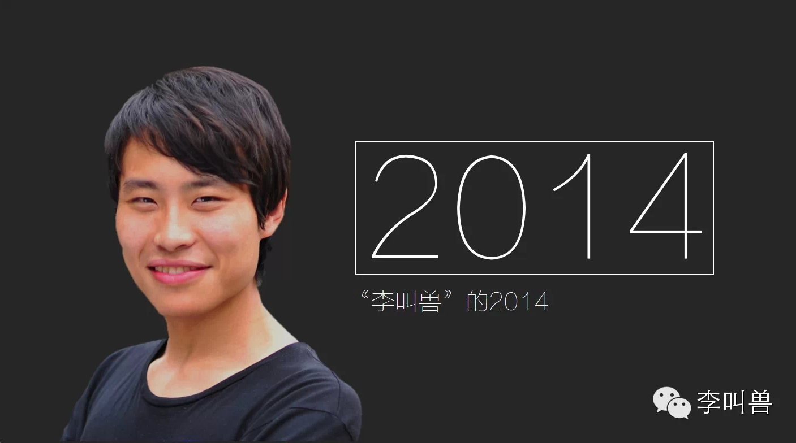
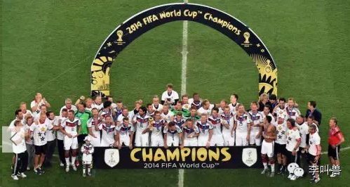
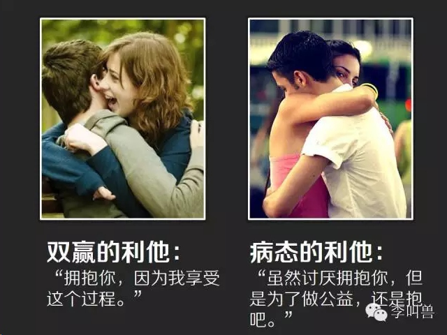
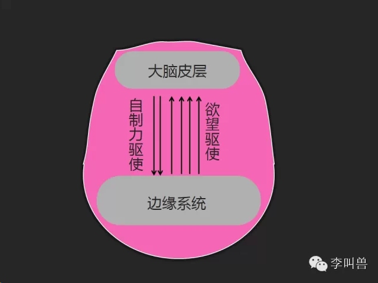
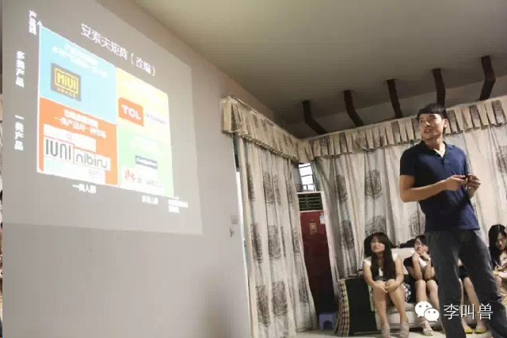

## 【李叫兽年终回顾】：如何优雅地完成新年愿望

*2015-01-05* *李靖* [李叫兽](https://mp.weixin.qq.com/s?__biz=MzA5NTMxOTczOA==&mid=202232416&idx=1&sn=bd2e06fdadf9a8a220e014167ed310a7&scene=21&key=db6cd421d403462c9de7a98fe00dfb4f925034fde62c3ed97859d0ba8eff74e4e1cfb111a61ae13b99132f9b5c620cce05b4d867e26cb40700483ce6b1b39bf5df5eeb0a85a999fe66fa4a2b66c8b7bc&ascene=7&uin=MjQwNzMxODYwNQ%3D%3D&devicetype=Windows+8&version=6203005d&pass_ticket=xOhI1VQDG%2FzwbhWgqYvgjLhswwNIUGjt8DUL4fp00EDxCVadhAwYny0MJ9B2H%2Fmr&winzoom=1.125##)

2015年刚刚开始，我想你正在考虑制定一个新年愿望。

不论去年的愿望实行地如何，总之现在是要有一个新的开始了。

如果2015年一定要把一件“非必须”的事情做成，应该怎么做？**不论是学习英语、练出八块腹肌、坚持每天跑步，还是成为编程专家或者开始运营一个自媒体，如果才能不像去年那样慢慢放弃？**

本期【李叫兽】将以【李叫兽】为案例，回顾李叫兽主页的2014，讲讲**如何完成新年愿望。**

- - - - - - - - - - -

我是这个微信公众号【李叫兽】的作者李靖，现在是清华经管学院的在读硕士生，每周一写一篇分析文章。坚持到现在，让这个公众号得到了超过12000名粉丝的支持，也让我自己学习到了前所未有的知识并接触到了各种机会。

**去年的这个时候，我的新年愿望是：今年做一个自媒体，分享商业分析，改变一些商业及职场上流行已久的错误观念。**

**那么这个新年愿望是如何开始并坚持下来的呢？**

**1，2014年1月：产生冲动，一切的前提**

当初为什么决定做这个自媒体？

想象一下，假设你是足球迷，你经常听人说“2014年世界杯冠军是西班牙队”，你什么感觉？

你一定想纠正这个观点。即使你迫于别人的面子有时不会把话说出来，但是我相信你是有这个冲动的。

**这就是我当时决定做自媒体时的感觉—仅仅是一种想要改变某些观点的冲动。**

我微信关注了一堆自媒体，但是**好多微信自媒体人压根1分钟的商业理论都没学过，就凭借自己主观感觉瞎分析什么“小米商业模式”，然后得出“小米必死”或者“小米必火”的极端言论—这不是在扯淡吗？**
特别是我看到“万能的大熊”发了一篇很火的**《当智商高到一定程度，情商就不重要了》**的文章，内心惊奇“咦？我在各种心理学研究中怎么没见过这个论断？”

再看文中举了牛顿的例子“牛顿情商不高，但是智商很高，所以成功了”，牛顿真的情商低吗？

**比如，情商一个重要的维度是“自我激励”能力，牛顿在进行开创式研究的过程中如果没有这个能力，怎么忍受一次又一次挫折？**

我觉得好多自媒体的分析太主观了，因此产生了想要改变一些的冲动。

正是这股“冲动”让我踏上了这条道路。

**什么是“冲动”？**

这里讲的“冲动”可以简单理解为人自身多巴胺（引起人类产生开心、兴奋的神经递质）分泌不足时，通过寻求外部刺激来激发自身多巴胺分泌的行为。（比如蹦极运动也有这效果）

**为什么是冲动的力量，而不是利弊分析？**

如果是利弊分析，我想很多对未知进行探索的行为压根不会发生。

比如100多万年前部分人类祖先离开非洲进入其他未知的大陆，对他们来说这显然不是利弊分析的行为—他们怎么知道自己在未知的大陆能活下来？

而对我来说，如果进行利弊分析，更加理智的选择可能是用这些时间找实习、充实简历等，而不是做一个前途未知的自媒体。

**为什么不是“利他动机”？**

有人说免费分享知识是伟大的利他行为，相当于公益。但是对我来说，即使分享知识可以听众带来好处，但是我更加享受的是这个过程本身，而这会让我更加容易坚持这件事。

**比如，下面AB两种情况，你更加喜欢哪一种：**

A：我最爱的人在拥抱我，TA很享受这个过程，很喜欢抱我。

B：我最爱的人在拥抱我，但是TA其实很延误抱我，仅仅是因为“利他”或者“同情心”来抱我。

我想大部分人选择是A：即使你在做一个利他行为（比如拥抱），但是这并不代表你应该强迫自己做自己不喜欢的事情。**相反，如果你在做自己最热爱的事情，而恰好这个行为是“利他”的，你会更加容易坚持下去。**

所以，我选择的也是A—写分析文章，改变一些观点，这本来就是我最热爱的事情之一。即使我没有在做这件事，我也会有分享知识的“冲动”。

- - - - - - - - - - -

**2，2014年3月：依靠自制力实施梦想，但是失败**

**很多人觉得“梦想”的坚持最重要的就是自制力**，能够完成某些愿望的都是拥有强大自制力和毅力的人。这些人不论做什么，都能说到做到持之以恒。

我不清楚这样的人是否存在，反正我没有见过自制力这么强的人，而我更加不是其中的一个。

我并没有强大的毅力，即使找到了自己的“冲动”，当时整个自媒体开始的过程也并不轻松。
2014年上半年，我在一家管理咨询公司实习，打算抽出周末和晚上的时间来实施自媒体。

**可以好不容易到了周末，每次一看到我列在清单上的长长的任务列表，就头大：**

给这个自媒体取一个名字；

写一段介绍；

分析这个自媒体的定位；

选头像；

向腾讯申请；

开始选题写文章

……

结果折腾了好几周连名字都没定下来，取了好多什么“商业思维”“黑色分析”等没有营养的名字，都不满意，后来干脆搁置了这个计划。（最后取“李叫兽”仅仅是因为这是我大二以后同学们起的外号，想不到好名字就随便用了这个）

**为什么我依靠自制力就是难以坚持？**

首先应该清楚什么是自制力。

**自制力可以简单地理解为你大脑皮层（掌管理智和计划）战胜边缘系统（掌管情感、欲望等）的概率。**我们的大部分行为决策都是这两个部位打架的结果，比如起床，大脑皮层认为为了梦想应该起床，而边缘系统却觉得为了舒服不能起床。

然而从解剖学来说，边缘系统对大脑皮层的投射远多于大脑皮层对边缘系统的投射，这意味着经常是边缘系统战胜大脑皮层，我们的自制力很有限。但是有时候大脑皮层也会偶尔战胜边缘系统，从而让我们产生了“看到好吃的也不会偷吃”等“自控”行为。

然而跟肌肉力量一样，这种自制力是有限的—使用后会下降，休息后会上升。**比如研究证明，在考试前呆在充满巧克力蛋糕的房间1小时，考试作弊的可能性会增加—因为他们已经为了忍受巧克力蛋糕的诱惑而消耗了自控力。**

也就是说，如果我还在依赖自控力或者“毅力”来完成某个梦想，这几乎是不可能的，因为它非常容易被消耗—**我可以强迫自己坚持1小时来做自己不喜欢的事情，但是无法强迫自己连续好几年都在做。**

- - - - - - - - - - -
**3，2014年5月：把梦想变成“不得不做的计划”**

为什么新年的梦想总是难以实现？其实并不是因为有了严格的短期计划而无法执行，而是因为**没有把梦想变成计划**。

回想一下在公司或者学校的情景，为什么公司的事情自己往往可以出色地完成，但是锻炼肌肉或者自媒体这种“梦想”总是被拖了一天又一天？

这是因为公司的存在帮助我们把“**梦想**”（比如公司产品成为全国第一）变成了“**不得不做的计划**”（比如明天联系20个客户）。

为什么这样很重要？因为这改变了我们问自己的问题—**如果只有某个梦想，我们问自己的问题更多地是“要不要做”**：要不要今天就开始做自媒体啊？要不要发一篇文章啊？

而一旦变成了“计划”，这就变成了“必须要做的事情”，**问自己的问题就不再是“要不要”而是 “如何做”**：“今天的文章怎么写比较好？”

而一旦一个事情变成了“必须要做的计划”，而不是可以被自己随意改变的事情，我们往往就不会犹犹豫豫挑三拣四了，**就会只想专注地把这件事做好。**

比如为什么父母包办结婚的离婚率反而低于自由恋爱？

因为自由恋爱时很多人想的总是“要不要”的问题，因此当出现了矛盾，TA第一反应想到的经常是“唉，我们可能不合适，要不要分开？”

而到了包办婚姻，人们不会去想“要不要”的问题，因此出了矛盾，首先想到的是：“唉，我们肯定是哪里出了问题，让我看看应该怎么调节矛盾吧！”

**所以如果我真的想把自媒体做出来，一定要把它变成“必须要做”的事情。**

而我怎么做的呢？

一个很重要的方面就是**跟几乎所有的好朋友分享我的想法**—我要做一个自媒体，并且把它做好！

这样我就不能中途放弃了，甚至进度也得抓紧了。我记得5月份的时候，之前实习的BOSS刘龙还问我：“李靖，你自媒体的计划怎么样了？加油！”

当时我周围好多朋友都知道了我的计划，他们的鼓励、询问以及支持让我不可能再问自己这个问题：这件事到底要不要做？要不要放弃？

除此之外，我还跟一个公益组织（向上青年空间）合作直接开始线下讲座活动，这样这个梦想就更加变得像计划了—**比如确定了6月6日做线下讲座，我就被逼不得不开始真正整理思想和知识，开始行动了。**

现在回想起来，如果这个自媒体的想法一直处于“做也行，不做也行，反正没人知道”的状态，我可能现在还在空想，我可能还在喷别人的自媒体，但是自己又不做出任何行动。

- - - - - - - - - - -

**4，2014年6月-持续地收到正反馈**

光凭借热爱和“不得不做的计划”，仍然是坚持不了多久的。如果要长久坚持，**这个梦想还必须带来“正反馈”—让我们看到行为的积极结果。**

而一开始我的各种计划施行地非常不顺利，几乎都是**负反馈：**

想做视频自媒体，就精心策划简短的商业分析视频。为了准备这个公开课视频，先是找各种人借器材，然后一边学习视频剪辑；器材不成问题后，发现没有场地—必须有多媒体投影仪配合，而学校的这种场地申请非常复杂。后来通过占教室的方式终于搞到了场地，但是又因为没有听众而导致演讲效果很差。

总之，尝试了各种方法，付出了好多努力，最终仍然没有达到想要的效果。我在想，如果一直这样下去，收不到正面反馈，不知道能坚持多久。

后来事情出现了转机，跟一个公益组织“向上青年空间”合作开办线下公开课，他们可以提供所有的场地、摄影支持等，并可以帮忙宣传。

于是就这样，我们准备了一个宣传稿《【李叫兽公开课第一季】：神奇的2X2矩阵》，并在朋友圈发出来。

结果出乎我的意料，原定的30人场地规模（在学校外的某个大厦），结果有100多个人愿意支付10元并坐地铁公交来参加这个分享。

这样的线下公开课最终做了3次，而且大部分听众是重复来听。要知道，同样是商业理论，很多学生即使被逼着也不愿意跑到教室去听的，但是他们竟然愿意跑这么远来听我的线下课程。

**这给了我正反馈和坚持下去的信心：原来有这么多人对知识充满渴望。**

**为什么这样的正反馈这么重要？**

因为我们的大脑中有“**奖赏机制**”， 当人作出某一行为后，如果产生了可见的好的效果, 大脑会向负责决策的区域发送“奖赏”信号（多巴胺），从而继续强化这种行为。

比如你第一次吃了梨子很好吃，就会激活大脑的奖赏机制。到你第二次一看到梨子，即使还没开始吃，就开始留口水了—吃梨子的行为被大脑强化，会促使你产生更多吃梨子的欲望。

如果一个梦想能让人看到短期的成果（正反馈），就会激活这种奖赏机制，从而让我们更加容易坚持做某件事。

相反，如果做一件事总是得到负反馈，也会激活惩罚机制，从而让你无法坚持这件事。比如你过量运动导致肌肉酸痛，次数多了，大脑就会启动惩罚机制，让你开始厌恶这种运动，从而健身计划也就泡汤了。

**在接下来的几个月，这种“正反馈”不断出现，也激励了我的坚持下去。**

比如直到8月份，粉丝一直停留在几百的样子缓慢增长（也一直没有做推广）。后来我几天内在知乎回答了2个问题，分别是“应该清楚男友哪些方面才能嫁给他？”和“Mac 为何不能拥有 iPhone 那样巨大的市场占有率？”。没想到知乎粉丝不到10个的我竟然在一周内获得了超过5000个赞，同时也给我的微信自媒体带来了2000个粉丝。

然后用了2个月的时间，粉丝通过自然生长，从2000到了4000左右。

直到我把微信公众号的一篇文章“7页PPT教你秒懂互联网文案”转到知乎“如何写产品文案”这个回答下，后来该回答被修改标题成了《月薪3000和月薪30000写文案的区别》，并在网站、微信、微博等大量转发。然后粉丝又涨到了8000左右。

与之而来的，还有大量的约稿、公司互联网营销的咨询业务等，**让我收到了持续的正反馈，更加坚定了坚持下去的信心。**

- - - - - - - - - - -

**5，把梦想变成“刷牙”**

实现任何一个计划，即使有无数的“正反馈”，但是总是还有很多不舒服的过程。

比如写作的时候绞尽脑汁，或者焦急地找不到很好的主题，相信我，这些过程绝对不轻松不舒服。

而且上面还说过，人的自制力是可以被消耗的，如果利用自制力做这些事，怎么也坚持不久。

**那么怎么办呢？**

想象一下我们每天早上的刷牙—它是多么讨厌的一件事，早上起来还充满睡意，谁也不想多拿个刷子刷来刷去的。但是因为我们从小养成了睡醒了刷牙的习惯，它就变成了一种睡醒了后自动进行的例行公事，变成了“自然而然”要做的事情，从而就容易坚持了。

同样，我把写自媒体也变成了类似刷牙的“例行公事”：每周一晚上必须得更新，因此每周一从傍晚到11点左右都是在写自媒体。

这变成了习惯，从而更加容易坚持。这就是为什么我们高中时能够每天坚持困难地学习12小时，那是因为学校把我们所有的事情都变成了固定时间的“例行公事”—起床、吃饭、学习、睡觉……

这种习惯保证了我在11月份忙得每天只睡4小时的时候，仍然坚持更新自媒体文章。

- - - - - - - - - - -

**6，不要跟这个世界苦大仇深**

如果我们看过“伟大的安妮”讲的她从事漫画的故事，就知道：当你想实现一个东西，有很多人会反对你，以至于你不得不成为她口中的“1%”。以至于你不得不成为另类，忍受嘲笑。

但是我的感受恰恰相反，**每当我努力地做一些有意义的事情，周围的人其实总是支持的。**
- 比如当我的文章被无耻地侵权抄袭的时候，我的本科老师、研究生老师、本科同学、研究生同学、实习认识的朋友、实习的BOSS、个人做咨询和外包的客户、知乎上的知友等几乎所有认识的人都在帮我声援和维权。
- 我的微信公众号没有做什么推广，大部分粉丝是靠他们的推荐和转发而吸引来的。
- 我听到的不是“这个有什么用？”“做知识分享完全没有什么意义”，而是：“你一定要坚持下去！”

所以我觉得，在坚持某件事的过程中，不要高估遇到的阻力，其实支持往往比反对多。

**的确，我也遇到过很多反对。**有的人说“你都没多少业界经验，有什么资格写商业分析？”有人因为我用了小米当做案例，就骂我是“小米的水军”……可是相比支持，反对声并没有那么多。

有时候我们感觉反对声很多，往往只是因为“**隧道视野**”在作怪—我们更加倾向于重视少数群体，比如在一场500人的演讲中，499人兴致勃勃地听着，但是有一人睡着了，我们就倾向于盯着那个睡着的1个人，然后感觉自己可能讲的不好。

**那么如何减少这种“隧道视野”的负面影响，从而不过度聚焦反对声呢？**

我觉得可以把我们面临的一切想象成“落日的美景”，当你在欣赏落日的时候，你不会说“**要是东边的光线再紫一些就好了**”，也不会盯着远处的某个垃圾袋不放，你会仅仅在欣赏整个景色。

同样，如果把坚持的事情看成“落日美景”，就不会盯着那一点反对，去说“要是反对声音再小一些就好了”。相反，我们会看到鼓励、看到积极的结果，看到“坚持下去的意义”。

**所以，不要把世界想象成跟我们苦大仇深的，不论你的新年愿望是健身还是创业，只要你坚持去做，得到的支持其实会超过你的预期。**

- - - - - - - - - - -
本期主要总结了下【李叫兽】主页的2014年，同样在此，我也立下2015年的一个计划：写一本真正有效的互联网营销方面的书籍。如果你也想在2015年做到某个“非必须”的计划，也请把你的计划说出来吧！

注：本期主要作为年终回顾，下周一将回归李叫兽的分析文风格！本期文章使用了很多个之前李叫兽文章或者我回答的知乎上提到过的观点，你能说出有哪些吗？**也算李叫兽给你的年终考试题，直接在本主页回复回答吧！**