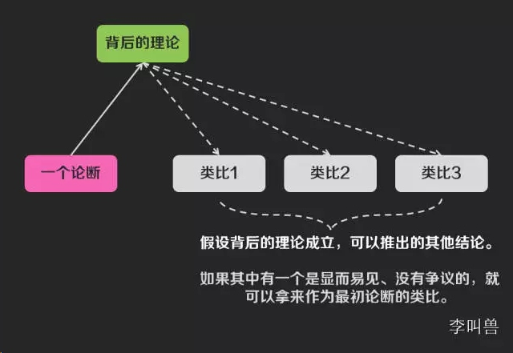
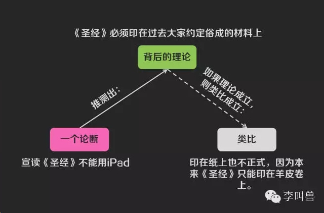
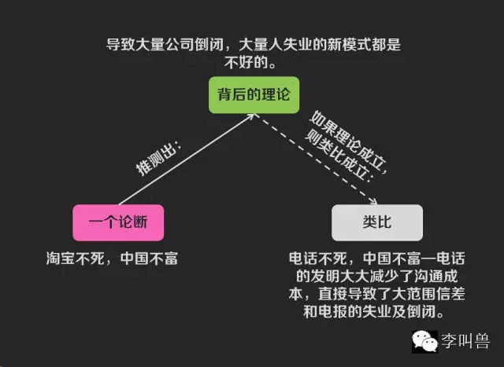
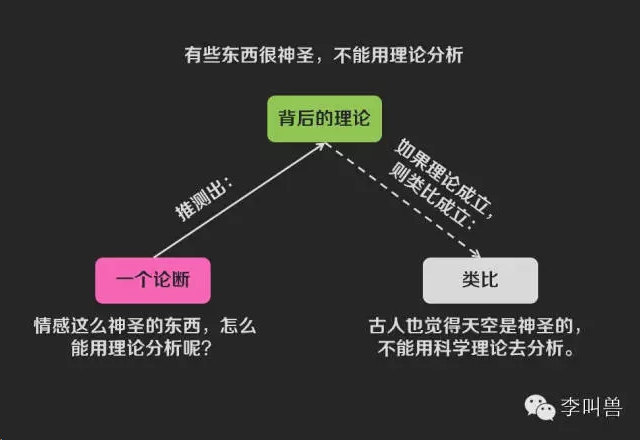
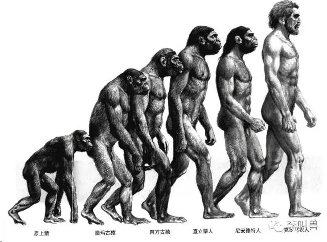
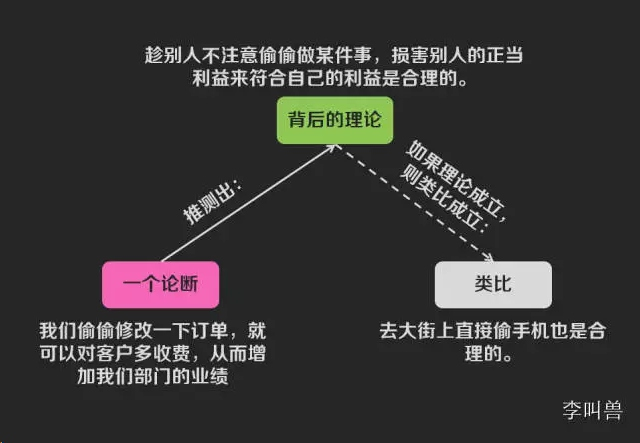

# 【李叫兽】类比思维：开会讨论，如何一句话让强盗逻辑闭嘴？

*2014-12-08* *李靖* [李叫兽](https://mp.weixin.qq.com/s?__biz=MzA5NTMxOTczOA==&mid=201711782&idx=1&sn=96a0f36d3019a0fedaf935bc63fc7572&scene=21&key=b5ad03ea130bc6d9462eaa259792e43908a0746d2566742161cc65a94882a5ca9e8ee69e65e615efa4ee376b46b66ad562a89ef13f5735a63b024007e8bccd4582caa3e00916374d7930b621ad920e97&ascene=7&uin=MjQwNzMxODYwNQ%3D%3D&devicetype=Windows+8&version=6203005d&pass_ticket=xOhI1VQDG%2FzwbhWgqYvgjLhswwNIUGjt8DUL4fp00EDxCVadhAwYny0MJ9B2H%2Fmr&winzoom=1.125##)

> 原文链接：https://mp.weixin.qq.com/s/CSWs6PtNLnzMTBCpHjzkOQ

**在讨论很多争议问题时，我们面红耳赤。**

**比如：**

为什么说淘宝不死，中国经济不振？

XX行业到底有没有前景？

情感这种东西，到底应不应该用理论和理智去解释？

**同样，在面对很多明显是强盗逻辑的无厘头论断时，我们往往一时想不出恰当的描述来反驳对方，让对方明白，比如：**

> “你长这么高，不打篮球真是浪费了！”

> “我妈看人最准了，去见一面就知道合不合适了！”

> “手机的发明是这个时代的悲剧，手机害的你们整天手机聊微信，不去跟朋友当面交流和学习，要是没有发明手机就好了。”

在很多时候，所谓的“争论”，并不是因为对方傻，只不过是因为他们还没有意识到自己某个表达“背后的理论”是错的。比如“你长这么高，不打篮球真是浪费了”背后的理论是“当任何人在某一方面有优势时，必须得去能发挥这个优势的行业”，**而这背后的理论显然是不对的。**

在这种时候，往往你说什么大道理都没有用—因为他们一旦是坚信某个观点，不论这个观点错得多离谱，都已经信了有一段时间了，你是很难通过“复杂大道理”让他们意识到的。

**你的道理必须“显而易见”！**

最好的方法就是使用类比—你先推测出对方论断“背后的理论”是什么，然后问自己“如果这个理论成立，会出现哪些显而易见的不合常规的现象？”然后这种现象就可以拿来当做类比。

比如“你长的这么高，不打篮球真是浪费了”，背后的理论是：“当任何人在某一方面有优势时，必须得去能发挥这个优势的行业”因此你可以用这个类比“您口才这么好，不也没去说相声吗？”**（这对对方来说是一个“显而易见不合常规的现象”）**

然后你不需要讲理论，对方自然明白了你的意思。

那么如何建立类比呢？如何让你的“大道理”变得“显而易见”呢？

**有下面这些路径：**

**1，时间序列的类比**

面对一个看似不合理的逻辑，不知道从哪里说起或者反驳，**其实你可以利用不同时间发生的类似事件做类比。**

比如曾经的某个新闻“某政客拿iPad宣读圣经就职惹争议”

有人认为圣经是神圣的东西，必须要印在纸上，在正式场合用iPad宣读肯定不合时宜。

你总觉得哪里不对，想说“读圣经重要的是心诚，而不在于用iPad读还是用纸来读啊”。

可以这样的反驳往往无力，而且对方不喜欢听“大道理”，也难以一下子感觉到自己认识的误区。

**那么你应该怎么做呢？其实用一个简单的类比就可以了：**

> “我们都觉得用纸才是正式的表现，但是圣经刚出来的时候还没有纸呢，那时候圣经不得不印在羊皮、竹简或者石头上。当后来发明了更加先进有效的纸张，那时的人估计也会说用纸读圣经太不正式了，圣经必须印在羊皮上。同样，现在发明了更加先进的电子设备来取代纸，为什么不正式了呢？”

**同样的方法也可以用于下面的例子：**

①“淘宝不死，中国不富”

此论断背后的理论：淘宝虽然降低了交易成本，但是导致了大范围传统零售商的倒闭和失业，这么多商家倒闭和失业，所以淘宝不死，中国不富。

那么如何通过类比来说明这个问题呢？

**你只需要假设该理论成立，然后看看这个理论能推理出多少“显而易见”不合常理的东西。比如相同的逻辑可以推理出：**

> - 电灯不死，中国不富—电灯的发明导致了大范围蜡烛和煤油灯制造商的倒闭和失业。
> - 机械不死，中国不富—机械自动化的出现大大节省了人力，社会不再需要这么多工人，从而导致了大规模工人失业。
> - 电话不死，中国不富—电话的发明大大减少了沟通成本，直接导致了大范围信差和电报的失业及倒闭。

好了，说到这里，我想你不用讲道理，对方也已经明白了。

**再比如：**

**②情感这么神圣的东西是不能用理论来解释的**

我曾经在知乎用心理学的众多理论回答过一个问题“应该清楚男友哪些方面才能嫁给他”，我觉得借助被研究证明的理论而不仅仅是个人直觉，我们可以更好地维护感情。

但是有人回复“**情感这么神圣的东西是不能用理论来分析的**”。

这个显然不合理，那么如何让对方“一目了然”地明白状况呢？

**只需要分析这背后的理论是什么，并且看过去假设该理论成立，存在哪些不合理的现象。**

背后的理论：有些东西很神圣，不能用理论和理智来分析。

**那么假设这个理论是成立的，存在这个“显而易见”的不合理现象：**

> “古人觉得天空是神圣的，是不能用理性的理论去解释和分析的。所以一切试图用气象学观点去分析天气的人都是玷污神圣的。如果这样，任何科学都无法发展了。然而科学是不断进步的，一开始分析神圣的自然，后来分析社会现象、历史等，在每个阶段都有人跳出来说XX不可以被科学分析。”

**2，用对方熟悉的事物做类比**

如果想通过类比让你的观点由“大道理”变成“显而易见”的事实，除了利用历史上类似情景类比之外，还可以用对方熟悉的事物类比。

比如大家吐槽某央企垄断并且高利润时，该央企代表曾经吐槽过：

> “我利润高你说过垄断，利润低你说我效率低下，利润高也不好低也不好，真是难做了！”

这个咋一听很有道理，但是仔细分析发现其表述存在逻辑漏洞，那么如何让别人明白你说的意思呢？

**其实只需要举一个别人熟悉的事物作为类比**：

> 某某杀人了，面对大家的指责，他反驳道：“我自首你说我杀人不好，我不自首你说我死不悔改，我是自首也不好不自首也不好，真是难做了！”

举了这个类比，我想所有人都会明白了—前面央企代表的话明显是强盗逻辑。

所以，如果想让对方明白，可以把这个不熟悉事物背后的理论挖出来，看看有哪些熟悉事物也符合这些理论，然后用上。

比如达尔文在阐述进化论时，知道大家对物种“自然选择造就基因进化”的观点难以接受，因此他前面实际上都在讲人类是如何通过“选育”来促进粮食的进化的—几万年来，人类通过选育来让粮食一代一代获得更多的产量。然后达尔文再说自然进化的过程其实和这个“选育”的过程是一样的，就让这本书更加容易被接受了。

**3，用类比转移到客观视角**

当人们看待自己的问题时，往往因为太过于主观而难以发现背后的错误和关系。

但是如果通过类比把一个问题转换成第三方的客观问题，就容易被理解和感知了。

比如某销售经理提议：

> “我们偷偷修改一下订单，就可以对客户多收费，从而增加我们部门的业绩。”

现在整个团队都陷入了主观的判断，难以觉察到这件事的不道德程度有多么严重。**那么如何类比才能让大家意识到不道德程度呢？**

**需要先推测出这个行为背后的理论，然后看假设这个理论成立，哪些行为还是合理的。**

背后的理论：趁别人不注意偷偷做某件事，损害别人的正当利益来符合自己的利益是合理的。

如果该理论成立，那么类比可以为：“如果这样说，那么咱们部门其实去大街上直接偷手机更划算一点。被抓住可能性低而且有助于提高这个月业绩”。

**这样通过类比把一个难以判别的主观问题（发生在自己身上），转化为容易判别的客观问题（发生在别人身上），从而让整件事变得更加容易判断了。**

同样，假设你是一个顾问，你发现某企业已经进入了某个业务陷阱—公司对即将颠覆它的新市场踌躇不前。那么除了大量的数据和理论之外，如何说服该企业CEO呢？
其实只需要通过类比把这个CEO的主观问题（本企业）转化为客观问题（其他企业），就行了。

> 比如你问他对当年的倒闭的柯达有什么建议，他也会说一堆解决方案。然后就会发现这些问题同样存在自己的公司，如此“显而易见”—因为通过类比，他站在了客观的角度。

**4，引入比较对象**

当一个人过度高估或者低估某件事时，最容易说服TA的方式往往是引入比较对象。

比如某女生说

> “我妈看人最准了，她只要见到我男朋友几分钟，就能判断我们是否合适。”

如何让该女生意识到她妈看人其实没有那么准呢？单纯说“没人看人会这么神”是没有用的。

**你可以引入一个她可以感知到的比较对象，比如说**

> “你前几天面试一个世界500强的实习生，但是在最后一轮被人资总监淘汰了，你觉得他们看人太不准了。但是你还说你妈看人准。你难道觉得你妈通过5分钟的看人，比世界500强公司4轮面试以及顶尖的HR看人还要准？如果这样，你妈可以成为世界上最顶尖的HR了，没有之一。”

这样我相信她就会明白了。

再比如，分析商业问题时，有人说：

> “在线教育在师生互动等方面远远低于线下教育，肯定是个泡沫，无法商业化！”

**你觉得这个人过度低估了在线教育的潜力，那么如何一句话让你的“大道理”显而易见呢？**

你需要引入一个比较对象，比如

> “在线教育的互动程度虽然比不上线下教育，但是远远比看书自学要好啊。既然出版业这么多年的发展证明书籍是可以商业化的，那么比书籍互动程度要高而且同样低价的在线教育，怎么就不能商业化呢？”

总之，很多时候你无法让别人理解你，只是因为你还没有让你的大道理足够“显而易见”。而一个重要的方法就是有效类比。

PS.类比仅可用户清晰表达一个观点，但是无法证实一个观点。