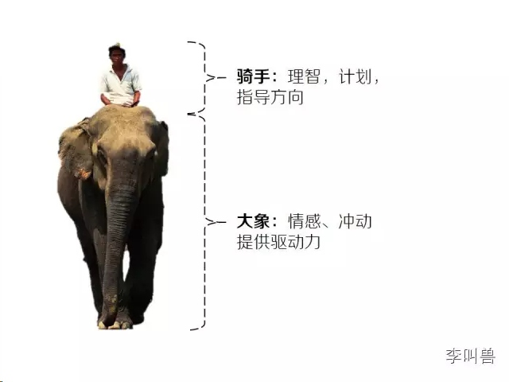
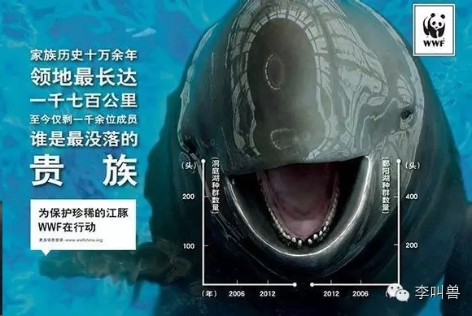

# 【李叫兽】“都跟你说了多少遍了！”—为什么你改变别人总是失败

*2014-12-01* *李靖* [李叫兽](https://mp.weixin.qq.com/s?__biz=MzA5NTMxOTczOA==&mid=201582208&idx=1&sn=75e8bdb9e3bcbc5964fcc80a80282044&scene=21&key=001aea40565292e6007b8843a847d9a2e23336a137cd72cf2c2a70822426eb0c6c425abced1a9c9f543bfda53e8a15bec4efd3a9287b13ddcc6e715cae60b6d79b17c7458aabfac38f5abfc4ea3ab192&ascene=7&uin=MjQwNzMxODYwNQ%3D%3D&devicetype=Windows+8&version=6203005d&pass_ticket=xOhI1VQDG%2FzwbhWgqYvgjLhswwNIUGjt8DUL4fp00EDxCVadhAwYny0MJ9B2H%2Fmr&winzoom=1.125##)

> 原文链接：http://mp.weixin.qq.com/s/PXATrSAIF-xffTT0F4Kmhw

“跟你说了多少遍了！！！”

妻子一遍又一遍抱怨丈夫乱脱鞋的习惯，丈夫也一再答应。但是一下班，他还是乱脱鞋。

领导一次又一次告诉下属要提高执行力，甚至花费巨资找了培训师开“执行力讲座”，员工斗志昂扬。但是到了周一，还是发现大家没有交周报。

你不停地劝解自己的朋友要早睡早起，他也暗下决心，但是还是不管用。

**为什么说理和命令总是不管用？**

因为这些方法最多让别人“赞同”，但是难以真正改变一个人的行为。

为什么呢？

**人的大脑运行实际包含两个系统：**

系统1：情绪、情感、本能、冲动，渴望立刻获得满足……

系统2：理智、意识、自控力、判断，能够推迟享受……

**如果把人行为的过程比作“骑大象”，那么系统2相当于骑手，它负责掌管方向；系统2相当于大象，它负责提供动力。更多的时候，骑手难以控制大象，就好像理智很难控制本能。**

比如你自己的“骑手”告诉你：我要准备一个考试，必须养成早起的习惯。于是“骑手”就把缰绳向“早起”的方向拉了一下。但是“大象”（你的本能）却并不喜欢这个决定，不管早上7点钟你怎么拉动“缰绳”，“大象”还是一动不动。

这个时候，**所有人都想做出改变，但是他们都是在改变这个“骑手”**—告诉自己一定要早起，再不早起剁手！而不是聚焦改变这个“大象”—比如设置难以关掉的闹钟。

同样的过程也发生在你想改变他人的情形下—不论是工作还是生活。**管理者一遍遍重申公司的纪律，员工也很认同，但是这只改变了员工的“骑手”（理智），没有改变员工的“大象”（驱动力）。**

于是我们看到了公司管理者经常做这样的愚蠢行为：**重复相同的行为（开会骂员工）并期望得到不同的结果。**

那么如果想真正改变别人，应该怎么办呢？

**你需要知道下面的几大原则，把改变的重点从对方的“骑手”（理智）转移成对方的“大象”（驱动力）：**

**1，无意识重复**

很多人觉得人很理智—他们一旦发现什么东西不符合自己的利益，自然就会改变。但是实际情况并不是这样，人经常无意识地重复明知道是错误的东西：

2000年的某个周六下午，一群心理学家在芝加哥的一家电影院门口像前来观影的观众发放免费的爆米花，所有人都拿到了免费的爆米花然后兴高采烈进入了影院。

但是这些观众们拿到的爆米花有一些不同：**都是开封5天以上的爆米花，完全受潮，非常难吃。**甚至有人在观影后抱怨：这些爆米花就像用泡沫塑料包裹起来的花生仁一样。

在电影结束后，心理学家们在门口等着做调查，**发现几乎所有人都把爆米花吃了大部分**—要知道，为了做实验，他们给每个人的爆米花都是超大份的。

也就是说，即使所有的观影人都觉得爆米花非常难吃，每吃一口都是难受，但是仍然被习惯所驱使，吃了大部分爆米花。

**他们养成了边看电影边用手掏爆米花的习惯，即使他们知道这样的习惯面对难吃的爆米花毫无意义，但是仍然无意识地重复了这个习惯。**

所以，如果你想改变别人，永远不要指望仅仅不停地说“吸烟是有危害的”就可以完成改变，这仅仅改变了TA的“骑手”（理智），但是并没有改变“大象”。TA往往还是会重复过去明智不合理的行为。

**2，使用环境线索**

在上面的例子中，如果你想让拿到受潮爆米花的人少吃爆米花，你会怎么做呢？

最简单的办法当然是告诉每个人：“这个爆米花受潮了，不要吃！”**但是这仅仅改变了“骑手**

**”，还是没有改变“大象”—记住，“大象”（驱动力）听不懂人类语言！**

怎么办呢？研究者发现，在爆米花的试验中，虽然所有的人都没有吃完爆米花，但是拿到较小包装袋的人吃了更少的爆米花。

在这个例子中，既然“大象”听不懂人类语言，就要先通过环境的改变来做到。

无数的商业和政治活动中都用到了这一点—通过环境线索来改变“大象”（驱动力），从而真正改变一个人的行为。

比如火锅连锁呷哺呷哺如何让客人吃得更快，从而赚更多钱？传统针对“骑手”的做法是—告诉客人：“请您快点吃，别人还等着呢！”但是这样不仅会得罪客人，更重要的是可能不会有任何效果。

**那怎么做呢？很简单，呷哺呷哺使用了很高的凳子，而研究发现，更高的凳子可以让人不自觉地加快吃饭的速度，并且在吃完后更快地选择离开而不是闲聊。**

再比如上世纪90年代前纽约层面临严重的暴力犯罪问题，市长采取了很多策略都作用不大，而且带来了很高的成本：增加警察数量、提高巡逻次数等。

**但是后来有一项简单的策略极大地改变了这个现状：市长下令大力清除各种地铁、街头涂鸦。更少的涂鸦让人产生了“这个城市很规范”的感觉，从而不自然地减少了做坏的动机。**

所以，如果想改变别人，先考虑他所处的环境，看看环境上有什么可以改变的，这往往比说理有效的多

**3，创造短期激励**

就像前面提到的，“大象”是冲动的、本能的，渴望立刻满足。所以如果你想真正改变一个人，一定要创建短期激励。

就拿“李叫兽”来说，我如何激励自己不断地学习、思考和自我提升呢？一种方法是不断告诫自己：我要实现自己的梦想，我需要不断提高能力和知识，这对我很重要！

**但是这样的长期愿景有时候就不奏效**，比如以前有段时间忙着做各种项目，结果几个月都没有看什么书，也没有静下来思考各种理论。每天都是在做“急事”而不是重要的事。

为了改变自己，我学习各种时间管理的方法，看了什么《高效能人士的七个习惯》，但是一忙起来还是有时会忘记坚持学习。因为我所有的做法仅仅改变了我的“骑手”而不是“大象”，而对“大象”来说，长期激励是没有用的，它需要短期激励，需要离开获得满足。

后来我做了“李叫兽”自媒体，每周一出一篇“分析文”，**这逼迫我即使不考虑长远发展，也不得不不断学习新知识、形成新思想，否则就无法给我的关注者们带来价值了。**

而每次更新之后，看到很高的阅读率和转发率，我的“大象”（驱动力）也得到了满足，从而让“骑手”（理智）轻松地拉动缰绳，驱动大象。

**我知道现在正在学习和写出来的知识会最终改变我的生活，但是如果没有这个自媒体，我可能会猴年马月抽一点时间整理整理，但是永远不会像现在这样加班加点集中精力去学习和写作。**

所以，如果你想促成改变，不论是改变自己还是别人**，一定要注重短期激励，而不是只有长期愿景。**

比如有职场人问我：**“将来我想提高升职潜力，因此计划学英语，可是怎么也坚持不下来，应该怎么办呢？”**

我的答案是，长期激励作用有限，如果你想有效学英语，**应****该先创造一种“不得不使用英语”的环境**，比如定期的英语讨论会、接触外国客户等。

这样你每周都会为自己的英语捉急，每次学了新单词之后也可以立马看到效果（比如得到周围人的赞许）。这样的短期激励会真正刺激你的“大象”，让你自然地主动每天学英语。

**同样，如果想改变别人，往往要提供短期激励，创造一个短期内他不得不完成某些改变的环境。**

**4，降低改变的门槛**

习惯的力量很可怕，“习惯了”的力量更可怕。人本能上都是懒惰并且不愿意改变的，他们已经习惯了过去的生活和工作，不愿意轻易转变。

因此如果想要改变别人，要降低他们改变的门槛，让他们从轻松地开始一步步完成改变。

有一个家庭债务压身，面临家庭破产的困扰。**假设你是这个家庭的金融顾问，你会怎么做？**

我想对学过金融的人来说解决方案貌似很简单：**先从利率最高的债务开始还起，这是最经济的做法。**

但是过去的事实证明，**这样并不奏效**，因为金融顾问们仍然在解决一个“骑手”的问题，而不是“大象”的问题。

这个家庭真正需要改变的，是首先建立起对还债的自信心。

比如刚刚赚了100元用于还债，去还一个10万元的高利息率的债务仍然让人觉得绝望。**但是如果去还了一个100元的无息债务，虽然并不是最经济的做法，但是让这个家庭可以在还债清单中划掉一项，从而增加了继续下去的信心。**

同样，如果你想带领团队完成一个艰巨的转变，**往往并不是从最紧急的转变开始，而是从最容易的转变开始**—降低改变的门槛，让成员们看到一点点进步，不要灰心。

**曾经有个营销研究也证明了这一点：**

一家洗车店推出客户忠诚卡，每次洗车消费可以加一个星，集齐8颗星最后就可以免费获得一次洗车服务。另一家店也推出类似的客户忠诚卡，不同的是，他们需要集齐10颗星才可以获得洗车服务。但是这家店的卡刚发下来时实际上已经有了2颗星了—用户还是需要继续洗8次车才能获得免费服务。

短短几个月过去后，第一家洗车店有19%的客户获得了免费洗车服务；而第二家集齐10颗星的有34%的客户获得了免费洗车服务。

虽然两家店的顾客都是需要继续付费8次才免费获得一次洗车机会。但是在第二家店中，顾客的心理是不同的：他们感觉自己已经集齐了20%的星星，只需要继续收集省下的80%就可以了。

所以，如果想改变别人，要首先降低“改变的门槛”，让别人先轻易获得一点点改变所得来的收获，从而有更多信心和毅力完成接下来的改变。

**5，可操作的改变**

请对比下面AB两种表达，哪一种更容易对别人产生积极的改变：

**男朋友对女朋友说：**

A：均衡饮食，减少食物热量，从而减肥。

B：少吃点巧克力，这可以减肥。

**卫生间公益广告：**

A：保护地球，节约用水！

B：用完水后请关紧水龙头！

**地铁公益广告：**

A：遵守市民秩序，提高市民素质。

B：上车排队，是有素质的体现。

**公司室内提示牌：**

A：爱护公司环境，人人有责！

B：吃完食物，请丢垃圾箱。

**那么为了真正改变别人的行为，AB两种说辞，哪一种更有效呢？**

我想你也知道，必然是B。

因为**所有的A都不具备可操作性**：“我知道要爱护公司环境，我也很爱它，但是怎么爱护呢？算了，不想了，心里爱一下就行了。”

“爱护环境，人人有责”只是告诉我们环境很重要，但是具体怎么做呢？不告诉我怎么做，光提出概念，有什么用？我们的大象往往不会思考，如果不给它明确的指示，它是不会去做的。

**所以，你觉得下面这个公益广告有什么用？**

嗯，**看了广告我也觉得保护江豚很重要，但是这并不足以让我的行为产生改变**，因为我看了广告仍然不知道我具体能够为江豚做些什么。

同样，公司不断地开会、培训，要员工提高执行力、提高创造力、提高主人翁精神。但是如果没有真正“可操作”的方案，仅仅是不断洗脑，有什么用呢？

**看到这里，对各位观众小小测试一下：**

大家都知道“少吃巧克力”，远远比“均衡饮食”更具可操作性。那么**如何继续提高“少吃小巧克力”的可操作性呢？**

我想聪明的你已经想到了，**改成“少买巧克力”会更好**。因为你的女友肯定会把买回来的所有巧克力都吃掉，因此强调“少吃”可操作性并不强。但是强调“少买”，她就更加容易产生行为上的转变。

**6，改变驱动力**

当你持续地想要改变别人，最终难以改变时，应该回头检查一下：**是不是给大象提供的驱动力错了？**

假设你是公司的一名行政人员，需要每周收集大家的周报，结果这周的截止日期过了，仍然有35%的没有交周报。因此你去批评别人，并且去告诉每个人：“**我的工作这么辛苦，各位能不能配合一下工作啊！**”

一开始还有点奏效，但是后来大家习惯了你的“提醒”，还是拖延交周报。

**这时你哪里错了呢？你给大家提供了错误的驱动力。**

**你跟别人说“我很辛苦，来配合一下我的工作”时，大家的驱动力是：每周帮你一次忙，交了周末你就不那么辛苦了。**

但是这种“人情”总是有限的，繁忙的员工也不是总会体谅你、帮助你。也就是说，这个驱动力是不可持续的。而且你抱怨式的邮件给人造成了一种印象：肯定有好多人迟交了，否则她怎么会这么说。让别人觉得迟交是一种可以被接受的行为。

那么你应该怎么做呢？

**你可以用邮件强调这样一个事实：“几乎三分之二的周报都是按时上交的！”这给了迟交的人一种“落后了”的感觉，而在激烈竞争的职场，没有人想要落在别人后面。**

这样你就把别人交周报的驱动力由“帮你一个忙”，变成“隐形的职场竞争”，而后者是一种可持续的驱动力。

所以，当你发现自己难以改变别人时，应该先反思自己：**我是不是提供了错误的驱动力？这个驱动力是可持续的吗？是不是应该改变驱动力？**

**7，自我实现预言**

**假设你想激励女朋友养成化妆的习惯，AB两种说法你觉得哪种好？**

A：我觉得你也太自由自在了吧？出席这种场合还是要化妆的！

B：我觉得你服装搭配很有心思，你一直是个爱美的女生，我觉得你今天如果化妆会更美的。

我想所有人都知道B会真正改变对方的行为，那么为什么呢？

这实际是一种“自我实现预言”，**人们倾向于表现出与自身形象相一致的行为。**当你说“你太自由自在了吧”，她觉得她在你面前的形象是“自由自在”，而“化妆”和这个形象是矛盾的，所以她下一句会说“我就是这么崇尚自由，才不化妆呢！”

而如果你用B方案，她会潜意识觉得自己的形象是“爱美”，而“化妆”与这个形象是协调的，所以她更容易采取行为，做出改变。

**所以，如果你想让人产生改变，就要向你想要的改变方向进行劝导，而不是相反。**

**如果你整天说一个人是“死胖子”，那么“胖子”的形象就会在他内心固化，他就会变得越来越胖。**而如果你整天说一个人“咦，我发现你没有那么胖哎！”他就会更加容易变瘦。

当你为了发泄情绪，而说出下面的话时，就不用指望对方产生什么实质性改变了：

你怎么这么笨！

你怎么这么懒！
你怎么这么馋！

**结语：**

改变别人，仅仅理智说服往往没有用，因为你只改变了他的“骑手”，而没有改变他的“大象”（驱动力）。就连你自己都很难说改变自己就改变自己，怎么又能要求别人这么做？如果想要真正地改变行为，你需要先放一放逻辑世界里的“骑手”，看一看心理世界里的“大象”。