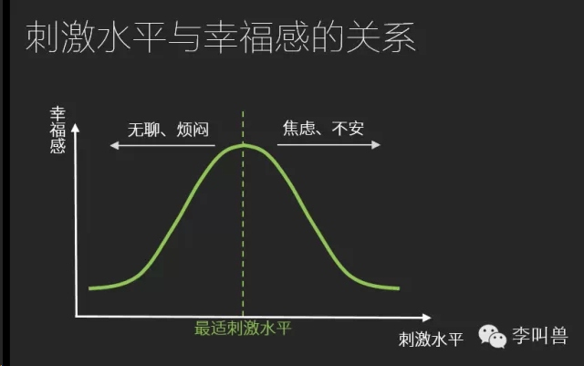
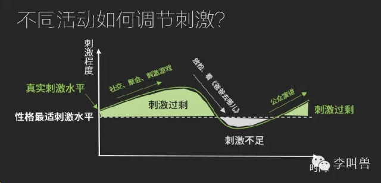
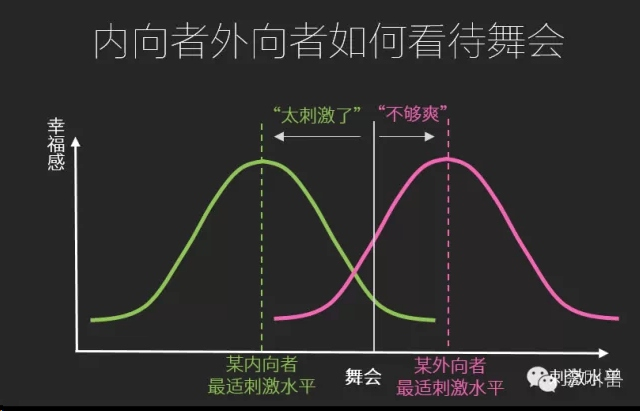

# 【一张图解析娱乐选择】你为什么不喜欢《爸爸去哪儿》-李叫兽

2014-09-15李靖 [李叫兽](https://mp.weixin.qq.com/s?__biz=MzA5NTMxOTczOA==&mid=200682015&idx=1&sn=165ac5f698928999a5e3f3602534be9e&scene=21&key=f001b101bcd9dcb699b4688bb816c251a3b76985b17b2033526b3bca2d5f7940f43ae718d79ed58523017a8cc8d4baa4977664ae5ebb3776839e916ace30027bf29dc73e134a2d5ae38a9357c1665328&ascene=7&uin=MjQwNzMxODYwNQ%3D%3D&devicetype=Windows+8&version=6203005d&pass_ticket=xOhI1VQDG%2FzwbhWgqYvgjLhswwNIUGjt8DUL4fp00EDxCVadhAwYny0MJ9B2H%2Fmr&winzoom=1.125##)

> 原文链接：http://mp.weixin.qq.com/s/og0gfqLxYZR1t56Ja_f57w

同样是娱乐，为什么你有时候特别想看《爸爸去哪儿》放松一下，有时候又特别想跟朋友聚会找找刺激？

**这不是因为你“双重人格”，也不是你“时而内向，时而外向”。**只不过是你的大脑在调整刺激水平。

人都需要一定量的外部刺激以获得幸福，比如社交、聚会、刺激电影、丛林探险等。

而每个人都有自己“**最适刺激水平**”—刺激过多会焦虑，刺激过少会无聊。

当你一段时间内**刺激过多**时（比如紧张的工作、不断的应酬交际），你的刺激水平就高于需求，因此就会希望通过减少社交、自己一个人安静、看轻松电视剧等方式来降低刺激水平；

而当你一段时间内**刺激过少**时（比如一个人复习考试、工作无聊），你的刺激水平就会低于需求，因此就希望通过增加社交、玩刺激游戏、丛林冒险等来提升刺激水平。

**当刺激过剩时，我们往往会变得焦虑、不安、紧张；当刺激不足时，我们往往又变得无聊、烦闷、莫名地哀伤。而“娱乐活动”是我们调整刺激刺激水平的重要方式：**

为什么我们很多人旅游喜欢爬山、漂流和篝火晚会，而足球明星们度假就是躺在海滩上？

因为体育明星们每天生活在聚光灯下，往往处于“**刺激过剩状态**”，对他们来说，需要安静一段时间来降低刺激水平；而有些上班族处于“**刺激不足状态**”，平时生活太无聊，所以假期需要“折腾一把”。

同样，工作无聊单调的人可能喜欢看恐怖片，以提高刺激水平；工作繁忙应酬多的人可能喜欢故事片，以降低刺激水平。

**如果你选择了错误的娱乐方式，可能会适得其反**—不仅不会平衡你的学习工作，反而会让你更加无力或者焦躁。

比如你刚刚花了2个月准备了一场考试，准备好好看一季美剧犒劳下自己。但是实际上可能并不会让你更开心，因为孤独备战考试可能让你处于刺激不足的状态，这时你应该“找找刺激”。所以对你来说，此时最好的娱乐选择是—跟喜欢的人一起去疯。

比如你刚刚应酬了几十个客户，结束了繁忙的项目，准备在周末多找几个朋友聚聚，以放松身心。这可能会让你更加焦虑，因为不断的应酬可能让你处于“刺激过剩”状态，这时你如果“看看闲书”或者“轻松散步”会更好一些。

**什么影响了我们对刺激的需求？**

每个人的最适刺激不同，这主要取决于一个人的性格内外向程度。

当说到内向外向，无数的偏见就涌过来了。

一说“外向”，他们联想到了“懂礼貌、乐于合作、乐观、自信、开朗”；一说内向，他们联想到了“孤僻、自我中心、不懂人情、不听话、独断专行、自私”。

总之，在很多前辈的嘴里，“这孩子别的都好，就是太内向了。”

但是实际上**内外向并无好坏之分，只是个人对刺激的需求程度不同。**内向型人对刺激需求少，而外向型对刺激需求多。

比如同样参加一个舞会，内向型的人可能倾向于喝酒，因为对他来说舞会“刺激”太多，而酒精可以减少刺激；而外向型的人可能倾向于喝咖啡，因为对他来说舞会“不够刺激”，而咖啡因可以提高刺激。

所以外向人优势是不那么容易觉得“太刺激了”，他们能适应更频繁的社交；而内向人的优势是不那么容易觉得“太无聊了”，他们能适应长时间的专注。

对外向人来说，更加适应具备高刺激水平的工作，比如销售、客服、演讲者等，而内向型可能更适合需要长时间专注的工作，比如调查、分析等。

**如果你的工作与你的内向外向性不匹配，导致你在工作时达不到“最适刺激水平”，你就需要更多的娱乐活动来平衡这种刺激。**比如一个外向的人当编辑，长期处于刺激不足状态，所以需要大量的高刺激娱乐来平衡—聚会、旅游等。

而如果你的工作恰好让你达到了“最适刺激水平”，你就会发现你即使没有娱乐，单纯做这个工作也挺幸福。