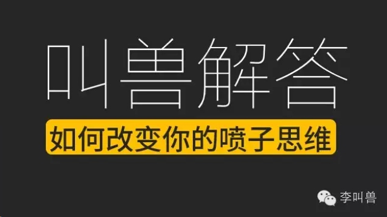
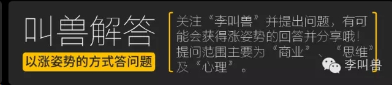
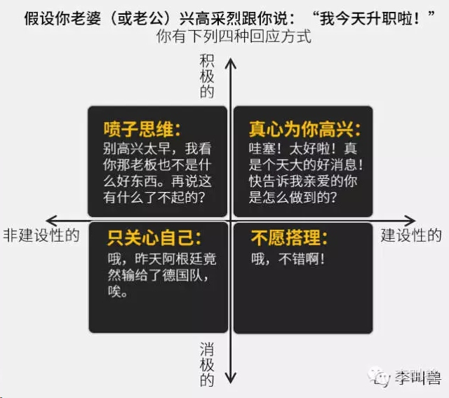
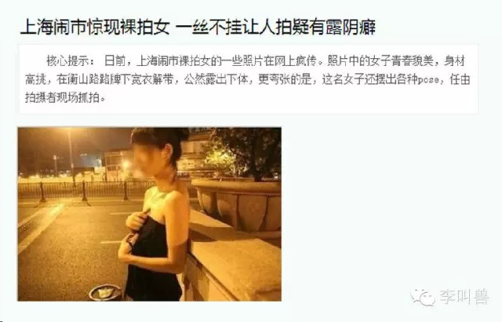
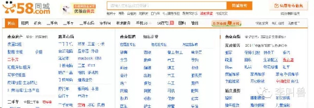

## 【叫兽解答第一期】如何改变一个人的“喷子思维”

*2014-08-11* *李靖* [李叫兽](https://mp.weixin.qq.com/s?__biz=MzA5NTMxOTczOA==&mid=200403116&idx=1&sn=f4c0992e0e29013a2418a60f77dea83b&scene=21&key=b5ad03ea130bc6d90f4d56960b07d752a3dfc7aa5f47f9175727e089b0b448f85545312c3f7529869944c2b07ae4282ef78f09b7672c8f19d92999b51ea8a7f41db3f8ef1b1effa0d663daa2999f13fd&ascene=7&uin=MjQwNzMxODYwNQ%3D%3D&devicetype=Windows+8&version=6203005d&pass_ticket=xOhI1VQDG%2FzwbhWgqYvgjLhswwNIUGjt8DUL4fp00EDxCVadhAwYny0MJ9B2H%2Fmr&winzoom=1.125##)

**【叫兽解答第一期】如何改变一个人的喷子思维**

本期提问者：“李叫兽”某关注者（TA选择匿名）

提问原问题：如何从一个秒喷型喷子变为积极回应并能提供建设性意见的人？

**首先，什么是“喷子思维”？**

我是用这张图定义“喷子思维”的：

其中—

**积极VS消极**是指你对别人分享信息的反应是“大”还是“小”；

**建设性VS非建设性**是指你的回应是正面鼓励性的，还是负面打击性的。

所以喷子思维的表现是，别人有了消息没人比TA更积极，但是却总是着眼于负面，不免让很多人讨厌。以至于无数人高呼“珍爱生命，远离喷子。”

**那么是什么导致了喷子思维以及如何转变自己的喷子思维呢？**

**在心理学上喷子思维的诱因：**

**1，社会比较理论&保护自尊**

社会比较（Leon Festinger，1954）是指我们经常通过与他人的比较来获得对自己的评价。在这样的比较过程中，为了保护自己的自尊，我们常常会在内心对优于自己的人产生诋毁。（尤其是这些人是我们身边的人时）

**比如常见以下现象：**

“秀恩爱，分的快！”

“你这是来拉仇恨的吗？”

当一个人自尊被伤害时，这种为了保护自尊而出现的“比较”和“诋毁”更加常见。

比如听说一些土豪带着美女去北大清华参观，看到路过的学生骂一句“穷学生！”是真的因为此土豪鄙视一切穷人吗？自然不是的，我敢说他不会对公司的最基层下属说“穷工人！”所以土豪骂“穷学生”只不过是在一群高知识的人面前找自尊而已，而这种找自尊的方法就是从1000个特点中找出一个对方比自己弱的。而土豪在其下属面前不需要保护自尊，所以也没必要鄙视。

类似的情况还常见于运动场，当一个没品的足球后卫被梅西过掉时，他有时也会骂一句“死侏儒！”因为这几乎是他能找到的比对方强的唯一一点了。

**那么如何解决呢？如何降低在“社会比较”方面的喷子属性？**

**①培养独立性自尊，减少社会比较。**自尊一般有2种，**依赖性自尊**和**独立性自尊**，前者是把自己的自尊建立在外在事物（比如金钱、名誉等）之上，所以需要不断地通过跟别人对比才能获得自尊；后者（独立性自尊）是把自己的自尊建立在对自己的良好感觉和信任感之上，“我知道我很棒，这就够了”，所以没必要跟别人对比。

相比独立性自尊，依赖性自尊往往表现出较强的攻击性（喷或者诋毁别人）、波动性（较大的情绪波动）以及焦虑水平。所以当你意识到这一点，可以更多地通过减少比较、增加努力程度等方式来提高独立性自尊，降低依赖性自尊。（两者都不可能变成0，都是同时存在的，只是比例不同）

**②不要把朋友当潜在竞争者。**想象一下：扎克伯格创业成功，我们会羡慕他崇拜他，而如果他恰好是你的室友，你可能会嫉妒他。这是因为受进化的影响（氏族社会同一族群内争夺有限的交配资源），我们潜意识经常把周围的朋友当成竞争者。因此我的建议是，当你的朋友成功了，给他一个由衷的祝福，即时内心有些不爽，但是不要在意，这只不过是进化的遗迹而已。

**③不要放大你的生物化学反应。**其实有时候我们莫名其妙喷周围的人，只不过是受短期内激素水平的影响。比如有研究证明，女性在排卵期对其他女性的敌意会增强。或者你被某些电影激发出的高肾上腺素水平提高了你的攻击性。这时你要明白：发生在你情绪上的，只不过是生物化学反应，并不是你性格的体现，不要过分放大它。

**2，基本归因错误**
另一种盲目乱喷的表现是基本归因错误。

基本归因错误是指，当我们评价别人时，经常把别人的行为归因到态度和性格等内在因素；而当我们评价自己时，经常把行为归因为环境等外部因素。

因此假设你是销售经理，当你下属销售不好，你第一反应是“你怎么不够努力？”而当你自己销售不好，你第一反应是“唉，现在客户太难拉了！”

**为什么这样呢？**

这是因为信息的易得性不同。当你观察别人时，别人的态度、行为等信息是易得的，而他们当时所处的环境是你不知道的，所以你根据易得性信息，自然认为这是别人的性格导致的。当你观察自己时，你自己的态度行为反而是难以察觉到，而你所处的环境更加容易被察觉，所以你往往更加倾向于归因为环境因素。

**正是因为这样的原因，我们往往觉得别人十恶不赦，丝毫不顾及可能是环境影响：**

- 比如你男朋友晚回家可能并不是其态度的体现（比如不爱你了），更可能是其环境的作用（老板强迫），而这时不管对方当时所处的环境就盲目乱喷（你这么不在意我！），明显是思维懒惰的表现（懒得了解对方的环境）。

- 比如下属业绩不好，可能并不是因为他太笨或者不够努力（态度因素），而是环境影响（整个行业都不景气），这时作为老板你需要了解事情的本质。

- 再比如我们骂暴恐案的实施者都是十恶不赦的混蛋，认为他们的暴力是性格的体现（天生惨无人道），但是忽略了他们所处的极端环境：他们只不过是被洗脑了。其实换个角度，如果让100个未经过思维训练的普通人跟他们处在一样的环境—“信息单一来源”、“权威型强迫”、“减少控制感”、“增加角色感”、“药物作用”等，可能有一半人也会变成暴徒。毕竟洗脑的作用太大了（详细百度：米尔格纳姆权威实验和斯坦福监狱实验）或许我们更应该去骂的是对这些人实施洗脑术的人。

**既然“基本归因错误”如此常见，那我们如何归因呢？**

可以参照心理学家凯利在1967提出的“三维归因理论”，比如当你看到下属迟到了，你需要问自己三个问题：

- 他是只在本公司上班迟到，还是不论做什么都拖拖拉拉？
- 他是经常迟到，还是只有今天迟到？
- 其他人今天迟到了吗？

如果他做其他事不迟到，而且只今天迟到，那么可能的原因是他个人遇到了急事（可以原谅）；如果今天其他人也都迟到，那么可能是公司问题，比如昨天加班，也可以原谅。

**通过这样的方法，你可以显著把“对人”和“对事”给区分开，降低盲目乱喷的概率。**

**3，隧道视野**

导致喷子思维的另一个原因是“隧道视野”。

**如果你在新闻头条看到这个：**

**你的第一反应是什么？**

我想有些人的第一反应是“唉，世风日下啊！上海市民真是开放！”

那如果我换一个新闻标题“**上海市本年市民有99.999%以上的人未参与公众裸拍行为**”，你会怎么想？“嗯，上海市民素质真高，裸拍率不到十万分之一。”

而实际上这两条新闻是一样的。

**这就叫“隧道视野”，我们喜欢人为放大少数事件的影响，忽略主体。**

比如你在台上给500人演讲，看到有一个人睡着了，你会盯着这个人看，然后想“唉，我的演讲真失败，你看他都睡着了！”然后下一场演讲，499个人睡着了，只有一个人兴高采烈地在听，你会盯着那个听的人，然后想“嗯，我讲的还是不错的，你看他听得多认真！”

所以，面对很优秀的个体，人往往还是容易注意到TA的缺点，因为那就像500个人中睡着的一个，在其他优点的对比下如此明显，因此我们就自然而然地“放开去喷吧！”

**所以我们可以看到：**

当说到小米公司，无数人所谓的“商业分析师”去喷它，即使小米已经是在很多方面优秀的公司，比如成功地改变了市场的竞争基础、被证明的商业模式、巨大的现金流等。甚至无数自媒体人“为喷小米而生”。（PS，仅为举例用，我不是米粉也不是米黑，既不支持也不反对，只是陈述事实。）

但是当看到某个10人团队的初创公司，即使他们根本连基本的商业模式都没找到，更别说“质量把关”“供应链管理”了，我们还是更容易去赞扬他们，“嗯，这个想法真是创新！”

所以，面对优秀的成功者，我们在100个优点中找一个缺点拿来喷，而在不成功的人中，我们在100个缺点中找一个1优点来赞美。

**如果你想做一个客观的人，请关注更具统计意义的“大多数”，这可以让你减低隧道视野对判断的负面影响**；当然如果仅仅是媒体，还是得关注更加博眼球的“小部分”。

**4，万能药思维**

**请想象这样一个场景：**

你身体不舒服，走进了医院。然后医生没有对你进行任何的询问，甚至几乎都没有看你一眼，就说：把这个药吃了，每天三次。你会不会觉得奇怪？当你用质疑医生时，他说：我前两个病人都是吃这个药治好的，因此预计你吃这个药也能好！

**喷子思维的另一个影响因素是“万能药思维”—我们潜意识认为所有问题的解决方案是一样的。总之，当你有一把钥匙，你看什么东西长得都像锁。**
**所以我们看到，刚入职的产品经理在喷：**58同城的UI界面简直挫的一逼啊，要是让我来设计，绝对分分钟高大上。

嗯，你潜意识觉得“高大上的精美设计”是一切互联网产品的解决方案，而忽视了不同企业的定位不同。

如果你做微信或者linkedIN，嗯，一定要精美！但是58同城的主要客户是有刚性需求（租房、找工作）的中小从业者，它的定位是“啥都有的大杂烩”，精美的设计反而不如这样简单粗暴的字符陈列管用。58同城不是高档西餐厅，而是城市小吃街—啥都有，都不贵，虽然脏乱差，但我们吃的就是这个情怀！给烧烤摊弄上高大上的装修，反而会让客人受不了。

所以，你在一个问题上取得了成功，并不代表你的“成功经验”具有普适性。**因此在你拿着自己的“成功经验”去喷别人之前，先搞清楚：你们面临的是同样的问题吗？**

就这些吧！我想你正在远离喷子，变成一个“客观”“理智”的人。

李靖