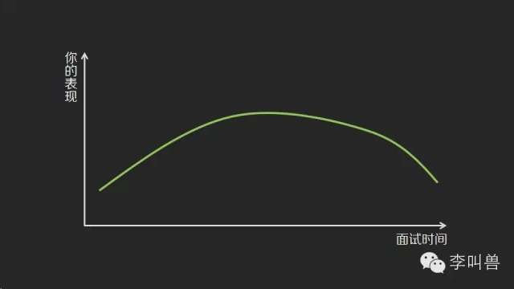
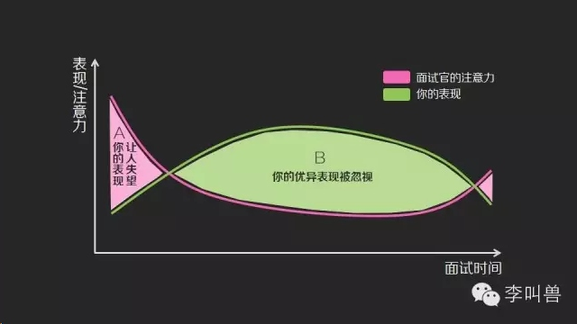

## 一张图告诉你：所有面试的最大矛盾

*2014-07-27* *李靖* [李叫兽](https://mp.weixin.qq.com/s?__biz=MzA5NTMxOTczOA==&mid=200365020&idx=1&sn=409133cd280a3680fb6a64fef1144fc5&scene=21&key=b5ad03ea130bc6d97aa9ee521c152d4cafdb4cb3ddef035c480cfbfbf8be22f52752a4c036fb9ab73a5900142819e07316630fb6323af4bf031725667fe96c7f65df2279a74dcd7d829e861eb57c05c9&ascene=7&uin=MjQwNzMxODYwNQ%3D%3D&devicetype=Windows+8&version=6203005d&pass_ticket=xOhI1VQDG%2FzwbhWgqYvgjLhswwNIUGjt8DUL4fp00EDxCVadhAwYny0MJ9B2H%2Fmr&winzoom=1.125##)

告诉你面试最大的矛盾：

**首选，你的面试表现一般是这样：**

刚进入面试场地，特别紧张、不自然，然后随着问题的进行慢慢进入状态，表现越来越好；最后随着面试进行变得疲惫，状态慢慢降低。因此你的面试表现变化曲线是这样的：

**然而，面试官情况是这样**：

一开始对新进来的面试者满怀期待（首因效应），然后随着面试的进行注意力迅速降低，最后一个问题时又提起精神（近因效应）。因此考官的注意力曲线是这样的：

然后对比两张图，就发现矛盾出现了：在面试官对你最关注最感兴趣的时候，你的表现最差（刚进来的不适应以及面试结束时的疲劳），而你表现最好的时候，考官却心不在焉：

在上图中的A区域（红色部分），考官对你特别关注，而你却状态不好，这让你的表现给考官留下了不好的印象，让人失望。

在上图中的B区域（绿色部分），你拿出了最精彩的表现，而考官却不在状态（面试了太多人的确累了），因此你“最好的一面”被忽视了。

这就好比：别人最饿的时候，你不给他饭吃；等别人吃饱了不想吃东西，你狂给他饭吃。

**怎么解决这个矛盾呢？**

很简单，在有限的面试准备时间中，你应该更加重视你的开场白和退场语。

**如何准备开场白？**

开场白一般是自我介绍，而大部分人的自我介绍落入了“我是谁、来自哪里、有哪些荣誉、有哪些能力”这样的“表格性”介绍。这样的自我介绍就像你在填写一份入党申请书，面面俱全但无聊透顶。**
**

应该怎么办呢？其实很简单，你只需要找准一个卖点，讲一个足够打动人的故事。

**这个故事的最短1分钟模板是：**

1. **引入：**最简洁的语言说明自身情况（我是谁，来自XX大学，什么专业）或者用一件让人意外的事情提起对方兴趣。（10秒）
2. **论点**：把你的核心卖点说出来。比如—我擅长把愿景变为现实；—我擅长协调复杂的关系并化解冲突；—没有人比我更擅长而且更热爱写代码。（5秒）
3. **证明：**找一个“跌宕起伏”的鲜活性故事来说明。（30秒）
4. **利益点：**指出我刚刚说的特点对你有什么用。（10秒）
5. **呼吁行动**：所以我来到这里，是想获得这样一个机会，去……（5秒）

因为篇幅原因，这个“自我展示的魔鬼公式”就不详述了，想要详细学习的童鞋可以看我主讲的一期公开课“**4分钟展示自己的魔鬼公式**”。关注本主页**“李叫兽”**并且回复**“魔鬼公式”就可以查看。**
**如何准备离场？**

1. 抓住最后机会重申最主要卖点+利益点+呼吁行动。比如：我热爱编程并能够以最迅速最准确的方式写程序（这个前面无数回答问题已经证明过，不需要再给证明），我相信这个特点能够帮助公司以最快的方式迭代产品（利益点），我渴望加入你的团队，希望你能给我这个机会。（呼吁行动）
2. 利用最后的提问机会提升形象。最后面试官会问题“你对我们有什么疑问吗？”这时如果说没有会让人觉得你不在乎我们，而一个恰当的高“逼格”问题有助于你瞬间增色并且让面试官爽快地倾诉（他也需要倾听者）。比如“在你的工作中，最让你觉得充满创造力的经历是什么？”“你对这个公司最美好的回忆是什么？”“加入这个公司后，你发现哪些事情和之前想象的不一样？”