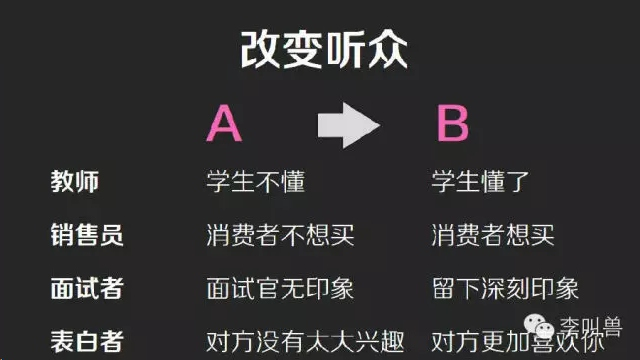
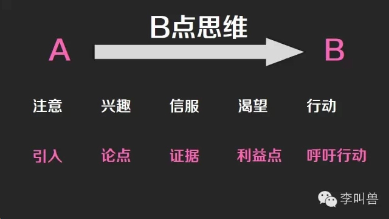

## 【李叫兽公开课第5集】：4分钟展示自己的魔鬼公式

*2014-07-22* *李靖* [李叫兽](https://mp.weixin.qq.com/s?__biz=MzA5NTMxOTczOA==&mid=200353570&idx=1&sn=fef633b7df874590e6c94ebab105e692&scene=21&key=001aea40565292e62eddc4f4adebe0e55a13278527906a487aa5299e06cbe66ae69e7bdd62d604d0b46efa352dd4d680ebc0d4db7f709b31f5bef851bb3bcc097539aea2499f340c693e30687148dd29&ascene=7&uin=MjQwNzMxODYwNQ%3D%3D&devicetype=Windows+8&version=6203005d&pass_ticket=xOhI1VQDG%2FzwbhWgqYvgjLhswwNIUGjt8DUL4fp00EDxCVadhAwYny0MJ9B2H%2Fmr&winzoom=1.125##)

【李叫兽公开课第5集】4分钟展示自己的魔鬼公式

直接点击播放视频，20分钟Get新技能：
[点此进入网页版内含视频]( http://mp.weixin.qq.com/s/Pkvxafx-8DrG7DrQKprEhg  )
<iframe allowfullscreen="" frameborder="0" height="501" src="https://v.qq.com/iframe/player.html?vid=t01326er1u3&amp;width=668&amp;height=501&amp;auto=0&amp;encryptVer=6.0&amp;platform=61001&amp;cKey=NiDl+p7t7z/WZ/NLC9U6ZTuyvoFcHAcxZHcAldTqBBf3A6hcW7vdWvLv7GBimGtu" style="margin: 0px; padding: 0px; max-width: 100%; box-sizing: border-box !important; word-wrap: break-word !important; z-index: 1; width: 668px !important; height: 501px !important;" width="668"></iframe>

**当我们讨论“说服技巧“时，我们真正在讨论的是什么？**

说服（包括演讲、展示、自我介绍）的目的并不是“描述一个观点”，而是“改变听众的行为”。如果听众在你演说之前的状态是A，在你演说之后的状态是B，那么B-A就是你演讲的效果。

**这样一个B-A****的效果就是演讲，它存在于我们方方面面，比如：**

- 如何有“说服力”地销售一个产品？
- 面试时如何做自我介绍？
- 如何让你的老板接受你的提议？

然而大部分人在这个过程中缺乏应有的技巧，这使得他们仅仅是在“陈述一个事情”，并指望他们的陈述能够打动听众。实际上，比起简单的陈述，我们能提高的实在太多太多。

**而通过这短短的20****分钟公开课，你将了解到：**

- 一个简短的4分钟展示应该包含什么内容？
- 手把手教你使用“4分钟魔鬼公式”来准备你的展示。
- 如何引入演讲，让听众在20秒内提起兴趣？
- 如何利用“鲜活性效应”来打动听众？
- 如何让听众付出行动，而不是仅仅“被打动”？
- 不论是销售产品、自我介绍，还是提出建议，你的目标是让听众走完“注意-兴趣-信服-渴望-行动”的整个过程，而大部分失败的销售或者演讲往往中途而止（比如有的广告仅仅让人产生兴趣，但是不信服；有的广告让人真正相信了，但是却没有产生渴望。）

如何在4分钟的时间内完整地走完这个过程，让听众真正改变他的行为？这看起来是个不小的挑战。**但是通过以下5****个部分的有效组织，我相信你可以做到：**

- 引入—通过现场发问、讲故事、列出让人震惊的数据等方式，让听众20S内对你产生兴趣，并且引起心中的疑问；
- 论点—引入部分后，立马提出论点（如果是4分钟，那么你只能聚焦1个论点）
- 证据—利用“鲜活性效应”引起共鸣并产生信服；
- 利益点—让听众觉得自己讲的东西对他很重要；
- 呼吁行动—通过语言或暗示让听众产生行动。

详细内容，请观看上面的视频。