#【李叫兽】品牌包装：你把用户感动哭了都没用

**策划一个品牌策略，目的是什么? **

最经常的回答是：

 

• 要感动我们的用户；

• 要让我们的品牌更有温度；

• 要让用户和品牌建立更深层次的情感联系。

 

但这其实是“**形象包装**”而不是“**品牌策略**”。

 

因为**品牌策略的本质**，并不是“提升形象，感动用户”，而是**“在用户心智中，针对竞争对手确定有利位置。”**

 

今天李叫兽这篇文章，就讲讲形象包装和品牌策略之间的区别。

**为什么要使用“品牌策略”，而不是单纯做品牌包装？**

先用李叫兽遇到的真实项目举例。

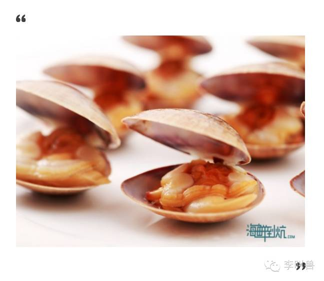

有个做熟食新鲜海鲜夜宵外卖的创业公司，叫**「**海鲜到炕（kàng）**」**，如果要规划品牌策略，你会怎么做？

 

如果是形象包装术，大致思路是这样的：

 

> 1、确定人群
 

“谁最可能吃这种海鲜？哦，单价30-50元，主打新鲜、便捷、健康、好吃。

**所以主打人群定为“崇尚健康并且繁忙的一线城市新中产白领。”**

> 2、如何感动这群人？
 

好了，既然人群定了，我们就要寻找“consumer insight”（消费者洞察）了，看看能否利用他们生活中的某些小细节，来打动他们。

 

“这些新中产白领生活虽然很精彩，但是工作压力大、节奏快，与家人、朋友的联系也比较少，所以我们希望他们更多地关心自己的生活，更多地关心自己爱的人。”

 

**所以就把slogan定成：多点关心，多点海鲜。**

 

如果对这句话心里没底，就再按照广告提案的通行惯例，想2个60分的当做备选吧：“鲜，让生活更有味道” 或者 “爱生活，爱海鲜”。

 
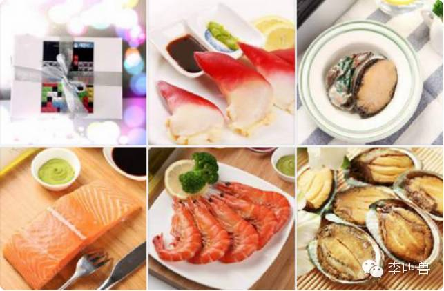

> 3、如何根据策略来打造品牌体系？
 

既然有了“多点关心，多点海鲜”这句slogan，那么接下来就可以制定所谓的品牌体系了——

“**品牌理念**：最新鲜的食材，给最关心生活的你。”

“**品牌调性**：爱心的，活力的，温暖的，健康的。”

“**公司使命**：让人们更关心生活，吃到更新鲜的海鲜。”

“**公司价值观**：用户至上，追求极致，与众不同，良心经营。”

……

**而这些就是传统的“品牌形象包装术”。（不过被很多人当成了“品牌策略”）**

 

上面的方案中，一切都那么容易让人信服，一切都切中了创业者的内心，一切都体现了对消费者的洞察，好像只要使用了这个策略，就会有无数消费者被感动，就会让他们觉得你说出了他们心里话，进而疯一样地来购买产品。

但这个策略最大的问题是什么？

 

**这个策略最大的问题就是：假设市场上只有你自己，你说什么用户都会听。**

实际上，市场上有很多竞争对手，用户每天看无数个广告，也有无数人想打动他们。

 

**品牌策略的目的，并不是感动消费者，也不是让消费者觉得你很走心，而是针对竞争对手，确定有利位置，从而赢得消费者的选择。**

 

按照品牌策略（而不是品牌包装术），该怎么做呢？

 

**1，找到你的竞争对手。**

 

我们需要给用户一个**买你而不买别人**的理由，所以需要首先找到你的竞争对手到底是谁（注：竞争对手不一定是同行，任何阻拦消费者购买你产品的，都是竞争对手）。

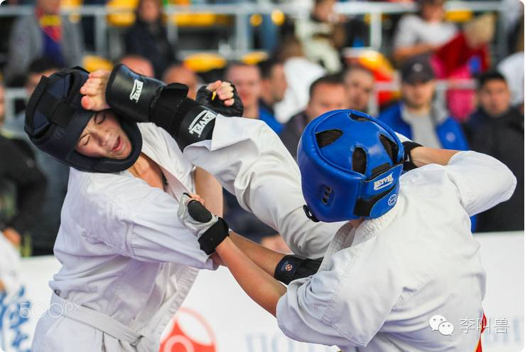

 

**那么在夜宵的市场，你的竞争对手到底是谁？**

 

可能是**不吃夜宵的习惯**——很多人不习惯吃夜宵，自然也不会买你；

可能是**去外面店里吃夜宵或者自己做**——很多人宁愿麻烦，也不想吃外卖；

可能是**其他的外卖夜宵**（比如各种小龙虾外卖、烤串外卖等）。

 

对比这几个选择，自然容易发现：第三个才是我们关键的竞争对手。

 

毕竟，让本来想去店里吃的人改变生活方式开始点外卖，是饿了么和美团外卖这种巨头要做的工作，并不是我们这个创业团队能做的。

 

**所以，我们的目标其实很简单：首先在消费者夜宵的选择中切一个市场。**

 

既然要切市场，自然要看这个市场的领导者是谁。稍微询问下就知道，现在北京夜宵市场，领导者大致是主打小龙虾外卖、烧烤外卖的一些店。

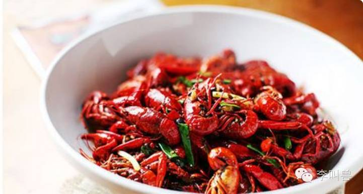

 

好了，找到了竞争对手，开始下一步。

 

**2，确定有利位置**

 

**找到了竞争对手，自然要寻找它们的缺点，从而让消费者放弃它们选择我们。**

 

直观一看就能发现，主要的竞争对手价格都很贵（小龙虾人均经常100多块）。

 

那么我们能打“更具性价比的夜宵”这个点吗？

 

当然不能。因为高价格是竞争对手的“直接缺点”，而不是“最大优势中的固有缺点”，而进攻直接缺点往往是无效的。

 

**我们要做的，是在竞争对手赖以生存的最大优点中找缺点。**

那么麻辣小龙虾、烤串等最大的优点是什么？人们为什么选择它?

自然是爽、刺激——没有什么比晚上和兄弟们一起撸串更爽的了。

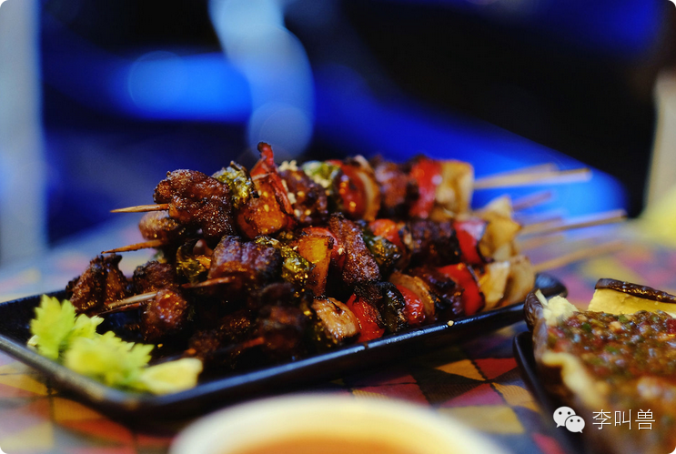

但任何硬币都有正反面，“爽”、“刺激”这个优势中，有什么固有缺点？

 

很多人觉得是“很重口”（有些人晚上想吃点夜宵，但是不想吃太重口的以致于有负罪感）。

 

**所以，我们的定位就出来了：“夜宵，吃点海鲜不重口”。**

一直以来，我们认为品牌规划的重要目的就是“打动消费者”，就是为了想出更多感人的语句来让消费者潸然泪下，但实际上这并不是品牌规划最重要的目的。

 

如果这样做，实际上做的是“形象包装”而不是“品牌策略”。

 
**真正的品牌战略，必须能够帮助一个公司针对竞争对手确定有利位置，并且最终赢得顾客的选择。**

那么为什么这样呢？

 

为什么我们要放弃传统的“单纯形象包装”，而使用真正的“品牌战略”？

 

**因为单纯的“形象包装”，经常存在这些问题：**

1. **重战术，轻战略**
2. **没有找到关键竞争对手**
3. **没有找到有利位置**
4. **按照自己的标准来划分市场**
5. **迷信单一手段**

###**1、重战术，轻战略**

“重战术，轻战略”是很多人在营销上经常犯的错误。

 

具体的表现在于：**迷恋形象包装，认为营销就是包装形象、促进传播，花费大量精力纠结于小细节，但是却对大战略（比如定位）不够重视。**

 

前段时间李叫兽跟朋友聊到手机行业的营销，有人问到“哪个手机公司营销做得最好”，大部分人认为锤子手机的营销是最好的。

 

**每次公关都是有力回击，每次文案都被疯狂转发，每次发布会都引来社会关注，还有大量的宗教信徒般忠诚的粉丝**——这在国内几乎没有什么公司可以比肩。

 

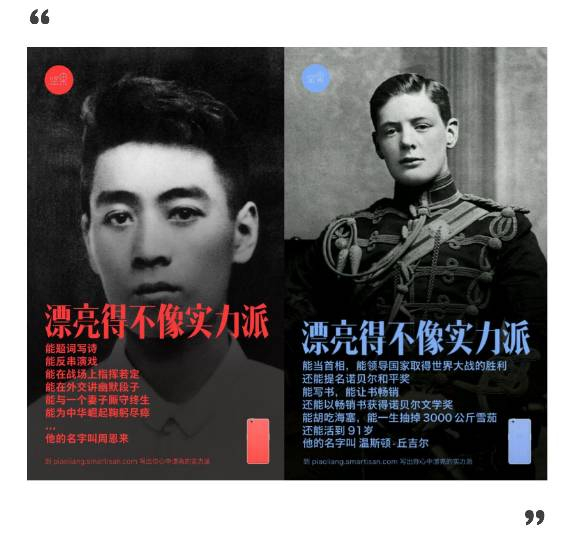

但显而易见的一个现实是：锤子手机并没有多少人买。

 

**我们知道，衡量营销能力最重要的方式就是看它“创造并保留顾客的能力”，锤子手机创造并保留顾客的能力并不高，为什么大家认为他营销做得好？仅仅因为每次公关战、文案战的胜出吗？**

 

这让我想起了我喜欢的美剧《权力的游戏》第二季中，斯塔克家族的Rob说的：**“I won every battle, but I am losing the war.” **（我赢得了所有的战斗，但是我即将在整个战争中失败。）

 

而这是“有小聪明没有大战略”的典型（虽然我个人非常喜欢Rob这个角色）。

 

**相反，在手机行业，去年我认为营销做得最好的是华为**，虽然华为的文案写作、公关反应、发布会等都差了锤子不是一点半点，但华为去年在整个营销战略上，打了一个漂亮的侧翼战。

 

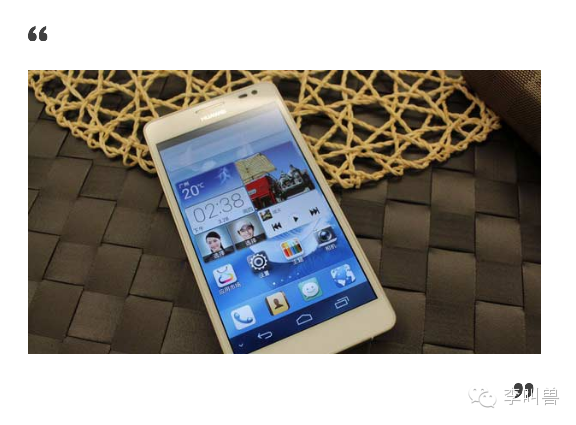

本来国产手机第一是小米，在用户心智中的优势是“高性价比”，这个时候试图在性价比上超越小米是不可能的（即使你的产品性价比是小米2倍，但因为小米已经牢牢占据这个定位，你怎么喊也没用）。

 

**而最应该做的，是寻找小米最大优势中固有的劣势。**（就像前面说的）

 

那性价比这个优势暗含着什么劣势？自然是“给人感觉很屌丝和低端。”

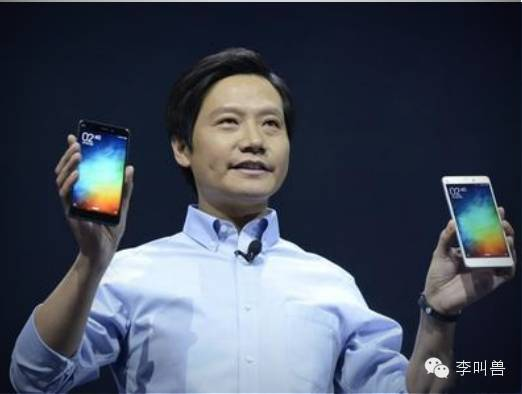

所以华为通过Mate8等机型的上市，主打高端定位，一举占领市场。

 

在军事中，真正能够赢得战争的军队，往往是占据了有利位置，然后让敌人不得不以劣势进行进攻，而不是单纯计较一城一兵的得失。

**在营销中也是这样，真正赢得市场的公司，往往是在用户心智中占据了有利定位，而不是单纯去计较某句话有没有打动消费者。**

 

**任何的形象包装，只有在定位正确的前提下才有意义。**否则，片面地追求形象包装和感动消费者，最终的结果必然是只感动自我，而这是典型的“有小聪明，没有大战略”的行为。

###**2、没有找到关键竞争对手**

**以“形象包装”来替代营销战略的问题在于：没有找到关键的竞争对手，凭借一腔热血去呼吁消费者，但是根本不知道自己到底要针对什么。**

 

之前李叫兽看到一个小旅行社写的传播文案，希望李叫兽帮忙诊断一下，文案大体是这样：

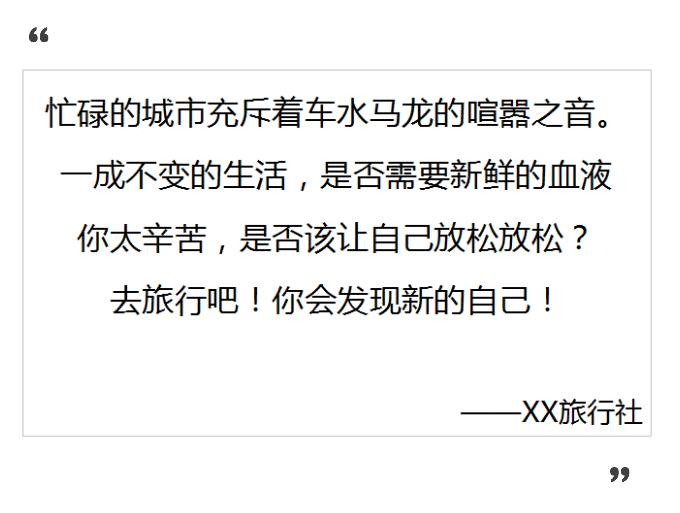

先无视这个文案在写作上的问题（比如没有顺应认知），单纯在策略上，就是完全不及格的：**根本没有找到竞争对手是谁，就想通过打动消费者来营销。**

 

那我们假设一种最理想的情况，你的文案写得特别好，真的打动了消费者，接着会发生什么呢？

 

> 假设我是一个处在生活高压中的普通白领，刚被领导骂了一顿，看了这个文案，感觉简直写到我心里去了。
> 
> 
> 
> 
> “是啊！我整天这么忙这么累，它说的对，我真的应该去旅行啊！”
> 
> 
> 
> 
> 
>  
> 
> 

> 想着想着，他就下定了决心。掏出手机，打开去哪儿，选定了目的地，直接把票买了。
> 
>  
> 
> “恩，就要来一场说走就走的旅行！”

等等！这个时候你会发现一个问题：**按理说这个文案很感动人，但整个过程中，写文案的那个“XX旅行社”去哪了？怎么故事的后半部分没有我们伟大的广告主啊！**

 

为什么感动了消费者，但最后没有买我的？

这当然很正常！

 

为什么呢？**因为文案作者脑中装的都是“如何打动用户”，而忘记了先找到“竞争对手”。**

 

在这个文案中，作者定位的竞争对手显然是“用户不去旅游的习惯”，并且希望通过文案让更多的消费者选择去旅行而不是待在办公室，从而击败“用户不去旅游的习惯”这个对手。

**但这是你真正的对手吗？**

必然不是。因为你并不是旅游行业的行业第一，也不是大多数人去旅行的第一选择，这个时候你真正的竞争对手是其他旅游公司，**你需要提供的是一个“为什么要选你而不是选别人的理由”，而不是一个“为什么要去旅行而不是待在办公室的理由”。**

而想刺激更多人去旅游的后果就是，这些用户会直接参照过去的行为习惯（比如用去哪儿直接订票），就没你什么事儿了。

 

**所以，广告人不能拿起笔来就想着怎么打动用户感动用户，应该先找找：我们现在关键的竞争对手到底是什么？我想让用户放弃什么来选择我？**

 

否则即使打动了也没有用。

###**3、没有找到有利位置**

**单纯的形象包装还有一个问题是：往往只是让你的品牌看起来更加有温度，但是并没有在用户心智中确定一个有利位置。**

 

在几年前的杯装奶茶大战中，市场上两大巨头是优乐美和香飘飘，他们采取了完全不一样的策略。

 

优乐美主打“你是我的优乐美”，拍了非常感人的广告，打动无数人的少女心，如果当时也有微信朋友圈的话，也一定能刷爆朋友圈。

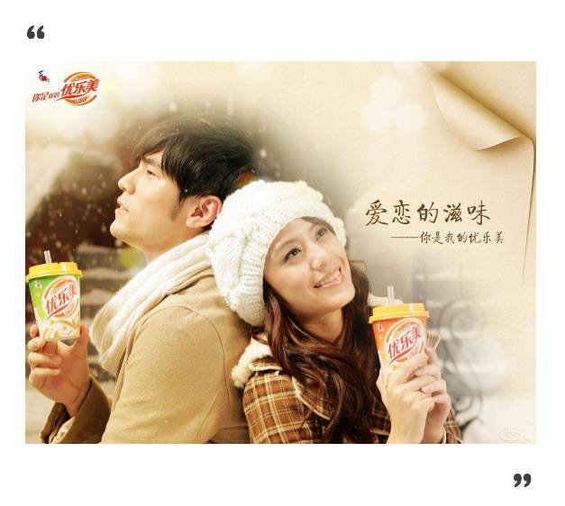

而香飘飘就主打“绕地球XX圈”，看起来很恶俗，也打动不了什么人。

 

**但结果是香飘飘在大战中胜利，而优乐美却一蹶不振。**

 

“你是我的优乐美啊”，表面上感动了很多人，但实际上没有有效传达任何“定位信息”（即使有的话，可能也只是轻微地暗示了“恋人专用”这种定位）。

 

而香飘飘的“销量绕地球XX圈”，传达了“我是行业第一”这个有效定位，让用户清晰地了解了它到底处在什么位置，然后大量的人就通过从众效应自然购买了。

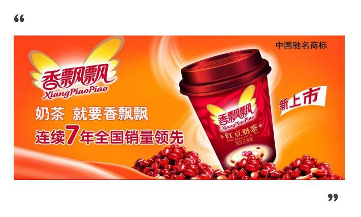

**广告宣传的重要目的，是让潜在用户明确知道你想填补什么位置，而不是宣传该产品到底有什么好处。**

**成功与否的重要标准，也并不是看广告是否引人注目、让人兴奋或者感动所有人，而是看是否在潜在用户心中牢牢占据了你想占据的有利位置。**

 

“哦，原来香飘飘是行业第一。”

“哦，原来神州专车主打安全。”

“哦，原来华为Mate系是国产高端机！”

 

很多人觉得某个定位很打动我自己，所以就选择它当做品牌slogan，殊不知能打动你和消费者的话多了去了。

 

比如李叫兽之前遇到一个电商APP的公司，卖高端生活品，slogan大致是“**不跟随，做自己**”，创始团队觉得特别打动自己，同时也有很多用户反应的确很喜欢这句话。

**但是你和你的用户都喜欢，并不代表它可以成为slogan——定位语的目的是有效传达定位信息，而不是让大家感动。**

 

如果说双方都喜欢就行的话，那我建议直接把这句话换成高晓松的“生活不止眼前的苟且，还有诗和远方”，然后你再进行一轮问卷测试，可能会发现：

 

这次，你的团队和消费者，可能都更加容易被高晓松这句话打动！

 

如果这样打动就行，我们也不需要学习战略定位和品牌营销，只需要不断在歌词里找灵感就行了。

 

这当然是不行的，因为这些诗句并没有说明你为什么会比竞争对手更能打动消费者，也没有给消费者一个选择你而不选择竞争对手的理由。

 

**所以，单纯品牌形象包装的问题就在这里：没有传达位置信息。**

###**4、按照自己的标准来划分市场**

**单纯品牌形象包装还有问题在于：他们喜欢按照自己的标准来划分市场。**

 

在大量的品牌策划书、品牌白皮书、品牌战略提案中，李叫兽见过的最多的一句话就是：“我们定位城市新中产阶级。”

 

类似的表达还有：

“我们定位25-40岁的城市新白领。”

“我们定位70-80后的城市中产。”

 

（话说“城市新中产”这个群体到底招谁惹谁了，被这么多公司定位？）

 

至于为什么一定是定位这个群体，为什么要采取群体划分的定位而不是情境划分的定位等，就回答不上来了。

 

而李叫兽之前写文章讲过，**应该按照“你的产品如何满足用户需求”来定义市场，而不是单纯用自己的标准来假想一个市场。**（比如奶昔定位成“帮早上开车上班的人，单手解决早餐”这个市场。）

李叫兽之前遇到一个做职场社交的公司，说要做河南省最大的职场社交软件。

 

这存在什么问题？

 

这个问题就是：**这完全是按照自己的标准假设划分的市场，而不是按照消费者的标准划分的。**

 

用户在用职场社交软件的时候，会区分这个软件是哪个省份的吗？

 

除非河南省社交习惯和其他省份出现巨大差异，或者河南省建了互联网防火墙，禁止外省软件，否则这个市场的划分毫无意义。

 

这就像一个学生说自己是“清华穿44码鞋的学生当中，成绩最好的”一样，几乎毫无意义。因为这是按照学生自己的标准，而不是企业用人单位的标准划分的。

 

所以，传统“品牌形象包装术”的问题就是：**经常是先按照自己标准假定一个群体，然后在这个群体内寻找consumer insight，而这样往往是无效的。**

###**5、迷信单一手段**

**单纯的“形象包装术”经常认为只要感动了消费者，用户就会购买，过于迷信单一的手段。**

 

所以我们看到大量的广告提案，都倡导“主打感情牌”、“产生共鸣感”，不论是回忆起恋人之间的点点滴滴，还是远在异乡的儿子表现对爸妈的思念，还是老婆支持丈夫的梦想……

 

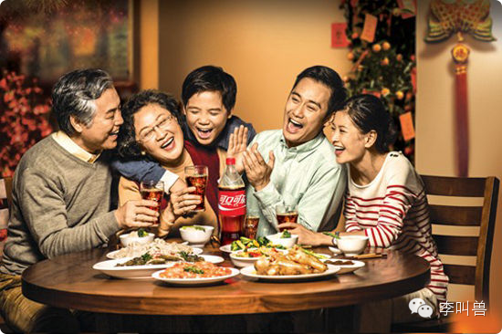

体现在各种slogan上，就充斥着：让爱发生，让温馨永远相伴，为梦想而生，心无间爱无限，不跟随、做自己等各种感动表达。

 

**但是实际上，“感动”、“打动”并不是产生购买的必要条件，更不是一个slogan一定要解决的问题。**

 

为什么？

 

众多关于广告的研究发现：**在享乐品、用户思考程度低以及产品代表某种关系时，情感类广告会产生较好的劝服效果。**

 

比如蒂芙尼的钻戒，代表了关系，也是享乐品，打情感感动的诉求，非常适合。

 

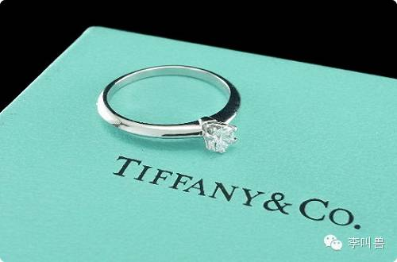

**而在强调功能的使用产品、用户思考程度高而且与人际关系无关时，情感类广告产生的效果非常差，远远不如理智诉求的广告。**

 

比如给房间配把锁，“更多人选择的家用锁品牌”这类信息，远远比“爱家人，就要守护她”有效得多。

实际上，**到底是否应该打感动牌，是在确定了品牌定位后，根据相对复杂的筛选条件最终进行选择的结果**（李叫兽之后会专门讲怎么选择），而不是拿到一个新产品，立马就要开始构思怎么感动消费者。

并不是所有的消费者都需要被感动。

 

**结 语 **

我相信即使说到现在，大部分人仍然会更喜欢“不跟随，做自己”、“多点关心，多点海鲜”这种定位。**实际上，我也是，因为这些话本身就像歌词那样讨人喜欢。**

 

但这完全不妨碍这些定位导致一个品牌的灭亡，也完全不妨碍你喜欢那个旅行社的文案，最终却还是在去哪儿上选了另一家，因为市场规律就是这么现实，它不以你的个人喜好为转移。

 

**品牌策略的目的，并不是想办法提升品牌形象从而感动更多消费者，而是针对竞争对手确定有利位置，并且把这个定位准确传达给潜在顾客。**

 

很多所谓的品牌策略，实际上只不过是“品牌包装术”。单纯进行品牌包装，而忽视真正的品牌策略，会让一个品牌缺乏持续的竞争力。只有明确了有利位置，再在这个基础上进行谨慎的包装才有意义。

 

所以，我们要做“品牌策略”，而不是单纯的“品牌包装”。  