#【李叫兽】真不巧，这次“消费升级”不太一样

**Re-think:**
**“消费升级”**
很多时候我们看不懂一个新机会，不是看的不够多，而是因为对基础概念的混淆——这波“消费升级”的机会就是这样。

这篇文章，带你重新思考“消费升级”。

**最近几年人人都在喊的“消费升级”到底是什么？**

一个流行的答案是：**消费者正在买越来越贵的东西。**

这里暗含的意思是：如果我们生产更加高端，更加大气，更加独特，更加满足消费者形象需求的商品，就能成为“风口上的猪”，抢占市场。

但这无法解释的一个现象是：**同样是高端商品，我们总觉得有一类商品根本不像这个时代的，而“另一类”商品，感觉才像当下时兴的消费升级。**

比如这把高端道具：

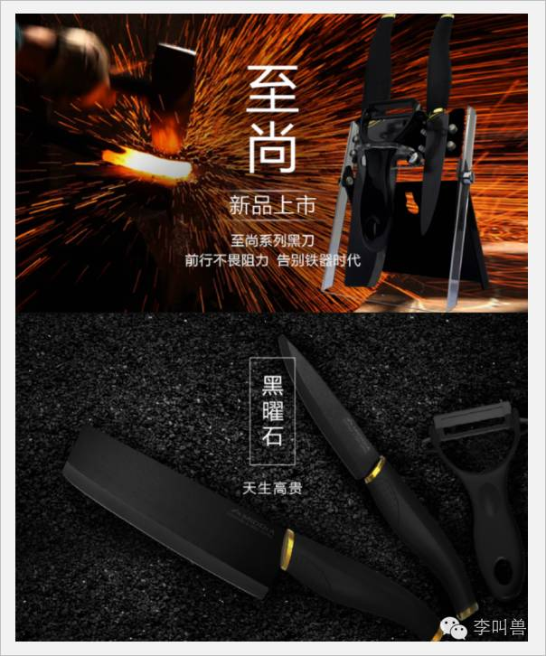

看这个描述（高贵、高端等），可能没有人会把它跟时下消费升级的热门品牌“花点时间”、“乐纯酸奶”、“XX轻体沙拉”等联系在一起，觉得它更像“上个世纪的诉求”。

（图：品牌花点时间的每周鲜花预定，也是消费升级）

**那这其中的本质区别是什么呢？**

最本质的区别是：

> **前面的陶瓷刀主打的是“奢侈品”诉求，而“花点时间”等代表的这波消费升级的真正机会，不是奢侈品消费的增加，而是高档品消费的增加。**（PS.后面我会详细讲营销策略的区别）
 

说到这里，**那“奢侈品”和“高档品”的区别是什么？**（毕竟看懂了他们之间的区别，才能看懂当下的机会。）

实际上，“奢侈品”和“高档品”的区别并不在于价格（因为有的高档品比奢侈品还贵），而在于它们被设计出来时要满足的需求，一句话概括：

**“奢侈品是区分阶级的需要，而高档品是努力工作的馈赠。”**

比如同样是iPhone，在一些人眼里，购买iPhone是为了区分阶级，让别人觉得“我买得起你买不起”或者“我有品位你没有”，以让自己融入某个群体并且离开某个群体（显得不屌丝），这个时候，iPhone就是奢侈品。

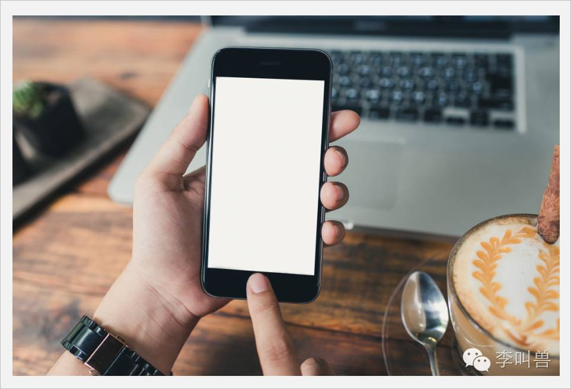
 
而在另一些人眼里，攒几个月的钱买iPhone，是为了质量、性能和积极的情感体验（比如对苹果文化的认同感），这个时候，iPhone就是高档品。

- - - - - - - - - - -

**上一次奢侈品市场的爆发，是源于中国社会“区分阶级”的需要。**

十几二十年前，也有大量的高价品牌的兴起。当时的机会是这样的：

一部分人借助改革开放的东风先富起来了，不论是通过80年代的倒货，90年代的经商，本世纪初开始的炒房，很多人迅速屌丝逆袭变成土豪。

与之而来的，就是这帮本来贫穷而迅速暴富的人，**需要通过炫耀性极强的产品，快速融入上游阶级，并跟原来家乡同等背景的穷兄弟们区分开**。

所以，高档茶叶、高档保健品、豪华轿车、奢侈品服装等迅速出现，满足了他们的需求——天价冬虫夏草真的有功效吗？当然不一定，但它的核心价值在于“**天价**”而不是在于“**功效**”。

于是到了今天，一些有多年经验的企业家，还会把这次消费升级跟十几二十年前的市场爆发、高端品牌崛起（比如高端鹿茸，意大利进口西服等）建立联系，觉得原有模式又可以迎来一波第二春。

**但这次不太一样，这次的机会不是“区分阶级的奢侈品”，而是“为努力工作提供馈赠的高档品”**

虽然整体经济在下行，但一方面拉动经济“三驾马车”中的“消费”占据的比例迅速上升，另一方面科技的进步和商品流动成本的下降（比如互联网降低了渠道费用），再加上城市化带来的文化转变等，让大量的消费者可以开始买“**高档品”**。

比如过去随随便便买个插座，而现在却要买颜值和功能齐备的插座。

**所以，最近几年在大家口中讨论的“消费升级”，本质上就是“高档品”需求的增加，而不是“奢侈品”需求的增加。**

**这届“消费升级”，营销的区别**

“奢侈品”和“高档品”，这两个看起来近似的概念，在营销上到底有什么区别呢？

我们知道，**奢侈品的本质是满足人区分阶级的需要，而高档品则是努力工作的馈赠**，这也让两种产品的营销、运作产生了这些区别：

**（1）营销诉求**

**奢侈品的主要诉求是无价感、不可比拟、稀缺感、尊贵感等，而高档品主要是诉求是性价比（对，你没看错，高档品也要性价比）、可比较性、认同感、情感连接等。**

开头提的陶瓷刀，说自己“天生高贵”，强调的是尊贵感，这些诉求本质上都是为“划分阶级”而存在的，属于奢侈品的诉求。

而如果把内容换一换，改成一个生活达人说：

> “切最爱的冰糖橙，总感觉普通水果刀，有股铁锈味——我爱吃水果，我也爱用陶瓷刀。”

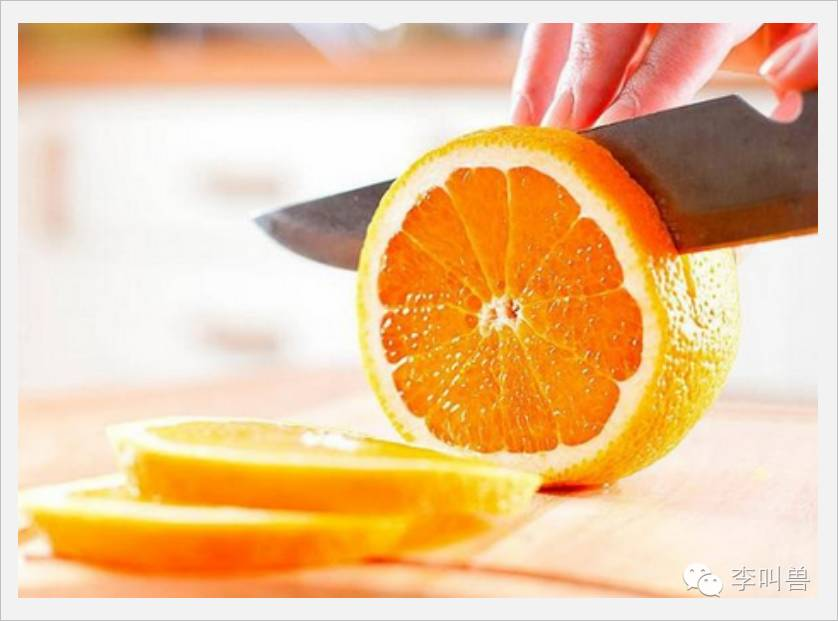

**换成对产品质量功能、生活方式等的描述，就变成了“高档品”的诉求了。**

再比如前几年的恒大冰泉，想要抓住消费升级的机会卖高价的水，但是其营销策略还是更像过去奢侈品的营销策略（强调水源地的唯一和稀缺），而不是强调当代新生活方式的追求，这样看起来总是跟这届消费升级的“酷”品牌没啥关系。

所以，接下来“高端大气上档次”、“有面子”、“身份象征”、“只买贵的”、“全球限量”、“独家定制”等诉求，并不是这次消费升级的机会（虽然会一直存在）。

**而“全新的生活方式”、“高质量产品高性价比产品”、“情感认同”、“过程体验”等带来的高档品消费，才是真正的机会。**

**（2）情感连接方式**

所有人都知道，单纯靠产品本身带来的价值远远不够，还需要跟消费者建立**情感连接**。

但同样是情感连接，奢侈品和这届消费升级的新贵“高档品”的连接方式却很不一样。

**奢侈品本质上是用来“划分阶级”的，所以它经常可以看起来“很冷漠”，让消费者感觉自己距离它很远，甚至有时候还摆着“爱买不买”态度，海报上连句slogan都没有**——这在营销上叫做“**零售拒绝**”（Retail Rejection），这样做反而会提高消费者对奢侈品的喜好。

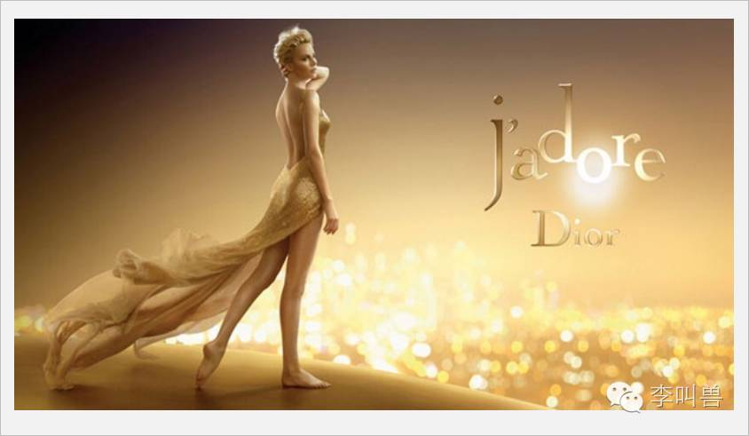
 
这是因为买奢侈品是为了融入某个阶级，你越拒绝我，我就越觉得自己不是这个阶级的一员，越想融入。

有个营销学实验还发现，**奢侈品商店的导购员越对顾客冷冰冰的，顾客反而买的越多**（证明我不是看得起买不起）。

所以，你可以理解为什么星巴克用让人费解的沟通语言“grande”的效果了吧？（故意让人弄不懂也是零售拒绝。）

**而高档品的情感连接方式则恰恰相反，他们经常需要跟顾客有很多互动，让顾客产生高度的参与感，好像顾客就是老板娘一样。**

比如乐纯酸奶让粉丝参与投票，参与口味的评测，支持他们的梦想（情感一致性）等等。

比如金六福酒直接利用更加贴近用户的语言（而不是拒绝感很强的语言）来沟通：

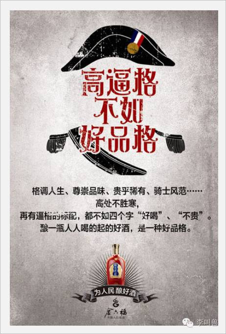

还有大量的品牌让消费者参与研发、参与传播、参与社群等，本质上都是在建立这种情感连接。

**所以，既然这次消费升级的对象在于“高档品”而不是“奢侈品”，就应该更多地建立强情感连接和互动，而不是用过去奢侈品一贯的“拒绝”、“高冷”等感觉。**

比如同样是20万左右的车，MiniCooper的广告，看起来就像“高档品”的广告：

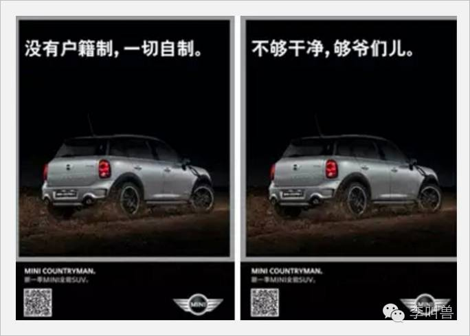

而这个类似价位的别克君越，则主打的是奢侈品诉求，有点拒绝感（再次说明，奢侈品和高档品的区别不是定价而是需求，有的奢侈品比高档品便宜）：

**（3）可比较性**

**“可比较性”是指用户是否能够清晰地比较不同产品之间的属性（比如参数的描述），奢侈品为了划分阶级，一般都会想办法降低可比较性；而高档品则需要提高产品的可比较性，让消费者可以更明显感受到它带来的实际价值。**

比如同样是价格较高的床垫，奢侈品床垫一定是拍摄华丽的图片（可能修图就够修半个月的），找的外国模特，营造出皇室的感觉（划分阶级）。然后文案上要不就是突出某种没用材质的稀缺性（镶金），要不就是倡导“北欧之风，奢华之选”，要不就是干脆没有文案让用户自己感悟高冷的华贵气息。

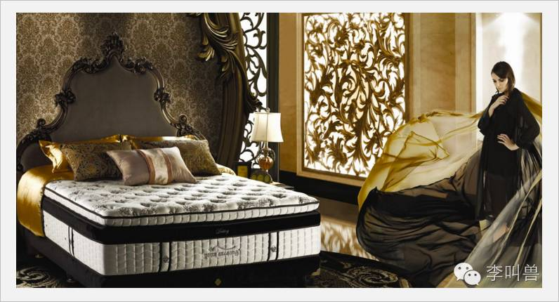

这些都会降低消费者在不同产品之间对比的能力——“你没告诉我床垫到底应该怎么选，也没告诉我你的优势劣势和功能等。”

**而高档品则恰恰相反，往往会提高产品的可对比性，让消费者可以直接看到产品独特功能带来的价值****。**比如小米床垫：

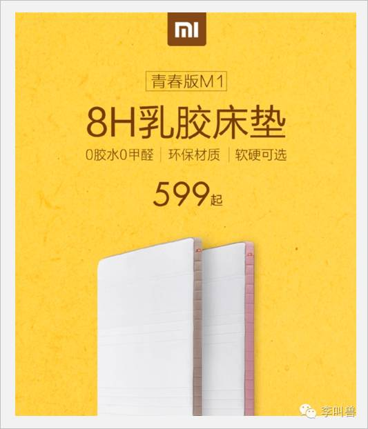

**之所以这样，是因为奢侈品主要的价值在于价值、品味、历史等信号的传递号，而性价比本身就是劣势。**

毕竟奢侈品包如果也像小米那样，说什么“XX牛皮”、“XX航空级材质”、“手部弯角设计，更易抓取”、“两部手机的重量，极致轻盈”，用户就容易对比不同包之间的属性和性价比，最终发现这些属性淘宝600元的包其实都有。

**而高档品则往往是质量和体验的提升，为了吸引消费者，反而要提高可对比性，**让消费者可以很轻易得出这样的结论：“哇，多了这么多功能，看来多花300块是值的。”

否则如果故弄玄虚的话，消费者反而会因为不清楚高价带来的价值，而放弃购买。

**（4）消费人群**

**奢侈品的主要消费人群是想要让进入某个阶级的人，他们购买产品最重要的目标就是“能不能让别人看出来我的阶级”。**

这类人群一般都有一个明显的特点：**身份的急剧变化。**

**因为当身份迅速变化的时候，我们内心就会产生想要确认新身份的需求，从而会更加注重自己的外在形象**——比如你去见每天都能见面的租房室友，可能随便穿穿；而当你刚刚进入一家新公司，可能就需要通过名牌服装或者光鲜的经历（“你知道吗？我去年拿过戛纳奖”）来“确立地位”，让别人迅速对你建立“正确认知”。

比如突然变得有钱的人，经常会通过购买名牌服装等来确认自己的身份，让别人知道自己变得有钱了。

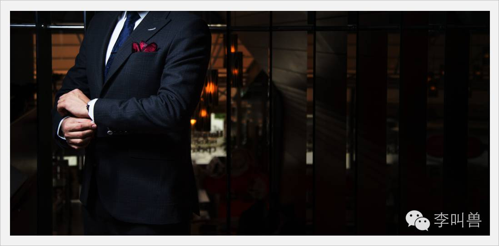
 
而突然变得有名或者社会地位提升的人，则会消费文化类的奢侈品（比如去花费几万块去听自己根本听不懂的培训课来彰显知识，或者购买艺术品来彰显品位），目的不是为了证明有钱，而是为了证明有文化。

**这些人跟当下消费升级的主力人群并不一样，当下购买高档品的大部分人，并没有突然变得有钱、有名或者阶级提升，而是随着文化、经济的变化慢慢有了消费能力和欲望。**

他们更多是每年薪水上涨20%，每2年升职或跳槽一次，刷着朋友圈同时也在勤恳工作的白领——他们的消费虽然也有维护形象的成分，但本质上是价值驱动型的。他们购买高档品是为了提高生活质量，感受到某种生活方式的体验（比如小白领周日早上自己做一个奶茶，瞬间感觉好像体验了西方生活）。

**（5）产品策略**

**对产品生产来说，如果奢侈品是强调手工艺和稀缺，普通大众货品强调的是“能不能大规模生产”，那么高档品强调的就是他们两者的结合——“大规模的工艺化”。**

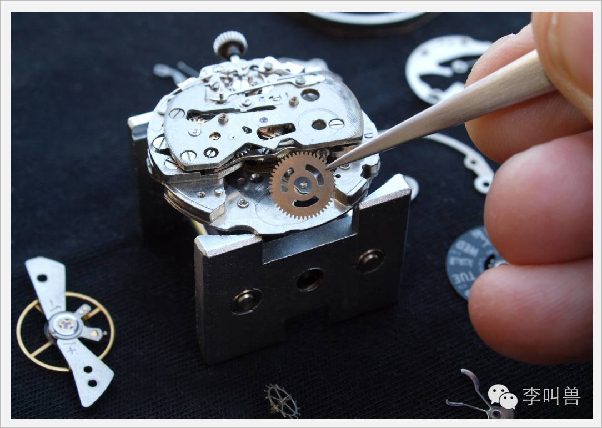

高档品本质上是**大规模生产大规模销售**（这点要记住，因为很多人明显定位人群太窄了，这不像高档品），同时想办法实现产品的“工艺化”。

不过同样是对“工艺”有追求，奢侈品和当下消费升级的高档品很不一样。

奢侈品工艺追求的目的是为了稀缺和区隔，所以定位奢侈品的小牛皮箱子，文案会是“一头牛只能做四个”。

而高档品工艺的追求是为了实际使用利益，所以定位高档品的小牛皮箱子，文案会是“精选新西兰小牛皮，下雨也能用”。

这也导致过去在奢侈品常用的产品策略“微小属性策略”，在高档品上也会失效——**过去奢侈品为了支撑起它的价值，就得给别人一个产品区分的理由，而这个理由经常是一个“高价稀缺”但实际上没有卵用的功能（“微小属性”）。**

比如加入更多氢气的水、镶钻的手机、XX庄园的牛肉（其实跟其他牛肉没啥区别）等，**虽然不会带来直接的利益，但因为微小属性的区隔，获得了差异化的机会。**

这一招在消费升级的“高档品”就不灵了，因为高档品不是求异求稀缺，而是追求实实在在的性能体验提升。

**（6）广告目标**

奢侈品和当下消费升级的“高档品”，广告沟通的目标也有很大不同。

**奢侈品最重要的沟通目标让品牌跟某种积极的形象和阶级建立关联**——比如某个包包品牌和欧洲皇室的情形不断同时在广告出现，慢慢消费者潜移默化就把它当成了这种阶级的代表，从而将来会为了进入阶级而消费这个产品。

**而高档品广告沟通的目标则更加是“让消费者在购买前就产生体验”**，比如用了辛苦工作的白领，靠自己的努力，用XX高端电饭煲给加班的老公煮了一顿赞不绝口的饭，消费者看完了后也会觉得要“善待自己”，从而购买。

再比如，同样是找代言，因为奢侈品目的是塑造形象，所以用户看完代言广告后的感觉应该是：

> “哇，刘德华代言的！果然高端！”
 

而高档品的目的是让“让消费者在购买前就产生体验”，所以用户看完代言广告后的感觉应该是：

> “哇，你看，果然还是刘德华这样的明星会享受啊！”
 
**结 语**

**这一次消费升级的关键，并不是在于满足消费者区分阶级的需要，而是给他们努力工作的馈赠。**

既然这样，你采取的各种策略也应该相应发生变化：

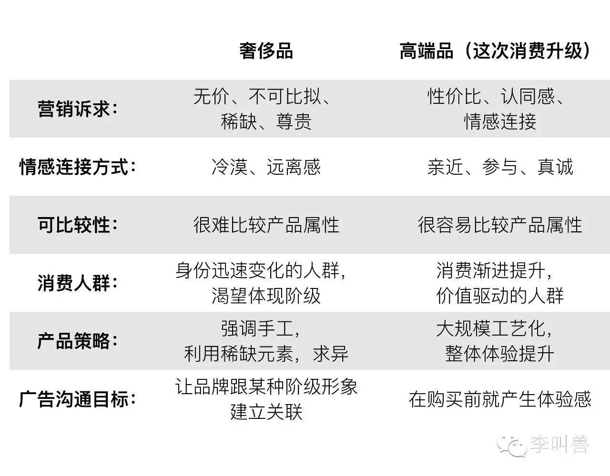

**预告**

这周文章仅仅是简单讲了这波消费升级的需求本质，因为篇幅原因，并没有说具体怎么做。

下周会发文章“消费升级（下）”，告诉你：**到底怎么样，才能让消费者“买点好的”。**

部分引用来源
- Silverstein M, Butman J, Fiske N. Trading up : why consumers want new luxury goods--and how companies create them[J]. 2005.
- Ward M K, Dahl D W. Should the Devil Sell Prada? Retail Rejection Increases Aspiring Consumers’ Desire for the Brand[J]. Journal of Consumer Research, 2014, 41(3):590-609.