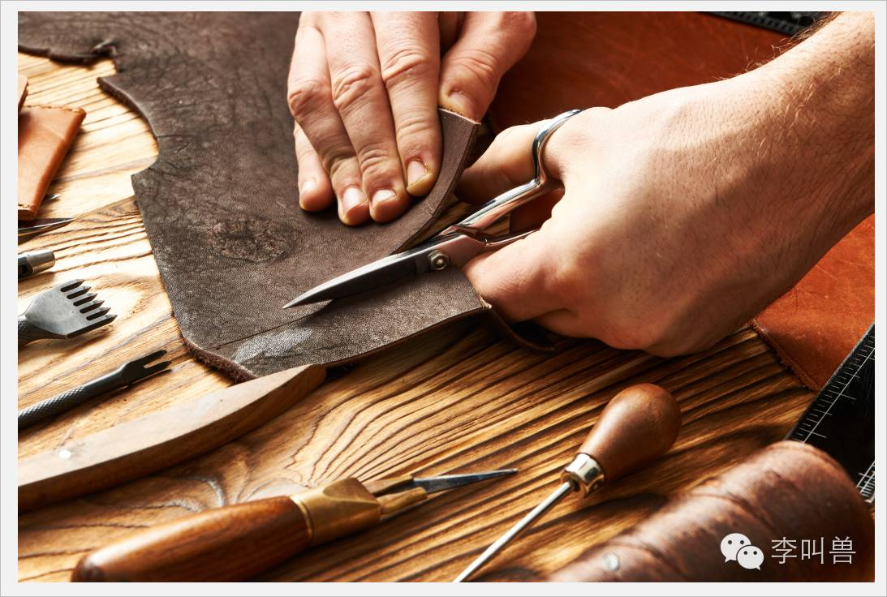
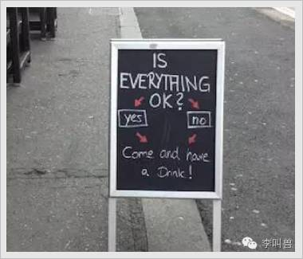
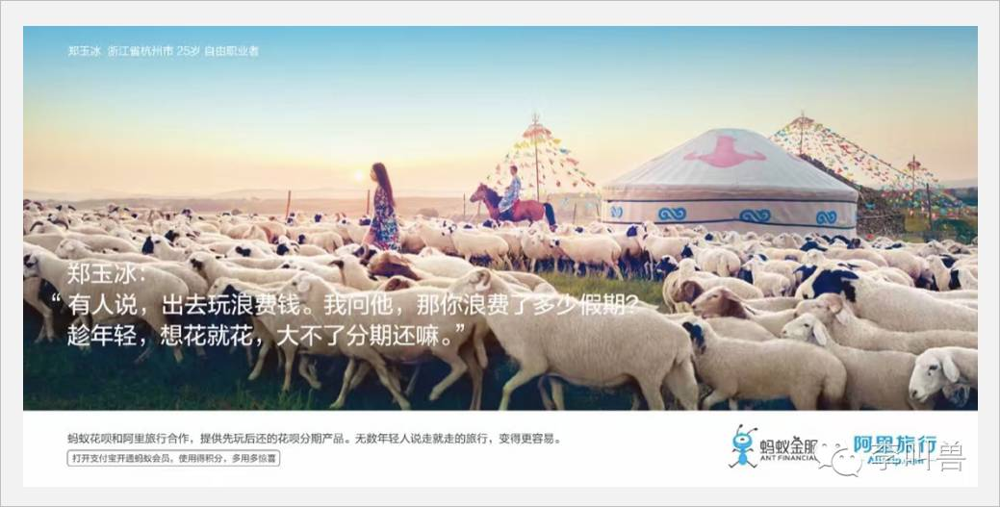
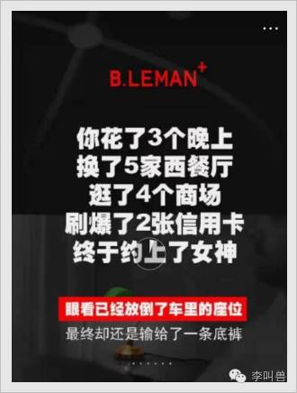

#【李叫兽】消费升级，如何让消费者“买点好的”？

李叫兽·消费升级系列文章——第二篇：如何让消费者买点好的。

- - - - - - - - - - -

在消费升级的浪潮下，本来寻常无比的米粉、茶叶、肉夹馍亦或是台灯、办公椅、牙刷，都突然有了“匠人精神”。**可到底如何才能让消费者“买点好的”，是一个关键问题。**

在营销界最流行、最影响深远的一种做法是：诉诸成本**——**让消费者觉得我们的产品成本高、稀缺、独特，从而愿意支付溢价。

> “奢华小牛皮箱子，一头牛仅能做4只。”
> 
> “纯手工制作，匠心独运。”

这种常见做法背后的假设是：**消费者愿意为成本更高、更稀缺的商品支付高价，因为这可以给他们带来面子和形象提升。**（毕竟人无我有嘛）

如果产品的定位是“奢侈品”，这当然是合理的。因为奢侈品出现的目标是帮助人们划分阶级，让一个购买了奢侈品包包的人享受“稀缺商品”带来的尊贵感，从而感觉更加融入那个阶级。

但我上篇文章中讲了：**这次消费升级真正的机会，并不是奢侈品消费的增加，而是高档品消费的增加。**

（PS.来自贝恩的一份报告显示，2015年中国奢侈品销售量下降2%，奢侈品怎么也不可能是这次消费升级的拉动力）

奢侈品与这次消费升级真正的机会“高档品”的区别是：

**奢侈品是划分阶级的需要，而高档品是努力工作的馈赠。**

为了划分阶级，奢侈品自然要倡导稀缺和高成本；而为了成为“努力工作的馈赠”，高档品应该怎么做营销，才能让消费者更想“买点好的”？

这篇文章就讲被大量研究和案例证明过的四种方法，让你的消费者更加想“买点好的”。

**1、提供理由，让消费者自我奖赏** 

一顿“装逼与美味齐飞”的轻奢餐，对很多城市新白领明明充满诱惑力，但为什么很多人仍然不去消费？

因为我们消费高档品会有一定的负罪感——比起饿了么上15元的外卖，出去吃顿150元的大餐，当然花费更多，吃完之后感觉：“唉，这下又得开始省钱了”。

既然我们收入有限，自然就不能把“高档品”当成每天的选择，只能当成偶尔对自己的奖赏。

**而品牌方能做的，就是想办法激活人的这种“自我奖赏”心理，减少金钱方面的负罪感，从而刺激消费者对高档品的购买。**

激活这种“自我奖赏”心理，就需要给消费者提供一个“理由”，来减少负罪感。

比如滴滴专车之前的文案：“如果现实总拼命，至少车上静一静。全力以赴的你，今天做好一点。”

**一般来说，你可以利用的这种理由，有三大类：权利类理由、特殊类理由、促销类理由。**

**（1）权利类理由**

**如果你感觉到自己已经“付出很多”、“做的不错”，就会觉得自已有了“奖赏自己的权利”，更加容易短暂“消费升级”一下。**

作为营销人，就可以给消费者提供这种理由：

**我付出太多，所以有权利消费升级：**

- 加班太辛苦，今天吃点好的！
- 学习太劳累，今天吃点好的！

**我已经有成就，所以有权利消费升级：**

- 你做的已经足够好，只不过对自己要求太高。今天早点下班，吃点好的。

（PS. 我记得在电视剧《欢乐颂》中，爱吃蛋糕的邱莹莹平时舍不得买，但有一天终于找到了新工作，果断跑去蛋糕店买了蛋糕，跟这个心理类似）

**我做了好事，所以有权利消费升级：**

- 为别人操心太多的你，今天关心自己一次，吃点好的！

**（2）特殊类理由**

消费者并不能总是“消费升级、买点好的”（金钱所限），所以要想说服他们买点好的，就得让他们感觉到这次是一种“特殊行为”。

类似于很贫穷的人，过年的时候也不吝啬给自己买身新衣服，做点好吃的。

如果给消费者提供这些“特殊理由”，他们就更容易“消费升级”：

**特殊场合：**

- 今天出差了，今天吃点好的。
- 今天没出差，今天吃点好的。
- 今天回家了，今天吃点好的。

**特殊时间：**

- 周末又到了，今天吃点好的。
- 工作日又到了，今天吃点好的。
- 今天天气好，吃点好的庆祝一下。
- 今天天气不好，吃点好的补偿一下。

**特殊人物：**

- 难得跟同事吃顿饭，今天吃点好的。
- 难得跟女朋友吃顿饭，今天吃点好的。
- 难得朋友来做客，今天吃点好的。
- 难得朋友不来做客，今天吃点好的。

**很多人觉得上面有些理由自相矛盾，但实际上消费者总能找到看起来合理的理由去消费的。**

**（3）低成本类理由**

**对于让人渴望的“高档品”，很多人因为负罪感最终没有消费，但如果偶然发现成本降低，这种负罪感就容易烟消云散，最终刺激购买。**

即使这时候仍然很贵，但他们会觉得不去消费是一种损失。

常见的手段诸如：打折促销、免费尝试、偶尔抽奖等，因为应用比较普遍，这里就不详述了。

**总之，要让消费者克服内心的负罪感去享受一把，给自己来一次“消费升级”，可以给他们提供各种理由，以攻破内心的最后一道门锁。**

**可不要小看这种理由的力量，有时候一个简单的理由（即使细思起来根本不合理），也能刺激我们产生行为上的改变。**

比如之前心理学家EllenLanger曾经做过一个“插队”实验：

在一群排队等待复印机的人当中，Langer直接问“我可以先用一下复印机吗”，只有60%的人同意插队。

但当她加入了一个理由，说“我可以先用一下复印机吗，因为我有一些文件需要复印”（废话，谁来复印不是因为有些文件要复印），结果这次有93%的人同意了插队。

很多时候消费者本来就想做一件事情，在店门口、下单页面、菜单旁犹豫不决，这时往往就差一个理由。

而如果能够有效提供这种消费理由，就更有可能潜移默化刺激他们“消费升级”一下，奖赏自己一次。

（图：奥运会期间某酒吧广告，“一切都好吗？”，好或者不好箭头都指向“过来喝一杯吧”）

**2、利用群体，让消费者XXX** 

明明对更好的产品产生渴望，但却没有购买，经常是因为我们觉得“不应该这样”——“月收入区区几千块，干嘛买这么好的衣服？月收入几千块，干嘛还嘚瑟非得去旅行？最近经济不好，还是老老实实攒钱吧……”

于是，我们在不断地进行自我控制，克制自己的消费，这显然与一大堆“工匠精神”、“极致产品”的情怀企业形成了矛盾。

怎么办呢？

**如果消费者发现比他更不应该消费该产品的人，都开始消费了，他们就容易克服内心的阻碍，去买点好的。**

比如一个普通男生舍不得买一双AirJordan的鞋子来“消费升级”，但如果看到一个生活更加不好的美国黑人，都收藏了好几双，就更加容易接受。

比如男朋友本来不舍得给女朋友买更贵的首饰，但是看到广告片，明明很贫穷的男主角仍然偷偷攒钱给心爱的女友买了让她惊喜的生日礼物，就更加觉得应该给自己女朋友消费升级。

比如一个热爱摄影的大学生，觉得家境一般舍不得买好一点的单反相机，但看到广告片中真正的摄影发烧友，穷得出去拍摄只能吃干粮，仍然拿着佳能5D，更加会咬咬牙买一套好单反。

一个职场女性，觉得出去旅行太花钱，不应该如此“消费升级”，结果发现比她职位更低收入更低的女孩，都能去享受有旅行的假期，也更有可能对自己说：老娘这次也要犒劳自己一把！

**之所以这样，是因为我们一旦看到他人降低自律、违反规范的时候，我们也会改变对自己的要求。**

有个心理学实验就证明了这一点，找一群被试者，让他们先阅读“行人”、“车辆”、“红灯”、“闯”等和违规、降低自控等相关的词语，然后让他们选购鞋子。

结果发现，比起普通鞋子，这些人变得更加乐意去挑一些既有设计感又舒适的好球鞋。

日常生活中也是一样的，我记得本科时有次我本来坚持复习（第二天有考试），结果发现一些比我复习得更少的同学，都跑出去玩了，我也突然变得忍耐不住，觉得“自己没必要复习这么多”了。

所以，充满匠人精神、生产出高档消费升级产品的你，一定会面临一些“觉得自己不应该买这么贵”的消费者，**如果你能够通过广告、文案、公关、营销活动等，让他们感受到，比自己更不应该买的人，也买了，他们就更加容易放下内心阻碍，去“买点好的”。**

我还记得鲁迅写的《阿Q正传》中，阿Q调戏尼姑被发现，辩解说“和尚摸得，我摸不得？”，就是类似的心理——**既然别人可以，我凭什么不可以**。

当然，在具体应用的时候，要注意一点：**你所利用的群体，必须不能是消费者想要回避的群体，否则反而会起到负面效果。**

有研究发现，当看到清洁工等低地位群体不遵守交通规则的时候，大学生反而更加遵守交通规则了（跟这些群体区分开）。

**3、绑定目标，让消费者更挑剔**

高档品电饭煲，可以做出更香的米饭，但是大部分消费者可能并不在意：“我用普通电饭煲就行了，干嘛需要买这么好的？”

也就是说“匠人精神太高，消费者的挑剔程度不够用了”。

**这时候营销需要做的就是想办法让消费者对这个品类的产品，变得更加挑剔。**

怎么做呢？

关键的方法就是：**让你的产品，成为消费者一直在追求的某个重要目标的一部分。**

比如高档男士内裤，可能大部分人缺乏购买动机——他们对内裤不够挑剔，认为买个普通的就行了。

但如果让内裤成为某个重要目标的一部分，让用户觉得自己已经为这个目标付出了足够的努力，就差这一条了，就容易提高对内裤的挑剔程度。

**正常情况下，我们很难为一个产品多花钱，但如果我们觉得自己已经为某个目标付出了足够的努力、万事具备，但就是差一个“足够好的XX”，就会提高对这个产品的挑剔程度。**

比如你旅游时跑到人山人海的景点，看到一瓶水竟然卖10块钱（远超正常价格），不想买。

但如果此时有人说：“好不容易挤出时间来旅行，不要因为10块钱，让口渴毁掉你的心情”，你就更加愿意为超过均价的水付费。

对我来说，“获得美妙的旅行体验”是一个重要的目标，为此我已经付出了请假5天、耽误工作、忍受旅途颠簸、再加上半个月工资等成本，看起来这个目标已经处于“接近完成”的状态，我就更不允许我的某个行为来打扰目标的完成。

“反正已经付出了这么多，来都来了，难道还差10块钱？”

**这在心理学上叫做“目标趋近效应”（Goal-Gradient Effect）——我们越是趋近于某个目标，越是想要不惜一切代价完成它。**

比如你看一个2小时电影，刚看到30分钟，被老板叫回去加班，可能真的会停下来。

但如果看到1小时55分钟，即使发了地震，可能都很难让你立刻停下来。

所以，如果你想要让消费者变得更加挑剔，可以问自己：

**我的产品，可以帮助消费者完成什么即将完成的目标？TA为这个目标，还付出了什么努力？**

比如之前有个学员做高端大米的产品，目标人群是都市上班族，发现消费者也对大米不够挑剔，所以想定位成“绿色、健康”等诉求。

但我认为这样可能难以改变消费者的挑剔程度：健康这个目标太过于远大，即使吃了你的大米，这个目标可能也只多完成了1%，而把目标完成度从10%提高到11%，消费者是没有任何感觉的。

“嗯，吃你的大米是更健康一点，但我还吸着雾霾、劳累工作、健身太少，关于健康还有这么多任务没做，怎么轮得到大米？”

所以不如切换成一个“即将完成的目标”：“好不容易亲手做次饭，就要用最好的米，做最香的饭。”

（一个繁忙的上班族，为了亲手做顿吃的已经付出了很多其他努力，可能不想让大米成为一个“限制环节”。）

**4、重新定义行业，切换消费者的“心理账户”**

**有些问题很难解决，并不是因为我们不够优秀，而是因为我们的思维被局限到固定的“类别”中。**

让消费者“买点好的”这个任务，也是一样。

任何想要让顾客**“**消费升级**”**的企业，永远绕不开这样一个挑战——**消费者固定的“心理账户”。**

消费者总觉得“杯子是几十块钱的东西”、“饮料是几块钱的东西”、“猪肉是十几块钱一斤的东西”，如果有商品远远超过了这些日常的价格，他们就很难去买。

比如我见过拿着几万块包包的人，竟然说我买上千块的Filco机械键盘很奢侈。因为在TA的心理账户中，键盘的预算可能就是几十上百块，超过了这个价格就显得难以接受。

也就是说，TA的内心中，买包包的账户可能有几万块，但买键盘的账户可能只有几十块。

这个时候想要超越这种“心理账户”的限制，就变得非常困难。

那怎么办呢？

**最经常的做法是：重新定义的你的产品，让消费者可以放入另一个“心理账户”中。**

比如一个美女眼中，杯子属于实用品，其心理账户只有几十块，而你销售几百块的杯子，不论质量多么好，都可能无法打动她。

但如果你重新思考“杯子”这个产品能满足的需求——“谁说杯子一定是实用品？”，然后想办法让消费者把它放到不同的“心理账户”中，就容易多了。

Swell bottle水杯，重新思考了“杯子能够满足的需求”，把杯子定义成了“装饰品”而不是“实用品”，结果让几百块一个高价杯子大卖。

毕竟，对一个杯子来说，几百块的确太贵了，大部分人在“杯子”的心理账户中没有这么多钱，但对于一个时尚装饰品来说，几百块其实一点也不贵——任何一条好看的项链都比这个贵多了。

再比如高价的酸奶归类到“代餐酸奶”后，消费者也觉得没那么贵了（毕竟代餐的心理账户的钱，比买酸奶当饮料的钱要多）。

**当然，这种思路不光用于“让消费者买点好的”，更是几乎所有优秀产品、营销的基石。**

**我之前也说过：一流的解决方案和二流的解决方案之间最大的不同，往往不是“答案是不是更好”，而是它们回答了“不同的问题”。**

比如大部分做布娃娃的人，想创新时问自己的问题是：如何做出更好的布娃娃？

然后我们看到了更舒适的、用料更好的、设计更优雅的布娃娃，但这本身更像是一种“无聊的优秀”。

**而另一部分人问自己的问题却是：人们到底为什么需要布娃娃？**

是啊，布娃娃到底满足了人的什么需求？还可以满足什么需求？

回到了这些更根本的问题，才能够得到更好的方案。

芭比娃娃公司当年就重新回答了这个问题，在“人们为什么需要布娃娃”上找到了新答案——他们发现，小女孩对布娃娃真正的需求，并不是得到同类的陪伴，而是提前看到成年后的“美好自己”。

所以他们首次开发了主角是成人的布娃娃，满足了另一个需求，也重新定义了行业。

（ps.以后李叫兽会详细分析如何重新定义行业，这里不详述。）

总之，回到我们的问题：“如何让消费者买点好的”，你还可以做的根本的解决方案就是：**重新思考，你的产品品类，还可以被消费者放到什么“心理账户”中。而不是盲目地做出材质更好、功能更多、代言人更大牌的商品。**

**结 语**

**消费升级浪潮下，到底怎么让消费者买点好的？**

前面讲了四种方法，它们是层层递进的——**越靠前的方法，操作越简单、越容易改变，但同时更加短效；越靠后的方法，操作难度更大（有的涉及到营销的重新定位和产品的改良），但同时也更加长效和根本。**

这些方法分别是：

1. **提供理由，让消费者自我奖赏。**
2. **利用群体，让消费者克服阻碍。**
3. **绑定目标，让消费者更加挑剔。**
4. **重新定义行业，切换消费者的“心理账户”。**

希望对你有所帮助。

这篇文章接上篇：[【李叫兽】真不巧，这次“消费升级”不太一样](http://mp.weixin.qq.com/s?__biz=MzA5NTMxOTczOA==&mid=2650441512&idx=1&sn=5769388eda924a76da2a18cfc1de4181&scene=21#wechat_redirect)

部分引用来源- 奢侈品数据来自：《2015年中国奢侈品市场研究报告》
- 芭比娃娃案例引用自：菲利普·科特勒《水平营销》
- Kivetz R, Zheng Y. Determinants of justification and self-control.[J]. Journal of Experimental Psychology General, 2006, 135(4):572-87.
- Pham M T. Representativeness, Relevance, and the Use of Feelings in Decision Making[J]. Journal of Consumer Research, 1998, 25(2):144-59.
- Ran K, Urminsky O, Zheng Y. The Goal-Gradient Hypothesis Resurrected: Purchase Acceleration, Illusionary Goal Progress, and Customer Retention[J]. Journal of Marketing Research, 2006, 43(1):39-58.
- 奢侈品、高档品的定义，学术上有不同观点，本文定义援引《奢侈品战略》的作者Vincent Bastien & Jean-Noel Kapferer 的定义。