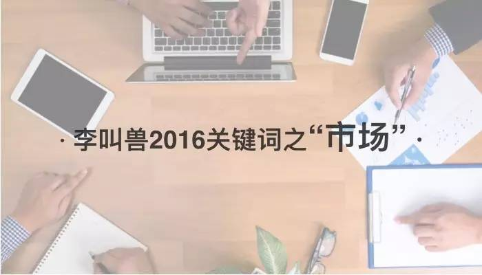
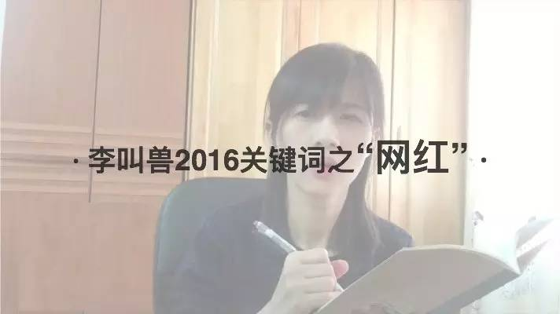
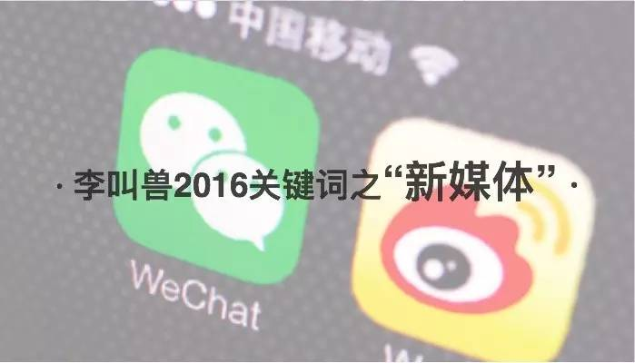
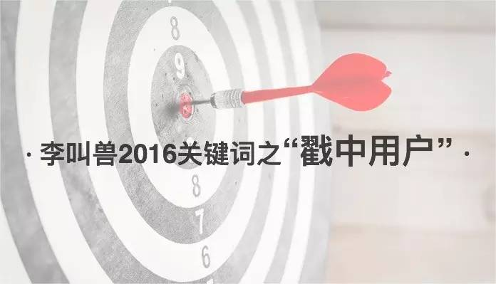
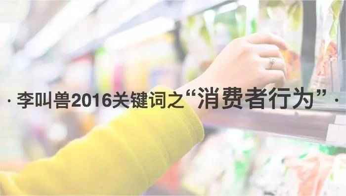
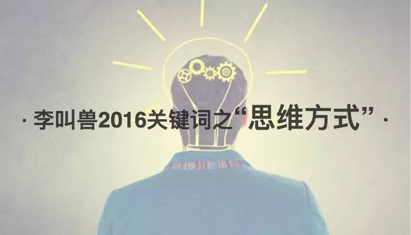

#一篇文章，读完李叫兽方法2016
2016年即将结束，大约一个月前，我突然收到了一箱快递。

拆开来看，原来是一个创业者做的“互联网手工辣条”项目，给我寄来了一箱产品—— 这个创始人去年看到我当时随意写的一个文章《如何用互联网思维卖辣条》，竟然立马看到了机会辞职创业，**真的参考文章中的方法去做了一个辣条品牌。**

这个简单的故事，再次提醒我：**虽然经常有人说社会太浮躁，但仍然有很多想要不断学习、研究并革新自我知识的人，原来偶尔分享下我的分析可以产生很多价值。**

这一年，我相信你跟我一样，看了太多的观点，关注了不少热门话题分析：从直播大战到共享单车崛起，从消费升级到网红经济，从内容电商到场景时代，总之，发生了太多现象。

在这纷繁的现象中，我也分析了一个又一个营销人关注的重要问题。**而这篇文章，我就用七个关键词做为总结，让你两小时内，系统化读完一年“李叫兽”。**

**关键词1  “市场”**

不论出现多少新的潮流词汇，但对营销人来说，“市场”这个词永远值得重新思考。所以关于这个关键词，我写了**“重新定义市场系列”。**

就拿最简单的“市场聚焦”来说，很多一直在做市场的人，都没有真正理解这个原则。

比如之前遇到一个O2O公司（主营上门修电脑修手机等），在初期推广的时候，几乎具备了成功营销的全部条件：整体服务满意度高，价格低廉（比如上门清灰只有49元），文案也OK，团队执行力强，甚至，也进行了市场聚焦——定点聚焦到几个高端小区进行推广，先把渗透率做起来。

**但却效果甚微。为什么呢？**

因为它没有真正符合“市场聚焦”的原则（即使它表面上聚焦了几个小区做推广）——它可能进入了几百个市场，但没有进入任何一个有效的市场。

一般来说，一个有效的市场（Market）至少要满足这4个条件：

1. 拥有一群实际存在的顾客；
2. 这些顾客普遍都有某些需求；
3. 有一系列产品和服务来满足其需求；
4. 在决定购买时，市场中的消费者相互参考。

大多数人对前三条都有直观的理解。**但遗憾的是，最后一条才是大部分新产品企业成功推向市场的关键——市场中的消费者相互参考。**

在上面的例子中，该O2O公司上门修电脑的服务看似聚焦在了几个北京市高端白领小区，但是因为小区内的住户几乎不会在“怎么修电脑”的问题上，跟隔壁邻居交换意见（互相都不认识），也就缺乏“意见参考效应”，从而没有真正聚焦：

这就意味着，一个小区有2000个家庭，你可能进入了2000个市场，而不是1个市场。

“市场聚焦”只不过是最基础的一个市场原则，每个人都挂在口中，但实际上却没有真正执行。如果你想了解“市场工作”方面的基础原则，可以参考“重新定义市场”系列的4篇文章：

- [《做市场的人，不一定知道什么才是市场》](http://mp.weixin.qq.com/s?__biz=MzA5NTMxOTczOA==&mid=402177985&idx=1&sn=77dbfc22fa8b1d04f3c0dc99513b06d2&scene=21#wechat_redirect)
- [《一个市场是如何被激活的》](http://mp.weixin.qq.com/s?__biz=MzA5NTMxOTczOA==&mid=402268611&idx=1&sn=aac0e4d11c1471b9475936949b9d93d8&scene=21#wechat_redirect)
- [《市场部到底该做什么》](http://mp.weixin.qq.com/s?__biz=MzA5NTMxOTczOA==&mid=402382827&idx=1&sn=30628119305fe86ff5a72f745757c7e6&scene=21#wechat_redirect)
- [《你可能只会做营销大纲，不会做营销计划》](http://mp.weixin.qq.com/s?__biz=MzA5NTMxOTczOA==&mid=402492799&idx=1&sn=7c908eb76892c96f0f6824527b52e4b5&scene=21#wechat_redirect)

**关键词2  “消费升级”**

**最近几年人人都在喊的“消费升级”到底是什么？**

一个流行的答案是：消费者正在买越来越贵的东西。

这里暗含的意思是：如果我们生产更加高端，更加大气，更加独特，更加满足消费者形象需求的商品，就能成为“风口上的猪”，抢占市场。

**但实际上这是十几年前那次消费升级的机会（奢侈消费增加），本质上是为了满足人迅速暴富后划分阶级的需要。**

而这次消费升级真正的机会却不是大部分想的“奢侈品的面子消费”，而是高档品带来的“奖赏自己的需要”，与之相对应的，则是整个营销策略的不同。

如何你想了解消费升级的机会，可以看“消费升级”系列的文章：

- [《真不巧，这次消费升级不太一样》](http://mp.weixin.qq.com/s?__biz=MzA5NTMxOTczOA==&mid=2650441512&idx=1&sn=5769388eda924a76da2a18cfc1de4181&scene=21#wechat_redirect)
- [《消费升级，如何让消费者买点好的》](http://mp.weixin.qq.com/s?__biz=MzA5NTMxOTczOA==&mid=2650441529&idx=1&sn=cc1fc3c3681c23ab64ff58781e2b8936&scene=21#wechat_redirect)
- [《消费升级，便宜货一定没机会吗？》](http://mp.weixin.qq.com/s?__biz=MzA5NTMxOTczOA==&mid=2650441553&idx=1&sn=ffbf4aa18387594ca4d5ec742ba2f05b&scene=21#wechat_redirect)

除此之外，如果还对这次消费升级的主力军之一—年轻新中产阶级感兴趣，还可以看这篇文章：

- [《这届中产阶级，想要什么》](http://mp.weixin.qq.com/s?__biz=MzA5NTMxOTczOA==&mid=2650441468&idx=1&sn=daf111a958b6d1e1c361fc477171e162&scene=21#wechat_redirect)

**关键词3  “网红”**

2016年网红经济强势崛起，很多网红爆发的商业价值让人惊讶——有的网红一个人年利润都快赶上一个正常的A股上市公司了。

在这个背景下，很多早就习惯了流量思维的人，仍然把网红的价值定义为“有很多流量”，这可能会让人错误利用网红的价值。

而实际上，网红真正的价值并不是流量（否则这不能解释为什么500W粉丝的网红卖货经常秒杀数千万的投放），而是多种消费者认知价值（比如心理唤起）。

如果你想了解网红通过改变消费者认知而带来的价值，可以看这篇文章：

- [《认知价值，决定网红商业模式》](http://mp.weixin.qq.com/s?__biz=MzA5NTMxOTczOA==&mid=2650441169&idx=1&sn=284aaf45995830a8631646910933a639&scene=21#wechat_redirect)

除此之外，关于网红，你还可以了解这些：

- [《我有三种方法，延长网红生命周期》](http://mp.weixin.qq.com/s?__biz=MzA5NTMxOTczOA==&mid=402595120&idx=1&sn=feece9ad8bfa5b16f2cab21217a72495&scene=21#wechat_redirect)
- [《如何像哪些网红一样呼风唤雨》](http://mp.weixin.qq.com/s?__biz=MzA5NTMxOTczOA==&mid=401912262&idx=1&sn=d25b27a46a67c66f1ffac16bc6f18494&scene=21#wechat_redirect)
	
**关键词4  “新媒体”**

说到“网红”，就不得不提“新媒体”。但因为去年就讲过大量的新媒体执行层面的方法（比如写作），所以2016年对新媒体话题，我提出的是：**媒体产品化，产品媒体化——把媒体当作产品去运营，同时让产品本身具备媒体属性。**

详细了解的话，可以看年初的这篇文章：

- [《2016，新媒体不是媒体——媒体产品化，产品媒体化》](http://mp.weixin.qq.com/s?__biz=MzA5NTMxOTczOA==&mid=401650053&idx=1&sn=25af8e671b315660717df4ffecd1bde0&scene=21#wechat_redirect)

**关键词5  “戳中用户”**

就像每个踢足球的人都想学一学射门，每个做营销的人也都想学一学“戳中用户”这门技术。

**关于“戳中用户”，很多人觉得每次都是新创意，但在我看来，却经常都是律师不爽的重复套路。**

比如“逃离北上广”这个热点，跟当年的“世界这么大，我想去看看”甚至各种“辞职去丽江开旅馆”之类的本质诉求非常类似——都是戳中了一直存在于我们内心、定期就会爆发的某个痛点。

我称之为“月经式痛点”，如果想了解，可以看这篇文章：

- [《北上广有哪些月经式痛点》](http://mp.weixin.qq.com/s?__biz=MzA5NTMxOTczOA==&mid=2650441384&idx=1&sn=803d756e3519ad3e10a8321d8a1efef4&scene=21#wechat_redirect)

除此之外，关于文中提到的唤起共鸣，你还可以看这个：

- [《什么是共鸣感文案？》](http://mp.weixin.qq.com/s?__biz=MzA5NTMxOTczOA==&mid=2650441204&idx=1&sn=568be576451cf209b9b317b1d27eaeff&scene=21#wechat_redirect)

**关键词6  “消费者行为”**

都说消费者越来越难被教育了，他们不光天生对一些广告很厌恶，还对一些产品也不感冒。

如果你的广告被用户厌恶拒绝，可以看看这个（比如让广告符合用户的场景任务）：

- [《用户讨厌你做营销，不如试试这四种办法》](http://mp.weixin.qq.com/s?__biz=MzA5NTMxOTczOA==&mid=2650441861&idx=1&sn=28d19ffb929d6042f099184b91e60d88&chksm=884f0b50bf3882461d6504c2e7c0ca3803705c5a4b203b4b970264c038183468a7d1346d95a5&scene=21#wechat_redirect)

如果你的产品本身也因为某些认知问题（比如缺乏信任），让用户很难接受，可以看看这个：

- [《对营销人来说，最难推的产品是什么？》](http://mp.weixin.qq.com/s?__biz=MzA5NTMxOTczOA==&mid=2650441148&idx=1&sn=468ea587c3b61faecd0aae5e4503d6cc&scene=21#wechat_redirect)

**关键词7  “思维方式”**

在我发的所有“李叫兽方法”中，读者的感觉最两极分化的就是这类方法“思维方式”——一部分人觉得这些是更加本质层面的分析，另一部分人则觉得太虚，甚至说“别啰嗦，你就直接告诉我怎么做”。

但不论怎样，这部分内容是我自己实践中发现最重要的——甚至其他的一切方法，本质上都来自于这些基础的思维方式。

这些是我在2016年中，最受影响的思维方式：

**（1）用户视角：大部分人无法站在用户角度思考，因为它本身违反我们的直觉**

- [《为什么正常人无法站在用户角度思考？》](http://mp.weixin.qq.com/s?__biz=MzA5NTMxOTczOA==&mid=2650441831&idx=1&sn=89b8f882567182efbbf83d40a1411729&chksm=884f0bb2bf3882a4da497662c725c792c429d81c7301bc952bc14d22278b5eb0a3acf51df7db&scene=21#wechat_redirect)

**（2）“看不见的手”：当一个绩效卓越的团队试图去改造一个糟糕得出名的行业，最终屹立不倒的往往是这个行业的糟糕名声——因为我们经常忘记识别市场上“看不见的手”。**

- [《当你梦想去改变一个行业》](http://mp.weixin.qq.com/s?__biz=MzA5NTMxOTczOA==&mid=2650441641&idx=1&sn=d3b7e267a8b792e09b2ce49bd23e159e&chksm=884f047cbf388d6a7b399667ff40f567119cef9997a9bce3af5ed31fb4d029f600cdb4d3034e&scene=21#wechat_redirect)

**（3）价值创造型战略：我们感觉营销变难了，是因为已经很难通过单纯的价值攫取了创造机会了，单纯的流量思维、渠道思维会逐渐被替代。**

- [《为什么你感觉营销变难了》](http://mp.weixin.qq.com/s?__biz=MzA5NTMxOTczOA==&mid=2650441600&idx=1&sn=a01f5120d912b1583314b17f754b983b&chksm=884f0455bf388d4332c1cae01c2bfb3eb15a06d7b5f2def4c52de10eb5b2e74e36507889d4dc&scene=21#wechat_redirect)

**（4）复利思维：你有10个亿，别人1000万，那你的优势是别人的100倍吗？在周转速度很慢的时代里当然是，但现在已经到了迅速变化的复利时代，过去资源带来的优势正在迅速衰减。**

[《为什么得势的变成了小品牌》](http://mp.weixin.qq.com/s?__biz=MzA5NTMxOTczOA==&mid=2650441912&idx=1&sn=8b89edbb9cbe1d5449a3aaf930e69ebd&chksm=884f0b6dbf38827bc5932f9624d00793ce9ad7bcaea2e878552c959866a672d43175cd9e3145&scene=21#wechat_redirect)

**（5）传统思维：我们经常说的“传统思维”，实际上往往是想通过“控制某种资源”来获得成功，但现在我们需要做的却是——通过放弃控制，来收获控制。**

- [《我眼中的传统思维》](http://mp.weixin.qq.com/s?__biz=MzA5NTMxOTczOA==&mid=2650441882&idx=1&sn=62c5999b2da649c0803c957612a820e3&chksm=884f0b4fbf388259461cb19ece3eb4c980c42fa2b1c2684aea4be1db76581aa9f00ba8d11617&scene=21#wechat_redirect)

当然，“思维方式”类的文章之所以被很多人不屑，除了它们本身的确太需要反思己身的思考外，另一个重要的原因就是——有的内容是假大空话，缺乏真正的洞见。

如果你担心自己识别不了假大空话，也可以看看这个文章：

- [《如何识别故作高深的空话》 ](http://mp.weixin.qq.com/s?__biz=MzA5NTMxOTczOA==&mid=400915964&idx=1&sn=e92989c09bdb44937d3f6f41f36882f7&scene=21#wechat_redirect)

**结语**

2016年，在文章方面主要分析了这7个关键词。

2017年，我希望我个人的关键词是——**产品化****（逐步地把好用的方法真正做成产品，惠及更多的人）。**

做了这个总结，希望你有收获。

**最后，愿消费者与你同在。**